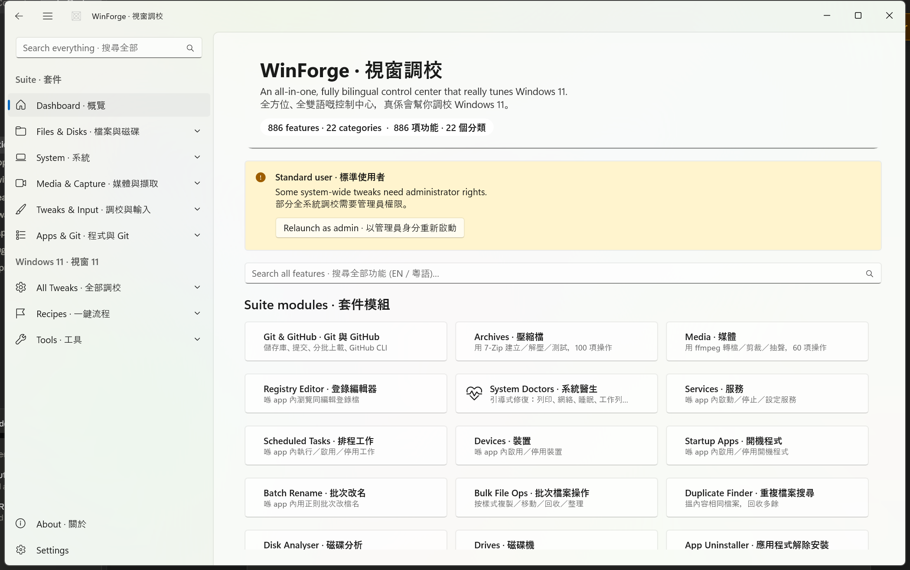

<div align="center">

# WinForge · 視窗鑄造

**An all-in-one, fully bilingual Windows 11 control center — every module is real and working — crowned by a hyper-realistic flagship nuclear-reactor simulator.**
**一個全方位、全程雙語嘅 Windows 11 控制中心 — 每個模組都係真正用得 — 仲有一個超寫實嘅旗艦核反應堆模擬器坐鎮。**

`WinUI 3 · .NET 11` · `English + 繁體中文／粵語` · `x64` · `319 in-app modules` · `1,214 total features` · `everything runs in-app`

</div>

---

## 🌏 Overview · 概覽

**EN —** WinForge is an all-in-one, fully bilingual control center for Windows 11. It gathers 319 real, working modules and 1,214 total features — system tweaking, files & disks, media & capture, developer tooling, networking, package management, AI, window management, PowerToys-style utilities, security vaults, virtualization and gaming — into a single **WinUI 3 / .NET 11** app where every English label is paired with **繁體中文／粵語** and every action actually changes the system. Its flagship is a **hyper-realistic Pressurized Water Reactor (PWR) control-room simulator** with full point-kinetics physics, a fuel-and-waste fuel cycle, a water-treatment plant, and Westinghouse-style safety systems.

**粵語 —** WinForge 係一個畀 Windows 11 用嘅全方位、全程雙語控制中心。佢將 319 個真正用得嘅模組同 1,214 項總功能 — 系統調校、檔案與磁碟、媒體與擷取、開發者工具、網絡、套件管理、AI、視窗管理、PowerToys 式工具、安全保險庫、虛擬化同遊戲 — 全部集合喺一個 **WinUI 3 / .NET 11** app 入面，每個英文標籤都配上**繁體中文／粵語**，而且每個動作都真正改到部機。佢嘅旗艦係一個**超寫實壓水堆（PWR）控制室模擬器**，附完整點動力學物理、燃料與廢料燃料循環、水處理廠同西屋式保護系統。

---

## 🖼️ Gallery · 模組畫廊

**EN —** A look at some of the major modules. Every screenshot shows the app's live bilingual UI; the full catalog is below.

**粵語 —** 部分主要模組嘅一覽。每張截圖都係 app 嘅即時雙語介面；完整目錄見下面。

| | |
|---|---|
|  <br> **Dashboard · 概覽** — Master search and home overview across every module. <br> 跨晒所有模組嘅總搜尋同主頁概覽。 |  <br> **Nuclear Reactor · 核反應堆** — The flagship hyper-realistic PWR control-room simulator. <br> 旗艦超寫實壓水堆控制室模擬器。 |
|  <br> **Git & GitHub · Git 與 GitHub** — Multi-repo workbench for git and gh with a chunked uploader. <br> 多儲存庫工作台，操作 git 同 gh，附分塊上傳器。 |  <br> **Package Manager · 套件管理** — One front-end over winget, scoop, choco, pip and npm. <br> 統一前端操作 winget、scoop、choco、pip 同 npm。 |
|  <br> **Cloudflare & Tunnel · Cloudflare 與 Tunnel** — Tunnels, DNS routing, Access, DoH and WARP. <br> 隧道、DNS 路由、Access、DoH 同 WARP。 |  <br> **AI Agents · AI 代理** — Install and launch terminal AI coding agents. <br> 安裝同啟動終端機 AI 編程代理。 |
|  <br> **Media · 媒體** — ffmpeg-powered video/audio convert, trim and GIF making. <br> 用 ffmpeg 轉檔、剪裁影音同整 GIF。 |  <br> **Settings & Control Panel · 設定與控制台** — In-app launcher for ms-settings and Control Panel applets. <br> app 內啟動 ms-settings 頁面同控制台小程式。 |
|  <br> **Clipboard · 剪貼簿** — Richer clipboard history with QR-code generation. <br> 更豐富嘅剪貼簿歷史，附二維碼產生。 |  <br> **Connections · 連線** — Live TCP/UDP socket list with owning processes. <br> 即時 TCP／UDP 連線清單同擁有程序。 |
|  <br> **Docker · Docker 容器管理** — Manage containers, images, volumes and networks. <br> 管理容器、映像、磁碟區同網路。 |  <br> **Cake Factory & Farm · 蛋糕工廠與農場** — HTML5 reactor-powered cake factory game. <br> HTML5 反應堆供電蛋糕工廠遊戲。 |

---

## 📑 Table of contents · 目錄

- [Gallery · 模組畫廊](#️-gallery--模組畫廊)
- [Build & Run · 建置與執行](#-build--run--建置與執行)
- [Highlights · 重點](#-highlights--重點)
- [Flagship: Nuclear Reactor · 旗艦：核反應堆](#-flagship-nuclear-reactor--旗艦核反應堆)
- [Module Catalog · 模組目錄](#-module-catalog--模組目錄)
- [Documentation & Wiki · 文件與 Wiki](#-documentation--wiki--文件與-wiki)
- [License · 授權條款](#-license--授權條款)

---

## 🔨 Build & Run · 建置與執行

**EN —** Requirements: the **.NET 11 SDK** and the **Windows App SDK** workload (Visual Studio 2022 with *.NET Desktop* + *Windows App SDK*, or the SDK on its own). Build the whole solution:

**粵語 —** 需求：**.NET 11 SDK** 同 **Windows App SDK** 工作負載（Visual Studio 2022 加 *.NET 桌面* + *Windows App SDK*，或者淨係裝 SDK）。建置成個方案：

```powershell
# Build the solution (Debug, x64) · 建置方案（Debug、x64）
dotnet build WinForge.sln -c Debug -p:Platform=x64
```

**EN —** To **run** a real, distributable build, publish self-contained — the Windows App SDK runtime is bundled, so no separate runtime install is needed:

**粵語 —** 想**執行**一個可發佈嘅版本，請用自包含方式 publish — 已內附 Windows App SDK 執行階段，唔使另外安裝：

```powershell
# Self-contained publish (x64) for running · 自包含 publish（x64）以供執行
dotnet publish WinForge.csproj -c Release -p:Platform=x64 -r win-x64 ^
  --self-contained true -p:WindowsAppSDKSelfContained=true -p:WindowsPackageType=None

# Then run the published WinForge.exe · 然後執行 publish 出嚟嘅 WinForge.exe
.\WinForge.exe
```

> **Open a single module directly · 直接開單一模組:** `WinForge.exe --page <alias>` (every alias is listed in the [Module Catalog](#-module-catalog--模組目錄) below). · 每個別名都喺下面嘅[模組目錄](#-module-catalog--模組目錄)。
>
> **Open All Apps · 開啟所有 app：** `WinForge.exe --page shell.allapps` opens the searchable **Open new tab** picker. It is a shell dialog, not a Dashboard tab. · `WinForge.exe --page shell.allapps` 會開可搜尋嘅「開新分頁」選擇器；佢係 shell 對話框，唔係 Dashboard 分頁。

---

## 🔎 Verification · 驗證

**EN —** Whole-app verification uses the repository-local [WinForge Exhaustive Smoke skill](.agents/skills/winforge-exhaustive-smoke/SKILL.md). It creates a code-derived ledger for every registered route, deep link, page, control surface, companion, launcher, test project, and source-review item; it then keeps build, launch, screenshot, behavior, safety, and documentation evidence distinct with ASCII-safe routing diagnostics.

**粵語 —** 全 app 驗證會用儲存庫入面嘅 [WinForge Exhaustive Smoke skill](.agents/skills/winforge-exhaustive-smoke/SKILL.md)。佢會由程式碼產生涵蓋清單，包晒已登記路線、深層連結、頁面、控制介面、companion、launcher、測試專案同 source review；建置、啟動、截圖、行為、安全同文件證據會分開記錄，routing diagnostics 亦用 ASCII-safe 格式。

**EN —** Current screenshots are mandatory for changed visual surfaces. If capture is unavailable, the exact blocker is recorded rather than treating the page as visually verified. Live system, network, package, credential, or integration effects are tested through safe/reversible paths unless explicitly authorized.

**粵語 —** 有改視覺介面就一定要有最新截圖；影唔到就記低確實阻礙，唔可以當視覺驗證通過。系統、網絡、套件、認證同整合嘅實際副作用，除非有明確授權，否則只會用安全同可還原嘅路徑測試。

**EN —** A 2026-07-11 capture-fallback audit established that this desktop
session is capture-blocked end to end: a fresh self-contained Dashboard
`CopyFromScreen` attempt returned `The handle is invalid`; successful
`PrintWindow(PW_RENDERFULLCONTENT)` produced an inspected 682×1311 PNG that
was uniformly `ARGB #FF000000` across 3,198 sampled pixels; and
Windows.Graphics.Capture `CreateForWindow` created items for both WinForge
(668×1304) and an owned coloured WinForms diagnostic window (706×473), but
neither free-threaded frame pool delivered `FrameArrived` within 12 seconds.
No valid PNG was produced or substituted, so this is never a visual-pass claim.

**粵語 —** 2026-07-11 嘅截圖 fallback 審查證實呢個 desktop session 由頭到尾都擷取
受阻：新 self-contained Dashboard 嘅 `CopyFromScreen` 嘗試回傳
`The handle is invalid`；雖然 `PrintWindow(PW_RENDERFULLCONTENT)` 回傳成功，
但已檢查嘅 682×1311 PNG 係 3,198 個抽樣像素都同一隻 `ARGB #FF000000`；而
Windows.Graphics.Capture `CreateForWindow` 雖然為 WinForge（668×1304）同自有
有色 WinForms 診斷視窗（706×473）建立到 item，兩個 free-threaded frame pool
喺 12 秒內都冇 `FrameArrived`。冇產生或者用其他圖頂替有效 PNG，所以絕對唔係
visual-pass 聲稱。

**EN —** Settings persistence is integrity-first: `%LOCALAPPDATA%\WinForge\settings.json` is replaced atomically only after a flushed same-directory temporary write, preserving the prior complete snapshot as `settings.json.bak`. A malformed primary restores from a valid backup while retaining a `settings.json.corrupt-*` evidence copy; if neither snapshot is valid, ordinary writes fail closed rather than serializing defaults over user data.

**粵語 —** 設定儲存以完整性行先：`%LOCALAPPDATA%\WinForge\settings.json` 只會喺同一資料夾嘅臨時檔案寫好兼 flush 咗之後先原子式替換，上一個完整快照會保留做 `settings.json.bak`。主檔案壞咗會由有效備份還原，同時留低 `settings.json.corrupt-*` 證據副本；兩份都唔有效就會 fail closed，平常寫入唔會用預設值蓋走使用者資料。

### Focused Reactor Harness · 專注反應堆測試框架

**EN —** The `net8.0-windows` reactor/dependent console harness prints a result for every scenario and is a real CI gate: it exits **0 only when all scenarios pass**; any failed assertion or caught scenario exception exits **1**. On machines where the app build overrides `DOTNET_ROOT` to the local .NET 11 SDK, clear that override or use an installed .NET 8 runtime for this focused harness.

**粵語 —** `net8.0-windows` 嘅反應堆／相依服務 console 測試框架會列印每個情景嘅結果，而且係真正嘅 CI gate：**全部情景通過**先會退出 **0**；任何斷言失敗或者捉到嘅情景例外都會退出 **1**。如果 app build 將 `DOTNET_ROOT` 指去本機 .NET 11 SDK，跑呢個專注測試前要清除覆寫，或者用已安裝嘅 .NET 8 runtime。

```powershell
# ReactorSim.Tests targets net8.0-windows.
Remove-Item Env:DOTNET_ROOT -ErrorAction Ignore
& "$env:ProgramFiles\dotnet\dotnet.exe" run --project tests/ReactorSim.Tests -c Debug
if ($LASTEXITCODE -ne 0) { exit $LASTEXITCODE }

# Fast self-test of the pass/fail exit-code mapping (no simulator scenarios run).
& "$env:ProgramFiles\dotnet\dotnet.exe" run --project tests/ReactorSim.Tests -c Debug -- --verify-exit-code-contract
```

### Pumped-Hydro State Integrity Harness · 抽水蓄能狀態完整性測試框架

**EN —** `tests/PumpedHydroService.Tests` is a platform-neutral deterministic regression harness for the Pumped-Storage Hydro timer boundary and MWh-based rewards. It proves that page load, rendering, and language refresh do not advance state; verifies the documented split round-trip efficiency; and checks that one delivered MWh mints exactly `0.036 ⚡`, not `36 ⚡`.

**粵語 —** `tests/PumpedHydroService.Tests` 係針對抽水蓄能 timer 邊界同以 MWh 計獎勵嘅 platform-neutral、確定性回歸框架。佢會證明頁面 load、render 同轉語言都唔會推進狀態；驗證文件寫明嘅分開往返效率；同埋檢查一個已送出 MWh 正正鑄造 `0.036 ⚡`，唔係 `36 ⚡`。

```powershell
dotnet run --project tests/PumpedHydroService.Tests -c Debug
```

**EN —** The repair is service/code-behind only: it has no XAML layout change, so screenshot replacement is not applicable. While Batch 09 was sweeping routes, no competing WinForge GUI or screenshot capture was run. See the [state-integrity record](docs/Pumped-Hydro-State-Integrity.md) and [smoke campaign ledger](docs/wiki/Smoke-Test-Campaign.md).

**粵語 —** 呢次修正只改 service／code-behind：冇 XAML 排版變更，所以唔適用截圖替換。Batch 09 跑 route sweep 期間冇開另一個 WinForge GUI 或做截圖擷取。詳情請睇[狀態完整性記錄](docs/Pumped-Hydro-State-Integrity.md)同[冒煙測試清單](docs/wiki/Smoke-Test-Campaign.md)。

### Regex Cheatsheet & Reactor Settings Lifecycle Harnesses · 正則速查同反應堆設定生命週期測試框架

**EN —** `RegexCheatService.Tests` keeps the embedded reference honest for .NET: it rejects the unsupported possessive `*+` claim, compiles the atomic `(?>a*)` equivalent, and parses every ready-made recipe. `ReactorSettingsLifecycle.Tests` is a headless source-invariant check that proves a reused Reactor Settings page attaches one named live-API timer handler, restores its language handler on load, and releases it on unload. Neither test starts the reactor, Home Assistant, system linkage, or a real shutdown path.

**粵語 —** `RegexCheatService.Tests` 令內置參考保持符合 .NET：佢會拒絕 .NET 唔支援嘅佔有 `*+` 聲稱、編譯原子 `(?>a*)` 等價寫法，同埋解析所有現成配方。`ReactorSettingsLifecycle.Tests` 係 headless source-invariant 檢查，證明重用嘅反應堆設定頁只會掛一個具名 live-API timer handler、load 時重新訂閱語言 handler，同 unload 時解除訂閱。兩個測試都唔會啟動反應堆、Home Assistant、系統連動或者真實關機路徑。

```powershell
dotnet run --project tests/RegexCheatService.Tests -c Debug
dotnet run --project tests/ReactorSettingsLifecycle.Tests -c Debug
```

**EN —** Both focused harnesses passed 3/3, and the Debug x64 solution build passed with 0 errors. Fresh `regexcheat` and `reactorsettings` route launches also passed; their screenshot attempts are recorded as capture-blocked rather than visual verification. See the [full repair record](docs/RegexCheat-ReactorSettings-Lifecycle.md) and [smoke campaign](docs/wiki/Smoke-Test-Campaign.md).

**粵語 —** 兩個專注 harness 都係 3/3 通過，Debug x64 solution build 亦以 0 errors 通過。新嘅 `regexcheat` 同 `reactorsettings` route launch 同樣通過；佢哋嘅截圖嘗試會記做 capture-blocked，唔會當視覺驗證。完整記錄請睇[修復記錄](docs/RegexCheat-ReactorSettings-Lifecycle.md)同[冒煙測試](docs/wiki/Smoke-Test-Campaign.md)。

**EN —** AI Chat keeps provider API keys under CurrentUser DPAPI. If Windows cannot read an existing encrypted key, WinForge retains its opaque ciphertext; if it cannot protect a changed key, it aborts the whole provider-file write. Neither failure path clears a saved key.

**粵語 —** AI Chat 嘅供應商 API 金鑰會用 CurrentUser DPAPI 保護。Windows 讀唔到原有加密金鑰時，WinForge 會保留原封不動嘅 ciphertext；保護改過嘅金鑰失敗時，就會取消成份供應商檔案嘅寫入。兩種失敗都唔會清空已儲存嘅金鑰。

**EN —** KeePass secret clipboard cleanup now clears only text that still exactly
matches WinForge’s own delayed secret copy. A generation guard prevents an
older cleanup timer from erasing a newer user copy; focused crypto/clipboard
regression coverage checks matching, replacement, null, empty, and stale-timer
generation cases.

**粵語 —** KeePass 嘅密碼剪貼簿清除而家只會清除仲同 WinForge 延遲複製嘅密碼
完全一樣嘅文字。generation guard 會阻止舊 timer 抹走使用者之後複製嘅新內容；
專注 crypto／clipboard regression 會檢查相同、替換、null、空白文字同 stale-timer
generation 情況。

**EN —** Package Manager now preserves a selected package or bundle source through
the command preview, multi-select identity, shared queue and runner. A single
policy turns only validated manager-specific sources into real flags or trusted
registry endpoints; an empty source keeps the manager default, no-selector
uninstall/update paths retain safe source metadata, and local, unknown or unsafe
source text is rejected before it reaches a command.

**粵語 —** 套件管理器而家會將所揀套件或者清單來源一路保留到指令預覽、多選身份、
共用佇列同 runner。單一政策只會將已驗證、管理器專用嘅來源變成真實旗標或者可信
registry endpoint；空白來源會保留管理器預設，冇來源選擇器嘅解除安裝／更新路徑會
保留安全來源中繼資料，而本機、未知或者唔安全來源文字未到指令之前已經拒絕。

**EN —** The latest checkpoints fixed Base Converter and CSV ⇄ JSON startup
faults exposed by the route sweep; fresh self-contained `--page baseconvert`
and `--page csvjson` launches now pass. See the
[smoke campaign ledger](docs/wiki/Smoke-Test-Campaign.md) for the exact build,
launch, retry, and screenshot-blocker evidence.

**粵語 —** 最新 checkpoint 修好 route sweep 搵到嘅進位轉換同 CSV ⇄ JSON 啟動問題；
新嘅 self-contained `--page baseconvert` 同 `--page csvjson` 而家可以成功開到。
確實 build、launch、retry 同截圖阻礙證據請睇
[冒煙測試清單](docs/wiki/Smoke-Test-Campaign.md)。

**EN —** Launch-only batches 01–09 now provide current process-level route
evidence for the first 225 of 323 manifest routes. Batch 09 exercised indices
200–224: 24 passed at five seconds and Percent Calculator first exposed a
reproducible typed `IsChecked` startup fault; its guarded managed default and
fresh deep-link retest completed the batch at 25/25 launch-pass. The same
review also added focused Pixel Editor (5/5) and Proxmox certificate-policy
(6/6) regression harnesses. Fresh screenshot attempts for every changed page
remain capture-blocked: `CopyFromScreen` is unavailable and PrintWindow is
uniform, so no PNG was created, replaced, or treated as visual completion.

**粵語 —** 淨 launch batches 01–09 而家為 323 條 manifest routes 入面頭 225 條
提供最新嘅 process-level route 證據。Batch 09 測咗 indices 200–224：24 條五秒
通過，而 Percentage Calculator 第一次揭示咗可重現嘅 typed `IsChecked` startup
fault；受 guard 保護嘅 managed default 加新鮮 deep-link retest 令呢批最後係
25/25 launch-pass。今次審查亦新增 Pixel Editor（5/5）同 Proxmox certificate-policy
（6/6）專注 regression harnesses。每個改過頁面嘅最新 screenshot 嘗試仍然係
capture-blocked：`CopyFromScreen` 唔可用，而 PrintWindow 係 uniform，所以冇 PNG
產生、替換或者當成 visual completion。

---

**EN —** The XAML startup audit reproduced an HTML Table Convert crash while
the self-contained runtime assigned `ToggleSwitch.IsOn` from XAML. It moves all
16 direct `IsOn="True|False"` defaults across 12 affected pages into managed
initialization, preserving their defaults without touching bindings. The new
`Test-WinForgeXamlLiteralSafety.ps1` guard prevents that unsafe literal form
from returning and checks all 16 migrated defaults; a fresh self-contained
launch check passed for all 12 aliases.

**粵語 —** XAML 啟動審查重現咗 HTML 表格轉換喺 self-contained runtime 由 XAML
設定 `ToggleSwitch.IsOn` 時崩潰。今次將 12 個受影響頁面入面全部 16 個 direct
`IsOn="True|False"` 預設搬去 managed initialization，保留原本預設而唔掂 bindings。
新嘅 `Test-WinForgeXamlLiteralSafety.ps1` guard 會阻止呢種唔安全 literal 再返嚟；
12 個 alias 嘅新 self-contained launch check 都已通過。

**EN —** Screenshot capture for the repaired HTML Table page remains blocked
in this desktop session (`CopyFromScreen`: `The handle is invalid`), so this is
launch evidence only and no stale screenshot was replaced.

**粵語 —** 修好後嘅 HTML 表格頁面截圖喺呢個 desktop session 仍然受阻
（`CopyFromScreen`：`The handle is invalid`），所以只係 launch 證據，冇聲稱 visual pass，
亦冇用舊截圖頂替。

**EN —** A bounded typed-literal audit then exercised all 78 deep-linkable
pages that declare a direct `NumberBox.Value` default: 72 launched unchanged;
six reproduced `XamlParseException` failures (Markdown TOC, Name Generator,
Number Formatter, Scientific Notation, Subnet Calculator, and Unit Converter).
Only those six pages moved their ten numeric defaults into guarded managed
initialization. The repaired Markdown TOC route then exposed one separate
`CheckBox.IsChecked` conversion failure, so its one existing default moved too.
The literal-safety guard protects these page-local defaults without banning
passing NumberBox or CheckBox literals; a forced self-contained publish and
fresh `--page` retest passed all six routes. Each changed-page capture again
stopped at `CopyFromScreen`: `The handle is invalid`, so no canonical image was
created or replaced.

**粵語 —** 之後一個受限嘅 typed-literal 審查跑晒 78 個有 direct
`NumberBox.Value` 預設、亦有 deep link 嘅頁面：72 個冇改動都成功開到；6 個重現
`XamlParseException`（Markdown 目錄、名稱產生器、數字格式化、科學記數法、子網
計算器同單位換算器）。只有呢 6 個頁面嘅 10 個數值預設搬去有 guard 嘅 managed
initialization。修好後嘅 Markdown 目錄 route 再揭示咗一個獨立嘅
`CheckBox.IsChecked` conversion failure，所以只搬咗佢一個既有預設。literal-safety
guard 會保護呢啲 page-local default，但唔會禁止已經通過嘅 NumberBox 或 CheckBox
literal；forced self-contained publish 同新鮮 `--page` retest 全部 6 條 route 都通過。
每個改過嘅頁面都再試過截圖，但一樣喺 `CopyFromScreen`：`The handle is invalid`
停咗；所以冇建立或者替換 canonical image。

## ✨ Highlights · 重點

**EN —**
- **All-in-one control center** — 315 modules and 1,210 total features in one app; OSS-inspired additions are remade as native WinForge tabs instead of installer-only launchers. · **全方位控制中心** — 一個 app 有 315 個模組同 1,210 項總功能；受開源 app 啟發嘅新增功能會重製成 WinForge 原生分頁，而唔係只做安裝／啟動器。
- **Flexible language modes** — choose Bilingual, Cantonese, or English; UI updates live. · **彈性語言模式** — 可揀雙語、粵語或英文，介面即時更新。
- **Accessible app shell** — main navigation, search, tabs and new native OSS pages expose screen-reader names, heading levels, visible focus paths and keyboard accelerators. · **無障礙 app 外殼** — 主要導航、搜尋、分頁同新原生開源頁面提供螢幕閱讀器名稱、標題層級、清楚焦點路徑同鍵盤捷徑。
- **Real engines, real effects** — wraps git/gh, ffmpeg, 7-Zip, yt-dlp, cloudflared, winget, libVLC, Docker and more, plus native Windows APIs — no fake toggles. · **真實引擎、真實效果** — 包住 git/gh、ffmpeg、7-Zip、yt-dlp、cloudflared、winget、libVLC、Docker 等同原生 Windows API — 冇假開關。
- **Safe hardware-monitor ownership** — System Monitor and Battery & Thermal share and deterministically release only the LibreHardwareMonitor object WinForge opened; no global service cleanup. See the [driver lifecycle record](docs/Hardware-Monitor-Driver-Lifecycle.md). · **安全嘅硬件監察所屬** — System Monitor 同 Battery & Thermal 共用並確定釋放只限 WinForge 自己開啟嘅 LibreHardwareMonitor object，唔會全局清理 service。請參閱[驅動生命週期記錄](docs/Hardware-Monitor-Driver-Lifecycle.md)。
- **Master search** — find and launch any module from the Dashboard. · **總搜尋** — 喺概覽頁搵到同啟動任何模組。
- **Hyper-realistic flagship** — a full PWR nuclear-reactor control-room simulator (see below). · **超寫實旗艦** — 一個完整嘅 PWR 核反應堆控制室模擬器（見下）。
- **WinUI 3 · .NET 11 · x64** — modern, self-contained, runs windowed or full-screen and hides to the tray. · **WinUI 3 · .NET 11 · x64** — 現代化、自包含，可視窗或全螢幕，並收埋去系統匣。

---

## ★ Flagship: Nuclear Reactor · 旗艦：核反應堆

**EN —** The headline module is a **hyper-realistic Pressurized Water Reactor (PWR) control-room simulator**, rendered in WinUI 3 with a pop-out HTML5 window. It is a simulation / training toy — it controls no real hardware. It models 6-group point kinetics, reactivity feedback (Doppler / moderator / boron / xenon), thermal-hydraulics, a steam/turbine secondary plant, a Westinghouse-style protection system (2-out-of-4 coincidence trips), synthesized control-room audio and a live plant mimic.

**粵語 —** 重點模組係一個**超寫實壓水堆（PWR）控制室模擬器**，用 WinUI 3 繪製，附可彈出嘅 HTML5 視窗。佢只係模擬／訓練玩具，唔會控制任何真實硬件。佢模擬六組點動力學、反應性回饋（都卜勒／緩和劑／硼／氙）、熱工水力、蒸汽渦輪二次側、西屋式保護系統（2-of-4 一致跳脫）、合成控制室音效同即時機組流程圖。

| Feature · 功能 | What it does · 內容 |
|---|---|
| **Rooms & HTML5 window** · 房間與 HTML5 視窗 | Walk through plant rooms; pop the control room out into its own dedicated HTML5 window for a full-screen view. <br> 行勻機組各個房間；將控制室彈出去自己嘅 HTML5 視窗睇全螢幕。 |
| **Fuel factory + waste cycle** · 燃料工廠 + 廢料循環 | A full fuel cycle — fabricate fuel in the fuel factory, burn it in the core, then route spent fuel through the waste cycle. <br> 完整燃料循環 — 喺燃料工廠製造燃料、喺爐心燃燒，再將乏燃料送入廢料循環。 |
| **Water-treatment plant** · 水處理廠 | A water-treatment plant feeds and conditions the plant's water systems. <br> 水處理廠為機組水系統供水同處理水質。 |
| **Status API** · 狀態 API | A live status API exposes the running plant state for external readers and widgets. <br> 即時狀態 API 對外公開機組運行狀態，供外部讀取同小工具使用。 |
| **Safety** · 安全 | **Meltdown → real PC shutdown is OFF by default** — a meltdown only shows a simulated overlay unless you explicitly arm "ARM REAL SHUTDOWN" (an abortable 10 s Windows shutdown). <br> **熔毀真實關機預設 OFF** — 熔毀只播模擬畫面，除非你明確開啟「ARM REAL SHUTDOWN」（可中止嘅 10 秒 Windows 關機）。 |

> Open it directly · 直接開啟: `WinForge.exe --page reactor`. Full procedures (startup-to-shutdown, scenarios, protection system) are in the [Nuclear Reactor Operating Manual](docs/wiki/Nuclear-Reactor-Operating-Manual.md). · 完整程序見[核反應堆操作手冊](docs/wiki/Nuclear-Reactor-Operating-Manual.md)。

---

## 🧩 Module Catalog · 模組目錄

**EN —** Every module is reachable from the **master search** on the Dashboard, or directly with `WinForge.exe --page <alias>`. Grouped by category below, each with a one-line bilingual description.

**粵語 —** 每個模組都可以喺概覽頁嘅**總搜尋**搵到，或者用 `WinForge.exe --page <alias>` 直接開啟。下面按分類分組，每個都有一句雙語說明。

### System & Tweaks · 系統與調校

| Module · 模組 | Description · 說明 | `--page` |
|---|---|---|
| **Dashboard · 概覽** | Master search and home overview across every module. <br> 跨晒所有模組嘅總搜尋同主頁概覽。 | `dashboard` |
| **Registry Editor · 登錄編輯器** | Browse and edit the live Windows registry (hives, keys, values). <br> 瀏覽同編輯實時 Windows 登錄檔（hive、機碼、值）。 | `regedit` |
| **System Doctors · 系統醫生** | One-click repairs for spooler, DNS, taskbar, search, icons and more. <br> 一鍵修復列印、DNS、工作列、搜尋、圖示等問題。 | `doctors` |
| **Services · 服務** | Start, stop and set the startup type of Windows services. <br> 啟動、停止同設定 Windows 服務嘅啟動類型。 | `services` |
| **Scheduled Tasks · 排程工作** | View and run entries in the Windows Task Scheduler. <br> 檢視同執行 Windows 排程工作。 | `tasks` |
| **Devices · 裝置** | Enable, disable and inspect hardware devices and drivers. <br> 啟用、停用同檢視硬件裝置同驅動程式。 | `devices` |
| **ViVeTool · 功能旗標** | Toggle hidden Windows feature flags via ViVeTool. <br> 用 ViVeTool 切換隱藏嘅 Windows 功能旗標。 | `vivetool` |
| **Startup Apps · 開機程式** | Manage logon and startup items that run at boot. <br> 管理開機同登入時自動執行嘅項目。 | `startup` |
| **Environment Variables · 環境變數** | Edit user/system environment variables with a dedicated PATH editor. <br> 編輯使用者／系統環境變數，附專用 PATH 編輯器。 | `envvars` |
| **Event Viewer · 事件檢視器** | Read Windows system and application event logs. <br> 讀取 Windows 系統同應用程式事件記錄。 | `events` |
| **System Info (Winfetch) · 系統資訊** | neofetch-style read-out of OS, CPU, GPU, memory and specs. <br> neofetch 風格顯示作業系統、CPU、顯示卡、記憶體等規格。 | `winfetch` |
| **System Monitor · 系統監察** | Live CPU, RAM and network monitor with priority and affinity control. <br> 即時監察 CPU、記憶體同網絡，可調優先權同核心親和性。 | `monitor` |
| **Process Explorer · 程序總管** | Process-tree task manager with command line, threads and kill controls. <br> 程序樹工作管理員，顯示命令列、執行緒，可結束程序。 | `procexp` |
| **Battery & Thermal · 電池與散熱** | Battery wear/health, temperatures, fan and powercfg energy report. <br> 電池耗損健康、溫度、風扇同 powercfg 能源報告。 | `battery` |
| **Volume Mixer · 音量混合器** | Per-app volume and mute control via WASAPI. <br> 用 WASAPI 逐個應用程式調音量同靜音。 | `mixer` |
| **Context Menu · 右鍵選單** | Add and remove shell right-click verbs. <br> 新增同移除右鍵選單動詞。 | `contextmenu` |
| **Explorer Right-Click · 檔案總管右鍵選單** | Toggle native and PowerToys Explorer right-click integrations. <br> 切換原生同 PowerToys 嘅檔案總管右鍵整合。 | `shellmenu` |
| **Nilesoft Shell · Nilesoft 右鍵選單** | Modern, themeable, customizable context menu via Nilesoft Shell. <br> 用 Nilesoft Shell 整現代、可換主題嘅自訂右鍵選單。 | `nilesoftshell` |
| **Awake · 保持喚醒** | Keep the PC awake without changing power settings. <br> 唔改電源設定都令電腦保持唔瞓。 | `awake` |
| **Settings & Control Panel · 設定與控制台** | In-app launcher for ms-settings pages and Control Panel applets. <br> app 內啟動 ms-settings 頁面同控制台小程式。 | `settingshub` |
| **Native Utilities · 原生工具** | Wi-Fi passwords, SMB shares, brightness, certificates, Bluetooth and more. <br> Wi-Fi 密碼、SMB 共享、亮度、憑證、藍牙等原生雜錦。 | `native` |
| **PowerToys Extras · PowerToys 額外工具** | Image Resizer, OCR text extractor, always-on-top plus links to the rest of WinForge's PowerToys-equivalent pages. <br> 圖片縮放、OCR 文字擷取、視窗置頂，再加上 WinForge 其餘同 PowerToys 對應嘅頁面連結。 | `powertoys` |
| **World Monitor · 世界監察** | News, geopolitics, finance and instability-index intelligence dashboard. <br> 新聞、地緣政治、金融同不穩定指數嘅情報儀表板。 | `worldmonitor` |
| **Activity Timeline · 活動時間軸** | Default-on foreground-window time tracking with crash-safe local recovery and per-app usage insights. <br> 預設開啟前景視窗時間追蹤，有本機防閃退復原同逐個應用程式使用量。 | `timelens` |

### Files & Disks · 檔案與磁碟

| Module · 模組 | Description · 說明 | `--page` |
|---|---|---|
| **Archives · 壓縮檔** | Compress, extract and test ZIP/7z/RAR/TAR archives. <br> 壓縮、解壓同測試 ZIP／7z／RAR／TAR 壓縮檔。 | `archives` |
| **Batch Rename · 批次改名** | Bulk rename files with regex and sequence patterns. <br> 用正規表示式同序號樣式批次改名。 | `rename` |
| **Bulk File Ops · 批次檔案操作** | Mass move, copy, delete and set attributes on files. <br> 批量移動、複製、刪除同設定檔案屬性。 | `bulkops` |
| **New+ · 範本新增** | Create files and folders from templates in the New menu. <br> 由範本喺「新增」選單建立檔案同資料夾。 | `newplus` |
| **Duplicate Finder · 重複檔案搜尋** | Find and dedupe files by size and hash. <br> 按大小同雜湊搵出同清除重複檔案。 | `duplicates` |
| **Instant File Search · 即時檔案搜尋** | Instant filename search over the NTFS master file table (Everything). <br> 用 NTFS 主檔案表做即時檔名搜尋（Everything）。 | `everything` |
| **File Locksmith · 檔案鎖偵測** | Find which process is locking a file or folder and unlock it. <br> 搵出邊個程序鎖住檔案或資料夾並解鎖。 | `filelocksmith` |
| **Disk Analyser · 磁碟分析** | Visualize folder sizes with a disk-space treemap. <br> 用樹狀圖顯示資料夾佔用磁碟空間。 | `disk` |
| **Hex Editor · 十六進位編輯器** | View and edit binary files byte-by-byte with hashing and search. <br> 逐位元組檢視同編輯二進位檔，附雜湊同搜尋。 | `hex` |
| **Drives · 磁碟機** | Manage volumes, format drives and toggle BitLocker. <br> 管理磁碟區、格式化磁碟機同切換 BitLocker。 | `drives` |
| **Disk Health (SMART) · 硬碟健康（SMART）** | Read SMART attributes, temperature, wear and failure prediction. <br> 讀取 SMART 屬性、溫度、耗損同故障預測。 | `diskhealth` |
| **Disk Benchmark · 硬碟速度測試** | CrystalDiskMark-style sequential and random read/write benchmarks. <br> CrystalDiskMark 式循序同隨機讀寫速度測試。 | `diskbench` |
| **TestDisk / PhotoRec Recovery · TestDisk / PhotoRec 資料救援** | Recover lost partitions and carve deleted files. <br> 救援遺失分割區同雕刻復原已刪除檔案。 | `testdisk` |
| **Peek · 快速預覽** | Quick-Look style instant file preview for images, text and more. <br> Quick-Look 式即時預覽圖片、文字等檔案。 | `peek` |
| **Rich Preview · 豐富預覽** | Explorer preview-pane add-ons for SVG, Markdown, code and more. <br> 檔案總管預覽窗格增益，支援 SVG、Markdown、程式碼等。 | `richpreview` |
| **OneDrive · OneDrive** | Manage Files On-Demand pinning, dehydration and Storage Sense. <br> 管理隨選檔案釘選、脫水同儲存體感知。 | `onedrive` |
| **Font Manager · 字型管理** | Install, preview and uninstall TTF/OTF fonts. <br> 安裝、預覽同移除 TTF／OTF 字型。 | `fonts` |
| **FTP / SFTP · FTP／SFTP 檔案傳輸** | Dual-pane FTP/SFTP/FTPS file transfers with a site manager. <br> 雙窗格 FTP／SFTP／FTPS 檔案傳輸，附站台管理。 | `filezilla` |
| **Config & Backup · 設定與備份** | Snapshot, restore and export encrypted configuration bundles. <br> 快照、還原同匯出加密設定包。 | `configbackup` |

### Media & Capture · 媒體與擷取

| Module · 模組 | Description · 說明 | `--page` |
|---|---|---|
| **Media · 媒體** | ffmpeg-powered video/audio convert, trim and GIF making. <br> 用 ffmpeg 轉檔、剪裁影音同整 GIF。 | `media` |
| **Audio Editor · 音訊編輯器** | In-app waveform recording, trimming and effects. <br> App 內波形錄音、剪裁同效果處理。 | `audioeditor` |
| **Audio Tagger · 音訊標籤編輯器** | Batch-edit ID3/audio metadata and cover art. <br> 批次編輯 ID3／音訊中繼資料同封面圖。 | `tags` |
| **Media Player · 媒體播放器** | libVLC player with streams, subtitles and snapshots. <br> libVLC 播放器，支援串流、字幕同截圖。 | `mediaplayer` |
| **Media Downloader · 媒體下載器** | yt-dlp video/audio downloads with quality and subtitle options. <br> yt-dlp 下載影音，可選畫質同字幕。 | `ytdlp` |
| **Document Converter · 文件轉換器** | Headless LibreOffice batch conversion between Office and PDF formats. <br> 用無介面 LibreOffice 批次轉換 Office 同 PDF 格式。 | `libreoffice` |
| **PDF Toolkit · PDF 工具箱** | Merge, split, rotate, watermark, encrypt and extract from PDFs. <br> 合併、分割、旋轉、加浮水印、加密同抽取 PDF。 | `pdf` |
| **Screen Recorder · 螢幕錄影** | Record the desktop with ffmpeg gdigrab. <br> 用 ffmpeg gdigrab 錄製桌面畫面。 | `recorder` |
| **Capture Studio · 擷取工作室** | Snip regions, screenshot, make GIFs and OCR text. <br> 擷取區域、截圖、整 GIF 同 OCR 認字。 | `capture` |
| **Text Extractor (OCR) · 原生文字辨識** | Extract text from any screen region using the native Windows OCR engine. <br> 用原生 Windows OCR 引擎由螢幕區域抽字。 | `ocr` |
| **GIF Studio · 螢幕轉 GIF** | Screen-to-GIF recording with a built-in frame editor. <br> 螢幕轉 GIF 錄製，附內建畫面格編輯器。 | `giflab` |
| **Crop And Lock · 裁切與鎖定** | Create live thumbnails, safe reparent-style cropped views, or frozen screenshots from a selected window region. <br> 由所選視窗範圍建立即時縮圖、安全重新指定父視窗風格裁切檢視或者靜態截圖。 | `cropandlock` |
| **Video Conference Mute · 視像會議靜音** | Global mute for the default communications microphone, with opt-in reversible camera privacy control and three configurable shortcuts. <br> 預設通訊咪嘅全域靜音，附可選、可還原鏡頭私隱控制同三個可設定快捷鍵。 | `videoconference` |
| **ZoomIt · 螢幕放大與標註** | On-screen zoom, annotation and presentation break timer. <br> 螢幕放大、標註同簡報小休倒數計時。 | `zoomit` |
| **Voice & Read-Aloud · 語音朗讀** | SAPI text-to-speech read-aloud with WAV export. <br> SAPI 文字轉語音朗讀，可匯出 WAV。 | `voice` |
| **PA Announcements · 喇叭語音廣播** | Public-address voice broadcasts with chimes, queue and priority. <br> 公共廣播語音播報，附叮咚、排隊同優先權。 | `announce` |
| **Pixel Editor · 像素畫編輯器** | Aseprite-style pixel-art editor with layers and animation frames. <br> Aseprite 式像素畫編輯器，支援圖層同動畫影格。 | `pixeleditor` |
| **Image Editor · 點陣圖影像編輯器** | Raster photo editor with filters, layers and adjustments. <br> 點陣圖相片編輯器，附濾鏡、圖層同調整功能。 | `imageeditor` |
| **Blender (3D / Render) · Blender（3D／算圖）** | Headless Blender render and animation queue. <br> 無介面 Blender 算圖同動畫佇列。 | `blender` |

### Developer · 開發者

| Module · 模組 | Description · 說明 | `--page` |
|---|---|---|
| **VS Code · VS Code 編輯器** | Drive the VS Code CLI to open files, diffs and manage extensions. <br> 驅動 VS Code CLI 開檔、比對同管理擴充功能。 | `vscode` |
| **Windows Terminal · Windows 終端機** | Edit Windows Terminal profiles and run an embedded shell. <br> 編輯 Windows 終端機設定檔同執行內嵌殼層。 | `terminal` |
| **SSH Toolset · SSH 工具** | SSH/SFTP/SCP profiles, key generation and passwordless deploy. <br> SSH／SFTP／SCP 設定檔、金鑰產生同免密碼部署。 | `ssh` |
| **quicktype · JSON 轉型別** | Generate types and code from JSON for many languages. <br> 由 JSON 為多種語言產生型別同程式碼。 | `quicktype` |
| **API Client · REST API 用戶端** | Postman-style REST client with collections and environments. <br> Postman 式 REST 用戶端，支援集合同環境變數。 | `api` |
| **Diff & Merge (WinMerge) · 比對與合併** | Side-by-side file/folder diff and merge with patch export. <br> 並排比對同合併檔案／資料夾，可匯出修補檔。 | `diff` |
| **Diagram Editor · 圖表編輯器** | draw.io-style flowchart and diagram editor with PNG/JSON export. <br> draw.io 式流程圖同圖表編輯器，可匯出 PNG／JSON。 | `diagram` |
| **.NET Decompiler · .NET 反編譯器** | Browse and decompile .NET assemblies to C# (ILSpy-style). <br> 瀏覽同反編譯 .NET 組件成 C#（ILSpy 式）。 | `decompiler` |
| **Postgres Tool · Postgres 工具 / pgAdmin** | Connect to and query PostgreSQL databases. <br> 連接同查詢 PostgreSQL 資料庫。 | `pgadmin` |
| **SQLite Browser · SQLite 資料庫瀏覽器** | Browse, query and edit SQLite databases. <br> 瀏覽、查詢同編輯 SQLite 資料庫。 | `sqlite` |
| **Packer (Image Builder) · Packer（映像建置器）** | Build machine images from HCL templates with HashiCorp Packer. <br> 用 HashiCorp Packer 由 HCL 範本建置機器映像。 | `packer` |
| **AWS Manager · AWS 管理中心** | AWS Console-style resources, 149-service catalog, native S3, Cloud Control CRUDL, and an advanced CLI workbench. <br> AWS Console 式資源、149 個服務目錄、原生 S3、Cloud Control CRUDL，同進階 CLI 工作台。 | `aws` |
| **Website Cloner · 網站複製器** | Scrape, download assets and rebuild a website. <br> 抓取、下載資源同重建網站。 | `webcloner` |
| **Resume Writer · 履歷與求職信寫手** | AI-assisted resume and cover-letter writer with export. <br> AI 輔助履歷同求職信寫手，可匯出。 | `resume` |
| **Regex Cheatsheet · 正則速查** | Searchable bilingual .NET regex reference with parser-checked recipes and the valid atomic equivalent for possessive repetition. <br> 可搜尋嘅雙語 .NET 正則參考，附解析器檢查過嘅配方同佔有重複嘅有效原子等價寫法。 | `regexcheat` |

### Network · 網絡

| Module · 模組 | Description · 說明 | `--page` |
|---|---|---|
| **Connections · 連線** | Live TCP/UDP socket list with owning processes (netstat/TCPView). <br> 即時 TCP／UDP 連線清單同擁有程序（netstat／TCPView）。 | `connections` |
| **Hosts Editor · hosts 編輯器** | Edit the hosts file and block domains. <br> 編輯 hosts 檔案同封鎖網域。 | `hosts` |
| **Packet Capture · 封包擷取** | Capture and filter packets with tshark/dumpcap (pcap). <br> 用 tshark／dumpcap 擷取同過濾封包（pcap）。 | `wireshark` |
| **Nmap Scanner · 網絡掃描** | Scan hosts, ports, services and OS with Nmap. <br> 用 Nmap 掃描主機、端口、服務同作業系統。 | `nmap` |
| **VPN & Mesh · VPN 與網狀網** | Manage NordVPN and Tailscale mesh connections. <br> 管理 NordVPN 同 Tailscale 網狀網連線。 | `vpn` |
| **RustDesk · 遠端桌面** | Self-hostable remote desktop control (TeamViewer alternative). <br> 可自架嘅遠端桌面控制（TeamViewer 替代品）。 | `rustdesk` |
| **Cloudflare & Tunnel · Cloudflare 與 Tunnel** | Cloudflared tunnels, DNS routing, Access, DoH and WARP. <br> Cloudflared 隧道、DNS 路由、Access、DoH 同 WARP。 | `cloudflare` |
| **Home Assistant · 家居助理** | Drive the Home Assistant REST API for scenes, lights and more. <br> 驅動 Home Assistant REST API 控制場景、燈光等。 | `homeassistant` |
| **In-App Login · 內置登入** | Shared WebView2 OAuth and sign-in for connected services. <br> 共用 WebView2 OAuth 同登入連接服務。 | `weblogin` |

### Apps, Git & Packages · 應用程式、Git 與套件

| Module · 模組 | Description · 說明 | `--page` |
|---|---|---|
| **Git & GitHub · Git 與 GitHub** | Multi-repo workbench for git and gh operations with a chunked uploader. <br> 多儲存庫工作台，操作 git 同 gh，附分塊上傳器。 | `git` |
| **Package Manager · 套件管理** | One front-end over winget, scoop, choco, pip, npm and more; tray shortcuts open Discover, Updates, or Installed directly. <br> 統一前端操作 winget、scoop、choco、pip、npm 等；系統匣捷徑可直接開搜尋安裝、可更新或已安裝檢視。 | `packages` · `package-discover` · `package-updates` · `package-installed` |
| **Native OSS Clones · 開源原生分頁** | Map of open-source app ideas remade as native C# WinForge tabs. <br> 將開源 app 想法重製成 WinForge 原生 C# 分頁嘅索引。 | `ossapps` |
| **Cake Factory & Farm · 蛋糕工廠與農場** | HTML5 reactor-powered cake factory game with cow milk provenance, laying-hen egg provenance, supplier delivery lead times, mixed dairy ration, parlor/poultry-house hygiene, an operator-run utility plant, audited ingredient lots, QA lab release, warehouse batch kitting, finite supplies/utilities, timed ingredient factories, vanilla extraction, a carton packaging plant, named byproduct/effluent handling, plant maintenance, manual HACCP gates, customer order dispatch and signed `.cake` files. <br> HTML5 反應堆供電蛋糕工廠遊戲，附牛奶來源、蛋來源、供應商送貨等候時間、混合奶牛飼料、擠奶間／禽舍衛生、操作員運行嘅公用工程廠、已審核原料批號、QA 實驗室放行、倉庫批次備料、有限補給／公用工程、計時原料工廠、雲呢拿萃取、紙盒包裝廠、具名副產物／廢水處理、廠房維修、手動 HACCP 放行關卡、客戶訂單出貨同已簽署 `.cake` 檔。 | `cakefactory` |
| **Feed Reader · RSS 閱讀器** | Native RSS/Atom reader inspired by QuiteRSS and Fluent Reader. <br> 受 QuiteRSS 同 Fluent Reader 啟發嘅原生 RSS／Atom 閱讀器。 | `rss` |
| **App Uninstaller · 應用程式解除安裝** | Remove apps and Appx packages via winget. <br> 用 winget 移除應用程式同 Appx 套件。 | `uninstall` |
| **Android (ADB) · Android（ADB）** | adb devices, APK install, shell, logcat and scrcpy mirroring. <br> adb 裝置、安裝 APK、shell、logcat 同 scrcpy 鏡像。 | `adb` |
| **Fastboot / Flasher · Fastboot／刷機** | Unlock bootloaders and flash factory/boot images. <br> 解鎖 bootloader 同刷入原廠／boot 映像。 | `fastboot` |
| **Android Emulator & SDK · Android 模擬器與 SDK** | Manage AVDs and the Android SDK manager. <br> 管理 AVD 虛擬裝置同 Android SDK 管理員。 | `emulator` |
| **qBittorrent · 種子下載** | Drive the qBittorrent Web API for torrents; an optional remembered WebUI password is protected with current-user Windows DPAPI, and stale refresh results are rejected. <br> 驅動 qBittorrent Web API 做種子下載；可選擇記住嘅 WebUI 密碼會用目前 Windows 使用者嘅 DPAPI 保護，過期刷新結果會被拒絕。 | `qbittorrent` |
| **Native Torrent · 原生種子下載** | In-process managed BitTorrent engine for magnets and downloads. <br> 內建受控 BitTorrent 引擎，處理磁力同下載。 | `torrent` |
| **Communications · 通訊** | Mail, Teams, Discord and Telegram deep links and quick actions. <br> 信件、Teams、Discord、Telegram 深層連結同快速動作。 | `comms` |
| **Mail · 電郵** | IMAP/SMTP mail client with compose, reply and attachments. <br> IMAP／SMTP 電郵客戶端，可撰寫、回覆同附件。 | `mail` |

### AI · 人工智能

| Module · 模組 | Description · 說明 | `--page` |
|---|---|---|
| **AI Agents · AI 代理** | Install and launch terminal AI coding agents (Claude Code, Codex and more). <br> 安裝同啟動終端機 AI 編程代理（Claude Code、Codex 等）。 | `ai` |
| **AI Chat · AI 聊天** | OpenWebUI-style chat over local and cloud LLMs. <br> OpenWebUI 式聊天，連接本機同雲端大模型。 | `aichat` |
| **Ollama · 本地大模型** | Pull, serve and chat with local GGUF models via Ollama. <br> 用 Ollama 下載、提供同對話本機 GGUF 模型。 | `ollama` |

### Window Management · 視窗管理

| Module · 模組 | Description · 說明 | `--page` |
|---|---|---|
| **Window Manager · 視窗管理** | Tile, cascade and pin windows always-on-top. <br> 並排、層疊同置頂視窗。 | `windows` |
| **Workspaces · 工作區** | Capture and relaunch named app layouts and window positions. <br> 擷取同還原具名應用程式佈局同視窗位置。 | `workspaces` |
| **FancyZones · 視窗分區** | Zone editor and snap layouts for window tiling. <br> 分區編輯器同貼齊版面做視窗排版。 | `fancyzones` |
| **AltSnap · Alt 拖曳視窗** | Move and resize windows with a modifier key from anywhere. <br> 用修飾鍵喺任何位置拖曳同縮放視窗。 | `altsnap` |
| **Komorebi (Tiling WM) · Komorebi 平鋪視窗管理** | Drive the komorebi tiling window manager daemon. <br> 驅動 komorebi 平鋪視窗管理守護程序。 | `komorebi` |
| **GlazeWM Tiling · GlazeWM 平鋪視窗** | Drive the GlazeWM tiling window manager. <br> 驅動 GlazeWM 平鋪視窗管理員。 | `glazewm` |

### PowerToys-style Utilities · PowerToys 式工具

| Module · 模組 | Description · 說明 | `--page` |
|---|---|---|
| **Keyboard Remapper · 鍵盤重新對應** | Remap keys via the Scancode Map (SharpKeys-style). <br> 用 Scancode Map 重新對應按鍵（SharpKeys 式）。 | `keyboard` |
| **Hotkey & Macro Runner · 熱鍵與巨集** | Run hotkeys, macros and text expansion snippets. <br> 執行熱鍵、巨集同文字展開片語。 | `hotkeys` |
| **Shortcut Guide · 快捷鍵指南** | Hold-Win overlay cheat sheet of Windows shortcuts. <br> 揿住 Win 鍵顯示快捷鍵速查覆蓋層。 | `shortcutguide` |
| **Command Palette · 指令面板** | Global launcher / PowerToys Run compatibility with apps, open-window switching, files, calc, local clipboard history, saved bookmarks, Remote Desktop profiles, time/date, `perf` system metrics, `$` Windows Settings, explicit `>` command mode, service actions, Terminal profiles, and a persistent edge Dock with `Ctrl+P`-pinned results. <br> 全域啟動器／PowerToys Run 相容功能：程式、切換已開啟視窗、檔案、計算、本機剪貼簿記錄、已儲存書籤、遠端桌面設定檔、時間／日期、`perf` 系統指標、`$` Windows 設定、明確 `>` 指令模式、服務動作、終端機設定檔，同埋可用 `Ctrl+P` 釘選結果嘅常駐邊緣 Dock。 | `cmdpalette` |
| **Color Picker · 螢幕取色** | System-wide color picker with hex/RGB/HSL output. <br> 全系統取色器，輸出 hex／RGB／HSL。 | `colorpicker` |
| **Screen Ruler · 螢幕間尺** | Measure distances and pixels on screen. <br> 喺螢幕量度距離同像素。 | `screenruler` |
| **Mouse Utilities · 滑鼠工具** | Find My Mouse, highlighter, crosshairs, pointer jump, CursorWrap and Grab and Move. <br> 搵滑鼠、點擊標示、十字線、指標跳轉、游標環繞同拖曳移動視窗。 | `mouseutils` |
| **Power Display · 顯示器控制** | Managed DDC/CI external-monitor controls, profiles, activation panel, tray access and Light Switch profile binding. <br> 受管 DDC/CI 外置螢幕控制、設定檔、啟用面板、系統匣入口同 Light Switch 設定檔綁定。 | `powerdisplay` |
| **Video Conference Mute · 視像會議靜音** | Global default-communications microphone mute with optional camera privacy gating and visible hotkey confirmation. <br> 預設通訊咪全域靜音，附可選鏡頭私隱閘同可見快捷鍵確認。 | `videoconference` |
| **Mouse & Pointer · 滑鼠與指標** | Adjust pointer speed, acceleration and behaviour. <br> 調整指標速度、加速同行為。 | `mouse` |
| **Mouse Without Borders · 無界滑鼠** | Share one keyboard and mouse across multiple PCs (software KVM). <br> 跨多部電腦共享一套鍵盤滑鼠（軟件 KVM）。 | `mwb` |
| **Quick Accent · 快速重音符** | Insert accented and special characters by holding a letter. <br> 揿住字母快速插入重音同特殊字元。 | `quickaccent` |
| **Command Not Found · 搵唔到指令** | Suggest a winget package for a missing PowerShell command. <br> 為搵唔到嘅 PowerShell 指令建議 winget 套件。 | `cmdnotfound` |
| **Clipboard · 剪貼簿** | Richer clipboard history with QR-code generation. <br> 更豐富嘅剪貼簿歷史，附二維碼產生。 | `clipboard` |
| **Advanced Paste · 進階貼上** | Paste-as transforms: plain text, Markdown, JSON, OCR and AI. <br> 貼上轉換：純文字、Markdown、JSON、OCR 同 AI。 | `advancedpaste` |
| **Taskbar Tweaker · 工作列調校** | Tweak taskbar alignment, button combining, tray and clock. <br> 調校工作列對齊、合併按鈕、系統匣同時鐘。 | `taskbar-tweaker` |
| **Windhawk Mods · Windhawk 模組** | Manage Windhawk mods that customize the taskbar, clock and shell. <br> 管理 Windhawk 模組，自訂工作列、時鐘同殼層。 | `windhawk` |
| **LightSwitch (Auto Dark Mode) · 自動深淺色** | Automatically switch light/dark theme on a sunrise/sunset schedule. <br> 按日出日落排程自動切換深淺色主題。 | `lightswitch` |
| **Rainmeter Widgets · Rainmeter 桌面小工具** | Install and toggle Rainmeter desktop skins and widgets. <br> 安裝同切換 Rainmeter 桌面皮膚同小工具。 | `taskbar` |
| **Time & Unit Tools · 時間與單位工具** | World clock, time-zone converter and unit converters. <br> 世界時鐘、時區換算同單位換算。 | `time` |
| **Flashcards · 間隔重複記憶卡** | Spaced-repetition flashcard study with SM-2 scheduling. <br> 用 SM-2 排程嘅間隔重複記憶卡學習。 | `flashcards` |

### Virtualization & Containers · 虛擬化與容器

| Module · 模組 | Description · 說明 | `--page` |
|---|---|---|
| **Docker · Docker 容器管理** | Manage Docker containers, images, volumes and networks locally. <br> 本機管理 Docker 容器、映像、磁碟區同網路。 | `docker` |
| **Docker over SSH · 透過 SSH 控制 Docker** | Control containers on a remote Docker host over SSH. <br> 透過 SSH 控制遠端 Docker 主機上嘅容器。 | `dockerssh` |
| **WSL & VM Launcher · WSL 與 VM 啟動器** | Launch WSL distros, Windows Sandbox and virtual machines. <br> 啟動 WSL 發行版、Windows 沙盒同虛擬機。 | `wsl` |
| **VirtualBox Manager · VirtualBox 管理** | Drive VBoxManage for VMs, snapshots and clones. <br> 驅動 VBoxManage 管理虛擬機、快照同複製。 | `virtualbox` |
| **Proxmox VE · Proxmox VE 虛擬化** | Manage Proxmox VE nodes, QEMU VMs and LXC containers via the REST API. <br> 用 REST API 管理 Proxmox VE 節點、QEMU 虛擬機同 LXC 容器。 | `proxmox` |

### Security & Vaults · 安全與保險庫

| Module · 模組 | Description · 說明 | `--page` |
|---|---|---|
| **WinForge Vault · WinForge 保險庫** | On-the-fly encrypted volume containers (VeraCrypt-derived). <br> 即時加密嘅磁碟區容器（源自 VeraCrypt）。 | `vault-volumes` |
| **Bitwarden Vault · Bitwarden 密碼庫** | Drive the Bitwarden CLI for logins, TOTP and generators. <br> 驅動 Bitwarden CLI 管理登入、TOTP 同密碼產生。 | `bitwarden` |
| **KeePass Vault · 密碼保險庫** | Local offline KeePass (kdbx) password vault, natively encrypted. <br> 本機離線 KeePass（kdbx）密碼庫，原生加密。 | `keepass` |

### Gaming & Emulation · 遊戲與模擬

| Module · 模組 | Description · 說明 | `--page` |
|---|---|---|
| **Minecraft World Editor (Amulet) · Minecraft 世界編輯器（Amulet）** | Launch the Amulet Minecraft world/map editor with backups. <br> 啟動 Amulet Minecraft 世界／地圖編輯器，附備份。 | `amulet` |
| **Minecraft Server · Minecraft 伺服器** | Set up and run a Paper/Spigot server with plugins and console. <br> 建立同執行 Paper／Spigot 伺服器，附外掛同主控台。 | `minecraftserver` |
| **ViaProxy · Minecraft 版本代理** | Cross-version Minecraft protocol bridge (ViaVersion-based). <br> 跨版本 Minecraft 協定橋接（基於 ViaVersion）。 | `viaproxy` |
| **Imaging & Game Tools · 燒錄與遊戲工具** | USB/SD flashing (Rufus, Pi Imager) and Minecraft world downloader. <br> USB／SD 燒錄（Rufus、Pi Imager）同 Minecraft 世界下載器。 | `imaging` |

### Nuclear Reactor · 核反應堆

| Module · 模組 | Description · 說明 | `--page` |
|---|---|---|
| **Nuclear Reactor · 核反應堆** | Hyper-realistic PWR control-room simulator with full physics and safety systems. <br> 超寫實壓水堆控制室模擬器，附完整物理同保護系統。 | `reactor` |
| **Reactor Settings · 反應堆設定** | Dedicated opt-in, reversible settings page; its live API indicator has reload-safe timer and language-handler lifetime management. <br> 獨立嘅可選、可逆設定頁；其 live API 指示器有可安全重載嘅 timer 同語言 handler 生命週期管理。 | `reactorsettings` |

---

## 📚 Documentation & Wiki · 文件與 Wiki

**EN —** The wiki is a categorized index of every module, with deeper pages for the headline ones — start at **[docs/wiki/Home.md](docs/wiki/Home.md)**. The flagship has its own full **[Nuclear Reactor Operating Manual](docs/wiki/Nuclear-Reactor-Operating-Manual.md)**, and the HTML5 cake simulator has a full **[Cake Factory & Farm manual](docs/wiki/Cake-Factory-and-Farm.md)**.

**粵語 —** Wiki 係所有模組嘅分類索引，重點模組仲有專頁 — 由 **[docs/wiki/Home.md](docs/wiki/Home.md)** 開始。旗艦有自己完整嘅**[核反應堆操作手冊](docs/wiki/Nuclear-Reactor-Operating-Manual.md)**，HTML5 蛋糕模擬器亦有完整嘅**[蛋糕工廠與農場手冊](docs/wiki/Cake-Factory-and-Farm.md)**。

---

## 📄 License · 授權條款

**EN —** Released under the [MIT License](LICENSE). Provided "as is", without warranty of any kind.

**粵語 —** 以 [MIT 授權條款](LICENSE) 發佈。按「現狀」提供，不附任何形式嘅保證。

---

<div align="center">

Made with WinUI 3 · 用 WinUI 3 製作 · `English + 繁體中文／粵語`

</div>

## Theme Contrast · 深淺色對比

**EN —** WinForge's shared reactor accent is theme-aware: Dark mode keeps the vivid green on dark surfaces, while Light mode uses a darker accessible green for text, links, focus rings, status dots, and accent controls. Brand-filled cards automatically switch to white foreground text, and the primary/secondary/tertiary text ramps remain legible in either mode.

**粵語 —** WinForge 共用反應堆強調色會跟主題調整：深色模式會保留深色表面上嘅鮮綠色；淺色模式就會用對比更高嘅深綠色顯示文字、連結、焦點圈、狀態圓點同強調控制項。品牌色卡片會自動轉用白色前景文字，而且主要／次要／第三層文字喺兩個模式都保持清楚易讀。
