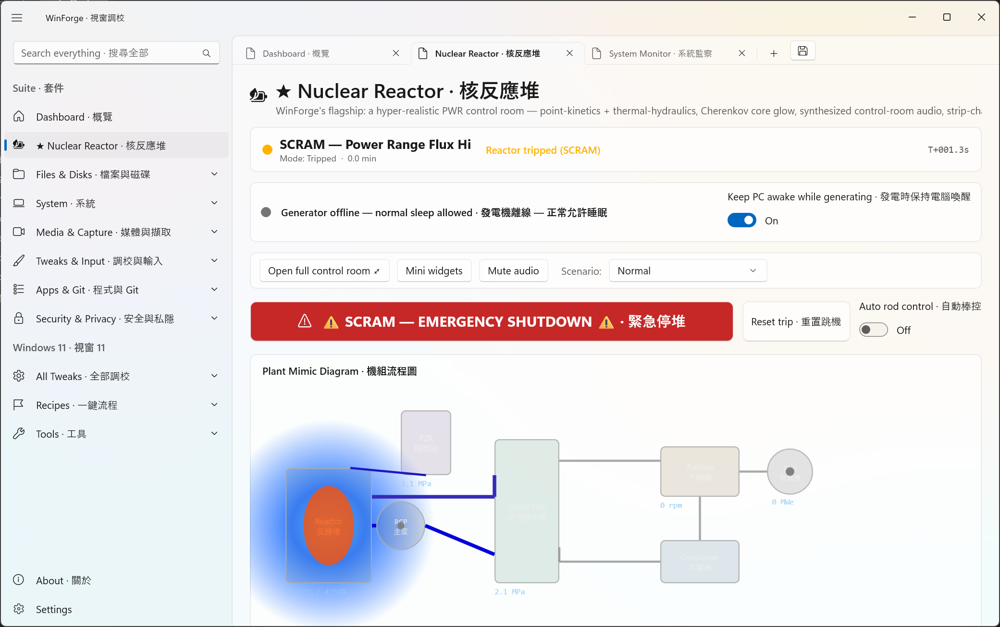
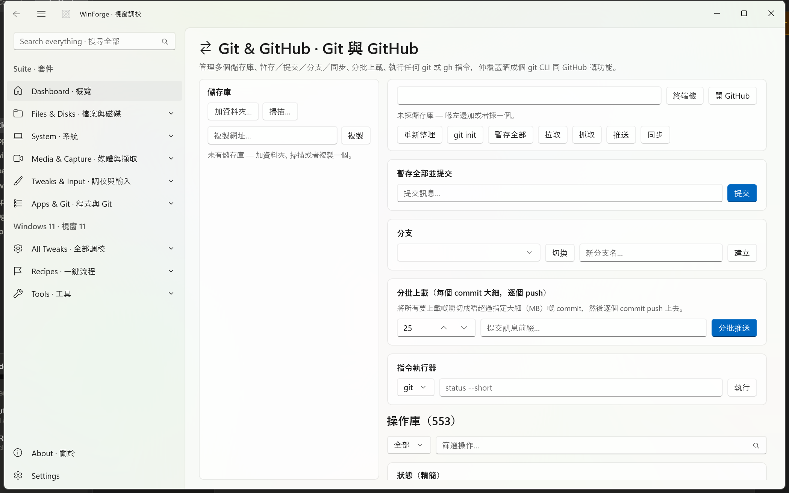
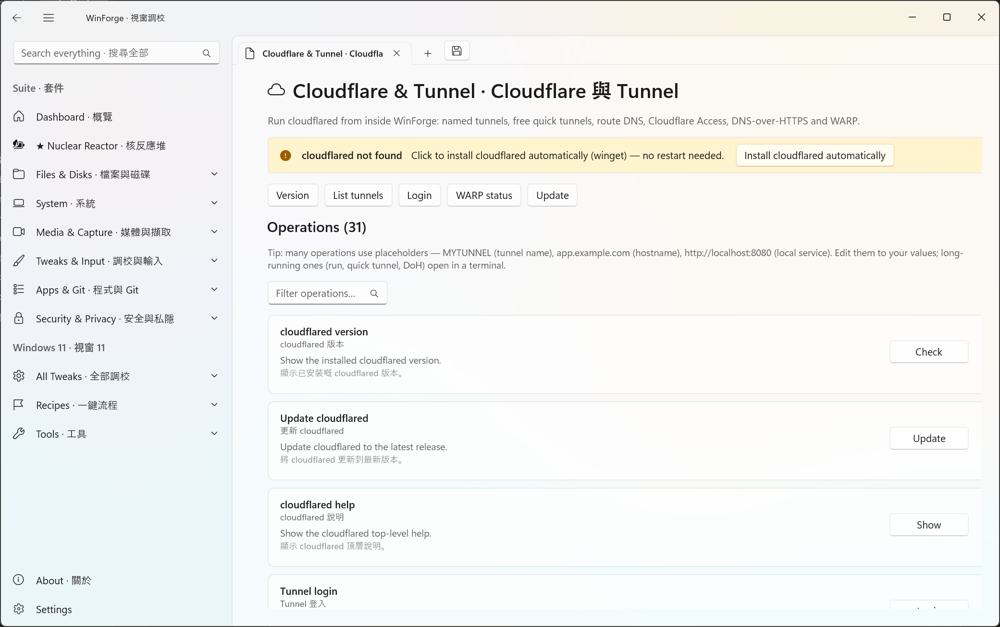
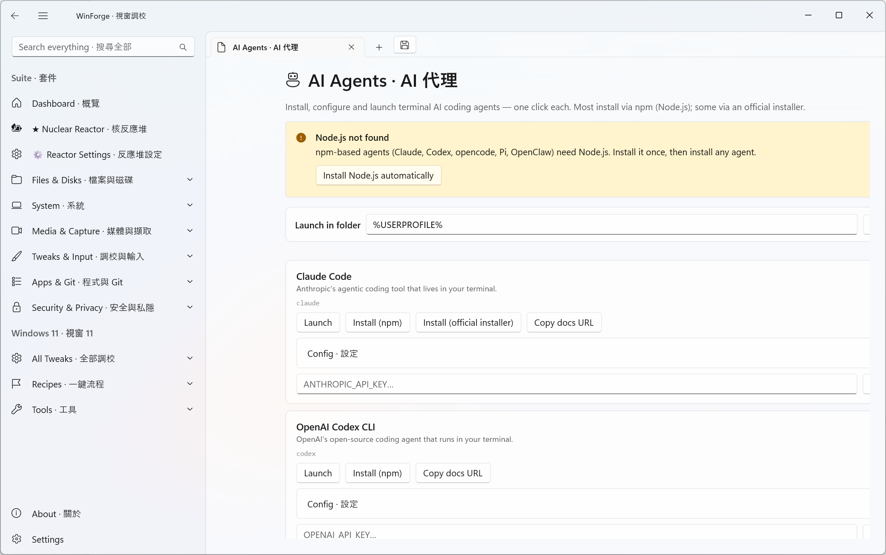
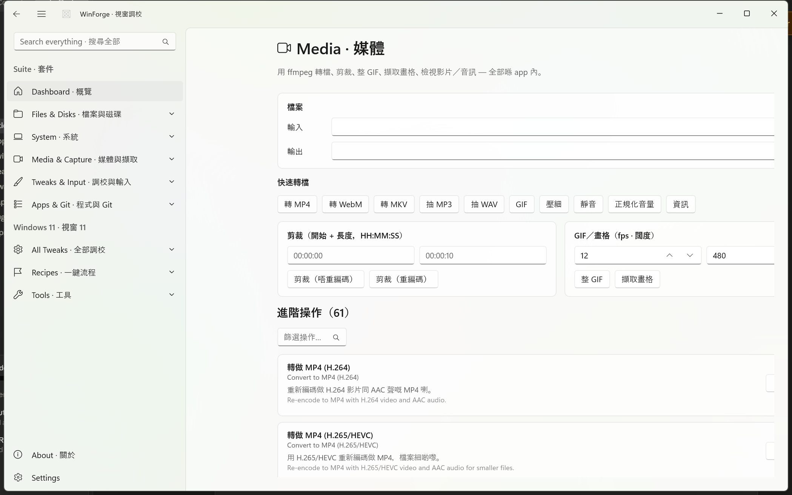
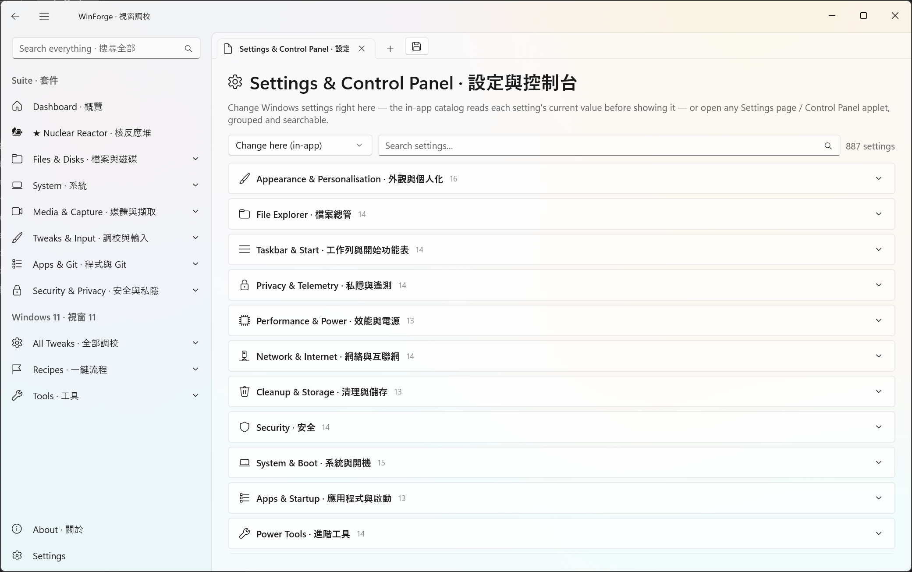
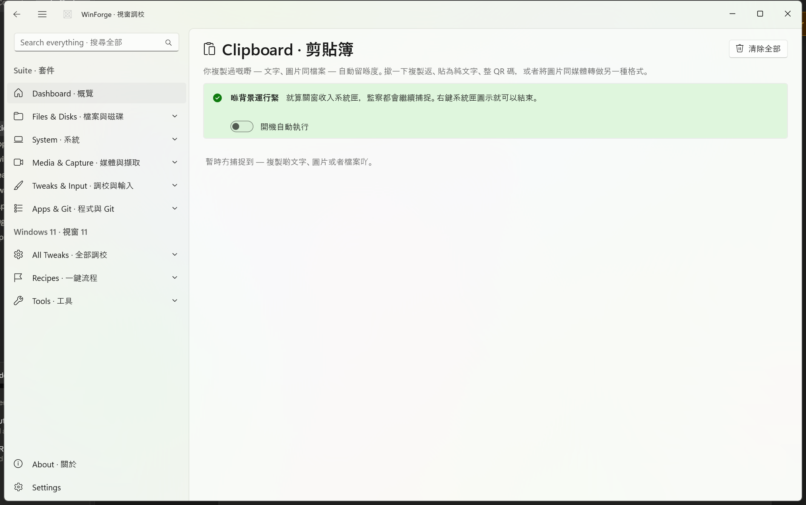
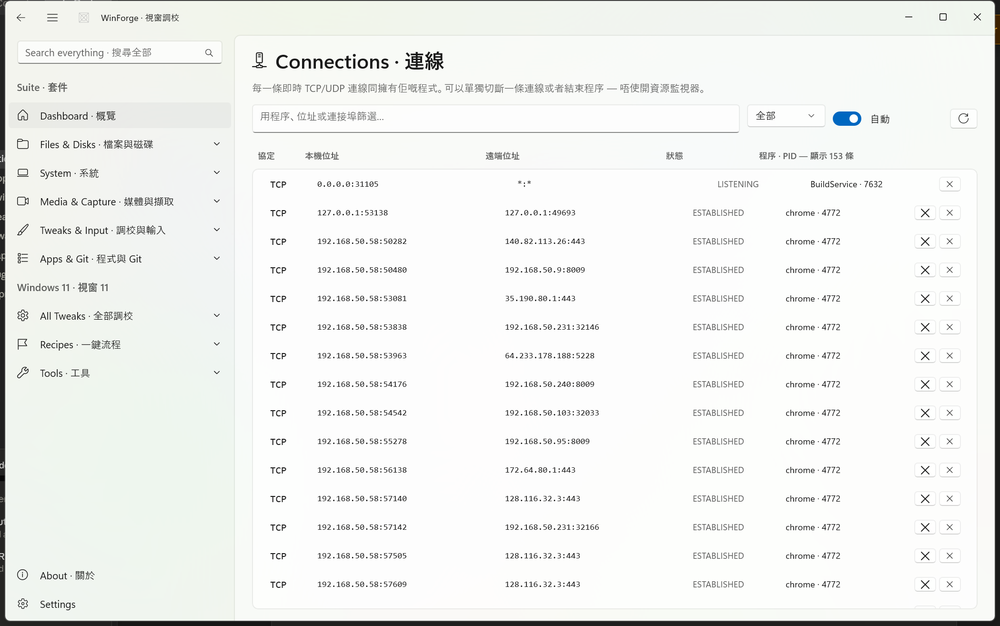
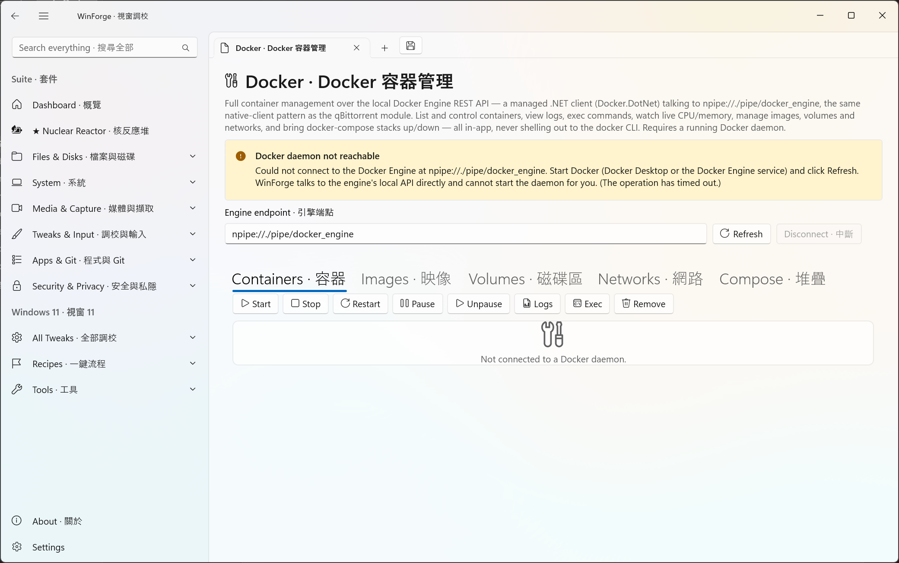
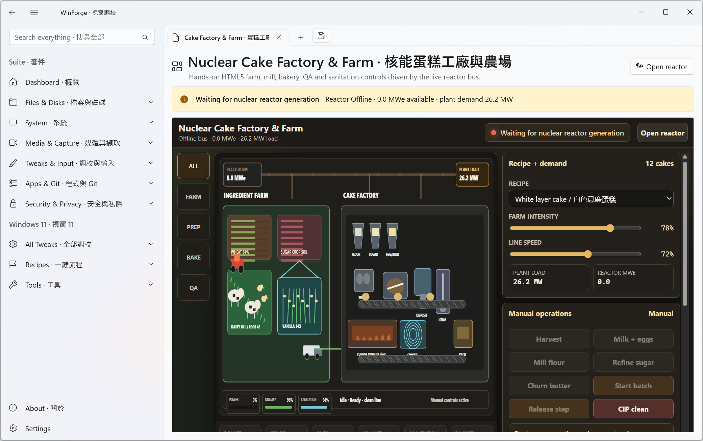

<div align="center">

> Native installer CI · The C++20 installer is contract-checked before packaging, after Inno Setup compilation, and after silent install; see [Native Installer CI](docs/Native-Installer-CI.md). 原生安裝程式 CI 會檢查封裝前、編譯後同靜默安裝後嘅合約。

> Native update · Symbols Palette is now a tested C++/WinRT page: 226 local glyphs in nine bilingual categories, literal-default and opt-in bounded-PCRE2 filtering, explicit clipboard Copy, and aliases symbols/glyphs/module.symbols. See [Native Symbols Palette](docs/Native-Symbols-Palette.md).

# WinForge · 視窗鑄造

**An all-in-one, fully bilingual Windows 11 control center — every module is real and working — crowned by a hyper-realistic flagship nuclear-reactor simulator.**
**一個全方位、全程雙語嘅 Windows 11 控制中心 — 每個模組都係真正用得 — 仲有一個超寫實嘅旗艦核反應堆模擬器坐鎮。**

`WinUI 3 · shipping .NET 11 + native C++20 rewrite` · `English + 繁體中文／粵語` · `x64` · `319 in-app entries` · `1,214 total features`

</div>

---

## 🌏 Overview · 概覽

**EN —** WinForge is an all-in-one, fully bilingual control center for Windows 11. It gathers 319 real, working modules and 1,214 total features — system tweaking, files & disks, media & capture, developer tooling, networking, package management, AI, window management, PowerToys-style utilities, security vaults, virtualization and gaming — into a single **WinUI 3 / .NET 11** app where every English label is paired with **繁體中文／粵語** and every action actually changes the system. Its flagship is a **hyper-realistic Pressurized Water Reactor (PWR) control-room simulator** with full point-kinetics physics, a fuel-and-waste fuel cycle, a water-treatment plant, and Westinghouse-style safety systems.

**粵語 —** WinForge 係一個畀 Windows 11 用嘅全方位、全程雙語控制中心。佢將 319 個真正用得嘅模組同 1,214 項總功能 — 系統調校、檔案與磁碟、媒體與擷取、開發者工具、網絡、套件管理、AI、視窗管理、PowerToys 式工具、安全保險庫、虛擬化同遊戲 — 全部集合喺一個 **WinUI 3 / .NET 11** app 入面，每個英文標籤都配上**繁體中文／粵語**，而且每個動作都真正改到部機。佢嘅旗艦係一個**超寫實壓水堆（PWR）控制室模擬器**，附完整點動力學物理、燃料與廢料燃料循環、水處理廠同西屋式保護系統。

## 🧱 Native C++ Rewrite · 原生 C++ 重寫

### 2026-07-18 chmod and renderer-evidence checkpoint · chmod 同渲染證據檢查點

**EN —** `module.unixperm` is now a genuine standard-C++/C++/WinRT chmod Calculator, reachable through `unixperm`, `chmod`, and its canonical route. It synchronizes all 12 Unix permission bits with two-way octal and symbolic editors, starts at `0644`, preserves `s/S/t/T`, retains the last valid state after malformed input, previews without executing `chmod`, and changes the clipboard only after an explicit Copy. Twenty focused core contracts include exhaustive round trips across all 4,096 modes; the aggregate Debug and Release suites each pass **439/439** and the owned shell campaign passes **267/267**. A new central renderer contract identifies exactly **18 dedicated fixed-route renderers**; All Apps now says “available” for those routes and “pending” for the remaining catalog entries. The corrected ledger records 18 `in-progress` fixed routes and 328 `not-started` routes—no pending page is counted as ported.

**粵語 —** `module.unixperm` 而家係真正標準 C++／C++/WinRT chmod 計算機，可以用 `unixperm`、`chmod` 同本體 route 開啟。全部 12 個 Unix 權限位會同雙向八進位／符號編輯器同步，預設 `0644`，完整保留 `s/S/t/T`；錯誤輸入會保留上一個有效狀態，`chmod` 只會預覽而絕不執行，而且只有明確 Copy 先會改剪貼簿。20 個專項 core 合約包括全部 4,096 個模式來回驗證；Debug 同 Release 總套件各自係 **439/439**，自有 shell campaign 係 **267/267**。新中央 renderer 合約準確列出 **18 條有專用 renderer 嘅固定 route**；All Apps 對呢啲 route 顯示「可用」，其他目錄項目仍顯示「待完成」。修正後 ledger 有 18 條 `in-progress` 同 328 條 `not-started`，pending 頁絕不當成已移植。

**Headless visual evidence · 無頭視覺證據：** The requested local LowLevel MCP successfully completed a real stdio handshake, staged an immutable 294-file runtime, launched the exact native WinUI window on a uniquely named isolated desktop, and proved PID/title/class ownership. Its 1320×880 `PrintWindow` frame had a completely white client (22,657 sampled pixels, one color, zero variance); `SwitchDesktop` then failed at High integrity with Win32 error 5, leaving XAML composition dormant. The visible desktop was not touched, no input was sent, and no blank PNG was promoted. This row therefore remains honestly `capture-blocked`, not visually passed. · 指定本機 LowLevel MCP 已真正完成 stdio handshake、暫存不可變 294-file runtime、喺獨立命名隔離 desktop 開啟準確原生 WinUI 視窗，亦證明 PID／title／class 擁有權；但 1320×880 client 完全白色，High integrity 下 `SwitchDesktop` 再因 Win32 錯誤 5 失敗。冇觸碰可見 desktop、冇送輸入、冇將空白 PNG 當證據，所以狀態如實保持 `capture-blocked`。

**EN · Current 2026-07-17 native checkpoint:** A genuine C++20/C++/WinRT rewrite is underway beside the shipping managed app. Debug and Release x64 native WinUI 3 builds finish with 0 errors; the inventory covers **346 fixed routes + five dynamic route families**; and the current Debug and Release core executables each pass **417/417**. The active regex set has six surfaces (Shell, All Apps, cached Package Discover, Regex Cheatsheet, Symbols Palette, and cached App Uninstaller). The earlier 403/403 and 226/226 visible-shell figures are historical snapshots, not current headless-only verification. Release PE inspection still finds a zero COM descriptor and no `coreclr`, `hostfxr`, or `mscoree` import. This remains a migration milestone, not a full-port claim.

**粵語 · 2026-07-17 目前檢查點：** Debug 與 Release native core 各自是 **417/417**；regex surface 一共有六個；舊的 403/403 與 226/226 可見桌面記錄只屬歷史，不能代替 headless-only 證據。

**粵語 —** 真正嘅 C++20／C++/WinRT 重寫而家會同發佈中受控 app 並行。Debug 同 Release x64 原生 WinUI 3 都以 0 errors 建置，清單涵蓋 **346 條固定路線 + 五組動態路線**，目前原生測試 executable 喺 Debug 係 **403/403**、Release 亦係 **403/403**（包括 14 個 Password Generator、11 個 Password Strength、六個 Regex Cheatsheet 同八個 Regex Tester 延續 core 檢查），而提權、只控制自己 process 嘅 UI Automation shell 亦係 **226/226**。Release PE 審查亦證實 COM descriptor 係零，而且冇 `coreclr`、`hostfxr` 或 `mscoree` import。呢個係遷移里程碑，唔係扮成全功能已移植：未完成功能會顯示明確 pending 頁，而每項對等清單通過之前，受控 app 仍然係權威版本。

### Native safe regex search & builder · 原生安全正規搜尋同建立器

**EN · Current regex contract (2026-07-17):** `RegexSearchSurface.h` registers six native regex-search surfaces: Shell catalog, All Apps, cached Package Discover, Regex Cheatsheet, Symbols Palette, and cached App Uninstaller. Each uses bounded PCRE2-16 only when its labelled Regex mode is enabled. The builder target indices are App Uninstaller **5** and Tester-only **6**; invalid expressions cannot apply.

**粵語 · 目前 Regex 合約：** 六個 surface 是 Shell、All Apps、cached Package Discover、Regex Cheatsheet、Symbols Palette 同 cached App Uninstaller；builder target App Uninstaller 是 **5**，Tester-only 是 **6**。

**Latest Regex Tester continuation / 最新 Regex Tester 延續**

**EN · Current verification:** Debug and Release native core each pass **417/417**. The LowLevel off-screen UI campaign is presently `capture-blocked`: the WinUI client frame is blank and `NativePageTitle` does not appear after 30 seconds. It deliberately does not fall back to a focus-stealing visible desktop. The earlier 226/226 visible-shell campaign is historical, not current headless evidence.

**粵語 · 目前驗證：** Debug 與 Release core 各自 **417/417**。LowLevel off-screen UI 目前 `capture-blocked`：WinUI client frame 空白，30 秒後都冇 `NativePageTitle`；刻意不回退去會搶焦點的可見桌面。

**粵語 —** 原生 Regex Tester 而家會顯示最多 100 個非重疊相符項目同命名 capture 資訊，支援 `(x)` 忽略 pattern 空白、`(n)` 只保留命名 capture，同埋只喺本機做替換預覽（`$$`、存在嘅 `$0`–`$99` 同 `${name}`）。Debug 同 Release 都係 **403/403**，headless UI Automation 係 **226/226**。852×880 全視窗同 836×841 client-only 截圖都係空白，已丟棄；冇重用舊圖，所以視覺證據如實標記為 `capture-blocked`。

**粵語 —** `RegexSearchSurface.h` 明確登記咗而家每個原生 regex-search 控制：Shell 目錄、所有 app、已快取 Package Discover 同靜態本機 Regex Cheatsheet；只有清楚標示嘅 Regex mode 啟用時先會經有界 PCRE2-16。完整四步 `module.regextester` 精靈而家有旗標、已 escape literal recipe（包含、完全、開頭、結尾、完整字）、路線／套件／版本起始式、字元類別同 token、group、alternative、word-boundary 同 lookaround assertion、quantifier、安全 match／capture 預覽同按目標 Apply；無效模式唔可以套用。Package Discover 有意只限本機快取：builder 目標會強制 Discover、只保留真正 Discover 搜尋快取、絕對唔會入套件 argv 或 HTTPS 請求、會停用遠端 Search，而且單調遞增嘅 query audit 唔會改。PCRE2 用 UTF/UCP 語義、唔用 JIT 同有嚴格互動資源限制；呢個唔係完整 .NET regex 或 replacement 對等聲稱。

### Native Regex Cheatsheet parity · 原生 Regex 速查表對等

**EN · Current Regex Cheatsheet status:** `module.regexcheat` is the **fourth of six** registered native regex-search surfaces. Its local bounded-PCRE2 behavior remains real, but earlier 224/224 UI-smoke text is historical. Current core proof is the Debug/Release **417/417** suite; headless visual evidence remains `capture-blocked` because the off-screen WinUI client frame is blank.

**粵語 · Regex Cheatsheet 目前狀態：** 它是六個 native regex-search surface 的第四個；舊 224/224 UI-smoke 只屬歷史，headless 視覺證據仍然 `capture-blocked`。

**粵語 —** `module.regexcheat` 而家係真正嘅 C++/WinRT route，有純 C++ 67 項、九個分類嘅雙語參考目錄，同八個要明確按 Copy 先會複製嘅現成模式。搜尋預設係 literal；只有清楚標示嘅 Regex mode 會用 bounded、本機 PCRE2-16 篩選，而無效表達式會保留原先睇到嘅結果。佢係第四個已註冊嘅原生 regex-search surface，並可經完整 builder round-trip 一個已驗證嘅表達式。.NET 專用語法只係參考資料：唔會執行、啟動 process、發 request 或改 package command。六個 focused core 檢查同 224/224 原生 UI Automation smoke 覆蓋目錄、篩選、安全模式、Copy、builder handoff、accessibility 同 clipping。檢查過嘅 852×880 full frame 同 836×841 client frame 都係空白並已丟棄，所以 visual 狀態如實係 `capture-blocked`。

### Password Generator native parity · 密碼產生器原生對等

**EN —** `module.passgen` is now a live native C++ Password Generator, reachable through `passgen`, `password`, and its canonical route. Its testable core uses Windows BCrypt cryptographic randomness with unbiased rejection sampling; it generates passwords with guaranteed selected classes, optional ambiguous-character removal and no-repeat enforcement, plus 3–10-word passphrases from the current 252-word dictionary with selectable separators, capitalization, and an optional trailing digit. The page reports entropy, supports 1–100 output rows, preserves generated state across language rerenders, and writes the clipboard only after explicit Copy. The ledger remains **in progress only because this desktop session cannot produce a valid fresh capture**.

**粵語 —** `module.passgen` 而家係即時原生 C++ 密碼產生器，可以用 `passgen`、`password` 同本體 route 開啟。可測試 core 用 Windows BCrypt 加密碼學隨機值配合無偏 rejection sampling；會產生保證包含已揀字元類別嘅密碼，可選移除易混淆字元同禁止重複，亦可用現有 252 字詞字典產生 3–10 字通行短語，支援分隔符、大寫同可選尾數字。頁面會顯示熵值、支援 1–100 行輸出、轉語言時保留已產生狀態，而且只會喺明確 Copy 後先寫剪貼簿。清單仍然只因呢個 desktop session 產生唔到有效新擷取而標示**進行中**。

### Password Strength native parity · 密碼強度原生對等

**EN —** `module.passwordstrength` is a live native C++ local-only analyzer, available through `passwordstrength`, `pwstrength`, and its canonical route. It calculates the managed ASCII-pool entropy, applies local common-password, repeat, and sequence warnings, reports rating and crack-time bands, starts masked, and supports an explicit in-memory reveal. The value is never persisted, logged, sent, or copied, and it is cleared when navigating away. Debug/Release core tests include 11 focused checks and the 224/224 native UI smoke covers masking, reveal toggles, local warnings, aliases, language retention, accessibility, and horizontal bounds. The row remains `in-progress` only because the inspected LowLevel capture had a blank client surface and was discarded.

**粵語 —** `module.passwordstrength` 係即時原生 C++、只限本機嘅分析器，可以用 `passwordstrength`、`pwstrength` 同本體 route 開啟。佢會計算受控版 ASCII 字元池熵值、喺本機套用常見密碼／重複／序列警告、顯示評級同破解時間範圍；預設遮蔽，並提供明確只喺記憶體嘅顯示切換。密碼絕對唔會持久化、記錄、傳送或者複製，離開頁面時會清除。Debug／Release core 測試包括 11 個專項檢查，而 224/224 原生 UI smoke 覆蓋遮蔽、顯示切換、本機警告、alias、語言保留、無障礙同水平邊界。呢項只因檢查過嘅 LowLevel 擷取有空白 client surface、已經丟棄而保持 `in-progress`。

### Case Converter native parity · 大小寫轉換原生對等

**EN —** `module.caseconvert` now has a live native implementation that tokenizes separators plus camel/Pascal/digit boundaries and emits ten ordered forms: camelCase, PascalCase, snake_case, kebab-case, CONSTANT_CASE, Title Case, Sentence case, dot.case, path/case, and Train-Case. The page keeps its bilingual input/output layout through language rerenders, uses built-in Windows invariant NLS casing rather than a machine-specific ICU DLL, and exposes stable accessibility IDs for each copy action. A fresh capture through both the repository driver and a LowLevel headless desktop returned a blank or near-uniform WinUI client frame, so the stale image was retired and visual status is `capture-blocked`.

**粵語 —** `module.caseconvert` 而家有即時原生實作，會按分隔符同 camel／Pascal／數字邊界做 token 化，再輸出十種有序格式：camelCase、PascalCase、snake_case、kebab-case、CONSTANT_CASE、Title Case、Sentence case、dot.case、path/case 同 Train-Case。頁面喺轉語言時會保留雙語輸入／輸出版面，會用內置 Windows invariant NLS 大小寫處理而唔依賴機器特定 ICU DLL，並為每個複製動作提供穩定無障礙 ID。repository driver 同 LowLevel 無頭 desktop 都重新嘗試過最新擷取，但只得到空白／接近單色 WinUI client frame；舊圖已移除，視覺狀態係 `capture-blocked`。

### Roman Numerals native parity · 羅馬數字原生對等

**EN —** `module.romannum` is now a live native C++ utility, reachable through `roman`, `romannum`, and its canonical route. It converts 1–3,999 in standard notation and, when Extended is enabled, 1–3,999,999 with U+0305 combining-overline vinculum notation (`4,000 → I̅V̅`); canonical parenthetical input such as `(IV)` also parses as 4,000. The pure standard-C++ core deliberately preserves the managed strict canonical round trip, including rejection of direct lowercase, `IIII`, `IC`, `(I)`, and `(I)V`. Both directions and the range setting survive language rerenders, each input/output/copy control has a stable automation ID, and the clipboard is written only by explicit Copy. Its 17 focused native cases and 13 live Roman UI Automation checks were part of the 2026-07-15 **355/355** and **148/148** checkpoint; the current aggregate is recorded above. The repository driver and inspected LowLevel headless desktop both produced blank or near-uniform client frames, so no screenshot is accepted and visual evidence is `capture-blocked`.

**粵語 —** `module.romannum` 而家係真正原生 C++ utility，可以用 `roman`、`romannum` 同本體 route 開啟。佢會用標準寫法轉換 1–3,999；開啟「擴充」後可用 U+0305 組合上劃線 vinculum 寫法轉換 1–3,999,999（`4,000 → I̅V̅`），而標準括號輸入 `(IV)` 亦會解析成 4,000。純標準 C++ core 有意保留受控版嚴格 canonical round-trip：直接小楷、`IIII`、`IC`、`(I)` 同 `(I)V` 都會拒絕。兩邊轉換同範圍設定會喺轉語言時保留，每個輸入／輸出／複製 control 都有穩定 automation ID，而且剪貼簿只會喺明確 Copy 後先寫入。17 個原生專項案例同 13 個即時 Roman UI Automation 檢查屬於 2026-07-15 **355/355** 同 **148/148** checkpoint；目前整體會喺上面記錄。repository driver 同檢查過嘅 LowLevel 無頭 desktop 都只得到空白／接近單色 client frame，所以唔會接受截圖，視覺證據係 `capture-blocked`。

### GUID & ID Generator native parity · GUID 同 ID 產生器原生對等

**EN —** `module.guidgen` now has a live native C++ implementation for RFC 4122 GUID v4 generation in D/N/B/P/X formats, uppercase output, 1–1000 bulk generation, ULID creation, nano-ID creation, and GUID byte/version/variant inspection. The page is reachable through `guidgen` and the canonical route, keeps generated/inspected state across language rerenders, exposes stable UI Automation IDs for every explicit Copy action, and only touches the clipboard after the operator selects Copy. Its ledger row remains **in progress only because fresh native visual capture is environment-blocked**.

**粵語 —** `module.guidgen` 而家有即時原生 C++ 實作，支援 RFC 4122 GUID v4、D/N/B/P/X 格式、大楷輸出、1–1000 個批量產生、ULID、nano-ID，同 GUID 位元組／版本／variant 檢查。頁面可以用 `guidgen` 同本體 route 開啟，轉語言時保留已產生／已檢查狀態，為每個明確 Copy 動作提供穩定 UI Automation ID，而且只會喺操作員撳 Copy 後先掂剪貼簿。清單仍然只因最新原生視覺擷取受環境阻擋而標示**進行中**。

### UUID v7 native parity · UUID v7 原生對等

**EN —** `module.uuidv7` is now a live native C++ RFC 9562 utility, reachable through `uuidv7` and its canonical route. It generates canonical version-7 UUIDs from a 48-bit Unix-millisecond timestamp plus cryptographic random fields, offers 1–1000-item bulk generation, and has an optional monotonic mode that remains ordered across same-millisecond generation, backwards clocks, and `rand_a` overflow. Its local decoder accepts canonical, compact, braced, and `urn:uuid:` forms; reports version, RFC variant, UTC/local timestamps when the UUID carries time (v7 and best-effort v1), and canonical lowercase output. State survives language rerenders and the clipboard changes only after explicit Copy. The ledger is still **in progress only because fresh native visual capture is environment-blocked**.

**粵語 —** `module.uuidv7` 而家係即時原生 C++ RFC 9562 utility，可以用 `uuidv7` 同本體 route 開啟。佢會由 48-bit Unix millisecond timestamp 加密碼學隨機欄位產生標準 version-7 UUID，支援 1–1000 條批量產生；可選 monotonic 模式會喺同一毫秒、時鐘倒退同 `rand_a` overflow 時維持排序。本機 decoder 接受標準、緊湊、花括號同 `urn:uuid:` 格式；會報告 version、RFC variant、帶時間 UUID（v7 同 best-effort v1）嘅 UTC／本機 timestamp 同標準小楷輸出。轉語言時會保留狀態，而剪貼簿只會喺明確 Copy 後先改。清單仍然只因最新原生視覺擷取受環境阻擋而標示**進行中**。

### Base32 / Base58 / Ascii85 native parity · Base32／Base58／Ascii85 原生對等

**EN —** `module.base32` is now a real native codec page reachable through `base32`, `base58`, and `module.base32`. The standard-C++ core matches the managed UTF-8 contract for padded and unpadded RFC 4648 Base32, Bitcoin Base58 (including leading zero bytes), and Adobe Ascii85 (`<~ ~>` markers and `z` zero groups). The page keeps codec selection, input, and output across language rerenders, provides localized UI Automation names and a polite live status, clears output atomically on malformed input, and only writes the clipboard after explicit Copy. Focused codec tests pass 15/15; the 2026-07-15 checkpoint was **355/355** with **148/148** live UI Automation checks, including horizontal-clipping checks for the codec and Package Manager controls. Fresh native visual capture remains environment-blocked: both the repository driver and the LowLevel MCP headless-desktop `PrintWindow` capture produced a blank/near-uniform WinUI client frame, so no stale or managed screenshot is presented as native evidence.

**粵語 —** `module.base32` 而家係真正原生編解碼頁，可以用 `base32`、`base58` 同 `module.base32` 開啟。標準 C++ core 跟足受控版 UTF-8 合約，支援有填充／無填充 RFC 4648 Base32、Bitcoin Base58（包括開頭零位元組）同 Adobe Ascii85（`<~ ~>` 標記同 `z` 零組）。頁面轉語言時保留編碼方式、輸入同輸出，有本地化 UI Automation 名稱同 polite live status；無效輸入會原子式清空輸出，而剪貼簿只會喺明確 Copy 後先寫入。編解碼專項測試係 15/15；2026-07-15 checkpoint 係 **355/355**，live UI Automation 係 **148/148**，當中包括 codec 同套件管理控制項嘅水平裁切檢查。最新原生視覺擷取仍受環境阻擋：repository driver 同 LowLevel MCP 無頭 desktop `PrintWindow` 擷取都只得到空白／接近單色 WinUI client frame，所以冇用舊圖或者受控版截圖當原生證據。

### Native layout and installer CI · 原生版面同安裝程式 CI

**EN —** The native shell now measures pages to the available viewport, keeps a vertical overflow path, and enables horizontal scrolling as a last-resort accessibility escape hatch so bilingual headings, action rows, and the Package Manager toolbar are not silently clipped. [`.github/workflows/native-release.yml`](.github/workflows/native-release.yml) pins the VS 2022 runner and proves/provisions its C++ v143 UWP toolset before MSBuild, then builds the C++ Release x64 runtime, runs native core tests and catalog parity, creates a portable runtime zip, compiles `WinForge-Native-Setup.exe`, and silently installs it into a guarded, per-run `%LOCALAPPDATA%` directory. CI asserts `WinForge.exe`, `unins000.exe`, and `THIRD-PARTY-NOTICES.txt`, silently uninstalls, then asserts the install root is gone. The interactive process-owned UI Automation smoke remains a required local/elevated gate because a GitHub-hosted service desktop cannot provide trustworthy WinUI composition or accessibility geometry. Every branch push and every pull request into `main` runs the complete native gate; every successful `main` push creates a uniquely tagged GitHub Release with the native artifacts. Branch and pull-request runs retain Actions artifacts without publishing unmerged binaries as releases. · 原生 shell 而家會按可用 viewport 量度頁面，保留垂直溢出路徑，並以水平捲動作最後嘅無障礙保底，避免雙語標題、動作列同套件管理工具列靜默被裁切。[`.github/workflows/native-release.yml`](.github/workflows/native-release.yml) 會固定使用 VS 2022 runner，並喺 MSBuild 前驗證／準備 C++ v143 UWP 工具組，之後建置 C++ Release x64 runtime、執行原生核心測試同目錄對等、產生可攜 runtime zip、編譯 `WinForge-Native-Setup.exe`，再喺受保護、每次執行專用嘅 `%LOCALAPPDATA%` 目錄靜默安裝。CI 會確認 `WinForge.exe`、`unins000.exe` 同 `THIRD-PARTY-NOTICES.txt`，靜默解除安裝，最後確認安裝根目錄已消失。互動式 process-owned UI Automation smoke 仍然係必需嘅本機／提權 gate，因為 GitHub-hosted service desktop 提供唔到可信嘅 WinUI composition 或無障礙 geometry。每次推送任何 branch 同每個合併去 `main` 嘅 pull request 都會執行完整原生 gate；每次成功推送去 `main` 都會用原生 artifacts 建立獨立標籤 GitHub Release。Branch 同 pull-request 執行會保留 Actions artifacts，但唔會將未合併 binary 發佈成版本。

**CI proof · CI 證明：** The 2026-07-18 [every-push trigger proof](https://github.com/codingmachineedge/WinForge/actions/runs/29655932405) ran from a non-`main` branch and passed C++ Release, 417 core route/package-manager tests, 46 parser tests, catalog parity, all three installer-contract boundaries, the guarded silent install/uninstall lifecycle, and artifact upload. It correctly retained the 89,642,539-byte native artifact while skipping public release creation for unmerged code. · 2026-07-18 嘅[每次推送觸發證明](https://github.com/codingmachineedge/WinForge/actions/runs/29655932405)由非 `main` branch 執行，已通過 C++ Release、417 個 core route／package-manager 測試、46 個 parser 測試、目錄對等、三個 installer-contract 邊界、受 guard 靜默安裝／解除安裝生命週期，同 artifact 上載。佢正確保留 89,642,539-byte 原生 artifact，同時略過未合併程式碼嘅公開版本建立。

### Check Digit native parity · 檢查碼原生對等

**EN —** `module.checkdigit` now has a genuine native C++ implementation for Luhn/card-brand detection, ISBN-10, ISBN-13, EAN-13, UPC-A, and IBAN. ISBN-13 requires its registered 978/979 prefix; IBAN validates ASCII country/check characters, all **89 registered prefixes/formats in SWIFT Registry Release 102**, exact registered length and BBAN classes before bounded incremental mod-97. An independent pinned registry fixture verifies every row, a Unicode-confusable regression prevents case folding from widening accepted input, and Discover labelling uses the official 16–19-digit range boundaries without absorbing adjacent 6590/UnionPay space. Validation is live, bilingual, state-preserving across language changes, reachable through `checkdigit`, `luhn`, and the canonical route, and announced through a polite accessible live region. The 48 focused native cases, 24/24 managed-oracle parity cases, and all six UI schemes pass. Its ledger row remains **in progress only because fresh visual capture is environment-blocked**; no old or managed screenshot is presented as native evidence.

**粵語 —** `module.checkdigit` 而家有真正原生 C++ 實作，支援 Luhn／卡種識別、ISBN-10、ISBN-13、EAN-13、UPC-A 同 IBAN。ISBN-13 只接受已登記嘅 978／979 開頭；IBAN 會先驗證 ASCII 國家／檢查字元、SWIFT Registry Release 102 全部 **89 個已登記 prefix／格式**、已登記固定長度同 BBAN 字元類別，之後先做有界增量 mod-97。獨立固定 registry fixture 會驗證每一行，Unicode 混淆字元回歸亦避免 case folding 擴闊可接受輸入；Discover 標籤亦跟官方 16–19 位 range 邊界，唔會錯吞相鄰 6590／UnionPay 空間。驗證會即時更新、完整雙語，轉語言時保留狀態，可以用 `checkdigit`、`luhn` 同本體 route 開啟，狀態亦會經 polite 無障礙 live region 宣告。48 個專項原生案例、24/24 受控基準對等案例同六個 UI 格式全部通過。清單仍然只因為最新視覺擷取受環境阻擋而標示**進行中**；絕對冇將舊圖或受控版截圖扮成原生證據。

### Text to Binary native parity · 文字轉二進位原生對等

**EN —** `module.binarytext` is now a real standard-C++ UTF-8 text/byte converter, reachable through `binarytext`, `textbinary`, and its canonical route. It preserves the managed formatting contract for binary, decimal, octal, and uppercase hexadecimal byte codes; accepts spaces, tabs, line breaks, commas, and matching `0b`/`0o`/`0x` prefixes; trims managed Unicode whitespace around a code; fails atomically for malformed or out-of-range codes; and matches managed replacement behavior for malformed UTF-8 (including continuation-prefix and invalid-scalar boundaries) and unpaired UTF-16. The native page preserves its selected base, input, and output across language rerenders, exposes localized UI Automation names plus a polite live region with caution styling on failures, and only touches the clipboard after an explicit Copy action. Native Debug/Release regressions pass 25 focused cases inside the 281/281 total suite (235 core + 46 parser), the linked managed-reference regression passes 18/18, and the 115/115 live UI automation still exercises Encode, Decode, Move, explicit Copy, malformed-output clearing, restored base/input/output, and every alias. Its ledger row remains **in progress only because fresh visual capture is environment-blocked**; no screenshot was fabricated or reused.

**粵語 —** `module.binarytext` 而家係真正標準 C++ UTF-8 文字／位元組轉換器，可以用 `binarytext`、`textbinary` 同本體 route 開啟。佢跟足受控版嘅二進位、十進位、八進位同大楷十六進位位元組格式；接受空格、tab、換行、逗號同配對嘅 `0b`／`0o`／`0x` prefix；亦會修剪數字碼前後跟受控版一致嘅 Unicode 空白；遇到格式錯誤或者超出範圍嘅碼會原子式失敗；而無效 UTF-8（包括 continuation prefix 同無效 scalar 邊界）同未配對 UTF-16 都會跟受控版用替代字元。原生頁面轉語言時會保留已揀進位、輸入同輸出，有本地化 UI Automation 名稱同失敗時會用 caution 樣式嘅 polite live region，而且只會喺明確撳 Copy 後先掂剪貼簿。原生 Debug／Release 回歸入面 25 個專項案例同 281/281 完整套件（235 core + 46 parser）都通過，連結嘅受控參考回歸係 18/18，115/115 live UI automation 仍然會操作 Encode、Decode、搬輸出、明確 Copy、格式錯誤清空、重建後嘅進位／輸入／輸出同全部 alias。清單仍然只因最新視覺擷取受環境阻擋而標示**進行中**；絕對冇合成或者重用截圖。

Current aggregate evidence after the native Password Generator slice is **368/368 native tests** in Debug and Release (including 14 focused Password Generator checks) and **200/200 native UI Automation checks**; older per-feature counts below are retained as historical slice evidence. · 原生 Password Generator 批次之後目前整體證據係 Debug 同 Release **原生測試 368/368**（包括 14 個 Password Generator 專項檢查）同 **原生 UI Automation 200/200**；下面較舊嘅逐功能數字保留作歷史批次證據。

See the [full native rewrite record](docs/Native-Cpp-Rewrite.md), [wiki overview](docs/wiki/Native-Cpp-Rewrite.md), and [machine-readable parity ledger](docs/cpp-port-parity.json). · 請睇[完整原生重寫記錄](docs/Native-Cpp-Rewrite.md)、[wiki 概覽](docs/wiki/Native-Cpp-Rewrite.md)同[machine-readable 對等清單](docs/cpp-port-parity.json)。

**Native App Uninstaller / 原生應用程式解除安裝.** The native current-user Store/UWP route, bounded local regex search, reviewed-confirmed removal, fail-closed cleanup boundary, test evidence, and capture-blocked visual record are documented in [Native App Uninstaller](docs/Native-App-Uninstaller.md) and its [wiki mirror](docs/wiki/Native-App-Uninstaller.md). 原生目前使用者 Store/UWP route、本機 bounded regex 搜尋、review/Confirm 移除、fail-closed 清理邊界、測試證據同 capture-blocked 視覺記錄都寫喺以上文件。

### Package Manager migration truth · 套件管理遷移實況

**2026-07-15 historical native coordinator update · 2026-07-15 歷史原生協調器更新：** One cached Discover, Updates, or Installed row can create a redacted reviewed Install/Update/Uninstall argv plan in AwaitingConsent; a separate Confirm control queues that exact validated plan for serial execution at normal integrity. The coordinator caps in-memory records at 50, applies a five-minute runtime limit, supports cancellation before start and while running, requires fresh consent for retry, and cancels all work on Package Manager exit or navigation away. It fails closed for elevation, hooks, unsafe IDs, custom mutation arguments, and an oversized consent preview rather than tail-truncating it. It retains the redacted reviewed argv plus request/lifecycle metadata in memory; a bounded redacted lifecycle event is written to existing operation history; third-party stdout, stderr, and runtime diagnostic text are withheld. Multi-select batches and **Update all** remain preview-only. Debug and Release passed **355/355**, and the elevated shell smoke passed **148/148** at that checkpoint. Normal-integrity live manager execution remains unproven because this session is elevated. The required driver and isolated LowLevel MCP desktop both produced blank or near-uniform WinUI client frames for Discover, Updates, and Installed, so no native PNG is accepted; Operations is also capture-blocked rather than substituted. · 一條已快取 Discover、Updates 或 Installed 資料列可以喺 AwaitingConsent 建立已遮蔽嘅已檢視安裝／更新／解除安裝 argv 計劃；要由另一個 Confirm 控制先可以喺正常 integrity 將該條準確已驗證計劃排入串行執行。協調器最多保存 50 條記憶體記錄、runtime 上限五分鐘、支援開始前同執行中取消、重試必須重新確認，並會喺離開或者關閉 Package Manager 時取消全部工作。提升權限、hooks、唔安全 ID、自訂修改參數同過長確認預覽都會 fail closed，而唔會截斷預覽尾部。佢會喺記憶體保留已遮蔽嘅已檢視 argv 連同要求／生命週期 metadata；現有操作歷史會寫入有界、已遮蔽嘅生命週期事件；第三方 stdout、stderr 同執行時診斷文字都會略去。多選批次同**全部更新**保持只供預覽。嗰個 checkpoint 嘅 Debug／Release 通過 **355/355**，提權 shell smoke 通過 **148/148**。因為目前 session 已提權，正常 integrity 即時管理器執行仍未證實。必需 driver 同隔離 LowLevel MCP desktop 為 Discover、Updates 同 Installed 都只得到空白／接近單色 WinUI client frame，所以冇接受任何原生 PNG；Operations 同樣如實係 capture-blocked，唔會頂替。

> The current native status is described below; earlier per-slice counts are historical only. · 下面係目前原生狀態；較早逐批數字只作歷史記錄。

**EN —** The **shipping managed .NET Package Manager** remains the production implementation; the C++20/C++/WinRT shell is a real but incomplete migration, not a full UniGetUI cutover. Native Discover, Updates, and Installed perform safe read-only result queries; Discover locally filters cached rows by Both, Name, ID, Exact, or Similar with case and ignore-special options. A source-aware selection of up to 25 cached Discover/Updates/Installed rows, or the current eligible Update all set, now enters one all-or-nothing reviewed batch: every redacted full argv is visible, one separate batch confirmation queues the displayed commands serially, cancellation stops the active command and cancels the remainder, and retry returns only unsuccessful commands for fresh review. Individual rows retain their separate consent path. Read-only Details, update-suppression rules, a redacted Sources probe, native JSON preferences, and the bounded metadata-only Bundle workspace are implemented; Setup/bootstrap, scheduling, broad per-manager settings, an elevation broker, full bundle interoperability, and normal-integrity live proof remain pending.

**粵語 —** **發佈中受控 .NET 套件管理器**仍然係正式版本；C++20／C++/WinRT shell 係真正但未完整嘅遷移，唔係完整 UniGetUI 切換。原生 Discover、Updates 同 Installed 會做安全只讀結果查詢；Discover 可以喺已快取資料列本機用 Both、Name、ID、Exact 或 Similar，加上大小寫同忽略特殊字元選項篩選。識別來源嘅最多 25 個快取 Discover／Updates／Installed 資料列，或者目前合資格嘅全部更新集合，而家可以進入一個全有或全無嘅已檢視批次：每個完整已遮蔽 argv 都會顯示、一個獨立批次確認會按顯示次序串行排隊、取消會停止執行中指令並取消其餘指令，而重試只會將未成功指令返回全新檢視。個別資料列保留佢哋分開嘅確認路徑。只讀 Details、更新隱藏規則、已遮蔽 Sources 探測、原生 JSON 偏好同有界只存 metadata 嘅 Bundle 工作區都已實作；Setup／bootstrap、排程、廣泛逐管理器設定、提升權限 broker、完整 Bundle 互通同正常 integrity 即時證據仍然待完成。

**EN —** Native Bundles is now an explicit in-memory workspace rather than a fallback to the visible query. Selected **Discover** and **Installed** rows append metadata only; Updates remains preview-only. Export stays disabled while the workspace is empty, then writes bounded UniGetUI-v3-style JSON/`.ubundle` (`export_version: 3`) atomically, deduplicates compatible entries by manager/source/ID/version and managerless audit entries by source/ID/version, separates compatible `packages` from incompatible audit records, imports bounded metadata with installation-option stripping, and asks before replacing a dirty draft. It never constructs or executes a package command.

**粵語 —** 原生 Bundles 而家係明確嘅記憶體工作區，唔會 fallback 去目前可見查詢。所揀 **Discover** 同**已安裝**資料列只會附加 metadata；Updates 仍然只供預覽。工作區空白時匯出保持停用；有記錄後先會原子式匯出有上限、UniGetUI v3 風格 JSON／`.ubundle`（`export_version: 3`），相容項按管理器／來源／ID／版本、冇管理器嘅稽核項按來源／ID／版本去重，分開相容 `packages` 同不相容審計記錄，匯入有上限 metadata 時移除安裝選項，並喺取代未儲存草稿前詢問。絕對唔會建立或者執行套件指令。

The Package Manager Settings tab persists package-view, search text, sort-mode, Discover filter mode/toggles, update rules, manager filters, and snooze duration in native JSON state. Operations keeps bounded structured history, sanitizes legacy entries on load, and records a bounded redacted lifecycle event for each coordinator outcome; it deliberately never retains third-party output. Batch cards show every reviewed argv and provide their own Confirm/Cancel/Retry controls without exposing a child-level bypass; only failed, timed-out, or cancelled children can return to fresh review, never successful commands. Broader per-manager defaults, backup/restore, scheduler, notification, and elevation mediation remain pending.

套件管理嘅 Settings tab 會用原生 JSON 狀態保存套件檢視、搜尋文字、排序模式、Discover 篩選模式／toggle、更新規則、管理器篩選同暫停時長。Operations 會保存有界結構化歷史、載入時遮蔽舊項目，並為每個協調器結果寫入有界、已遮蔽嘅生命週期事件；佢絕對唔會保存第三方輸出。批次卡會展示每個已檢視 argv，並提供自己嘅 Confirm／Cancel／Retry 控制，絕對唔會提供繞過批次嘅子項控制；只有失敗、超時或者已取消子項可以返回全新檢視，成功指令永遠唔會重播。更完整逐管理器預設、備份／還原、排程、通知同提升權限調停仍然待完成。

**EN —** The current native executable passes **368/368 in Debug** and **368/368 in Release**, including the safe PCRE2 core/builder, UUID v7 vectors, and 14 focused Password Generator checks. The process-owned elevated UI Automation smoke passes **200/200**, including Password Generator class/no-repeat/ambiguity, passphrase, explicit-copy, rerender, alias, accessibility, and horizontal-bound checks. This verifies routing, controls, fail-closed behavior, accessibility, and clipping—not normal-integrity external manager execution. On 2026-07-16, the repository driver launched Password Generator but `CopyFromScreen` was unavailable and its `PrintWindow` fallback was blank/near-uniform. The requested LowLevel MCP was not registered in the active Codex session, so no LowLevel capture is claimed. No PNG is accepted as native visual evidence, and the gallery image below remains a **managed production reference** only.

**粵語 —** 目前原生 executable 喺 Debug 係 **368/368**、Release 亦係 **368/368**，包括安全 PCRE2 core／builder、UUID v7 vectors 同 14 個 Password Generator 專項檢查。只控制自己 process 嘅提升權限 UI Automation smoke 係 **200/200**，包括 Password Generator 字元類別／禁止重複／易混淆字元、通行短語、明確 Copy、重建、alias、無障礙同水平邊界檢查。呢個驗證導覽、控制項、fail-closed 行為、無障礙同裁切，而唔代表正常 integrity 外部管理器執行。2026-07-16，repository driver 開啟 Password Generator，但 `CopyFromScreen` 用唔到，而 `PrintWindow` fallback 係空白／接近單色。要求嘅 LowLevel MCP 未有登記喺目前 Codex session，所以唔會聲稱有 LowLevel 擷取。冇 PNG 會被當成原生視覺證據，下面畫廊圖片仍然只係**受控正式版參考**。

**EN —** Remaining UniGetUI-informed parity work includes the capability/maintenance model, manager-specific rich Details layouts/actions, scheduler integration, persisted sorting and media/open-location/share actions, elevation mediation, full bundle interoperability and installed detection, backup and per-manager settings, actionable verb-aware notifications/tray behavior, and authenticated API/CLI/headless/deep-link/widget surfaces. The native coordinator now provides bounded serial individual and batch consent/cancellation with output withholding; it is not a substitute for those broader workflows. Linux/macOS-only managers are outside this Windows product’s scope. The complete MIT-licensed upstream snapshot is vendored for provenance only at `ThirdParty/UniGetUI`, pinned to Devolutions/UniGetUI commit `21116375c8299d1db38a3c3b4c2eb7e18bc97c4e`; upstream UI, IPC and telemetry are excluded from WinForge build and runtime inputs. See [Package Manager · 套件管理](docs/wiki/Package-Manager.md).

**粵語 —** 尚欠嘅 UniGetUI 參考對等工作包括 capability／維護模型、逐管理器豐富 Details 版面同動作、排程整合、持久化排序同媒體／開啟位置／分享動作、提升權限調停、完整 Bundle 互通同已安裝偵測、備份同逐管理器設定、可操作兼識別動詞嘅通知／系統匣行為，以及已驗證身份嘅 API／CLI／headless／deep-link／widget 介面。原生協調器而家提供有界串行嘅個別同批次確認／取消以及輸出略去，但唔可以代替嗰啲廣泛流程。只供 Linux／macOS 嘅管理器唔屬於呢個 Windows 產品範圍。完整 MIT 授權上游快照只作來源依據，存放喺 `ThirdParty/UniGetUI`，固定到 Devolutions/UniGetUI commit `21116375c8299d1db38a3c3b4c2eb7e18bc97c4e`；上游 UI、IPC 同 telemetry 已排除喺 WinForge 建置同執行輸入之外。詳情見[套件管理](docs/wiki/Package-Manager.md)。

---

## 🖼️ Gallery · 模組畫廊

**EN —** A look at some of the major modules. Every screenshot shows the app's live bilingual UI; the full catalog is below.

**粵語 —** 部分主要模組嘅一覽。每張截圖都係 app 嘅即時雙語介面；完整目錄見下面。

| | |
|---|---|
| **Dashboard · 概覽** — Master search and home overview across every module. Fresh native capture is currently `capture-blocked`; no stale image is substituted. <br> 跨晒所有模組嘅總搜尋同主頁概覽；最新原生擷取目前係 `capture-blocked`，唔會用舊圖頂替。 |  <br> **Nuclear Reactor · 核反應堆** — The flagship hyper-realistic PWR control-room simulator. <br> 旗艦超寫實壓水堆控制室模擬器。 |
|  <br> **Git & GitHub · Git 與 GitHub** — Multi-repo workbench for git and gh with a chunked uploader. <br> 多儲存庫工作台，操作 git 同 gh，附分塊上傳器。 |  <br> **Package Manager · 套件管理 — managed production reference · 受控正式版參考** — This image remains the shipping managed UI, not native evidence. Fresh native Discover, Updates, Installed, and Operations capture attempts are `capture-blocked`: the driver and isolated LowLevel MCP desktop returned blank or near-uniform WinUI client frames, so no stale or synthetic native screenshot is presented. <br> 呢張圖片仍然係發佈中受控介面，唔係原生證據。最新原生 Discover、Updates、Installed 同 Operations 擷取全部係 `capture-blocked`：driver 同隔離 LowLevel MCP desktop 都只回傳空白／接近單色 WinUI client frame，所以唔會展示舊或者合成嘅原生截圖。 |
|  <br> **Cloudflare & Tunnel · Cloudflare 與 Tunnel** — Tunnels, DNS routing, Access, DoH and WARP. <br> 隧道、DNS 路由、Access、DoH 同 WARP。 |  <br> **AI Agents · AI 代理** — Install and launch terminal AI coding agents. <br> 安裝同啟動終端機 AI 編程代理。 |
|  <br> **Media · 媒體** — ffmpeg-powered video/audio convert, trim and GIF making. <br> 用 ffmpeg 轉檔、剪裁影音同整 GIF。 |  <br> **Settings & Control Panel · 設定與控制台** — In-app launcher for ms-settings and Control Panel applets. <br> app 內啟動 ms-settings 頁面同控制台小程式。 |
|  <br> **Clipboard · 剪貼簿** — Richer clipboard history with QR-code generation. <br> 更豐富嘅剪貼簿歷史，附二維碼產生。 |  <br> **Connections · 連線** — Live TCP/UDP socket list with owning processes. <br> 即時 TCP／UDP 連線清單同擁有程序。 |
|  <br> **Docker · Docker 容器管理** — Manage containers, images, volumes and networks. <br> 管理容器、映像、磁碟區同網路。 |  <br> **Cake Factory & Farm · 蛋糕工廠與農場** — HTML5 reactor-powered cake factory game. <br> HTML5 反應堆供電蛋糕工廠遊戲。 |

---

## 📑 Table of contents · 目錄

- [Gallery · 模組畫廊](#️-gallery--模組畫廊)
- [Native C++ Rewrite · 原生 C++ 重寫](#-native-c-rewrite--原生-c-重寫)
- [Build & Run · 建置與執行](#-build--run--建置與執行)
- [Highlights · 重點](#-highlights--重點)
- [Flagship: Nuclear Reactor · 旗艦：核反應堆](#-flagship-nuclear-reactor--旗艦核反應堆)
- [Module Catalog · 模組目錄](#-module-catalog--模組目錄)
- [Documentation & Wiki · 文件與 Wiki](#-documentation--wiki--文件與-wiki)
- [License · 授權條款](#-license--授權條款)

---

## 🔨 Build & Run · 建置與執行

**EN —** Requirements: the **.NET 11 SDK** and the **Windows App SDK** workload (Visual Studio 2022 with *.NET Desktop* + *Windows App SDK*, or the SDK on its own). Build the whole solution:

**粵語 —** 需求：**.NET 11 SDK** 同 **Windows App SDK** 工作負載（Visual Studio 2022 加 *.NET 桌面* + *Windows App SDK*，或者淨係裝 SDK）。建置成個方案：

```powershell
# Build the solution (Debug, x64) · 建置方案（Debug、x64）
dotnet build WinForge.sln -c Debug -p:Platform=x64
```

**EN —** To **run** a real, distributable build, publish self-contained — the Windows App SDK runtime is bundled, so no separate runtime install is needed:

**粵語 —** 想**執行**一個可發佈嘅版本，請用自包含方式 publish — 已內附 Windows App SDK 執行階段，唔使另外安裝：

```powershell
# Self-contained publish (x64) for running · 自包含 publish（x64）以供執行
dotnet publish WinForge.csproj -c Release -p:Platform=x64 -r win-x64 ^
  --self-contained true -p:WindowsAppSDKSelfContained=true -p:WindowsPackageType=None

# Then run the published WinForge.exe · 然後執行 publish 出嚟嘅 WinForge.exe
.\WinForge.exe
```

**Native migration build · 原生遷移建置：**

```powershell
# Restore, build, launch, and verify the C++/WinRT shell · 還原、建置、啟動同驗證 C++/WinRT shell
powershell -ExecutionPolicy Bypass -File .agents\skills\run-winforge\driver.ps1 `
  -Native -Publish -Page dashboard -NoCapture
tests\native\WinForge.Core.Tests\bin\x64\Debug\WinForge.Core.Tests.exe
dotnet run --project tests\CheckDigitCore.Tests\CheckDigitCore.Tests.csproj -c Release
dotnet run --project tests\BinaryTextCore.Tests\BinaryTextCore.Tests.csproj -c Release
powershell -ExecutionPolicy Bypass -File eng\native\Test-NativeCatalogParity.ps1
powershell -ExecutionPolicy Bypass -File eng\native\Invoke-NativeShellSmoke.ps1
```

> The C++ executable is a real native process, not C++/CLI, a CLR host, IPC wrapper, or managed subprocess. Feature cutover is evidence-gated; see [Native C++ Rewrite](docs/Native-Cpp-Rewrite.md). · C++ executable 係真正原生 process，唔係 C++/CLI、CLR host、IPC wrapper 或受控 subprocess。功能切換以證據把關，詳情見[原生 C++ 重寫](docs/Native-Cpp-Rewrite.md)。

> **Open a single module directly · 直接開單一模組:** `WinForge.exe --page <alias>` (every alias is listed in the [Module Catalog](#-module-catalog--模組目錄) below). · 每個別名都喺下面嘅[模組目錄](#-module-catalog--模組目錄)。
>
> **Open All Apps · 開啟所有 app：** `WinForge.exe --page shell.allapps` opens the searchable **Open new tab** picker. It is a shell dialog, not a Dashboard tab. · `WinForge.exe --page shell.allapps` 會開可搜尋嘅「開新分頁」選擇器；佢係 shell 對話框，唔係 Dashboard 分頁。

---

## 🔎 Verification · 驗證

**EN —** Whole-app verification uses the repository-local [WinForge Exhaustive Smoke skill](.agents/skills/winforge-exhaustive-smoke/SKILL.md). It creates a code-derived ledger for every registered route, deep link, page, control surface, companion, launcher, test project, and source-review item; it then keeps build, launch, screenshot, behavior, safety, and documentation evidence distinct with ASCII-safe routing diagnostics.

**粵語 —** 全 app 驗證會用儲存庫入面嘅 [WinForge Exhaustive Smoke skill](.agents/skills/winforge-exhaustive-smoke/SKILL.md)。佢會由程式碼產生涵蓋清單，包晒已登記路線、深層連結、頁面、控制介面、companion、launcher、測試專案同 source review；建置、啟動、截圖、行為、安全同文件證據會分開記錄，routing diagnostics 亦用 ASCII-safe 格式。

**EN —** Current screenshots are mandatory for changed visual surfaces. If capture is unavailable, the exact blocker is recorded rather than treating the page as visually verified. Live system, network, package, credential, or integration effects are tested through safe/reversible paths unless explicitly authorized.

**粵語 —** 有改視覺介面就一定要有最新截圖；影唔到就記低確實阻礙，唔可以當視覺驗證通過。系統、網絡、套件、認證同整合嘅實際副作用，除非有明確授權，否則只會用安全同可還原嘅路徑測試。

**EN —** A 2026-07-11 capture-fallback audit established that this desktop
session is capture-blocked end to end: a fresh self-contained Dashboard
`CopyFromScreen` attempt returned `The handle is invalid`; successful
`PrintWindow(PW_RENDERFULLCONTENT)` produced an inspected 682×1311 PNG that
was uniformly `ARGB #FF000000` across 3,198 sampled pixels; and
Windows.Graphics.Capture `CreateForWindow` created items for both WinForge
(668×1304) and an owned coloured WinForms diagnostic window (706×473), but
neither free-threaded frame pool delivered `FrameArrived` within 12 seconds.
No valid PNG was produced or substituted, so this is never a visual-pass claim.

**粵語 —** 2026-07-11 嘅截圖 fallback 審查證實呢個 desktop session 由頭到尾都擷取
受阻：新 self-contained Dashboard 嘅 `CopyFromScreen` 嘗試回傳
`The handle is invalid`；雖然 `PrintWindow(PW_RENDERFULLCONTENT)` 回傳成功，
但已檢查嘅 682×1311 PNG 係 3,198 個抽樣像素都同一隻 `ARGB #FF000000`；而
Windows.Graphics.Capture `CreateForWindow` 雖然為 WinForge（668×1304）同自有
有色 WinForms 診斷視窗（706×473）建立到 item，兩個 free-threaded frame pool
喺 12 秒內都冇 `FrameArrived`。冇產生或者用其他圖頂替有效 PNG，所以絕對唔係
visual-pass 聲稱。

**EN —** Settings persistence is integrity-first: `%LOCALAPPDATA%\WinForge\settings.json` is replaced atomically only after a flushed same-directory temporary write, preserving the prior complete snapshot as `settings.json.bak`. A malformed primary restores from a valid backup while retaining a `settings.json.corrupt-*` evidence copy; if neither snapshot is valid, ordinary writes fail closed rather than serializing defaults over user data.

**粵語 —** 設定儲存以完整性行先：`%LOCALAPPDATA%\WinForge\settings.json` 只會喺同一資料夾嘅臨時檔案寫好兼 flush 咗之後先原子式替換，上一個完整快照會保留做 `settings.json.bak`。主檔案壞咗會由有效備份還原，同時留低 `settings.json.corrupt-*` 證據副本；兩份都唔有效就會 fail closed，平常寫入唔會用預設值蓋走使用者資料。

### Focused Reactor Harness · 專注反應堆測試框架

**EN —** The `net8.0-windows` reactor/dependent console harness prints a result for every scenario and is a real CI gate: it exits **0 only when all scenarios pass**; any failed assertion or caught scenario exception exits **1**. On machines where the app build overrides `DOTNET_ROOT` to the local .NET 11 SDK, clear that override or use an installed .NET 8 runtime for this focused harness.

**粵語 —** `net8.0-windows` 嘅反應堆／相依服務 console 測試框架會列印每個情景嘅結果，而且係真正嘅 CI gate：**全部情景通過**先會退出 **0**；任何斷言失敗或者捉到嘅情景例外都會退出 **1**。如果 app build 將 `DOTNET_ROOT` 指去本機 .NET 11 SDK，跑呢個專注測試前要清除覆寫，或者用已安裝嘅 .NET 8 runtime。

```powershell
# ReactorSim.Tests targets net8.0-windows.
Remove-Item Env:DOTNET_ROOT -ErrorAction Ignore
& "$env:ProgramFiles\dotnet\dotnet.exe" run --project tests/ReactorSim.Tests -c Debug
if ($LASTEXITCODE -ne 0) { exit $LASTEXITCODE }

# Fast self-test of the pass/fail exit-code mapping (no simulator scenarios run).
& "$env:ProgramFiles\dotnet\dotnet.exe" run --project tests/ReactorSim.Tests -c Debug -- --verify-exit-code-contract
```

### Pumped-Hydro State Integrity Harness · 抽水蓄能狀態完整性測試框架

**EN —** `tests/PumpedHydroService.Tests` is a platform-neutral deterministic regression harness for the Pumped-Storage Hydro timer boundary and MWh-based rewards. It proves that page load, rendering, and language refresh do not advance state; verifies the documented split round-trip efficiency; and checks that one delivered MWh mints exactly `0.036 ⚡`, not `36 ⚡`.

**粵語 —** `tests/PumpedHydroService.Tests` 係針對抽水蓄能 timer 邊界同以 MWh 計獎勵嘅 platform-neutral、確定性回歸框架。佢會證明頁面 load、render 同轉語言都唔會推進狀態；驗證文件寫明嘅分開往返效率；同埋檢查一個已送出 MWh 正正鑄造 `0.036 ⚡`，唔係 `36 ⚡`。

```powershell
dotnet run --project tests/PumpedHydroService.Tests -c Debug
```

**EN —** The repair is service/code-behind only: it has no XAML layout change, so screenshot replacement is not applicable. While Batch 09 was sweeping routes, no competing WinForge GUI or screenshot capture was run. See the [state-integrity record](docs/Pumped-Hydro-State-Integrity.md) and [smoke campaign ledger](docs/wiki/Smoke-Test-Campaign.md).

**粵語 —** 呢次修正只改 service／code-behind：冇 XAML 排版變更，所以唔適用截圖替換。Batch 09 跑 route sweep 期間冇開另一個 WinForge GUI 或做截圖擷取。詳情請睇[狀態完整性記錄](docs/Pumped-Hydro-State-Integrity.md)同[冒煙測試清單](docs/wiki/Smoke-Test-Campaign.md)。

### Regex Cheatsheet & Reactor Settings Lifecycle Harnesses · 正則速查同反應堆設定生命週期測試框架

**EN —** `RegexCheatService.Tests` keeps the embedded reference honest for .NET: it rejects the unsupported possessive `*+` claim, compiles the atomic `(?>a*)` equivalent, and parses every ready-made recipe. `ReactorSettingsLifecycle.Tests` is a headless source-invariant check that proves a reused Reactor Settings page attaches one named live-API timer handler, restores its language handler on load, and releases it on unload. Neither test starts the reactor, Home Assistant, system linkage, or a real shutdown path.

**粵語 —** `RegexCheatService.Tests` 令內置參考保持符合 .NET：佢會拒絕 .NET 唔支援嘅佔有 `*+` 聲稱、編譯原子 `(?>a*)` 等價寫法，同埋解析所有現成配方。`ReactorSettingsLifecycle.Tests` 係 headless source-invariant 檢查，證明重用嘅反應堆設定頁只會掛一個具名 live-API timer handler、load 時重新訂閱語言 handler，同 unload 時解除訂閱。兩個測試都唔會啟動反應堆、Home Assistant、系統連動或者真實關機路徑。

```powershell
dotnet run --project tests/RegexCheatService.Tests -c Debug
dotnet run --project tests/ReactorSettingsLifecycle.Tests -c Debug
```

**EN —** Both focused harnesses passed 3/3, and the Debug x64 solution build passed with 0 errors. Fresh `regexcheat` and `reactorsettings` route launches also passed; their screenshot attempts are recorded as capture-blocked rather than visual verification. See the [full repair record](docs/RegexCheat-ReactorSettings-Lifecycle.md) and [smoke campaign](docs/wiki/Smoke-Test-Campaign.md).

**粵語 —** 兩個專注 harness 都係 3/3 通過，Debug x64 solution build 亦以 0 errors 通過。新嘅 `regexcheat` 同 `reactorsettings` route launch 同樣通過；佢哋嘅截圖嘗試會記做 capture-blocked，唔會當視覺驗證。完整記錄請睇[修復記錄](docs/RegexCheat-ReactorSettings-Lifecycle.md)同[冒煙測試](docs/wiki/Smoke-Test-Campaign.md)。

**EN —** AI Chat keeps provider API keys under CurrentUser DPAPI. If Windows cannot read an existing encrypted key, WinForge retains its opaque ciphertext; if it cannot protect a changed key, it aborts the whole provider-file write. Neither failure path clears a saved key.

**粵語 —** AI Chat 嘅供應商 API 金鑰會用 CurrentUser DPAPI 保護。Windows 讀唔到原有加密金鑰時，WinForge 會保留原封不動嘅 ciphertext；保護改過嘅金鑰失敗時，就會取消成份供應商檔案嘅寫入。兩種失敗都唔會清空已儲存嘅金鑰。

**EN —** KeePass secret clipboard cleanup now clears only text that still exactly
matches WinForge’s own delayed secret copy. A generation guard prevents an
older cleanup timer from erasing a newer user copy; focused crypto/clipboard
regression coverage checks matching, replacement, null, empty, and stale-timer
generation cases.

**粵語 —** KeePass 嘅密碼剪貼簿清除而家只會清除仲同 WinForge 延遲複製嘅密碼
完全一樣嘅文字。generation guard 會阻止舊 timer 抹走使用者之後複製嘅新內容；
專注 crypto／clipboard regression 會檢查相同、替換、null、空白文字同 stale-timer
generation 情況。

**EN —** In the shipping managed Package Manager, a selected package or bundle source is preserved through the command preview, multi-select identity, shared queue and runner. A single policy turns only validated manager-specific sources into real flags or trusted registry endpoints; an empty source keeps the manager default, no-selector uninstall/update paths retain safe source metadata, and local, unknown or unsafe source text is rejected before it reaches a command. The native C++ batch now has a bounded, metadata-only UniGetUI-v3 Bundle workspace with separate compatible and incompatible records; it still is not a full UniGetUI clone or parity cutover.

**粵語 —** 發佈中受控套件管理器會將所揀套件或者清單來源一路保留到指令預覽、多選身份、共用佇列同 runner。單一政策只會將已驗證、管理器專用嘅來源變成真實旗標或者可信 registry endpoint；空白來源會保留管理器預設，冇來源選擇器嘅解除安裝／更新路徑會保留安全來源中繼資料，而本機、未知或者唔安全來源文字未到指令之前已經拒絕。原生 C++ 批次而家有有界、只限 metadata、UniGetUI v3 嘅 Bundle 工作區，會分開相容同不相容記錄；但仲未係完整 UniGetUI 複製品或者對等切換。

**EN —** The latest checkpoints fixed Base Converter and CSV ⇄ JSON startup
faults exposed by the route sweep; fresh self-contained `--page baseconvert`
and `--page csvjson` launches now pass. The native Package Manager can also be
deep-linked directly to the bundle snapshot view with
`--page module.packages#bundles`. See the
[smoke campaign ledger](docs/wiki/Smoke-Test-Campaign.md) for the exact build,
launch, retry, and screenshot-blocker evidence.

**粵語 —** 最新 checkpoint 修好 route sweep 搵到嘅進位轉換同 CSV ⇄ JSON 啟動問題；
新嘅 self-contained `--page baseconvert` 同 `--page csvjson` 而家可以成功開到。
原生套件管理而家亦可以用 `--page module.packages#bundles` 直接 deep-link 去清單快照視圖。
確實 build、launch、retry 同截圖阻礙證據請睇
[冒煙測試清單](docs/wiki/Smoke-Test-Campaign.md)。

**EN —** Launch-only batches 01–10 now provide current process-level route
evidence for the first **250 of 323** manifest routes. Batch 10 exercised
indices 225–249: all 25 passed their initial five-second launch after a fresh
self-contained publish, with no retry. Source review replaced QuickType’s
user-controlled cmd string with an argument vector; repaired Randomizer’s
full-Int32 sampling/dice arithmetic, Quick Accent’s corrupt-settings recovery,
Screen Recorder’s stderr/stop lifecycle, Registry Editor failure reporting, and
Rainmeter’s copy-link wording. Focused harnesses passed 9/9 across those
repairs. Fresh capture attempts for every changed page remain
capture-blocked: `CopyFromScreen` is unavailable and PrintWindow is uniform, so
no PNG was created, replaced, or treated as visual completion.

**粵語 —** 淨 launch batches 01–10 而家為 323 條 manifest routes 入面頭
**250 條**提供最新嘅 process-level route 證據。Batch 10 測咗 indices 225–249：
合併後新 self-contained publish 之後，25 條第一次五秒 launch 全部通過，冇 retry。
來源審查將 QuickType 嘅 user-controlled cmd string 換成 argument vector；修正
Randomizer full-Int32 sampling／骰仔運算、Quick Accent corrupt-settings recovery、
Screen Recorder stderr／stop lifecycle、Registry Editor failure reporting，同埋
Rainmeter copy-link wording。呢啲修正嘅 focused harnesses 合共 9/9 通過。每個改過
頁面嘅最新 capture 嘗試仍然係 capture-blocked：`CopyFromScreen` 唔可用，而
PrintWindow 係 uniform，所以冇 PNG 產生、替換或者當成 visual completion。

> **Coverage correction · 覆蓋修正:** the 323-route figures below are preserved as historical evidence for the legacy extractor. The corrected whole-shell contract is 346 fixed routes plus five dynamic families because the old manifest omitted 22 runtime category routes and Settings. · 下面 323-route 數字會保留做舊 extractor 嘅歷史證據；修正後全 shell 合約係 346 條固定路線加五組動態路線，因為舊 manifest 漏咗 22 條執行時分類路線同 Settings。

**EN —** An isolated Batch 11 records a further **25/25** first-attempt deep-link
launches for indices 250–274 (Short ID through Find & Replace), with 171 matching
XAML handlers and the literal-safety guard checked. It remains launch/static evidence:
database, SSH, registry, scheduled-task, terminal, recovery, OCR, clipboard, and file
actions were not live-run. Its fresh Short ID capture is capture-blocked because
CopyFromScreen is unavailable and PrintWindow is uniform; no PNG was published or used
as visual proof. See [Batch 11 evidence](docs/Smoke-Launch-Batch-11.md).

**粵語 —** 隔離嘅 Batch 11 記錄咗 indices 250–274（Short ID 到 Find & Replace）
另外 **25/25** 第一次 deep-link launch 通過，亦檢查咗 171 個對應 XAML handlers 同
literal-safety guard。佢仍然只係 launch／static 證據：資料庫、SSH、登錄檔、
scheduled-task、terminal、recovery、OCR、clipboard 同檔案 actions 都冇 live-run。
最新 Short ID capture 因為 CopyFromScreen 唔可用、PrintWindow 又係 uniform 而
capture-blocked；冇 PNG 發佈或者當成 visual proof。請睇 [Batch 11 證據](docs/Smoke-Launch-Batch-11.md)。

**EN —** Batch 12 extends current process-level evidence through index **299**:
Text Sort through Video Conference Mute all passed their first five-second launch
(**25/25**, no retry). Source review repaired Timer’s unload/reload state so it no
longer appears to run invisibly after navigation; its headless lifecycle fixture passes
3/3. The literal-safety guard and Debug x64 build pass with 0 errors. A fresh Text Sort
capture is explicitly `capture-blocked`—CopyFromScreen is unavailable and PrintWindow
is uniform—so no PNG was added or treated as visual proof. See [Batch 12
evidence](docs/Smoke-Launch-Batch-12.md).

**粵語 —** Batch 12 將而家嘅 process-level 證據延伸到 index **299**：由文字排序
到視像會議靜音全部第一次五秒 launch 通過（**25/25**，冇 retry）。來源審查修正咗
Timer unload/reload state，所以導航後唔會好似喺背景偷偷繼續運行；headless lifecycle
fixture 係 3/3 通過。literal-safety guard 同 Debug x64 build 都以 0 errors 通過。新嘅
Text Sort capture 明確係 `capture-blocked`——CopyFromScreen 唔可用而 PrintWindow 係
uniform——所以冇加 PNG 或者當成 visual proof。請睇 [Batch 12 證據](docs/Smoke-Launch-Batch-12.md)。

**EN —** Batch 13 completes current process-level route coverage: indices 300–321
passed their initial five-second launch (**22/22**, no retry), and the special
`shell.allapps` modal route passed its UI-Automation check. The sweep repaired the
missing command-line All Apps route, Unicode-scalar character counting, and YAML root /
escaped-quote round trips; focused harnesses pass 3/3 and 7/7. The final Debug x64 build
has 0 errors. Fresh VirtualBox and All Apps screenshot attempts are capture-blocked
(CopyFromScreen unavailable; PrintWindow uniform), so no PNG is claimed as visual proof.
See [Batch 13 evidence](docs/Smoke-Launch-Batch-13.md).

**粵語 —** Batch 13 完成而家嘅 process-level route coverage：indices 300–321 第一次
五秒 launch 通過（**22/22**，冇 retry），特別嘅 `shell.allapps` modal route 都通過
UI-Automation check。呢輪修正咗 command-line All Apps route 遺漏、Unicode-scalar 字符
統計，同 YAML root／escaped-quote round trips；focused harnesses 係 3/3 同 7/7 通過。
最後 Debug x64 build 有 0 errors。新嘅 VirtualBox 同 All Apps 截圖嘗試都係
capture-blocked（CopyFromScreen 唔可用；PrintWindow uniform），所以冇 PNG 當 visual
proof。請睇 [Batch 13 證據](docs/Smoke-Launch-Batch-13.md)。

**EN —** The [exhaustive smoke closeout](docs/Exhaustive-Smoke-Closeout.md) proves
the legacy extractor's 323-route subset, all 2,858 XAML event mappings, 1,910 direct action
handlers, and all 23 headless test projects. Screenshot evidence remains honestly
capture-blocked in this desktop session; stateful and external actions remain
safe/non-live unless explicitly authorized.

**粵語 —** [完整冒煙測試結案](docs/Exhaustive-Smoke-Closeout.md) 證明咗舊 extractor 嘅 323-route
子集、全部 2,858 個 XAML event mappings、1,910 個 direct action handlers，同埋全部
23 個 headless test projects。呢個 desktop session 嘅 screenshot 證據仍然係誠實嘅
capture-blocked；stateful 同 external actions 冇明確授權下會保持 safe/non-live。

---

**EN —** The XAML startup audit reproduced an HTML Table Convert crash while
the self-contained runtime assigned `ToggleSwitch.IsOn` from XAML. It moves all
16 direct `IsOn="True|False"` defaults across 12 affected pages into managed
initialization, preserving their defaults without touching bindings. The new
`Test-WinForgeXamlLiteralSafety.ps1` guard prevents that unsafe literal form
from returning and checks all 16 migrated defaults; a fresh self-contained
launch check passed for all 12 aliases.

**粵語 —** XAML 啟動審查重現咗 HTML 表格轉換喺 self-contained runtime 由 XAML
設定 `ToggleSwitch.IsOn` 時崩潰。今次將 12 個受影響頁面入面全部 16 個 direct
`IsOn="True|False"` 預設搬去 managed initialization，保留原本預設而唔掂 bindings。
新嘅 `Test-WinForgeXamlLiteralSafety.ps1` guard 會阻止呢種唔安全 literal 再返嚟；
12 個 alias 嘅新 self-contained launch check 都已通過。

**EN —** Screenshot capture for the repaired HTML Table page remains blocked
in this desktop session (`CopyFromScreen`: `The handle is invalid`), so this is
launch evidence only and no stale screenshot was replaced.

**粵語 —** 修好後嘅 HTML 表格頁面截圖喺呢個 desktop session 仍然受阻
（`CopyFromScreen`：`The handle is invalid`），所以只係 launch 證據，冇聲稱 visual pass，
亦冇用舊截圖頂替。

**EN —** A bounded typed-literal audit then exercised all 78 deep-linkable
pages that declare a direct `NumberBox.Value` default: 72 launched unchanged;
six reproduced `XamlParseException` failures (Markdown TOC, Name Generator,
Number Formatter, Scientific Notation, Subnet Calculator, and Unit Converter).
Only those six pages moved their ten numeric defaults into guarded managed
initialization. The repaired Markdown TOC route then exposed one separate
`CheckBox.IsChecked` conversion failure, so its one existing default moved too.
The literal-safety guard protects these page-local defaults without banning
passing NumberBox or CheckBox literals; a forced self-contained publish and
fresh `--page` retest passed all six routes. Each changed-page capture again
stopped at `CopyFromScreen`: `The handle is invalid`, so no canonical image was
created or replaced.

**粵語 —** 之後一個受限嘅 typed-literal 審查跑晒 78 個有 direct
`NumberBox.Value` 預設、亦有 deep link 嘅頁面：72 個冇改動都成功開到；6 個重現
`XamlParseException`（Markdown 目錄、名稱產生器、數字格式化、科學記數法、子網
計算器同單位換算器）。只有呢 6 個頁面嘅 10 個數值預設搬去有 guard 嘅 managed
initialization。修好後嘅 Markdown 目錄 route 再揭示咗一個獨立嘅
`CheckBox.IsChecked` conversion failure，所以只搬咗佢一個既有預設。literal-safety
guard 會保護呢啲 page-local default，但唔會禁止已經通過嘅 NumberBox 或 CheckBox
literal；forced self-contained publish 同新鮮 `--page` retest 全部 6 條 route 都通過。
每個改過嘅頁面都再試過截圖，但一樣喺 `CopyFromScreen`：`The handle is invalid`
停咗；所以冇建立或者替換 canonical image。

## ✨ Highlights · 重點

**EN —**
- **All-in-one control center** — 319 registered in-app entries and 1,214 total features in one app; OSS-inspired additions are remade as WinForge tabs instead of installer-only launchers. · **全方位控制中心** — 一個 app 有 319 個已登記 app 內項目同 1,214 項總功能；受開源 app 啟發嘅新增功能會重製成 WinForge 分頁，而唔係只做安裝／啟動器。
- **Flexible language modes** — choose Bilingual, Cantonese, or English; UI updates live. · **彈性語言模式** — 可揀雙語、粵語或英文，介面即時更新。
- **Accessible app shell** — main navigation, search, tabs and new native OSS pages expose screen-reader names, heading levels, visible focus paths and keyboard accelerators. · **無障礙 app 外殼** — 主要導航、搜尋、分頁同新原生開源頁面提供螢幕閱讀器名稱、標題層級、清楚焦點路徑同鍵盤捷徑。
- **Real engines, real effects** — wraps git/gh, ffmpeg, 7-Zip, yt-dlp, cloudflared, winget, libVLC, Docker and more, plus native Windows APIs — no fake toggles. · **真實引擎、真實效果** — 包住 git/gh、ffmpeg、7-Zip、yt-dlp、cloudflared、winget、libVLC、Docker 等同原生 Windows API — 冇假開關。
- **Safe hardware-monitor ownership** — System Monitor and Battery & Thermal share and deterministically release only the LibreHardwareMonitor object WinForge opened; no global service cleanup. See the [driver lifecycle record](docs/Hardware-Monitor-Driver-Lifecycle.md). · **安全嘅硬件監察所屬** — System Monitor 同 Battery & Thermal 共用並確定釋放只限 WinForge 自己開啟嘅 LibreHardwareMonitor object，唔會全局清理 service。請參閱[驅動生命週期記錄](docs/Hardware-Monitor-Driver-Lifecycle.md)。
- **Master search** — find and launch any module from the Dashboard. · **總搜尋** — 喺概覽頁搵到同啟動任何模組。
- **Hyper-realistic flagship** — a full PWR nuclear-reactor control-room simulator (see below). · **超寫實旗艦** — 一個完整嘅 PWR 核反應堆控制室模擬器（見下）。
- **WinUI 3 · .NET 11 · x64** — modern, self-contained, runs windowed or full-screen and hides to the tray. · **WinUI 3 · .NET 11 · x64** — 現代化、自包含，可視窗或全螢幕，並收埋去系統匣。

---

## ★ Flagship: Nuclear Reactor · 旗艦：核反應堆

**EN —** The headline module is a **hyper-realistic Pressurized Water Reactor (PWR) control-room simulator**, rendered in WinUI 3 with a pop-out HTML5 window. It is a simulation / training toy — it controls no real hardware. It models 6-group point kinetics, reactivity feedback (Doppler / moderator / boron / xenon), thermal-hydraulics, a steam/turbine secondary plant, a Westinghouse-style protection system (2-out-of-4 coincidence trips), synthesized control-room audio and a live plant mimic.

**粵語 —** 重點模組係一個**超寫實壓水堆（PWR）控制室模擬器**，用 WinUI 3 繪製，附可彈出嘅 HTML5 視窗。佢只係模擬／訓練玩具，唔會控制任何真實硬件。佢模擬六組點動力學、反應性回饋（都卜勒／緩和劑／硼／氙）、熱工水力、蒸汽渦輪二次側、西屋式保護系統（2-of-4 一致跳脫）、合成控制室音效同即時機組流程圖。

| Feature · 功能 | What it does · 內容 |
|---|---|
| **Rooms & HTML5 window** · 房間與 HTML5 視窗 | Walk through plant rooms; pop the control room out into its own dedicated HTML5 window for a full-screen view. <br> 行勻機組各個房間；將控制室彈出去自己嘅 HTML5 視窗睇全螢幕。 |
| **Fuel factory + waste cycle** · 燃料工廠 + 廢料循環 | A full fuel cycle — fabricate fuel in the fuel factory, burn it in the core, then route spent fuel through the waste cycle. <br> 完整燃料循環 — 喺燃料工廠製造燃料、喺爐心燃燒，再將乏燃料送入廢料循環。 |
| **Water-treatment plant** · 水處理廠 | A water-treatment plant feeds and conditions the plant's water systems. <br> 水處理廠為機組水系統供水同處理水質。 |
| **Status API** · 狀態 API | A live status API exposes the running plant state for external readers and widgets. <br> 即時狀態 API 對外公開機組運行狀態，供外部讀取同小工具使用。 |
| **Safety** · 安全 | **Meltdown → real PC shutdown is OFF by default** — a meltdown only shows a simulated overlay unless you explicitly arm "ARM REAL SHUTDOWN" (an abortable 10 s Windows shutdown). <br> **熔毀真實關機預設 OFF** — 熔毀只播模擬畫面，除非你明確開啟「ARM REAL SHUTDOWN」（可中止嘅 10 秒 Windows 關機）。 |

> Open it directly · 直接開啟: `WinForge.exe --page reactor`. Full procedures (startup-to-shutdown, scenarios, protection system) are in the [Nuclear Reactor Operating Manual](docs/wiki/Nuclear-Reactor-Operating-Manual.md). · 完整程序見[核反應堆操作手冊](docs/wiki/Nuclear-Reactor-Operating-Manual.md)。

---

## 🧩 Module Catalog · 模組目錄

**EN —** Every module is reachable from the **master search** on the Dashboard, or directly with `WinForge.exe --page <alias>`. Grouped by category below, each with a one-line bilingual description.

**粵語 —** 每個模組都可以喺概覽頁嘅**總搜尋**搵到，或者用 `WinForge.exe --page <alias>` 直接開啟。下面按分類分組，每個都有一句雙語說明。

### System & Tweaks · 系統與調校

| Module · 模組 | Description · 說明 | `--page` |
|---|---|---|
| **Dashboard · 概覽** | Master search and home overview across every module. <br> 跨晒所有模組嘅總搜尋同主頁概覽。 | `dashboard` |
| **Registry Editor · 登錄編輯器** | Browse and edit the live Windows registry; deletion success is shown only after the registry confirms the write. <br> 瀏覽同編輯實時 Windows 登錄檔；只會喺登錄檔確認寫入之後先顯示刪除成功。 | `regedit` |
| **System Doctors · 系統醫生** | One-click repairs for spooler, DNS, taskbar, search, icons and more. <br> 一鍵修復列印、DNS、工作列、搜尋、圖示等問題。 | `doctors` |
| **Services · 服務** | Start, stop and set the startup type of Windows services. <br> 啟動、停止同設定 Windows 服務嘅啟動類型。 | `services` |
| **Scheduled Tasks · 排程工作** | View and run entries in the Windows Task Scheduler. <br> 檢視同執行 Windows 排程工作。 | `tasks` |
| **Devices · 裝置** | Enable, disable and inspect hardware devices and drivers. <br> 啟用、停用同檢視硬件裝置同驅動程式。 | `devices` |
| **ViVeTool · 功能旗標** | Toggle hidden Windows feature flags via ViVeTool. <br> 用 ViVeTool 切換隱藏嘅 Windows 功能旗標。 | `vivetool` |
| **Startup Apps · 開機程式** | Manage logon and startup items that run at boot. <br> 管理開機同登入時自動執行嘅項目。 | `startup` |
| **Environment Variables · 環境變數** | Edit user/system environment variables with a dedicated PATH editor. <br> 編輯使用者／系統環境變數，附專用 PATH 編輯器。 | `envvars` |
| **Event Viewer · 事件檢視器** | Read Windows system and application event logs. <br> 讀取 Windows 系統同應用程式事件記錄。 | `events` |
| **System Info (Winfetch) · 系統資訊** | neofetch-style read-out of OS, CPU, GPU, memory and specs. <br> neofetch 風格顯示作業系統、CPU、顯示卡、記憶體等規格。 | `winfetch` |
| **System Monitor · 系統監察** | Live CPU, RAM and network monitor with priority and affinity control. <br> 即時監察 CPU、記憶體同網絡，可調優先權同核心親和性。 | `monitor` |
| **Process Explorer · 程序總管** | Process-tree task manager with command line, threads and kill controls. <br> 程序樹工作管理員，顯示命令列、執行緒，可結束程序。 | `procexp` |
| **Battery & Thermal · 電池與散熱** | Battery wear/health, temperatures, fan and powercfg energy report. <br> 電池耗損健康、溫度、風扇同 powercfg 能源報告。 | `battery` |
| **Volume Mixer · 音量混合器** | Per-app volume and mute control via WASAPI. <br> 用 WASAPI 逐個應用程式調音量同靜音。 | `mixer` |
| **Context Menu · 右鍵選單** | Add and remove shell right-click verbs. <br> 新增同移除右鍵選單動詞。 | `contextmenu` |
| **Explorer Right-Click · 檔案總管右鍵選單** | Toggle native and PowerToys Explorer right-click integrations. <br> 切換原生同 PowerToys 嘅檔案總管右鍵整合。 | `shellmenu` |
| **Nilesoft Shell · Nilesoft 右鍵選單** | Modern, themeable, customizable context menu via Nilesoft Shell. <br> 用 Nilesoft Shell 整現代、可換主題嘅自訂右鍵選單。 | `nilesoftshell` |
| **Awake · 保持喚醒** | Keep the PC awake without changing power settings. <br> 唔改電源設定都令電腦保持唔瞓。 | `awake` |
| **Settings & Control Panel · 設定與控制台** | In-app launcher for ms-settings pages and Control Panel applets. <br> app 內啟動 ms-settings 頁面同控制台小程式。 | `settingshub` |
| **Native Utilities · 原生工具** | Wi-Fi passwords, SMB shares, brightness, certificates, Bluetooth and more. <br> Wi-Fi 密碼、SMB 共享、亮度、憑證、藍牙等原生雜錦。 | `native` |
| **PowerToys Extras · PowerToys 額外工具** | Image Resizer, OCR text extractor, always-on-top plus links to the rest of WinForge's PowerToys-equivalent pages. <br> 圖片縮放、OCR 文字擷取、視窗置頂，再加上 WinForge 其餘同 PowerToys 對應嘅頁面連結。 | `powertoys` |
| **World Monitor · 世界監察** | News, geopolitics, finance and instability-index intelligence dashboard. <br> 新聞、地緣政治、金融同不穩定指數嘅情報儀表板。 | `worldmonitor` |
| **Activity Timeline · 活動時間軸** | Default-on foreground-window time tracking with crash-safe local recovery and per-app usage insights. <br> 預設開啟前景視窗時間追蹤，有本機防閃退復原同逐個應用程式使用量。 | `timelens` |

### Files & Disks · 檔案與磁碟

| Module · 模組 | Description · 說明 | `--page` |
|---|---|---|
| **Archives · 壓縮檔** | Compress, extract and test ZIP/7z/RAR/TAR archives. <br> 壓縮、解壓同測試 ZIP／7z／RAR／TAR 壓縮檔。 | `archives` |
| **Batch Rename · 批次改名** | Bulk rename files with regex and sequence patterns. <br> 用正規表示式同序號樣式批次改名。 | `rename` |
| **Bulk File Ops · 批次檔案操作** | Mass move, copy, delete and set attributes on files. <br> 批量移動、複製、刪除同設定檔案屬性。 | `bulkops` |
| **New+ · 範本新增** | Create files and folders from templates in the New menu. <br> 由範本喺「新增」選單建立檔案同資料夾。 | `newplus` |
| **Duplicate Finder · 重複檔案搜尋** | Find and dedupe files by size and hash. <br> 按大小同雜湊搵出同清除重複檔案。 | `duplicates` |
| **Instant File Search · 即時檔案搜尋** | Instant filename search over the NTFS master file table (Everything). <br> 用 NTFS 主檔案表做即時檔名搜尋（Everything）。 | `everything` |
| **File Locksmith · 檔案鎖偵測** | Find which process is locking a file or folder and unlock it. <br> 搵出邊個程序鎖住檔案或資料夾並解鎖。 | `filelocksmith` |
| **Disk Analyser · 磁碟分析** | Visualize folder sizes with a disk-space treemap. <br> 用樹狀圖顯示資料夾佔用磁碟空間。 | `disk` |
| **Hex Editor · 十六進位編輯器** | View and edit binary files byte-by-byte with hashing and search. <br> 逐位元組檢視同編輯二進位檔，附雜湊同搜尋。 | `hex` |
| **Drives · 磁碟機** | Manage volumes, format drives and toggle BitLocker. <br> 管理磁碟區、格式化磁碟機同切換 BitLocker。 | `drives` |
| **Disk Health (SMART) · 硬碟健康（SMART）** | Read SMART attributes, temperature, wear and failure prediction. <br> 讀取 SMART 屬性、溫度、耗損同故障預測。 | `diskhealth` |
| **Disk Benchmark · 硬碟速度測試** | CrystalDiskMark-style sequential and random read/write benchmarks. <br> CrystalDiskMark 式循序同隨機讀寫速度測試。 | `diskbench` |
| **TestDisk / PhotoRec Recovery · TestDisk / PhotoRec 資料救援** | Recover lost partitions and carve deleted files. <br> 救援遺失分割區同雕刻復原已刪除檔案。 | `testdisk` |
| **Peek · 快速預覽** | Quick-Look style instant file preview for images, text and more. <br> Quick-Look 式即時預覽圖片、文字等檔案。 | `peek` |
| **Rich Preview · 豐富預覽** | Explorer preview-pane add-ons for SVG, Markdown, code and more. <br> 檔案總管預覽窗格增益，支援 SVG、Markdown、程式碼等。 | `richpreview` |
| **OneDrive · OneDrive** | Manage Files On-Demand pinning, dehydration and Storage Sense. <br> 管理隨選檔案釘選、脫水同儲存體感知。 | `onedrive` |
| **Font Manager · 字型管理** | Install, preview and uninstall TTF/OTF fonts. <br> 安裝、預覽同移除 TTF／OTF 字型。 | `fonts` |
| **FTP / SFTP · FTP／SFTP 檔案傳輸** | Dual-pane FTP/SFTP/FTPS file transfers with a site manager. <br> 雙窗格 FTP／SFTP／FTPS 檔案傳輸，附站台管理。 | `filezilla` |
| **Config & Backup · 設定與備份** | Snapshot, restore and export encrypted configuration bundles. <br> 快照、還原同匯出加密設定包。 | `configbackup` |

### Media & Capture · 媒體與擷取

| Module · 模組 | Description · 說明 | `--page` |
|---|---|---|
| **Media · 媒體** | ffmpeg-powered video/audio convert, trim and GIF making. <br> 用 ffmpeg 轉檔、剪裁影音同整 GIF。 | `media` |
| **Audio Editor · 音訊編輯器** | In-app waveform recording, trimming and effects. <br> App 內波形錄音、剪裁同效果處理。 | `audioeditor` |
| **Audio Tagger · 音訊標籤編輯器** | Batch-edit ID3/audio metadata and cover art. <br> 批次編輯 ID3／音訊中繼資料同封面圖。 | `tags` |
| **Media Player · 媒體播放器** | libVLC player with streams, subtitles and snapshots. <br> libVLC 播放器，支援串流、字幕同截圖。 | `mediaplayer` |
| **Media Downloader · 媒體下載器** | yt-dlp video/audio downloads with quality and subtitle options. <br> yt-dlp 下載影音，可選畫質同字幕。 | `ytdlp` |
| **Document Converter · 文件轉換器** | Headless LibreOffice batch conversion between Office and PDF formats. <br> 用無介面 LibreOffice 批次轉換 Office 同 PDF 格式。 | `libreoffice` |
| **PDF Toolkit · PDF 工具箱** | Merge, split, rotate, watermark, encrypt and extract from PDFs. <br> 合併、分割、旋轉、加浮水印、加密同抽取 PDF。 | `pdf` |
| **Screen Recorder · 螢幕錄影** | Record the desktop with ffmpeg gdigrab, with managed diagnostic draining and a bounded Stop path. <br> 用 ffmpeg gdigrab 錄製桌面畫面，會受管理咁排走診斷輸出，而且停止流程有時間上限。 | `recorder` |
| **Capture Studio · 擷取工作室** | Snip regions, screenshot, make GIFs and OCR text. <br> 擷取區域、截圖、整 GIF 同 OCR 認字。 | `capture` |
| **Text Extractor (OCR) · 原生文字辨識** | Extract text from any screen region using the native Windows OCR engine. <br> 用原生 Windows OCR 引擎由螢幕區域抽字。 | `ocr` |
| **GIF Studio · 螢幕轉 GIF** | Screen-to-GIF recording with a built-in frame editor. <br> 螢幕轉 GIF 錄製，附內建畫面格編輯器。 | `giflab` |
| **Crop And Lock · 裁切與鎖定** | Create live thumbnails, safe reparent-style cropped views, or frozen screenshots from a selected window region. <br> 由所選視窗範圍建立即時縮圖、安全重新指定父視窗風格裁切檢視或者靜態截圖。 | `cropandlock` |
| **Video Conference Mute · 視像會議靜音** | Global mute for the default communications microphone, with opt-in reversible camera privacy control and three configurable shortcuts. <br> 預設通訊咪嘅全域靜音，附可選、可還原鏡頭私隱控制同三個可設定快捷鍵。 | `videoconference` |
| **ZoomIt · 螢幕放大與標註** | On-screen zoom, annotation and presentation break timer. <br> 螢幕放大、標註同簡報小休倒數計時。 | `zoomit` |
| **Voice & Read-Aloud · 語音朗讀** | SAPI text-to-speech read-aloud with WAV export. <br> SAPI 文字轉語音朗讀，可匯出 WAV。 | `voice` |
| **PA Announcements · 喇叭語音廣播** | Public-address voice broadcasts with chimes, queue and priority. <br> 公共廣播語音播報，附叮咚、排隊同優先權。 | `announce` |
| **Pixel Editor · 像素畫編輯器** | Aseprite-style pixel-art editor with layers and animation frames. <br> Aseprite 式像素畫編輯器，支援圖層同動畫影格。 | `pixeleditor` |
| **Image Editor · 點陣圖影像編輯器** | Raster photo editor with filters, layers and adjustments. <br> 點陣圖相片編輯器，附濾鏡、圖層同調整功能。 | `imageeditor` |
| **Blender (3D / Render) · Blender（3D／算圖）** | Headless Blender render and animation queue. <br> 無介面 Blender 算圖同動畫佇列。 | `blender` |

### Developer · 開發者

| Module · 模組 | Description · 說明 | `--page` |
|---|---|---|
| **VS Code · VS Code 編輯器** | Drive the VS Code CLI to open files, diffs and manage extensions. <br> 驅動 VS Code CLI 開檔、比對同管理擴充功能。 | `vscode` |
| **Windows Terminal · Windows 終端機** | Edit Windows Terminal profiles and run an embedded shell. <br> 編輯 Windows 終端機設定檔同執行內嵌殼層。 | `terminal` |
| **SSH Toolset · SSH 工具** | SSH/SFTP/SCP profiles, key generation and passwordless deploy. <br> SSH／SFTP／SCP 設定檔、金鑰產生同免密碼部署。 | `ssh` |
| **quicktype · JSON 轉型別** | Generate types and code from JSON for many languages. <br> 由 JSON 為多種語言產生型別同程式碼。 | `quicktype` |
| **API Client · REST API 用戶端** | Postman-style REST client with collections and environments. <br> Postman 式 REST 用戶端，支援集合同環境變數。 | `api` |
| **Diff & Merge (WinMerge) · 比對與合併** | Side-by-side file/folder diff and merge with patch export. <br> 並排比對同合併檔案／資料夾，可匯出修補檔。 | `diff` |
| **Diagram Editor · 圖表編輯器** | draw.io-style flowchart and diagram editor with PNG/JSON export. <br> draw.io 式流程圖同圖表編輯器，可匯出 PNG／JSON。 | `diagram` |
| **.NET Decompiler · .NET 反編譯器** | Browse and decompile .NET assemblies to C# (ILSpy-style). <br> 瀏覽同反編譯 .NET 組件成 C#（ILSpy 式）。 | `decompiler` |
| **Postgres Tool · Postgres 工具 / pgAdmin** | Connect to and query PostgreSQL databases. <br> 連接同查詢 PostgreSQL 資料庫。 | `pgadmin` |
| **SQLite Browser · SQLite 資料庫瀏覽器** | Browse, query and edit SQLite databases. <br> 瀏覽、查詢同編輯 SQLite 資料庫。 | `sqlite` |
| **Packer (Image Builder) · Packer（映像建置器）** | Build machine images from HCL templates with HashiCorp Packer. <br> 用 HashiCorp Packer 由 HCL 範本建置機器映像。 | `packer` |
| **AWS Manager · AWS 管理中心** | AWS Console-style resources, 149-service catalog, native S3, Cloud Control CRUDL, and an advanced CLI workbench. <br> AWS Console 式資源、149 個服務目錄、原生 S3、Cloud Control CRUDL，同進階 CLI 工作台。 | `aws` |
| **Website Cloner · 網站複製器** | Scrape, download assets and rebuild a website. <br> 抓取、下載資源同重建網站。 | `webcloner` |
| **Resume Writer · 履歷與求職信寫手** | AI-assisted resume and cover-letter writer with export. <br> AI 輔助履歷同求職信寫手，可匯出。 | `resume` |
| **Regex Cheatsheet · 正則速查** | Searchable bilingual .NET regex reference with parser-checked recipes and the valid atomic equivalent for possessive repetition. <br> 可搜尋嘅雙語 .NET 正則參考，附解析器檢查過嘅配方同佔有重複嘅有效原子等價寫法。 | `regexcheat` |

### Network · 網絡

| Module · 模組 | Description · 說明 | `--page` |
|---|---|---|
| **Connections · 連線** | Live TCP/UDP socket list with owning processes (netstat/TCPView). <br> 即時 TCP／UDP 連線清單同擁有程序（netstat／TCPView）。 | `connections` |
| **Hosts Editor · hosts 編輯器** | Edit the hosts file and block domains. <br> 編輯 hosts 檔案同封鎖網域。 | `hosts` |
| **Packet Capture · 封包擷取** | Capture and filter packets with tshark/dumpcap (pcap). <br> 用 tshark／dumpcap 擷取同過濾封包（pcap）。 | `wireshark` |
| **Nmap Scanner · 網絡掃描** | Scan hosts, ports, services and OS with Nmap. <br> 用 Nmap 掃描主機、端口、服務同作業系統。 | `nmap` |
| **VPN & Mesh · VPN 與網狀網** | Manage NordVPN and Tailscale mesh connections. <br> 管理 NordVPN 同 Tailscale 網狀網連線。 | `vpn` |
| **RustDesk · 遠端桌面** | Self-hostable remote desktop control (TeamViewer alternative). <br> 可自架嘅遠端桌面控制（TeamViewer 替代品）。 | `rustdesk` |
| **Cloudflare & Tunnel · Cloudflare 與 Tunnel** | Cloudflared tunnels, DNS routing, Access, DoH and WARP. <br> Cloudflared 隧道、DNS 路由、Access、DoH 同 WARP。 | `cloudflare` |
| **Home Assistant · 家居助理** | Drive the Home Assistant REST API for scenes, lights and more. <br> 驅動 Home Assistant REST API 控制場景、燈光等。 | `homeassistant` |
| **In-App Login · 內置登入** | Shared WebView2 OAuth and sign-in for connected services. <br> 共用 WebView2 OAuth 同登入連接服務。 | `weblogin` |

### Apps, Git & Packages · 應用程式、Git 與套件

| Module · 模組 | Description · 說明 | `--page` |
|---|---|---|
| **Git & GitHub · Git 與 GitHub** | Multi-repo workbench for git and gh operations with a chunked uploader. <br> 多儲存庫工作台，操作 git 同 gh，附分塊上傳器。 | `git` |
| **Package Manager · 套件管理** | Shipping managed workspace over 11 Windows package engines and nine views. The C++ migration has three non-mutating result views, read-only Details, update rules, a source probe, a bounded metadata-only UniGetUI-v3 Bundle workspace, and native consent coordination: review one cached Install/Update/Uninstall row or atomically review up to 25 selected/current eligible Update rows, inspect every redacted argv, then separately confirm the serial normal-integrity batch. The 50-record in-memory coordinator cancels on exit, retries only unsuccessful commands with fresh consent, and withholds raw tool output. <br> 發佈中受控工作區支援 11 個 Windows 套件引擎同九個檢視；C++ 遷移有三個非修改結果檢視、只讀詳細資料、更新規則、來源探測、有界只限 metadata 嘅 UniGetUI v3 Bundle 工作區，同原生確認協調：可以檢視一條已快取安裝／更新／解除安裝資料列，或者原子地檢視最多 25 個所選／目前合資格更新資料列，檢查每個已遮蔽 argv，再另外確認正常 integrity 串行批次。50 條記憶體協調器會喺離開時取消、只會用重新確認重試未成功指令、略去原始工具輸出。 | `packages` · `package-discover` · `package-updates` · `package-installed` · `package-bundles` |
| **Native OSS Clones · 開源原生分頁** | Map of open-source app ideas remade as native C# WinForge tabs. <br> 將開源 app 想法重製成 WinForge 原生 C# 分頁嘅索引。 | `ossapps` |
| **Cake Factory & Farm · 蛋糕工廠與農場** | HTML5 reactor-powered cake factory game with cow milk provenance, laying-hen egg provenance, supplier delivery lead times, mixed dairy ration, parlor/poultry-house hygiene, an operator-run utility plant, audited ingredient lots, QA lab release, warehouse batch kitting, finite supplies/utilities, timed ingredient factories, vanilla extraction, a carton packaging plant, named byproduct/effluent handling, plant maintenance, manual HACCP gates, customer order dispatch and signed `.cake` files. <br> HTML5 反應堆供電蛋糕工廠遊戲，附牛奶來源、蛋來源、供應商送貨等候時間、混合奶牛飼料、擠奶間／禽舍衛生、操作員運行嘅公用工程廠、已審核原料批號、QA 實驗室放行、倉庫批次備料、有限補給／公用工程、計時原料工廠、雲呢拿萃取、紙盒包裝廠、具名副產物／廢水處理、廠房維修、手動 HACCP 放行關卡、客戶訂單出貨同已簽署 `.cake` 檔。 | `cakefactory` |
| **Feed Reader · RSS 閱讀器** | Native RSS/Atom reader inspired by QuiteRSS and Fluent Reader. <br> 受 QuiteRSS 同 Fluent Reader 啟發嘅原生 RSS／Atom 閱讀器。 | `rss` |
| **App Uninstaller / 應用程式解除安裝器** | Native current-user Store/UWP inventory with local literal/Regex filtering, review plus explicit Confirm removal, normal-integrity fail-closed gate, and deliberately no local-data deletion. <br> 原生現有使用者 Store/UWP 清單有本機 literal/Regex 篩選、覆核加獨立 Confirm 移除、正常 integrity fail-closed gate，而且刻意唔會刪本機資料。 | uninstall |
| **Android (ADB) · Android（ADB）** | adb devices, APK install, shell, logcat and scrcpy mirroring. <br> adb 裝置、安裝 APK、shell、logcat 同 scrcpy 鏡像。 | `adb` |
| **Fastboot / Flasher · Fastboot／刷機** | Unlock bootloaders and flash factory/boot images. <br> 解鎖 bootloader 同刷入原廠／boot 映像。 | `fastboot` |
| **Android Emulator & SDK · Android 模擬器與 SDK** | Manage AVDs and the Android SDK manager. <br> 管理 AVD 虛擬裝置同 Android SDK 管理員。 | `emulator` |
| **qBittorrent · 種子下載** | Drive the qBittorrent Web API for torrents; an optional remembered WebUI password is protected with current-user Windows DPAPI, and stale refresh results are rejected. <br> 驅動 qBittorrent Web API 做種子下載；可選擇記住嘅 WebUI 密碼會用目前 Windows 使用者嘅 DPAPI 保護，過期刷新結果會被拒絕。 | `qbittorrent` |
| **Native Torrent · 原生種子下載** | In-process managed BitTorrent engine for magnets and downloads. <br> 內建受控 BitTorrent 引擎，處理磁力同下載。 | `torrent` |
| **Communications · 通訊** | Mail, Teams, Discord and Telegram deep links and quick actions. <br> 信件、Teams、Discord、Telegram 深層連結同快速動作。 | `comms` |
| **Mail · 電郵** | IMAP/SMTP mail client with compose, reply and attachments. <br> IMAP／SMTP 電郵客戶端，可撰寫、回覆同附件。 | `mail` |

### AI · 人工智能

| Module · 模組 | Description · 說明 | `--page` |
|---|---|---|
| **AI Agents · AI 代理** | Install and launch terminal AI coding agents (Claude Code, Codex and more). <br> 安裝同啟動終端機 AI 編程代理（Claude Code、Codex 等）。 | `ai` |
| **AI Chat · AI 聊天** | OpenWebUI-style chat over local and cloud LLMs. <br> OpenWebUI 式聊天，連接本機同雲端大模型。 | `aichat` |
| **Ollama · 本地大模型** | Pull, serve and chat with local GGUF models via Ollama. <br> 用 Ollama 下載、提供同對話本機 GGUF 模型。 | `ollama` |

### Window Management · 視窗管理

| Module · 模組 | Description · 說明 | `--page` |
|---|---|---|
| **Window Manager · 視窗管理** | Tile, cascade and pin windows always-on-top. <br> 並排、層疊同置頂視窗。 | `windows` |
| **Workspaces · 工作區** | Capture and relaunch named app layouts and window positions. <br> 擷取同還原具名應用程式佈局同視窗位置。 | `workspaces` |
| **FancyZones · 視窗分區** | Zone editor and snap layouts for window tiling. <br> 分區編輯器同貼齊版面做視窗排版。 | `fancyzones` |
| **AltSnap · Alt 拖曳視窗** | Move and resize windows with a modifier key from anywhere. <br> 用修飾鍵喺任何位置拖曳同縮放視窗。 | `altsnap` |
| **Komorebi (Tiling WM) · Komorebi 平鋪視窗管理** | Drive the komorebi tiling window manager daemon. <br> 驅動 komorebi 平鋪視窗管理守護程序。 | `komorebi` |
| **GlazeWM Tiling · GlazeWM 平鋪視窗** | Drive the GlazeWM tiling window manager. <br> 驅動 GlazeWM 平鋪視窗管理員。 | `glazewm` |

### PowerToys-style Utilities · PowerToys 式工具

| Module · 模組 | Description · 說明 | `--page` |
|---|---|---|
| **Keyboard Remapper · 鍵盤重新對應** | Remap keys via the Scancode Map (SharpKeys-style). <br> 用 Scancode Map 重新對應按鍵（SharpKeys 式）。 | `keyboard` |
| **Hotkey & Macro Runner · 熱鍵與巨集** | Run hotkeys, macros and text expansion snippets. <br> 執行熱鍵、巨集同文字展開片語。 | `hotkeys` |
| **Shortcut Guide · 快捷鍵指南** | Hold-Win overlay cheat sheet of Windows shortcuts. <br> 揿住 Win 鍵顯示快捷鍵速查覆蓋層。 | `shortcutguide` |
| **Command Palette · 指令面板** | Global launcher / PowerToys Run compatibility with apps, open-window switching, files, calc, local clipboard history, saved bookmarks, Remote Desktop profiles, time/date, `perf` system metrics, diacritic-insensitive fuzzy search, direct `reg HKCU\\...` registry navigation/editing, `theme light`/`theme dark`/`theme system` app-theme switching, optional Solid/Mica/Acrylic backdrops and local background images, `$` Windows Settings, explicit `>` command mode, service actions, Terminal profiles, and a persistent edge Dock with `Ctrl+P`-pinned results. <br> 全域啟動器／PowerToys Run 相容功能：程式、切換已開啟視窗、檔案、計算、本機剪貼簿記錄、已儲存書籤、遠端桌面設定檔、時間／日期、`perf` 系統指標、忽略重音符號嘅模糊搜尋、直接 `reg HKCU\\...` 登錄檔導覽／編輯、`theme light`／`theme dark`／`theme system` 應用程式主題切換、可選 Solid／Mica／Acrylic 背景效果同本機背景圖片、`$` Windows 設定、明確 `>` 指令模式、服務動作、終端機設定檔，同埋可用 `Ctrl+P` 釘選結果嘅常駐邊緣 Dock。 | `cmdpalette` |
| **Color Picker · 螢幕取色** | System-wide color picker with hex/RGB/HSL output. <br> 全系統取色器，輸出 hex／RGB／HSL。 | `colorpicker` |
| **Screen Ruler · 螢幕間尺** | Measure distances and pixels on screen. <br> 喺螢幕量度距離同像素。 | `screenruler` |
| **Mouse Utilities · 滑鼠工具** | Find My Mouse, highlighter, crosshairs, pointer jump, CursorWrap and Grab and Move. <br> 搵滑鼠、點擊標示、十字線、指標跳轉、游標環繞同拖曳移動視窗。 | `mouseutils` |
| **Power Display · 顯示器控制** | Managed DDC/CI external-monitor controls, profiles, activation panel, tray access and Light Switch profile binding. <br> 受管 DDC/CI 外置螢幕控制、設定檔、啟用面板、系統匣入口同 Light Switch 設定檔綁定。 | `powerdisplay` |
| **Video Conference Mute · 視像會議靜音** | Global default-communications microphone mute with optional camera privacy gating and visible hotkey confirmation. <br> 預設通訊咪全域靜音，附可選鏡頭私隱閘同可見快捷鍵確認。 | `videoconference` |
| **Mouse & Pointer · 滑鼠與指標** | Adjust pointer speed, acceleration and behaviour. <br> 調整指標速度、加速同行為。 | `mouse` |
| **Mouse Without Borders · 無界滑鼠** | Share one keyboard and mouse across multiple PCs (software KVM). <br> 跨多部電腦共享一套鍵盤滑鼠（軟件 KVM）。 | `mwb` |
| **Quick Accent · 快速重音符** | Insert accented and special characters by holding a letter. <br> 揿住字母快速插入重音同特殊字元。 | `quickaccent` |
| **Command Not Found · 搵唔到指令** | Suggest a winget package for a missing PowerShell command. <br> 為搵唔到嘅 PowerShell 指令建議 winget 套件。 | `cmdnotfound` |
| **Clipboard · 剪貼簿** | Richer clipboard history with QR-code generation. <br> 更豐富嘅剪貼簿歷史，附二維碼產生。 | `clipboard` |
| **Advanced Paste · 進階貼上** | Paste-as transforms: plain text, Markdown, JSON, OCR and AI. <br> 貼上轉換：純文字、Markdown、JSON、OCR 同 AI。 | `advancedpaste` |
| **Taskbar Tweaker · 工作列調校** | Tweak taskbar alignment, button combining, tray and clock. <br> 調校工作列對齊、合併按鈕、系統匣同時鐘。 | `taskbar-tweaker` |
| **Windhawk Mods · Windhawk 模組** | Manage Windhawk mods that customize the taskbar, clock and shell. <br> 管理 Windhawk 模組，自訂工作列、時鐘同殼層。 | `windhawk` |
| **LightSwitch (Auto Dark Mode) · 自動深淺色** | Automatically switch light/dark theme on a sunrise/sunset schedule. <br> 按日出日落排程自動切換深淺色主題。 | `lightswitch` |
| **Rainmeter Widgets · Rainmeter 桌面小工具** | Install and toggle Rainmeter desktop skins and widgets; copy curated skin-pack links for user-controlled downloads. <br> 安裝同切換 Rainmeter 桌面皮膚同小工具；複製精選皮膚套裝連結，再由你自己控制下載。 | `taskbar` |
| **Time & Unit Tools · 時間與單位工具** | World clock, time-zone converter and unit converters. <br> 世界時鐘、時區換算同單位換算。 | `time` |
| **Flashcards · 間隔重複記憶卡** | Spaced-repetition flashcard study with SM-2 scheduling. <br> 用 SM-2 排程嘅間隔重複記憶卡學習。 | `flashcards` |

### Virtualization & Containers · 虛擬化與容器

| Module · 模組 | Description · 說明 | `--page` |
|---|---|---|
| **Docker · Docker 容器管理** | Manage Docker containers, images, volumes and networks locally. <br> 本機管理 Docker 容器、映像、磁碟區同網路。 | `docker` |
| **Docker over SSH · 透過 SSH 控制 Docker** | Control containers on a remote Docker host over SSH. <br> 透過 SSH 控制遠端 Docker 主機上嘅容器。 | `dockerssh` |
| **WSL & VM Launcher · WSL 與 VM 啟動器** | Launch WSL distros, Windows Sandbox and virtual machines. <br> 啟動 WSL 發行版、Windows 沙盒同虛擬機。 | `wsl` |
| **VirtualBox Manager · VirtualBox 管理** | Drive VBoxManage for VMs, snapshots and clones. <br> 驅動 VBoxManage 管理虛擬機、快照同複製。 | `virtualbox` |
| **Proxmox VE · Proxmox VE 虛擬化** | Manage Proxmox VE nodes, QEMU VMs and LXC containers via the REST API. <br> 用 REST API 管理 Proxmox VE 節點、QEMU 虛擬機同 LXC 容器。 | `proxmox` |

### Security & Vaults · 安全與保險庫

| Module · 模組 | Description · 說明 | `--page` |
|---|---|---|
| **WinForge Vault · WinForge 保險庫** | On-the-fly encrypted volume containers (VeraCrypt-derived). <br> 即時加密嘅磁碟區容器（源自 VeraCrypt）。 | `vault-volumes` |
| **Bitwarden Vault · Bitwarden 密碼庫** | Drive the Bitwarden CLI for logins, TOTP and generators. <br> 驅動 Bitwarden CLI 管理登入、TOTP 同密碼產生。 | `bitwarden` |
| **KeePass Vault · 密碼保險庫** | Local offline KeePass (kdbx) password vault, natively encrypted. <br> 本機離線 KeePass（kdbx）密碼庫，原生加密。 | `keepass` |

### Gaming & Emulation · 遊戲與模擬

| Module · 模組 | Description · 說明 | `--page` |
|---|---|---|
| **Minecraft World Editor (Amulet) · Minecraft 世界編輯器（Amulet）** | Launch the Amulet Minecraft world/map editor with backups. <br> 啟動 Amulet Minecraft 世界／地圖編輯器，附備份。 | `amulet` |
| **Minecraft Server · Minecraft 伺服器** | Set up and run a Paper/Spigot server with plugins and console. <br> 建立同執行 Paper／Spigot 伺服器，附外掛同主控台。 | `minecraftserver` |
| **ViaProxy · Minecraft 版本代理** | Cross-version Minecraft protocol bridge (ViaVersion-based). <br> 跨版本 Minecraft 協定橋接（基於 ViaVersion）。 | `viaproxy` |
| **Imaging & Game Tools · 燒錄與遊戲工具** | USB/SD flashing (Rufus, Pi Imager) and Minecraft world downloader. <br> USB／SD 燒錄（Rufus、Pi Imager）同 Minecraft 世界下載器。 | `imaging` |

### Nuclear Reactor · 核反應堆

| Module · 模組 | Description · 說明 | `--page` |
|---|---|---|
| **Nuclear Reactor · 核反應堆** | Hyper-realistic PWR control-room simulator with full physics and safety systems. <br> 超寫實壓水堆控制室模擬器，附完整物理同保護系統。 | `reactor` |
| **Reactor Settings · 反應堆設定** | Dedicated opt-in, reversible settings page; its live API indicator has reload-safe timer and language-handler lifetime management. <br> 獨立嘅可選、可逆設定頁；其 live API 指示器有可安全重載嘅 timer 同語言 handler 生命週期管理。 | `reactorsettings` |

---

## 📚 Documentation & Wiki · 文件與 Wiki

**EN —** The wiki is a categorized index of every module, with deeper pages for the headline ones — start at **[docs/wiki/Home.md](docs/wiki/Home.md)**. The [native rewrite page](docs/wiki/Native-Cpp-Rewrite.md) tracks C++ migration truth separately from shipping managed behavior. The flagship has its own full **[Nuclear Reactor Operating Manual](docs/wiki/Nuclear-Reactor-Operating-Manual.md)**, and the HTML5 cake simulator has a full **[Cake Factory & Farm manual](docs/wiki/Cake-Factory-and-Farm.md)**.

**粵語 —** Wiki 係所有模組嘅分類索引，重點模組仲有專頁 — 由 **[docs/wiki/Home.md](docs/wiki/Home.md)** 開始。[原生重寫頁](docs/wiki/Native-Cpp-Rewrite.md)會將 C++ 遷移真實狀態同發佈中受控功能分開記錄。旗艦有自己完整嘅**[核反應堆操作手冊](docs/wiki/Nuclear-Reactor-Operating-Manual.md)**，HTML5 蛋糕模擬器亦有完整嘅**[蛋糕工廠與農場手冊](docs/wiki/Cake-Factory-and-Farm.md)**。

---

## 📄 License · 授權條款

**EN —** Released under the [MIT License](LICENSE). Provided "as is", without warranty of any kind.

**粵語 —** 以 [MIT 授權條款](LICENSE) 發佈。按「現狀」提供，不附任何形式嘅保證。

---

<div align="center">

Made with WinUI 3 · 用 WinUI 3 製作 · `English + 繁體中文／粵語`

</div>

## Theme Contrast · 深淺色對比

**EN —** WinForge's shared reactor accent is theme-aware: Dark mode keeps the vivid green on dark surfaces, while Light mode uses a darker accessible green for text, links, focus rings, status dots, and accent controls. Brand-filled cards automatically switch to white foreground text, and the primary/secondary/tertiary text ramps remain legible in either mode.

**粵語 —** WinForge 共用反應堆強調色會跟主題調整：深色模式會保留深色表面上嘅鮮綠色；淺色模式就會用對比更高嘅深綠色顯示文字、連結、焦點圈、狀態圓點同強調控制項。品牌色卡片會自動轉用白色前景文字，而且主要／次要／第三層文字喺兩個模式都保持清楚易讀。


## Command Palette extension packs

WinForge now supports user-managed, declarative Command Palette extension packs. Import a JSON manifest from `Command Palette`, review it, then explicitly enable it. A pack can only open a registered WinForge module, open an HTTP(S) URL, or copy text. It cannot execute arbitrary code or shell commands, and newly imported packs are disabled by default.

See the bilingual [Command Palette extension guide](docs/wiki/Command-Palette-Extensions.md) for the schema and safe-action contract.

## Current native App Uninstaller checkpoint (2026-07-17)

**EN · Current 2026-07-17 App Uninstaller correction:** Debug and Release native core both pass **417/417**. The Store/UWP App Uninstaller uses local literal-default or bounded PCRE2 cache filtering, invalid-regex retention, review plus a separate Confirm removal boundary, and a normal-integrity fail-closed gate; it deliberately exposes **no deep-cleanup or local-data deletion path**. Its LowLevel headless UI smoke is presently blocked because the off-screen WinUI client frame is blank and `NativePageTitle` remains absent after 30 seconds. It does not fall back to a visible desktop. Fresh capture remains `capture-blocked`, and stale managed App Uninstaller images were retired.

**粵語 · 2026-07-17 App Uninstaller 更正：** Debug 同 Release native core 都係 **417/417**。Store/UWP App Uninstaller 用本機 literal-default 或 bounded PCRE2 cache filtering、invalid-regex retention、review 加獨立 Confirm removal boundary，同 normal-integrity fail-closed gate；刻意**冇 deep-cleanup 或本機資料刪除路徑**。LowLevel headless UI smoke 目前受阻，因為 off-screen WinUI client frame 空白，30 秒後仍冇 `NativePageTitle`；絕不回退到可見桌面。新 capture 仍然 `capture-blocked`，舊 managed App Uninstaller 圖已退休。

## Native Package Manager Setup review (2026-07-16)

**EN —** Native `package-setup` is no longer probe-only: it exposes 11 manager rows, keeps Winget, Scoop, PowerShell Gallery, and vcpkg manual-only, and permits review of only seven immutable Winget bootstrap IDs (Chocolatey, Python 3.12, Node LTS, .NET SDK 9, PowerShell 7, Rustup, and Bun). It also exposes 14 fixed managed-parity dependency IDs. Review is inert: the validated discrete argv is shown first and a separate explicit confirmation in Operations is still required before normal-integrity serial execution. Remote scripts, arbitrary commands, custom arguments, hooks, local sources, and elevation are refused.

**粵語 —** 原生 `package-setup` 而家唔再只係 probe：佢有 11 個 manager 行，Winget、Scoop、PowerShell Gallery 同 vcpkg 仍然要手動設定，而只會容許檢視七個固定 Winget bootstrap ID（Chocolatey、Python 3.12、Node LTS、.NET SDK 9、PowerShell 7、Rustup 同 Bun）。亦會列出 14 個固定 managed-parity 相依 ID。檢視本身係 inert：先顯示已驗證嘅獨立 argv，之後仍然要喺 Operations 做一次明確確認，先可以喺 normal integrity 串行處理。remote script、任意 command、自訂參數、hooks、local source 同 elevation 一概拒絕。

Debug and Release native tests pass **389/389**; the isolated LowLevel MCP UI Automation sweep passes **216/216**, including Setup accessibility, deferred-consent, no-process-start, provenance, and horizontal-clipping assertions. A fresh 852×880 headless window capture and 836×841 client capture were inspected and blank, so both were discarded; visual evidence remains `capture-blocked` and `docs/screenshot-packages.png` remains a clearly labelled managed-production reference.
