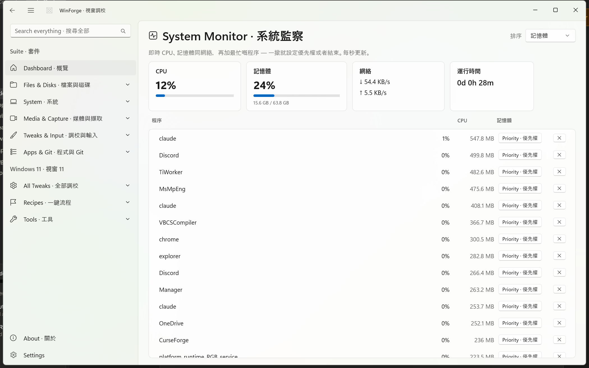

<div align="center">

# WinForge · 視窗鑄造

**A fully bilingual Windows convenience suite — 110+ real, working modules in one WinUI 3 control center that genuinely changes Windows 11.**
**一個全程雙語嘅 Windows 便利套件 — 110+ 個真正用得嘅模組，集合喺一個 WinUI 3 控制中心，真係會改到 Windows 11。**

`112 in-app modules` · `~1140 tweaks & ops` · `PowerToys + Winaero built in` · `kiosk / windowed` · `runs in the tray` · `WinUI 3 · .NET 11` · `English + 繁體中文／粵語`

`releases on every push (v1.0.x)` · `master search` · `no redirects — everything runs in-app`

</div>

> **A multi-module suite.** WinForge began as a Windows 11 tweaker and grew into a full convenience
> suite. Each "module" is a real, working tool that wraps a real engine or native API — no fake toggles,
> no redirects to external windows.
> **一個多模組套件。** WinForge 由 Windows 11 調校工具，逐步變成一個完整嘅便利套件。
> 每個「模組」都係真正用得嘅工具，包住真實引擎或者原生 API — 冇假開關，亦唔會跳去外部視窗。

---

## 📑 Table of contents · 目錄

- [Overview · 概覽](#-overview--概覽)
- [Download & install · 下載同安裝](#-download--install--下載同安裝)
- [Build from source · 由原始碼建置](#-build-from-source--由原始碼建置)
- [Screenshots gallery · 截圖畫廊](#-screenshots-gallery--截圖畫廊)
- [Module catalog · 模組目錄](#-module-catalog--模組目錄)
  - [System & Tweaks · 系統與調校](#system--tweaks--系統與調校)
  - [Files & Disks · 檔案與磁碟](#files--disks--檔案與磁碟)
  - [Media & Capture · 媒體與擷取](#media--capture--媒體與擷取)
  - [Developer · 開發者](#developer--開發者)
  - [Network · 網絡](#network--網絡)
  - [Apps, Git & Packages · 應用程式、Git 與套件](#apps-git--packages--應用程式git-與套件)
  - [AI · 人工智能](#ai--人工智能)
  - [Window Management · 視窗管理](#window-management--視窗管理)
  - [PowerToys-style utilities · PowerToys 式工具](#powertoys-style-utilities--powertoys-式工具)
  - [Security & Vaults · 安全與保險庫](#security--vaults--安全與保險庫)
  - [Productivity & Misc · 生產力與其他](#productivity--misc--生產力與其他)
  - [Gaming & Emulation · 遊戲與模擬](#gaming--emulation--遊戲與模擬)
- [Windows-11 tweak catalog · Windows 11 調校目錄](#-windows-11-tweak-catalog--windows-11-調校目錄)
- [Safety first · 安全至上](#-safety-first--安全至上)
- [How it works · 運作原理](#-how-it-works--運作原理)
- [Bilingual by design · 雙語設計](#-bilingual-by-design--雙語設計)
- [Documentation & wiki · 文件與 wiki](#-documentation--wiki--文件與-wiki)
- [License · 授權條款](#-license--授權條款)

---

## 🌏 Overview · 概覽

**EN —** WinForge is a modern **WinUI 3 / .NET 11** desktop app for Windows 11. Every feature is shown in
**both English and Traditional Chinese / Cantonese (繁體中文／粵語) at the same time**, and every toggle,
choice and action **actually changes the system** — it writes real registry keys, switches power plans,
resets the network stack, flips privacy settings, cleans caches, and drives real engines (git, gh, ffmpeg,
7-Zip, cloudflared, winget, and many more). Nothing is fake: each card maps to a documented Windows setting
or a real command. The app opens **windowed by default (~82% of the screen)**, **F11** toggles full screen,
and **closing hides it to the system tray** so background pieces (clipboard monitor, auto dark-mode, etc.)
keep running.

**粵語 —** WinForge 係一個畀 Windows 11 用嘅現代化 **WinUI 3 / .NET 11** 桌面應用程式。每一項功能都會
**同時用英文同繁體中文／粵語顯示**，而且每個開關、選項同動作都會**真正改到你部機** —
佢會寫真實嘅登錄檔、轉電源計劃、重設網絡堆疊、改私隱設定、清快取，仲會驅動真實引擎（git、gh、ffmpeg、
7-Zip、cloudflared、winget 等等）。冇一樣係假嘅：每張卡都對應一個有文件記載嘅 Windows 設定或者一句真實指令。
App **預設係視窗模式（約佔螢幕 82%）**，**F11** 切換全螢幕，**關閉視窗會收埋去系統匣**，
等背景功能（剪貼簿監察、自動深淺色等）繼續運行。

---

## 📥 Download & install · 下載同安裝

**EN —** Grab the latest build from **[GitHub Releases](https://github.com/codingmachineedge/WinForge/releases)**.
Every push to `main` publishes a fresh release (`v1.0.x`, currently **v1.0.8**) with two assets:

| Asset · 檔案 | What it is · 內容 |
|---|---|
| **`WinForge-Setup.exe`** | Inno Setup installer — installs to *Program Files*, adds Start-menu & optional desktop shortcuts. <br> Inno Setup 安裝程式 — 安裝到 *Program Files*，加開始功能表同（可選）桌面捷徑。 |
| **`WinForge-portable-x64-1.0.x.zip`** | Portable, self-contained x64 build — unzip anywhere and run `WinForge.exe`, no install needed. <br> 免安裝、自包含 x64 版本 — 解壓到任何位置，行 `WinForge.exe` 就得，唔使安裝。 |

**EN —** Both are **self-contained x64** (the Windows App SDK runtime is bundled — no separate runtime install).
Windows 11 is the target; Windows 10 1809+ also runs. Some operations require **administrator rights** — the
app offers a one-click elevated relaunch.

**粵語 —** 兩個都係**自包含 x64**（已內附 Windows App SDK 執行階段 — 唔使另外安裝）。
目標係 Windows 11；Windows 10 1809 或以上都用得。部分操作需要**管理員權限** — app 有一鍵以管理員身分重新啟動。

```powershell
# Portable: download, unzip, run · 免安裝：下載、解壓、執行
# (or just run WinForge-Setup.exe for the installer · 或者直接行 WinForge-Setup.exe 用安裝程式)
.\WinForge.exe
```

---

## 🔨 Build from source · 由原始碼建置

**EN —** Requirements: the **[.NET 11 SDK](https://dotnet.microsoft.com/download)** and the Windows App SDK
workload (Visual Studio 2022 with *.NET Desktop* + *Windows App SDK*, or the SDK on its own).

```powershell
# Clone · 複製
git clone https://github.com/codingmachineedge/WinForge.git
cd WinForge

# Restore + build (Release, x64) · 還原同編譯（Release、x64）
dotnet build -c Release -p:Platform=x64

# Run · 執行
dotnet run -c Release -p:Platform=x64
```

**EN —** Or open `WinForge.csproj` in **Visual Studio 2022** and press **F5**. To reproduce a release build
exactly, the CI publishes self-contained: `dotnet publish WinForge.csproj -c Release -p:Platform=x64
-r win-x64 --self-contained true -p:WindowsAppSDKSelfContained=true -p:WindowsPackageType=None`.

**粵語 —** 或者喺 **Visual Studio 2022** 打開 `WinForge.csproj`，撳 **F5**。要完全重現發佈版本，
CI 會用自包含方式 publish（指令見上）。

> **Launch a single page directly · 直接開單一頁面:** `WinForge.exe --page <id>` (every id is in
> [`docs/CLI.md`](docs/CLI.md)); master-search from the CLI with `--page search:<query>`.

---

## 🖼️ Screenshots gallery · 截圖畫廊

<div align="center">


</div>

<!-- Canonical screenshot set lives in docs/. Keep this gallery in sync with docs/wiki/. -->

| | |
|---|---|
|  <br> **Dashboard · 概覽** — master search across every module; everything runs in-app. <br> 跨所有模組嘅總搜尋；一切喺 app 內運行。 |  <br> **Git & GitHub · Git 與 GitHub** — multi-repo list, chunked uploader, full git/gh op library. <br> 多儲存庫清單、分批上載、完整 git/gh 操作庫。 |
|  <br> **Package Manager · 套件管理** — one front-end over 8+ package managers; batch update & bundles. <br> 一個介面統管 8+ 個套件管理器；批次更新同清單。 |  <br> **AI Agents · AI 代理** — install, configure & launch terminal AI coding agents, one click each. <br> 一鍵安裝、設定同啟動終端機 AI 編程代理。 |
|  <br> **Media · 媒體** — ffmpeg-powered video/audio convert, trim and GIF export. <br> 用 ffmpeg 嘅影片／音訊轉檔、剪裁同 GIF 匯出。 |  <br> **Clipboard · 剪貼簿** — history of text, images & files; QR, plain-text & format conversions. <br> 文字、圖片同檔案歷史；QR、純文字同格式轉換。 |
|  <br> **Connections · 連線** — every live TCP/UDP socket and the app that owns it. <br> 每一條即時 TCP/UDP 連線同擁有佢嘅程式。 |  <br> **System Monitor · 系統監察** — live CPU / RAM / network, process priority & affinity. <br> 即時 CPU／RAM／網絡、程序優先順序同親和性。 |
|  <br> **Cloudflare & Tunnel · Cloudflare 與 Tunnel** — named/quick tunnels, DNS routing, Access, DoH, WARP. <br> 具名／快速 tunnel、DNS 路由、Access、DoH、WARP。 |  <br> **Settings & Control Panel · 設定與控制台** — change Windows settings in-app, or open any Settings page / CPL applet. <br> 喺 app 內改 Windows 設定，或打開任何設定頁／控制台 applet。 |

> **EN —** The canonical screenshot set lives in [`docs/`](docs/) as `screenshot-<key>.png`. Matching wiki
> pages are in [`docs/wiki/`](docs/wiki/) and on the [GitHub wiki](https://github.com/codingmachineedge/WinForge/wiki).
> A few shots are labelled placeholders pending a fresh capture run — see [`docs/wiki/Screenshots.md`](docs/wiki/Screenshots.md).
> Modules without a dedicated screenshot are still fully documented in the catalog below.
>
> **粵語 —** 正式截圖放喺 [`docs/`](docs/)，命名為 `screenshot-<key>.png`。對應嘅 wiki 頁喺
> [`docs/wiki/`](docs/wiki/) 同 [GitHub wiki](https://github.com/codingmachineedge/WinForge/wiki)。
> 部分截圖係標明咗嘅佔位符，等緊重新擷取 — 詳見 [`docs/wiki/Screenshots.md`](docs/wiki/Screenshots.md)。
> 未有專屬截圖嘅模組，喺下面嘅目錄一樣有完整文件記載。

---

## 🧩 Module catalog · 模組目錄

**EN —** Every module is registered in [`Services/ModuleRegistry.cs`](Services/ModuleRegistry.cs) and reachable
from the **master search** on the Dashboard. The table below lists all of them, grouped by area, with a
one-line bilingual description. Open any one directly with `WinForge.exe --page <Tag>`.

**粵語 —** 每個模組都登記喺 [`Services/ModuleRegistry.cs`](Services/ModuleRegistry.cs)，可以喺概覽頁嘅
**總搜尋**搵到。下面嘅表按範疇分組列出全部模組，每個都有一句雙語說明。可以用 `WinForge.exe --page <Tag>` 直接打開。

### System & Tweaks · 系統與調校

| Module · 模組 | `--page` | Description · 說明 |
|---|---|---|
| **Dashboard · 概覽** | `dashboard` | Home surface with master search across every module. <br> 主頁，總搜尋橫跨所有模組。 |
| **Registry Editor · 登錄編輯器** | `module.regedit` | Browse and edit the live Windows registry — hives, keys, values. <br> 瀏覽同編輯實時 Windows 登錄檔 — hive、機碼、值。 |
| **System Doctors · 系統醫生** | `module.doctors` | One-click repairs: print spooler, DNS, sleep/wake, taskbar, search index, Explorer, icon/thumbnail cache, ownership/permissions. <br> 一鍵修復：列印多工緩衝、DNS、睡眠／喚醒、工作列、搜尋索引、檔案總管、圖示／縮圖快取、擁有權／權限。 |
| **Services · 服務** | `module.services` | List, start/stop and change startup type of Windows services. <br> 列出、啟動／停止同更改 Windows 服務嘅啟動類型。 |
| **Scheduled Tasks · 排程工作** | `module.tasks` | View and run Task Scheduler entries. <br> 檢視同執行工作排程器項目。 |
| **Devices · 裝置** | `module.devices` | Device Manager surface — enable/disable hardware and drivers. <br> 裝置管理員介面 — 啟用／停用硬件同驅動程式。 |
| **ViVeTool · 功能旗標** | `module.vivetool` | Toggle hidden Windows feature flags (Explorer tabs, new Start menu, modern context menu, Snap layouts…). <br> 切換隱藏嘅 Windows 功能旗標（檔案總管分頁、新開始功能表、現代右鍵選單、Snap 版面…）。 |
| **Startup Apps · 開機程式** | `module.startup` | Manage logon/startup items across Run keys, StartupApproved and Startup folders. <br> 管理登入／開機項目（Run 機碼、StartupApproved、開機資料夾）。 |
| **Environment Variables · 環境變數** | `module.envvars` | Edit user/system env vars with a per-entry PATH editor. <br> 編輯使用者／系統環境變數，附逐項 PATH 編輯器。 |
| **Event Viewer · 事件檢視器** | `module.events` | Read System/Application Windows event logs. <br> 讀取系統／應用程式 Windows 事件記錄。 |
| **System Info (Winfetch) · 系統資訊** | `module.winfetch` | neofetch-style specs read-out: OS, kernel, uptime, CPU/GPU/RAM, ASCII logo. <br> neofetch 式規格：系統、核心、開機時間、CPU／GPU／RAM、ASCII 標誌。 |
| **System Monitor · 系統監察** | `module.monitor` | Live CPU/RAM/network with per-process priority, affinity & EcoQoS. <br> 即時 CPU／RAM／網絡，附逐程序優先順序、親和性同 EcoQoS。 |
| **Battery & Thermal · 電池與散熱** | `module.battery` | Battery wear/health, temperatures, fan and power-config report. <br> 電池耗損／健康、溫度、風扇同電源設定報告。 |
| **Volume Mixer · 音量混合器** | `module.mixer` | Per-app volume and mute via Core Audio (WASAPI). <br> 透過 Core Audio（WASAPI）逐個應用程式調音量同靜音。 |
| **Context Menu · 右鍵選單** | `module.contextmenu` | Add/remove right-click shell verbs. <br> 新增／移除右鍵 shell 動詞。 |
| **Nilesoft Shell · 右鍵選單** | `module.nilesoftshell` | Modern customizable Explorer context menu via Nilesoft Shell — register, theme, templates. <br> 用 Nilesoft Shell 整現代化、可自訂嘅右鍵選單 — 註冊、主題、範本。 |
| **Awake · 保持喚醒** | `module.awake` | Keep the PC awake (caffeine) via SetThreadExecutionState. <br> 用 SetThreadExecutionState 令電腦唔瞓（咖啡因）。 |
| **Settings & Control Panel · 設定與控制台** | `module.settingshub` | Change Windows settings in-app, or open any `ms-settings:` page / `.cpl` applet, grouped & searchable. <br> 喺 app 內改 Windows 設定，或開任何 `ms-settings:` 頁／`.cpl` applet，已分類同可搜尋。 |
| **Native Utilities · 原生工具** | `module.native` | P/Invoke grab-bag: saved Wi-Fi passwords, SMB shares/sessions, monitor brightness (DDC), certificates, Bluetooth, GPU/disk counters, users. <br> P/Invoke 雜錦：已存 Wi-Fi 密碼、SMB 共享／工作階段、螢幕亮度（DDC）、憑證、藍牙、GPU／磁碟計數器、使用者。 |
| **PowerToys Extras · PowerToys 額外工具** | `module.powertoys` | Image Resizer, OCR text extractor, always-on-top, paste-as-plain-text. <br> 圖片縮放、OCR 文字擷取、置頂、純文字貼上。 |
| **World Monitor · 世界監察** | `module.worldmonitor` | A news / geopolitics / finance / energy intelligence dashboard. <br> 新聞／地緣政治／金融／能源情報儀表板。 |
| **Activity Timeline · 活動時間軸** | `module.timelens` | Foreground-window time tracking — per-app totals, idle, CSV export. <br> 前景視窗時間追蹤 — 逐個應用程式統計、閒置、CSV 匯出。 |

### Files & Disks · 檔案與磁碟

| Module · 模組 | `--page` | Description · 說明 |
|---|---|---|
| **Archives · 壓縮檔** | `module.archives` | 7-Zip-backed compress/extract/test/bench for zip, 7z, rar, tar, gzip. <br> 用 7-Zip 嘅壓縮／解壓／測試／效能，支援 zip、7z、rar、tar、gzip。 |
| **Batch Rename · 批次改名** | `module.rename` | PowerRename-style regex/sequence bulk rename. <br> PowerRename 式正則／序號批次改名。 |
| **Bulk File Ops · 批次檔案操作** | `module.bulkops` | Mass move/copy/recycle and attribute changes via SHFileOperation. <br> 透過 SHFileOperation 批量移動／複製／回收同改屬性。 |
| **New+ · 範本新增** | `module.newplus` | PowerToys New+ — create files/folders from templates via the New context menu, with variable substitution. <br> PowerToys New+ — 喺「新增」右鍵選單由範本建立檔案／資料夾，支援變數替換。 |
| **Duplicate Finder · 重複檔案搜尋** | `module.duplicates` | Find duplicates by size + hash and dedupe. <br> 按大小同雜湊搵重複檔再去重複。 |
| **File Locksmith · 檔案鎖偵測** | `module.filelocksmith` | PowerToys File Locksmith — find which process is locking a file/folder, then end it. <br> PowerToys File Locksmith — 搵出邊個程序鎖住檔案／資料夾，再結束佢。 |
| **Disk Analyser · 磁碟分析** | `module.disk` | Folder-size treemap to find what's eating space. <br> 資料夾大小樹狀圖，搵出邊個食晒空間。 |
| **Drives · 磁碟機** | `module.drives` | Volumes, format, BitLocker, mount ISO/VHD. <br> 磁碟區、格式化、BitLocker、掛載 ISO／VHD。 |
| **TestDisk / PhotoRec Recovery · 資料救援** | `module.testdisk` | Recover lost partitions and carve deleted files. <br> 救回遺失分割區同雕刻已刪除檔案。 |
| **Peek · 快速預覽** | `module.peek` | PowerToys Peek — instant Quick-Look preview of images, text, code, PDF, audio, video, archives. <br> PowerToys Peek — 即時快速預覽圖片、文字、程式碼、PDF、音訊、影片、壓縮檔。 |
| **Rich Preview · 豐富預覽** | `module.richpreview` | File-Explorer preview-pane add-ons: SVG, Markdown, PDF, source code, JSON/XML/YAML, 3D/G-code. <br> 檔案總管預覽窗格增益：SVG、Markdown、PDF、原始碼、JSON／XML／YAML、3D／G-code。 |
| **OneDrive · OneDrive** | `module.onedrive` | Files On-Demand: pin / free-up space / online-only, Storage Sense. <br> 隨選檔案：釘選／釋放空間／僅線上、儲存空間感知。 |
| **Font Manager · 字型管理** | `module.fonts` | Install, preview and uninstall TTF/OTF fonts. <br> 安裝、預覽同移除 TTF／OTF 字型。 |
| **FTP / SFTP (FileZilla) · 檔案傳輸** | `module.filezilla` | Dual-pane FTP/FTPS/SFTP transfers with a site manager and transfer queue. <br> 雙窗格 FTP／FTPS／SFTP 傳輸，附站台管理員同傳輸佇列。 |
| **Config & Backup · 設定與備份** | `module.configbackup` | Snapshot/restore settings, reg, winget; export bundles with optional AES-encrypted secrets. <br> 快照／還原設定、登錄、winget；匯出清單，可選 AES 加密機密。 |

### Media & Capture · 媒體與擷取

| Module · 模組 | `--page` | Description · 說明 |
|---|---|---|
| **Media · 媒體** | `module.media` | ffmpeg convert / trim / GIF export with live ffprobe info. <br> ffmpeg 轉檔／剪裁／GIF 匯出，附即時 ffprobe 資訊。 |
| **Audio Editor · 音訊編輯器** | `module.audioeditor` | Audacity-style waveform edit: record, trim, fade, normalize, denoise, mix, export. <br> Audacity 式波形編輯：錄音、剪裁、淡入淡出、正規化、降噪、混音、匯出。 |
| **Media Player · 媒體播放器** | `module.mediaplayer` | libVLC player — video/audio, streams, playlists, subtitles, snapshots, transcode. <br> libVLC 播放器 — 影片／音訊、串流、播放清單、字幕、截圖、轉檔。 |
| **Media Downloader · 媒體下載器** | `module.ytdlp` | yt-dlp front-end — download video/audio, playlists, subtitles; choose quality. <br> yt-dlp 介面 — 下載影片／音訊、播放清單、字幕；揀畫質。 |
| **Document Converter · 文件轉換器** | `module.libreoffice` | LibreOffice headless batch convert: docx/xlsx/pptx ⇄ pdf/odt/csv… <br> LibreOffice 無介面批次轉換：docx／xlsx／pptx ⇄ pdf／odt／csv… |
| **Screen Recorder · 螢幕錄影** | `module.recorder` | ffmpeg gdigrab whole-desktop screen recording. <br> 用 ffmpeg gdigrab 錄整個桌面。 |
| **Capture Studio · 擷取工作室** | `module.capture` | Region snip, screenshot, GIF and OCR text-recognition. <br> 區域擷取、截圖、GIF 同 OCR 文字辨識。 |
| **GIF Studio · 螢幕轉 GIF** | `module.giflab` | ScreenToGif-style screen-to-GIF with a frame editor and MP4/APNG export. <br> ScreenToGif 式螢幕轉 GIF，附畫面格編輯器同 MP4／APNG 匯出。 |
| **Crop And Lock · 裁切與鎖定** | `module.cropandlock` | PowerToys Crop And Lock — crop a window into a floating always-on-top thumbnail. <br> PowerToys Crop And Lock — 將視窗裁切成置頂浮窗縮圖。 |
| **Voice & Read-Aloud · 語音朗讀** | `module.voice` | SAPI text-to-speech: read aloud and export WAV. <br> SAPI 文字轉語音：朗讀同匯出 WAV。 |
| **Pixel Editor · 像素畫編輯器** | `module.pixeleditor` | Aseprite-style pixel-art editor — canvas, palette, layers, frames, GIF/PNG export. <br> Aseprite 式像素畫編輯器 — 畫布、調色盤、圖層、影格、GIF／PNG 匯出。 |
| **Blender (3D / Render) · Blender（3D／算圖）** | `module.blender` | Headless Blender render/animation queue with glTF/FBX/OBJ export. <br> 無介面 Blender 算圖／動畫佇列，支援 glTF／FBX／OBJ 匯出。 |

### Developer · 開發者

| Module · 模組 | `--page` | Description · 說明 |
|---|---|---|
| **VS Code · VS Code 編輯器** | `module.vscode` | Drive the `code` CLI — open files/folders, diff/merge, manage extensions, profiles, tunnels. <br> 驅動 `code` CLI — 開檔案／資料夾、比對／合併、管理擴充功能、設定檔、隧道。 |
| **Windows Terminal · Windows 終端機** | `module.terminal` | Edit `settings.json` profiles, color schemes, fonts; embedded ConPTY shell. <br> 編輯 `settings.json` 設定檔、色彩配置、字型；內嵌 ConPTY 殼層。 |
| **SSH Toolset · SSH 工具** | `module.ssh` | SSH/SFTP/SCP with profiles, ed25519/RSA keygen, passwordless deploy, DPAPI-protected. <br> SSH／SFTP／SCP，附設定檔、ed25519／RSA 產生金鑰、免密碼部署，DPAPI 保護。 |
| **quicktype · JSON 轉型別** | `module.quicktype` | Generate types/code (C#, TS, Python, Go, Rust…) from JSON/JSON-Schema/GraphQL. <br> 由 JSON／JSON-Schema／GraphQL 產生型別／程式碼（C#、TS、Python、Go、Rust…）。 |
| **Postgres Tool / pgAdmin · Postgres 工具** | `module.pgadmin` | Connect to PostgreSQL, run SQL, browse schemas/tables/views via Npgsql. <br> 連接 PostgreSQL，行 SQL，用 Npgsql 瀏覽結構描述／表／檢視。 |
| **Packer (Image Builder) · Packer** | `module.packer` | HashiCorp Packer — init/validate/fmt/build HCL templates with variables & plugins. <br> HashiCorp Packer — init／validate／fmt／build HCL 範本，支援變數同插件。 |
| **AWS CLI · AWS 命令列** | `module.aws` | Drive the AWS CLI — profiles, regions, S3/EC2/IAM/Lambda and generic commands. <br> 驅動 AWS CLI — 設定檔、區域、S3／EC2／IAM／Lambda 同通用指令。 |
| **WSL & VM Launcher · WSL 與 VM 啟動器** | `module.wslvm` | Launch WSL distros, Windows Sandbox and VMs; export/import distros. <br> 啟動 WSL 發行版、Windows 沙盒同 VM；匯出／匯入發行版。 |
| **VirtualBox Manager · VirtualBox 管理** | `module.virtualbox` | Drive VBoxManage — start/headless, snapshots, clone, OVA import/export. <br> 驅動 VBoxManage — 啟動／無介面、快照、複製、OVA 匯入／匯出。 |
| **Website Cloner · 網站複製器** | `module.webcloner` | Scrape and rebuild a site's HTML/CSS/JS assets locally. <br> 抓取並喺本機重建網站嘅 HTML／CSS／JS 資源。 |
| **Resume Writer · 履歷與求職信寫手** | `module.resume` | AI-assisted resume/cover-letter tailoring; export DOCX/PDF/Markdown. <br> AI 協助度身履歷／求職信；匯出 DOCX／PDF／Markdown。 |

### Network · 網絡

| Module · 模組 | `--page` | Description · 說明 |
|---|---|---|
| **Connections · 連線** | `module.connections` | Every live TCP/UDP socket and its owning process; drop a connection or end the process. <br> 每條即時 TCP/UDP 連線同擁有嘅程序；切斷連線或結束程序。 |
| **Hosts Editor · hosts 編輯器** | `module.hosts` | Edit the hosts file in-app, block-a-domain helper, backup + flush DNS. <br> 喺 app 內編輯 hosts、封鎖網域助手、備份 + 清 DNS。 |
| **Packet Capture (Wireshark) · 封包擷取** | `module.wireshark` | Drive tshark/dumpcap — capture, BPF/display filters, follow streams, statistics. <br> 驅動 tshark／dumpcap — 擷取、BPF／顯示過濾、追蹤串流、統計。 |
| **Nmap Scanner · 網絡掃描** | `module.nmap` | Port/host/service/OS scanning with NSE scripts; results in a grid. <br> 端口／主機／服務／作業系統掃描，支援 NSE 腳本；結果列表顯示。 |
| **VPN & Mesh · VPN 與網狀網** | `module.vpn` | NordVPN + Tailscale mesh — connect, exit nodes, ping; auto-install. <br> NordVPN + Tailscale 網狀網 — 連線、出口節點、ping；自動安裝。 |
| **RustDesk · 遠端桌面** | `module.rustdesk` | Self-hostable remote desktop/control — ID/password, relay, unattended access. <br> 可自架嘅遠端桌面／控制 — ID／密碼、中繼、無人值守存取。 |
| **Cloudflare & Tunnel · Cloudflare 與 Tunnel** | `module.cloudflare` | cloudflared named/quick tunnels, DNS routing, Access, DoH, WARP. <br> cloudflared 具名／快速 tunnel、DNS 路由、Access、DoH、WARP。 |
| **Home Assistant · 家居助理** | `module.homeassistant` | Drive the HA REST API — scenes, scripts, lights, climate, cameras, notify. <br> 驅動 HA REST API — 場景、腳本、燈光、空調、攝影機、通知。 |
| **In-App Login · 內置登入** | `module.weblogin` | Shared WebView2 OAuth/sign-in plumbing (GitHub, Cloudflare, AI providers, Bitwarden…). <br> 共用 WebView2 OAuth／登入機制（GitHub、Cloudflare、AI 供應商、Bitwarden…）。 |

### Apps, Git & Packages · 應用程式、Git 與套件

| Module · 模組 | `--page` | Description · 說明 |
|---|---|---|
| **Git & GitHub · Git 與 GitHub** | `module.git` | Multi-repo list, stage/commit/branch/sync, chunked uploader, and a large git-CLI + `gh`/`gh api` op library. <br> 多儲存庫清單、暫存／提交／分支／同步、分批上載，加埋龐大嘅 git-CLI + `gh`／`gh api` 操作庫。 |
| **Package Manager · 套件管理** | `module.packages` | UniGetUI-style front-end over winget, Scoop, Chocolatey, pip, npm, .NET tools, PowerShell Gallery, Cargo, vcpkg — Discover/Updates/Installed/Bundles. <br> UniGetUI 式介面統管 winget、Scoop、Chocolatey、pip、npm、.NET 工具、PowerShell Gallery、Cargo、vcpkg — 搜尋／更新／已安裝／清單。 |
| **App Uninstaller · 應用程式解除安裝** | `module.uninstall` | Remove apps and Appx packages (winget-backed). <br> 移除應用程式同 Appx 套件（winget 支援）。 |
| **Android (ADB) · Android（ADB）** | `module.adb` | adb — devices, APK install, shell, logcat, screencap, reboot, file push/pull; auto-installs adb. <br> adb — 裝置、安裝 APK、shell、logcat、截圖、重啟、檔案推送／拉取；自動安裝 adb。 |
| **Fastboot / Flasher · Fastboot／刷機** | `module.fastboot` | Bootloader unlock, flash boot/factory images, sideload OTA. <br> 解鎖 bootloader、刷 boot／原廠映像、側載 OTA。 |
| **Android Emulator & SDK · Android 模擬器與 SDK** | `module.emulator` | Manage AVDs and the Android SDK (sdkmanager/avdmanager) — launch, wipe, cold boot. <br> 管理 AVD 同 Android SDK（sdkmanager／avdmanager）— 啟動、清除、冷開機。 |
| **qBittorrent · 種子下載** | `module.qbittorrent` | Drive qBittorrent's Web API — torrents, magnets, categories, tags, speed limits. <br> 驅動 qBittorrent Web API — 種子、磁力、分類、標籤、速度限制。 |
| **Communications · 通訊** | `module.comms` | Compose mail (mailto), Teams meetings/calls, Discord/Telegram/Slack/phone deep links. <br> 撰寫郵件（mailto）、Teams 會議／通話、Discord／Telegram／Slack／電話深層連結。 |
| **Mail · 電郵** | `module.mail` | IMAP/SMTP mail client — inbox, compose, reply/forward, attachments, multiple accounts. <br> IMAP／SMTP 電郵客戶端 — 收件匣、撰寫、回覆／轉寄、附件、多帳戶。 |

### AI · 人工智能

| Module · 模組 | `--page` | Description · 說明 |
|---|---|---|
| **AI Agents · AI 代理** | `module.aiagents` | Install, configure & launch terminal AI coding agents (Claude Code, Codex, opencode, Pi, OpenClaw, Hermes…), one click each. <br> 一鍵安裝、設定同啟動終端機 AI 編程代理（Claude Code、Codex、opencode、Pi、OpenClaw、Hermes…）。 |
| **AI Chat · AI 聊天** | `module.aichat` | OpenWebUI-style chat over local & cloud LLMs (Ollama, OpenAI, OpenRouter, LM Studio, llama.cpp). <br> OpenWebUI 式聊天，支援本機同雲端 LLM（Ollama、OpenAI、OpenRouter、LM Studio、llama.cpp）。 |
| **Ollama · 本地大模型** | `module.ollama` | Pull, serve and chat with local GGUF models (llama, mistral, qwen, gemma, phi, deepseek…). <br> 下載、提供同對話本機 GGUF 模型（llama、mistral、qwen、gemma、phi、deepseek…）。 |

### Window Management · 視窗管理

| Module · 模組 | `--page` | Description · 說明 |
|---|---|---|
| **Window Manager · 視窗管理** | `module.windows` | Tile/cascade/always-on-top via EnumWindows + SetWindowPos zones. <br> 用 EnumWindows + SetWindowPos 分區做並排／層疊／置頂。 |
| **Workspaces · 工作區** | `module.workspaces` | PowerToys Workspaces — capture a set of apps + window positions and relaunch them. <br> PowerToys Workspaces — 擷取一組應用程式同視窗位置，再重新啟動。 |
| **FancyZones · 視窗分區** | `module.fancyzones` | PowerToys FancyZones — zone editor, grid layouts, snap with Shift-drag. <br> PowerToys FancyZones — 分區編輯器、格網版面、Shift 拖曳貼齊。 |
| **AltSnap · Alt 拖曳視窗** | `module.altsnap` | Move/resize any window with a modifier-key drag (AltDrag-style). <br> 用修飾鍵拖曳移動／縮放任何視窗（AltDrag 式）。 |
| **Komorebi (Tiling WM) · Komorebi 平鋪視窗管理** | `module.komorebi` | Drive the komorebi tiling window manager — BSP/columns/stack, workspaces, gaps. <br> 驅動 komorebi 平鋪視窗管理員 — BSP／欄／堆疊、工作區、間距。 |
| **GlazeWM Tiling · GlazeWM 平鋪視窗** | `module.glazewm` | Drive GlazeWM — tiling workspaces, keybindings, YAML config, reload. <br> 驅動 GlazeWM — 平鋪工作區、鍵盤綁定、YAML 設定、重新載入。 |

### PowerToys-style utilities · PowerToys 式工具

| Module · 模組 | `--page` | Description · 說明 |
|---|---|---|
| **Keyboard Remapper · 鍵盤重新對應** | `module.keyboard` | Remap keys via the Scancode Map registry (SharpKeys-style). <br> 透過 Scancode Map 登錄重新對應按鍵（SharpKeys 式）。 |
| **Hotkey & Macro Runner · 熱鍵與巨集** | `module.hotkeys` | Global hotkeys, macros, text expansion/snippets (AutoHotkey-style). <br> 全域熱鍵、巨集、文字展開／片語（AutoHotkey 式）。 |
| **Shortcut Guide · 快捷鍵指南** | `module.shortcutguide` | PowerToys Shortcut Guide — hold-Win overlay cheat sheet of shortcuts. <br> PowerToys Shortcut Guide — 揿住 Win 鍵彈出快捷鍵速查表。 |
| **Command Palette · 指令面板** | `module.cmdpalette` | PowerToys Run / Command Palette — global launcher, calculator, run, web search, system actions. <br> PowerToys Run／指令面板 — 全域啟動器、計算機、執行、網絡搜尋、系統動作。 |
| **Color Picker · 螢幕取色** | `module.colorpicker` | System-wide color picker (HEX/RGB/HSL) via a low-level mouse hook. <br> 系統級取色器（HEX／RGB／HSL），用低階滑鼠掛鈎。 |
| **Screen Ruler · 螢幕間尺** | `module.screenruler` | PowerToys Screen Ruler — measure pixel distances/bounds on screen. <br> PowerToys Screen Ruler — 喺螢幕量度像素距離／邊界。 |
| **ZoomIt · 螢幕放大與標註** | `module.zoomit` | Sysinternals ZoomIt — zoom, annotate/draw, break timer for presentations. <br> Sysinternals ZoomIt — 放大、標註／畫筆、簡報小休計時。 |
| **Mouse Utilities · 滑鼠工具** | `module.mouseutils` | PowerToys Mouse Utils — Find My Mouse, highlighter, jump, crosshairs. <br> PowerToys Mouse Utils — 搵滑鼠、點擊標示、跳轉、十字線。 |
| **Mouse & Pointer · 滑鼠與指標** | `module.mouse` | Pointer speed/acceleration and behaviour (live SystemParametersInfo). <br> 指標速度／加速同行為（即時 SystemParametersInfo）。 |
| **Mouse Without Borders · 無界滑鼠** | `module.mwb` | PowerToys Mouse Without Borders — share one keyboard/mouse across PCs, clipboard sync. <br> PowerToys Mouse Without Borders — 多部電腦共享一套鍵鼠、剪貼簿同步。 |
| **Quick Accent · 快速重音符** | `module.quickaccent` | PowerToys Quick Accent — hold a letter to insert accented/diacritic variants. <br> PowerToys Quick Accent — 揿住字母插入重音／變音字元。 |
| **Command Not Found · 搵唔到指令** | `module.cmdnotfound` | PowerToys Command Not Found — PowerShell hook suggesting a winget package for a missing command. <br> PowerToys Command Not Found — PowerShell 掛鈎，為搵唔到嘅指令建議 winget 套件。 |
| **Clipboard · 剪貼簿** | `module.clipboard` | Richer clipboard history (text/images/files) with QR, plain-text and conversions. <br> 更強嘅剪貼簿歷史（文字／圖片／檔案），附 QR、純文字同轉換。 |
| **Advanced Paste · 進階貼上** | `module.advancedpaste` | PowerToys Advanced Paste — paste as plain text/Markdown/JSON, transform, OCR, AI. <br> PowerToys Advanced Paste — 貼成純文字／Markdown／JSON、轉換、OCR、AI。 |
| **Taskbar Tweaker · 工作列調校** | `module.taskbar-tweaker` | 7+ Taskbar Tweaker / Windhawk-style taskbar tweaks — align, combine, small icons, clock seconds. <br> 7+ Taskbar Tweaker／Windhawk 式工作列調校 — 對齊、合併、細圖示、時鐘秒數。 |
| **Windhawk Mods · Windhawk 模組** | `module.windhawk` | Manage Windhawk mods — taskbar height, icon size, Start menu styler, rounded corners. <br> 管理 Windhawk 模組 — 工作列高度、圖示大小、開始功能表樣式、圓角。 |
| **LightSwitch (Auto Dark Mode) · 自動深淺色** | `module.lightswitch` | Auto-switch light/dark theme on a sunrise/sunset or fixed schedule. <br> 按日出／日落或固定排程自動切換淺色／深色主題。 |
| **Rainmeter Widgets · Rainmeter 桌面小工具** | `module.rainmeter` | Install/activate/refresh Rainmeter desktop skins via its bang interface. <br> 透過 bang 介面安裝／啟用／重新整理 Rainmeter 桌面皮膚。 |
| **Time & Unit Tools · 時間與單位工具** | `module.timeunit` | World clock / timezone and unit converters (length, mass, temperature). <br> 世界時鐘／時區同單位換算（長度、質量、溫度）。 |

### Security & Vaults · 安全與保險庫

| Module · 模組 | `--page` | Description · 說明 |
|---|---|---|
| **WinForge Vault · WinForge 保險庫** | `module.vault-volumes` | VeraCrypt-derived encrypted volumes/containers — create, mount/dismount, benchmark (AES/Serpent/Twofish). <br> VeraCrypt 衍生嘅加密磁碟區／容器 — 建立、掛載／卸載、效能測試（AES／Serpent／Twofish）。 |
| **Bitwarden Vault · Bitwarden 密碼庫** | `module.bitwarden` | Drive the Bitwarden CLI — unlock, search logins, TOTP, generate, sync (self-host friendly). <br> 驅動 Bitwarden CLI — 解鎖、搵登入、TOTP、產生密碼、同步（支援自架）。 |

### Productivity & Misc · 生產力與其他

| Module · 模組 | `--page` | Description · 說明 |
|---|---|---|
| *(cross-cutting)* | — | Many modules above double as productivity tools — **Clipboard**, **Activity Timeline**, **Time & Unit Tools**, **Communications**, **Mail**, **Resume Writer** and **Config & Backup** are listed in their primary categories. <br> 上面好多模組都兼具生產力用途 — **剪貼簿**、**活動時間軸**、**時間與單位工具**、**通訊**、**電郵**、**履歷寫手**同**設定與備份**已列喺各自嘅主分類。 |

### Gaming & Emulation · 遊戲與模擬

| Module · 模組 | `--page` | Description · 說明 |
|---|---|---|
| **Minecraft World Editor (Amulet) · Minecraft 世界編輯器** | `module.amulet` | Launch the Amulet world/map editor with backups of saves. <br> 啟動 Amulet 世界／地圖編輯器，附存檔備份。 |
| **Minecraft Server · Minecraft 伺服器** | `module.minecraftserver` | Paper/Spigot server — properties, plugins, console, RCON, Aikar flags. <br> Paper／Spigot 伺服器 — 設定、外掛、主控台、RCON、Aikar 旗標。 |
| **ViaProxy · Minecraft 版本代理** | `module.viaproxy` | ViaProxy protocol bridge — connect any client version to any server. <br> ViaProxy 協定橋接 — 任何客戶端版本連任何伺服器。 |
| **Imaging & Game Tools · 燒錄與遊戲工具** | `module.imaging` | Raspberry Pi Imager / Rufus-style USB & SD flashing, Minecraft world downloader. <br> Raspberry Pi Imager／Rufus 式 USB 同 SD 燒錄、Minecraft 世界下載器。 |

---

## ⚙️ Windows-11 tweak catalog · Windows 11 調校目錄

**EN —** Alongside the modules, WinForge ships a **data-driven tweak catalog** — roughly **1,140 tweaks and
operations across ~22 categories**, including the original Windows-11 tweak suite, **Winaero Tweaks** and
**Debloat & Annoyances**. Each tweak reads its **live current state** before showing it, carries bilingual
title + description, and applies a real registry change / power-plan switch / shell or PowerShell command.

**粵語 —** 除咗模組，WinForge 仲有一個**資料驅動嘅調校目錄** — 大約 **1,140 項調校同操作、橫跨約 22 個分類**，
包括原本嘅 Windows 11 調校套件、**Winaero Tweaks** 同 **Debloat 與煩擾移除**。每項調校顯示前會先讀取**即時目前狀態**，
帶住雙語標題同說明，並執行真實嘅登錄變更／電源計劃切換／shell 或 PowerShell 指令。

| Category · 分類 | What it does · 做乜 |
|---|---|
| 🎨 **Appearance & Personalisation · 外觀與個人化** | Dark mode, accent colour, transparency, animations, visual effects. <br> 深色模式、強調色、透明度、動畫、視覺特效。 |
| 📁 **File Explorer · 檔案總管** | Show extensions/hidden files, classic right-click menu, Explorer behaviour. <br> 顯示副檔名／隱藏檔案、經典右鍵選單、檔案總管行為。 |
| 📌 **Taskbar & Start · 工作列與開始功能表** | Alignment, Search, Widgets, Task View, Copilot, combine buttons, Start layout. <br> 對齊、搜尋、小工具、工作檢視、Copilot、合併按鈕、開始版面。 |
| 🔒 **Privacy & Telemetry · 私隱與遙測** | Advertising ID, telemetry level, activity history, tailored ads, suggestions. <br> 廣告 ID、遙測等級、活動記錄、個人化廣告、建議內容。 |
| ⚡ **Performance & Power · 效能與電源** | Visual-effects mode, fast startup, power plans, Game Mode, hibernation. <br> 視覺效果模式、快速啟動、電源計劃、遊戲模式、休眠。 |
| 🌐 **Network & Internet · 網絡與互聯網** | Flush DNS, reset Winsock/TCP-IP, change DNS servers, inspect connections. <br> 清 DNS、重設 Winsock／TCP-IP、轉 DNS 伺服器、檢視連線。 |
| 🧹 **Cleanup & Storage · 清理與儲存** | Temp files, caches, Recycle Bin, Update cache, thumbnails, event logs. <br> 暫存檔、快取、回收筒、更新快取、縮圖、事件記錄。 |
| 🛡️ **Security · 安全** | UAC, SmartScreen, firewall, Remote Desktop, sign-in protections, Defender scan. <br> UAC、SmartScreen、防火牆、遠端桌面、登入保護、Defender 掃描。 |
| 🧩 **System & Boot · 系統與開機** | Long paths, Developer Mode, restore points, clipboard history, boot options. <br> 長路徑、開發人員模式、還原點、剪貼簿記錄、開機選項。 |
| 🔧 **Power Tools · 進階工具** | SFC, DISM, God Mode, hosts file, battery report, lock / sleep / restart. <br> SFC、DISM、上帝模式、hosts 檔、電池報告、鎖定／睡眠／重啟。 |
| ✨ **Winaero Tweaks · Winaero 調校** | 45 classic Winaero-style Explorer/desktop tweaks. <br> 45 項經典 Winaero 式檔案總管／桌面調校。 |
| 🧼 **Debloat & Annoyances · 移除臃腫與煩擾** | Strip preinstalled apps and silence Windows nags. <br> 移除預裝應用程式同消除 Windows 煩擾。 |

> A full, browsable per-tweak reference is generated under [`docs/features/`](docs/features/)
> (and on disk via `WinForge.exe --export-docs docs\features`).
> 完整、可瀏覽嘅逐項調校參考喺 [`docs/features/`](docs/features/)（亦可用 `WinForge.exe --export-docs docs\features` 產生）。

---

## ⚠️ Safety first · 安全至上

**EN —** These tweaks modify **real** Windows settings and drive real engines. Most are reversible, but some
need **administrator rights** or a **restart / sign-out** to take effect. Always read a card's description
before applying it. Use at your own risk — see the [LICENSE](LICENSE).

**粵語 —** 呢啲調校會改到**真實**嘅 Windows 設定、驅動真實引擎。大部分都可以還原，
但有部分需要**管理員權限**，或者要**重啟／登出**先生效。套用之前請睇清楚每張卡嘅說明。
自行承擔風險 — 詳見 [LICENSE](LICENSE)。

---

## 🧱 How it works · 運作原理

**EN —** WinForge is **data-driven**. Each tweak is a `TweakDefinition` carrying its own behaviour (a registry
coordinate, a choice set, or a shell/PowerShell command) plus bilingual text; a reusable `TweakCard` renders
any of them. Each **module** is a real page that wraps a real engine or native API through a focused service
(e.g. `GitService`, `MediaService`, `ConnectionsService`). [`Services/ModuleRegistry.cs`](Services/ModuleRegistry.cs)
registers every module so the master search can find it.

```
Models/      LocalizedText, TweakDefinition, AppCategory, module models   (the data shapes)
Services/    Registry, ShellRunner, Admin, Loc, SystemInfo, ModuleRegistry, per-module services
Catalog/     Categories + per-category tweak files (~1,140 TweakDefinitions)
Controls/    TweakCard  (renders any tweak, always bilingual)
Pages/       Dashboard, CategoryPage, every module page, Settings, About
```

**粵語 —** WinForge 係**資料驅動**嘅。每項調校都係一個 `TweakDefinition`，自己帶住行為（登錄檔位置、一組選項，
或者一句 shell／PowerShell 指令）同雙語文字；一個可重用嘅 `TweakCard` 負責顯示。每個**模組**都係一個真實頁面，
透過專注嘅服務（例如 `GitService`、`MediaService`、`ConnectionsService`）包住真實引擎或原生 API。
[`Services/ModuleRegistry.cs`](Services/ModuleRegistry.cs) 登記每個模組，等總搜尋搵到佢哋。

---

## 🈳 Bilingual by design · 雙語設計

**EN —** Language is never hidden behind a menu: **both** English and Traditional Chinese / Cantonese appear on
every card at once. Settings lets you pick which language *leads*, and the whole UI updates live.

**粵語 —** 語言唔會收埋喺選單後面：**兩種**語言喺每張卡都會即時一齊出現。
設定頁可以揀邊種語言*排前面*，成個介面會即時更新。

---

## 📚 Documentation & wiki · 文件與 wiki

**EN —** Browse the [GitHub wiki](https://github.com/codingmachineedge/WinForge/wiki) (source in
[`docs/wiki/`](docs/wiki/)) for a categorized module index and per-module pages. Other references:

- [`docs/wiki/Home.md`](docs/wiki/Home.md) — categorized index of **all** modules · 所有模組嘅分類索引
- [`docs/wiki/Screenshots.md`](docs/wiki/Screenshots.md) — image inventory + capture guide · 圖檔清單同擷取指南
- [`docs/CLI.md`](docs/CLI.md) — every `--page` id and CLI switch · 每個 `--page` id 同命令列開關
- [`docs/HANDOFF.md`](docs/HANDOFF.md) — per-module engine/service reference · 逐模組引擎／服務參考
- [`docs/features/`](docs/features/) — generated per-tweak documentation · 自動產生嘅逐項調校文件
- [`CHANGELOG.md`](CHANGELOG.md) — project history · 專案歷史

**粵語 —** 想睇分類模組索引同逐模組頁，可以睇 [GitHub wiki](https://github.com/codingmachineedge/WinForge/wiki)
（原始檔喺 [`docs/wiki/`](docs/wiki/)）。其他參考見上。

---

## 📄 License · 授權條款

**EN —** Released under the [MIT License](LICENSE). Provided "as is", without warranty of any kind.

**粵語 —** 以 [MIT 授權條款](LICENSE) 發佈。按「現狀」提供，不附任何形式嘅保證。

---

<div align="center">

Made with WinUI 3 · 用 WinUI 3 製作 · `English + 繁體中文／粵語`

</div>
