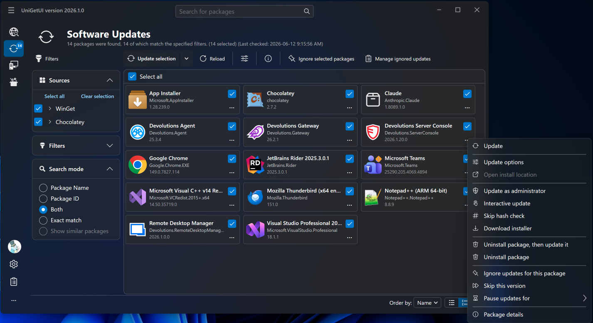
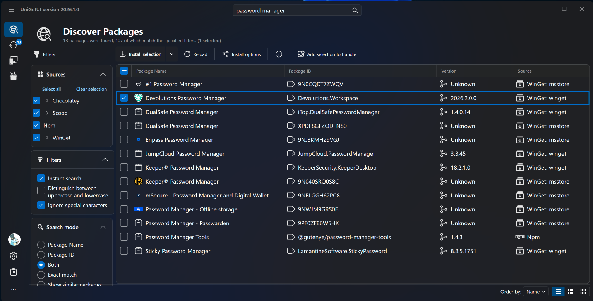
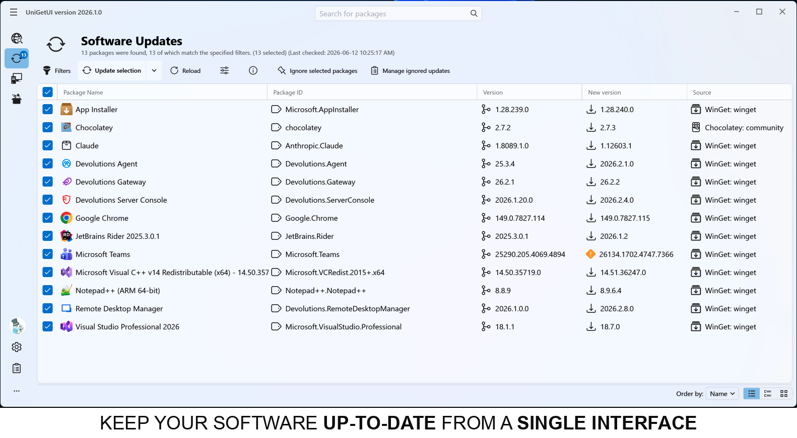
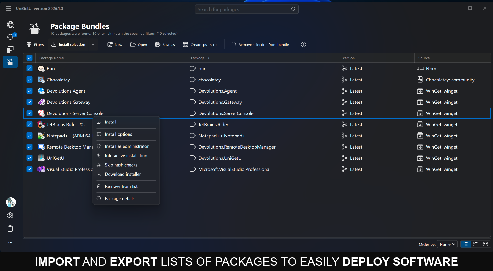
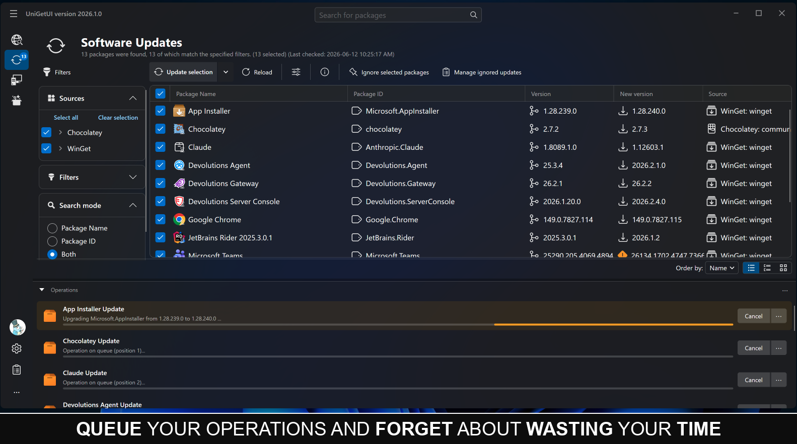

# WARNING: **wingetui<sub>•</sub>com** and **unigetui<sub>•</sub>com** are fake websites hosted by a third-party. please do NOT trust them
<br>

## Devolutions UniGetUI

> [!IMPORTANT]
> **Major announcement:** UniGetUI has entered its next chapter with Devolutions.
> Read the [blog post](https://devolutions.net/blog/2026/03/unigetui-enters-its-next-chapter-with-devolutions/) and the [official press release](https://www.globenewswire.com/news-release/2026/03/10/3253012/0/en/Devolutions-Acquires-UniGetUI-Strengthening-Security-and-Enterprise-Readiness.html).

[](https://github.com/Devolutions/UniGetUI/releases/latest)
[](https://github.com/Devolutions/UniGetUI/releases)
[](https://github.com/Devolutions/UniGetUI/issues)
[](https://github.com/Devolutions/UniGetUI/issues?q=is%3Aissue+is%3Aclosed)<br>
UniGetUI is a Windows-first, intuitive GUI for the most common CLI package managers on Windows 10 and 11. Cross-platform builds are also available for macOS and Linux, with support for package managers including [WinGet](https://learn.microsoft.com/en-us/windows/package-manager/), [Scoop](https://scoop.sh/), [Chocolatey](https://chocolatey.org/), [Homebrew](https://brew.sh/), [APT](https://wiki.debian.org/Apt), [DNF](https://dnf.readthedocs.io/), [Pacman](https://wiki.archlinux.org/title/Pacman), [Flatpak](https://flatpak.org/), [Snap](https://snapcraft.io/), [pip](https://pypi.org/), [npm](https://www.npmjs.com/), [Bun](https://bun.sh/), [.NET Tool](https://learn.microsoft.com/en-us/dotnet/core/tools/dotnet-tool-install), [PowerShell Gallery](https://www.powershellgallery.com/), and more.
With UniGetUI, you can discover, install, update, and uninstall software from multiple package managers through one interface.


View more screenshots [here](#screenshots)

Check out the [Package Managers](#package-managers) section for more details!

**Disclaimer:** UniGetUI is not affiliated with the package managers it integrates with. Packages are provided by third parties, so review sources and publishers before installation.

<br>


> [!CAUTION]
> **The official website for UniGetUI is [https://devolutions.net/unigetui/](https://devolutions.net/unigetui/).**<br>
> **The official source repository is [https://github.com/Devolutions/UniGetUI](https://github.com/Devolutions/UniGetUI).**<br>
> **Any other website should be considered unofficial, despite what they may say.**

🔒 Found a security issue? Please report it via the [Devolutions security page](https://devolutions.net/security/)

## Project stewardship

UniGetUI was created by Martí Climent and is now maintained by Devolutions. The project remains free, open source, and MIT-licensed. Devolutions' stewardship brings long-term investment, structured governance, stronger security processes, and a roadmap for broader enterprise readiness while keeping UniGetUI standalone and community-driven.

Read more in the [Devolutions announcement](https://devolutions.net/blog/2026/03/unigetui-enters-its-next-chapter-with-devolutions/) and the [official press release](https://www.globenewswire.com/news-release/2026/03/10/3253012/0/en/Devolutions-Acquires-UniGetUI-Strengthening-Security-and-Enterprise-Readiness.html).

## Table of contents
 - **[UniGetUI Homepage](https://devolutions.net/unigetui/)**
 - [Table of contents](#table-of-contents)
 - [Installation](#installation)
 - [Update UniGetUI](#update-unigetui)
 - [Project stewardship](#project-stewardship)
 - [Features](#features)
 - [Package Managers](#package-managers)
 - [Translations](TRANSLATION.md)
 - [Contributions](#contributions)
 - [Screenshots](#screenshots)
 - [Frequently Asked Questions](#frequently-asked-questions)
 - [CLI reference](docs/CLI.md)
 - [IPC reference](docs/IPC.md)

## Installation
<p>There are multiple ways to install UniGetUI — choose whichever one you prefer!</p>

### Windows

UniGetUI is primarily built for Windows. The Microsoft Store is the recommended installation method, but direct installer and package-manager options are also available.

#### Microsoft Store installation (recommended)
<a href="https://apps.microsoft.com/detail/xpfftq032ptphf"></a>

#### Download the Windows installer:

Use the installer for the best Windows experience. `UniGetUI.Installer.exe` is the legacy/default x64 installer alias; use the explicit architecture downloads if needed.

| Architecture | Installer | Portable `.zip` |
|---|---|---|
| x64 | [UniGetUI.Installer.x64.exe](https://github.com/Devolutions/UniGetUI/releases/latest/download/UniGetUI.Installer.x64.exe) ([default x64 alias](https://github.com/Devolutions/UniGetUI/releases/latest/download/UniGetUI.Installer.exe)) | [UniGetUI.x64.zip](https://github.com/Devolutions/UniGetUI/releases/latest/download/UniGetUI.x64.zip) |
| arm64 | [UniGetUI.Installer.arm64.exe](https://github.com/Devolutions/UniGetUI/releases/latest/download/UniGetUI.Installer.arm64.exe) | [UniGetUI.arm64.zip](https://github.com/Devolutions/UniGetUI/releases/latest/download/UniGetUI.arm64.zip) |

#### Install via WinGet:

```cmd
winget install --exact --id Devolutions.UniGetUI --source winget
```


#### Install via Scoop:

```cmd
scoop bucket add extras
scoop install extras/unigetui
```

#### Install via Chocolatey:

```cmd
choco install unigetui
```

### NativeAOT builds

Release packages are compiled with NativeAOT on all supported platforms (Windows, macOS, and Linux) for improved startup performance and a reduced attack surface. If you want to build the same configuration locally, the repository includes helper publish profiles and a script:

```powershell
pwsh ./scripts/publish-nativeaot.ps1 -Platform x64   # or arm64
```

This publishes `src/UniGetUI.Avalonia/UniGetUI.Avalonia.csproj` as a self-contained NativeAOT build into `artifacts/nativeaot/win-<platform>/`.

### macOS

macOS builds are available from GitHub Releases. Use the `.dmg` for the standard installer experience, or the `.tar.gz` archive for a portable app bundle.

| Architecture | `.dmg` | `.tar.gz` |
|---|---|---|
| Apple silicon (arm64) | [UniGetUI.macos-arm64.dmg](https://github.com/Devolutions/UniGetUI/releases/latest/download/UniGetUI.macos-arm64.dmg) | [UniGetUI.macos-arm64.tar.gz](https://github.com/Devolutions/UniGetUI/releases/latest/download/UniGetUI.macos-arm64.tar.gz) |
| Intel (x64) | [UniGetUI.macos-x64.dmg](https://github.com/Devolutions/UniGetUI/releases/latest/download/UniGetUI.macos-x64.dmg) | [UniGetUI.macos-x64.tar.gz](https://github.com/Devolutions/UniGetUI/releases/latest/download/UniGetUI.macos-x64.tar.gz) |

### Linux

Linux builds are available from GitHub Releases. Use the `.deb` package for Debian/Ubuntu-based distributions, the `.rpm` package for Fedora/RHEL-based distributions, or the `.tar.gz` archive for a portable build.

| Architecture | `.deb` | `.rpm` | `.tar.gz` |
|---|---|---|---|
| x64 | [Download](https://github.com/Devolutions/UniGetUI/releases/latest/download/UniGetUI.linux-x64.deb) | [Download](https://github.com/Devolutions/UniGetUI/releases/latest/download/UniGetUI.linux-x64.rpm) | [Download](https://github.com/Devolutions/UniGetUI/releases/latest/download/UniGetUI.linux-x64.tar.gz) |
| arm64 | [Download](https://github.com/Devolutions/UniGetUI/releases/latest/download/UniGetUI.linux-arm64.deb) | [Download](https://github.com/Devolutions/UniGetUI/releases/latest/download/UniGetUI.linux-arm64.rpm) | [Download](https://github.com/Devolutions/UniGetUI/releases/latest/download/UniGetUI.linux-arm64.tar.gz) |

Install the package that matches your distribution and architecture:

```bash
# Debian/Ubuntu-based distributions
sudo apt install ./UniGetUI.linux-x64.deb

# Fedora/RHEL-based distributions
sudo dnf install ./UniGetUI.linux-x64.rpm

# Portable archive
tar -xzf UniGetUI.linux-x64.tar.gz
./UniGetUI
```

Replace `x64` with `arm64` in the file name when using the arm64 build.


## Update UniGetUI

UniGetUI has a built-in autoupdater. On Windows, it can also be updated like any other package within UniGetUI when installed through WinGet, Scoop, or Chocolatey.


## Features

 - Install, update, and remove software from your system easily at one click: UniGetUI combines packages from the most used package managers for your platform, including WinGet, Chocolatey, Scoop, Homebrew, APT, DNF, Pacman, Flatpak, Snap, Pip, npm, Bun, and .NET Tool.
 - Discover new packages and filter them to easily find the package you want.
 - View detailed metadata about any package before installing it. Get the direct download URL or the name of the publisher, as well as the size of the download.
 - Easily bulk-install, update, or uninstall multiple packages at once selecting multiple packages before performing an operation
 - Automatically update packages, or be notified when updates become available. Skip versions or completely ignore updates on a per-package basis.
 - The system tray icon will also show the available updates and installed packages where supported, to efficiently update a program or remove a package from your system.
 - Easily customize how and where packages are installed. Select different installation options and switches for each package. Install an older version or force a specific architecture where supported. \[But don't worry, those options will be saved for future updates for this package*]
 - Share packages with your friends using generated package links.
 - Export custom lists of packages to then import them to another machine and install those packages with previously specified, custom installation parameters. Setting up machines or configuring a specific software setup has never been easier.
 - Backup your packages to a local file to easily recover your setup in a matter of seconds when migrating to a new machine*

## Package Managers

**NOTE:** All package managers do support basic install, update, and uninstall processes, as well as checking for updates, finding new packages, and retrieving details from a package.

UniGetUI loads package managers based on the current platform. Windows builds include WinGet, Scoop, Chocolatey, Windows PowerShell, PowerShell 7, npm, Bun, pip, Cargo, .NET Tool, and vcpkg. macOS and Linux builds include Homebrew, PowerShell 7, npm, Bun, pip, Cargo, .NET Tool, and vcpkg; Linux builds also include distro-aware support for APT, DNF, Pacman, Snap, and Flatpak where applicable.


✅: Supported on UniGetUI<br>
☑️: Not directly supported but can be easily achieved<br>
⚠️: May not work in some cases<br>
❌: Not supported by the Package Manager<br>
<br>

## Translations

UniGetUI translations are maintained directly in this repository. For the current language list, completion status, and per-language contributor attributions, see [TRANSLATION.md](TRANSLATION.md). If you spot a translation issue or want to improve a locale, please open an issue or submit a pull request.

## Screenshots
 











## Contributions
UniGetUI continues to grow thanks to its community of contributors. Devolutions is grateful to everyone who contributes code, translations, documentation, testing, and feedback to the project.<br><br>

[](https://github.com/Devolutions/UniGetUI/graphs/contributors)<br><br>


## Frequently asked questions

**Q: I am unable to install or upgrade a specific Winget package! What should I do?**<br>

A: This is likely an issue with Winget rather than UniGetUI. 

Please check if it's possible to install/upgrade the package through PowerShell or the Command Prompt by using the commands `winget upgrade` or `winget install`, depending on the situation (for example: `winget upgrade --id Microsoft.PowerToys`). 

If this doesn't work, consider asking for help at [Winget's project page](https://github.com/microsoft/winget-cli).<br>

#

**Q: The name of a package is trimmed with ellipsis — how do I see its full name/id?**<br>

A: This is a known limitation of Winget. 

For more details, see this issue: https://github.com/microsoft/winget-cli/issues/2603.<br>

#

**Q: My antivirus is telling me that UniGetUI is a virus! / My browser is blocking the download of UniGetUI!**<br>

A: A common reason apps (i.e., executables) get blocked and/or detected as a virus — even when there's nothing malicious about them, like in the case of UniGetUI — is because a relatively large amount of people are not using them.

Combine that with the fact that you might be downloading something recently released, and blocking unknown apps is in many cases a good precaution to take to prevent actual malware.

Since UniGetUI is open source and safe to use, whitelist the app in the settings of your antivirus/browser.<br>

#

**Q: Are packages from third-party package managers safe?**<br>

A: UniGetUI and the package-manager maintainers aren't responsible for every package available for download. Packages are provided by third parties and can theoretically be compromised, regardless of whether they come from WinGet, Scoop, Chocolatey, Homebrew, APT, DNF, Pacman, Flatpak, Snap, or another source.

Some package managers and repositories implement checks to mitigate the risks of downloading malware. Even so, it's recommended that you only download software from trusted publishers.

## Command-line interface:

Check out the CLI reference [here](docs/CLI.md) and the IPC reference [here](docs/IPC.md).
