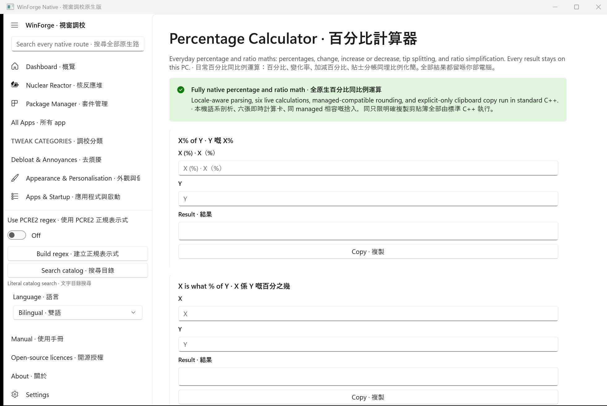

# Native Percentage Calculator · 原生百分比計算器

`percent`, `percentage`, and `module.percentcalc` are now genuine C++/WinRT routes over the dependency-free standard-C++ `PercentCalc` core. They keep all six managed calculations local: percent-of, what-percent, signed change, increase/decrease, tip splitting, and ratio simplification. Parsing accepts the current decimal separator plus invariant-dot fallback and managed-equivalent Unicode trimming; formatting rounds finite values to six places away from zero, while tip people counts use banker’s rounding. State survives a language rerender, resets on a fresh route, and only explicit Copy writes the clipboard.

`percent`、`percentage` 同 `module.percentcalc` 而家係真正 C++/WinRT route，用唔靠依賴嘅標準 C++ `PercentCalc` core。六種 managed 計算全部留喺本機：百分比乘數、反求百分比、有正負號變化、加／減、貼士分帳同化簡比例。解析接受目前小數點同 invariant-dot fallback，以及同 managed 一致嘅 Unicode 修剪；有限結果向遠離零方向取六位小數，人數用 banker’s rounding。轉語言會保留狀態、新 route 會重設，而且只有明確 Copy 先會寫剪貼簿。

## Controlled evidence · 受控證據

- Debug and Release x64 native builds: 0 errors; core suites: **915/915**, including Percentage Calculator **37/37**.
- Focused `-PercentCalcRoutesOnly -AllowClipboardMutation` UI Automation: **14/14**.
- Catalog parity: 346 fixed routes + five dynamic families, 319 registry records, 346 ledger rows; native installer contract passes.
- LowLevel MCP is unavailable as a callable tool in this session. The repository driver’s `CopyFromScreen` path was unavailable, but its valid 1962×1311 `PrintWindow` fallback was inspected and promoted as the current screenshot.
- Native release delivery remains C++-only and is locally hardened for test-gated/idempotent retries; the earlier hosted GitHub API-outage repairs are pending after the controlled push. See [Native Release Reliability](Native-Release-Reliability.md).

The C++-only release boundary is unchanged; this route remains `in-progress` only because the broader native migration is incomplete, not because it delegates to the managed app. · 只限 C++ 發佈界線冇變；呢條 route 保持 `in-progress` 只係因為更大範圍嘅原生遷移未完成，唔係因為佢委派畀 managed app。
