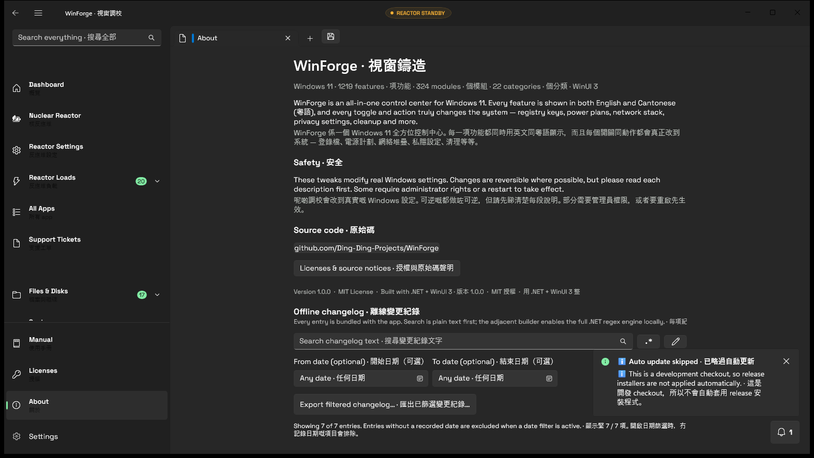

# Managed guided Regex Builder · 正式受管理引導式正則砌法

## Behavior · 行為

`module.regextester` uses the real .NET 11 `System.Text.RegularExpressions` dialect. The raw pattern editor stays authoritative. Its guided builder inserts escaped literal text, escaped or negated character classes, six anchors, numbered/named/non-capturing groups, alternation, and bounded quantifiers at the current selection. Five supported flags (`IgnoreCase`, `Multiline`, `Singleline`, `IgnorePatternWhitespace`, and `ExplicitCapture`) feed the same live evaluator. Test text produces indexed matches and capture groups; replacement text produces a preview. Pattern and match copying are explicit user actions. · `module.regextester` 用真正 .NET 11 `System.Text.RegularExpressions` 方言，原始 pattern 編輯器係權威來源。引導砌法會喺目前 selection 插入已跳脫字面文字、已跳脫／反轉字元類、六種錨點、編號／具名／唔擷取群組、二選一同有界量詞。五個支援旗標會餵入同一個即時 evaluator。測試文字會顯示有位置嘅配對同擷取群組；替換文字會產生預覽。複製 pattern 或配對一定要用戶明確操作。

The page is bilingual through `Loc.I.Pick`. Builder fields stack vertically, option controls use visible keyboard focus, and the page scrolls instead of truncating the long bilingual surface. Open it with `WinForge.exe --page regextester`. · 呢頁經 `Loc.I.Pick` 提供雙語；builder 欄位直排、選項控制有清楚鍵盤 focus，而長雙語內容會滾動，唔會硬截。用 `WinForge.exe --page regextester` 開啟。

`Controls/SearchPatternBox` brings that complete builder directly to eleven XAML surfaces: Dashboard, Category, Search Results, Manual, App Launcher, Licenses, Native OSS Hub, Settings Hub, Offline Documentation, Support Tickets, and the Authenticator vault. The code-built Settings and About searches use the same session contract; About now passes the complete `Spec` into the changelog matcher, so all selected flags reach real results. Plain text remains the initial/default mode. · `Controls/SearchPatternBox` 將同一套完整版砌法直接放入十一個 XAML 介面：Dashboard、Category、Search Results、Manual、App Launcher、Licenses、Native OSS Hub、Settings Hub、Offline Documentation、Support Tickets 同 Authenticator vault。用 code-built 砌出嚟嘅 Settings 同 About 搜尋都用同一套 session contract；About 而家會將完整 `Spec` 交畀 changelog matcher，所有揀中嘅旗標都真正到達結果。初始／預設仍然係純文字。

This real built-artifact capture is `docs/screenshot-about-changelog-regex-2026-08-11.png`, 1574×887, SHA-256 `7A92E8D73347AAC3549B03F7F541D14AC2D1CC3F022F6855756CC3DC85755B56`. It was captured from the self-contained Debug build on the named cheap headless desktop; the About/changelog search field, date controls, export action, and adjacent regex-builder affordance are in frame. · 呢張真實 build 擷取係 `docs/screenshot-about-changelog-regex-2026-08-11.png`，1574×887，SHA-256 如上；由 self-contained Debug build 喺指定 cheap headless desktop 擷取，About／changelog 搜尋欄、日期控制、匯出動作同隔籬 regex-builder affordance 都喺畫面內。

## Configuration and engine rules · 設定同引擎規則

- Engine/dialect: .NET 11 `System.Text.RegularExpressions`; backslash escaping follows .NET rules. · 引擎／方言：.NET 11 `System.Text.RegularExpressions`；反斜線按 .NET 規則跳脫。
- Plain text is still the default in the shared `SearchPatternService`; regex requires an explicit `UseRegex` state. Searches are case-insensitive by default, with `IgnoreCase`, `Multiline`, `Singleline`, `IgnorePatternWhitespace`, and `ExplicitCapture` synchronized bidirectionally. · 共用 `SearchPatternService` 仍然預設純文字；regex 要明確開 `UseRegex`。搜尋預設忽略大小寫；`IgnoreCase`、`Multiline`、`Singleline`、`IgnorePatternWhitespace` 同 `ExplicitCapture` 會雙向同步。
- Patterns, samples, replacements, and results are not transmitted or persisted by this page. Clipboard output occurs only after a Copy action. · 呢頁唔會傳送或保存 pattern、sample、replacement 或結果；只會喺明確按 Copy 後寫剪貼簿。
- The generated [search-surface inventory](../../audits/search-surface-inventory-2026-07-24.md) classifies 102 candidate controls across 83 source files: 13 integrated builder-backed searches, 68 applicable ordinary searches retained for later batches, 9 domain/provider query dialects requiring explicit adapters, 7 dedicated pattern tools, 2 read-only outputs, and 3 shared-control internals. The remaining ordinary search bars, dropdowns, menus, and pickers are intentionally still listed as pending rather than silently treated as complete. · 生成嘅[搜尋介面清單](../../audits/search-surface-inventory-2026-07-24.md)分類晒 83 個來源檔案入面 102 個候選控制：13 個已接 builder、68 個一般搜尋留待分批處理、9 個領域／供應者方言要明確 adapter、7 個專用 pattern 工具、2 個唯讀輸出，同 3 個共用控制內部欄位。其餘一般搜尋欄、dropdown、menu 同 picker 仍然明確列做待辦，唔會靜靜雞當完成。

## Bounds, failure modes, and security · 上限、故障模式同安全

Patterns are limited to 4,096 characters, samples/search candidates to 1,000,000, replacements to 65,536, and displayed matches to 2,000. The dedicated tester uses a one-second timeout; integrated result searches compile once per refresh and use a 250 ms per-candidate timeout. A search matcher that times out is poisoned for the rest of that batch, so it fails closed without repeatedly evaluating the adversarial expression. Replacement preview also has a conservative 8,000,000-unit work guard. Zero-width matches advance through `.NET Match.NextMatch()`. Invalid syntax, oversized data, unsafe replacement work, and timeouts fail closed with bilingual feedback; no pattern becomes code, a command argument, a process launch, or a network request. · Pattern 上限 4,096 字元、sample／搜尋候選 1,000,000、replacement 65,536，顯示配對最多 2,000。專用 tester 超時一秒；整合結果搜尋每次 refresh 只編譯一次，每個候選超時 250 ms。任何 matcher 一旦超時，嗰批餘下候選會立即 fail closed，唔會重複運算對抗式表達式。替換預覽另有保守 8,000,000 工作量閘。零寬度配對經 `.NET Match.NextMatch()` 安全推進。語法錯、資料過大、替換工作量唔安全或者超時都會 fail closed 並顯示雙語提示；pattern 永遠唔會變成 code、命令參數、程序啟動或者網絡要求。

## Verification · 驗證

`dotnet run --project tests/RegexBuilder.Tests -c Debug` passes **35/35** and covers the changelog `Spec` handoff, all eleven XAML builder surfaces, the two code-built builder surfaces, the complete builder UI contract, and the 102-row source inventory. The remaining ordinary searches and all dropdown/menu/picker surfaces remain an explicit pending migration lane. · `dotnet run --project tests/RegexBuilder.Tests -c Debug` **35/35** 全過，會驗證 changelog `Spec` 交接、十一個 XAML builder 介面、兩個 code-built builder 介面、完整 builder UI contract，同 102 行來源清單。其餘一般搜尋，同所有 dropdown／menu／picker 介面，仍然明確保留做待整合 lane。
