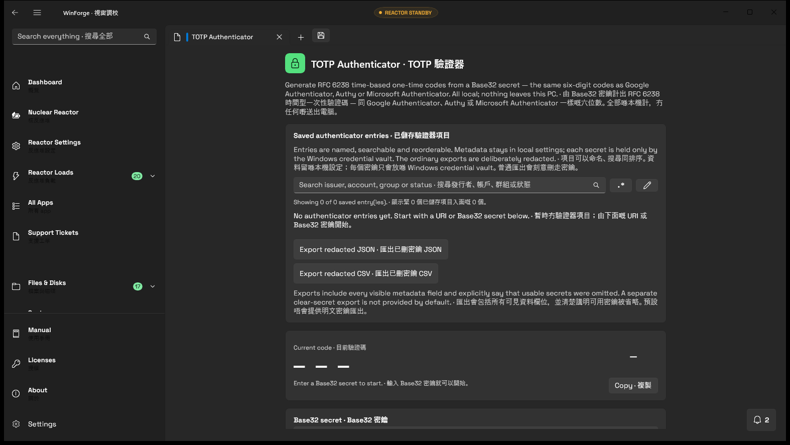

# Local authenticator vault · 本機驗證器 vault

## Behavior · 行為

The TOTP page now keeps a bounded multi-entry authenticator list. Each entry carries issuer,
account, label, group, algorithm, digits, period, order, and creation time as versioned local
metadata. A secret is never part of that metadata: it is stored under a stable per-entry key in
the Windows credential vault.

Registration is a two-step local flow. Paste an otpauth://totp/ URI or enter Base32 parameters,
generate the QR in-process, then enter one current code to confirm pairing before the vault entry
is created. Existing entries show a live code and numeric countdown, support search through the
shared plain-text-first regex builder, can be selected into the editor without copying the secret,
and can be grouped or reordered through the local store.

Standard JSON and CSV exports contain every visible metadata field and an explicit
secretsOmitted/secretsOmitted=true marker. There is no ordinary clear-secret export. Removal
requires two independently entered confirmation keys and a full-range slider, then deletes both
the metadata and the vault credential.

## Security and failure modes · 安全同失敗處理

- Secrets remain in the operating-system credential vault; settings, exports, logs, screenshots,
  history, and ticket records do not contain usable secret values.
- Pairing rejects a wrong current code before writing metadata or a credential.
- Vault reads and writes fail closed with an actionable local status message.
- The app does not contact a server for code generation, pairing, or metadata storage.
- QR image-file import and camera scanning remain separate follow-up work; the current supported
  zero-retyping path is a pasted otpauth:// URI or clipboard text.

## Verification · 驗證

The TotpAuthenticator.Tests harness runs the RFC 6238 SHA-1, SHA-256, and SHA-512 vectors, URI
parameter preservation, and invalid-parameter checks. The solution build verifies the WinUI page,
vault service, and test project with zero warnings and errors in the verified run.

## Built-artifact evidence · 真實建置證據

This capture was inspected from the self-contained build on a dedicated hidden desktop. Its
SHA-256 is `7D2D6D016D22EA0F92E074291C11B3F1D728D8EB042285664879738DE1C2C4C0`. · 呢張圖由專用隱藏 desktop 上嘅自包含 build 檢視，SHA-256 如上。

## Suggested articles · 建議文章

- [Authenticator QR pairing](authenticator-qr.md) — local QR generation and pairing presentation.
- [Shared settings](shared-settings.md) — language, School mode, and local preferences.
- [Offline changelog](offline-changelog.md) — release and verification history inside the app.
