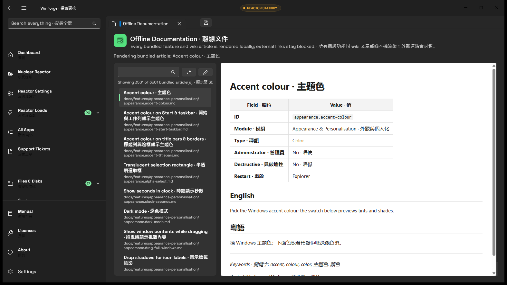

# Offline documentation browser · 離線文件瀏覽器

## Behavior · 行為

WinForge bundles the feature and wiki Markdown corpus into the application and exposes it through
the `Offline Documentation` destination. The page lists the bundled articles, searches titles and
body text with plain text as the default, and opens an article in the same local rendered surface.
Internal article links resolve back into the browser; they do not launch a remote browser or require
network access. · WinForge 將功能同 wiki Markdown corpus 捆綁入 app，經 `Offline Documentation`
目的地提供。頁面列出已捆綁文章，預設用純文字搜尋標題同內文，再喺同一個本機渲染介面開文章。
文章內部連結會返到文件瀏覽器，唔會開遠端 browser，亦唔需要網絡。

## Configuration and limits · 設定同限制

The build-time inventory is collected from `docs/features` and `docs/wiki`. Each Markdown article
is bounded before bundling, the corpus is bounded as a whole, and the build fails if the source
inventory is empty or the expected bundled files are absent. The page has its own anchored regex
builder through the shared search control and preserves the active article while filtering.
· Build 時 inventory 由 `docs/features` 同 `docs/wiki` 收集。每篇 Markdown 喺捆綁前有上限，整個
corpus 亦有總上限；如果 source inventory 空白或者預期捆綁檔案唔見，build 會失敗。頁面自己有
經共用搜尋控制接駁嘅 anchored regex builder，篩選時會保留目前文章。

## Failure and security · 失敗同安全

Missing, oversized, malformed, or external article targets remain local failures with an honest
notification or no-match state. The renderer receives bounded local content only; generated links
use the `winforge-doc:///` scheme, and ordinary external navigation is blocked. No catalog, article,
search pattern, or sample text is sent to a server by this feature. · 缺失、過大、格式錯誤或者外部
文章 target 會如實顯示本機失敗或 no-match 狀態。renderer 只會收到有界本機內容；生成連結用
`winforge-doc:///` scheme，普通外部 navigation 會封鎖。呢個功能唔會將 catalog、文章、搜尋 pattern
或者 sample text 傳去 server。

## Verification · 驗證

`tests/OfflineDocs.Tests/Program.cs` covers corpus discovery, bundled inventory, internal target
resolution, the local URI shape, the direct start-page route, and the generated-navigation boundary
(`5/5`). A real self-contained build was launched on a hidden desktop, and the rendered article was
visually inspected. · `tests/OfflineDocs.Tests/Program.cs` 覆蓋 corpus discovery、捆綁 inventory、
內部 target resolution、本機 URI 形式、直接 start-page 路線同 generated-navigation boundary
（`5/5`）。真實自包含 build 喺隱藏 desktop 啟動，渲染文章亦已檢視。

## Built-artifact evidence · 真實建置證據

This capture was inspected from the self-contained build on a dedicated hidden desktop. Its
SHA-256 is `A4199948F47F545D9870632FEDBB8540743767B8D67F0FCCA7AC803D8E2D5759`. · 呢張圖由專用隱藏
desktop 上嘅自包含 build 檢視，SHA-256 如上。

## Suggested articles · 建議文章

- [Offline changelog](offline-changelog.md) — release history with local filtering and export.
- [Shared settings](shared-settings.md) — language, School mode, and local presentation settings.
- [Authenticator vault](authenticator-vault.md) — another fully local, offline-first destination.
