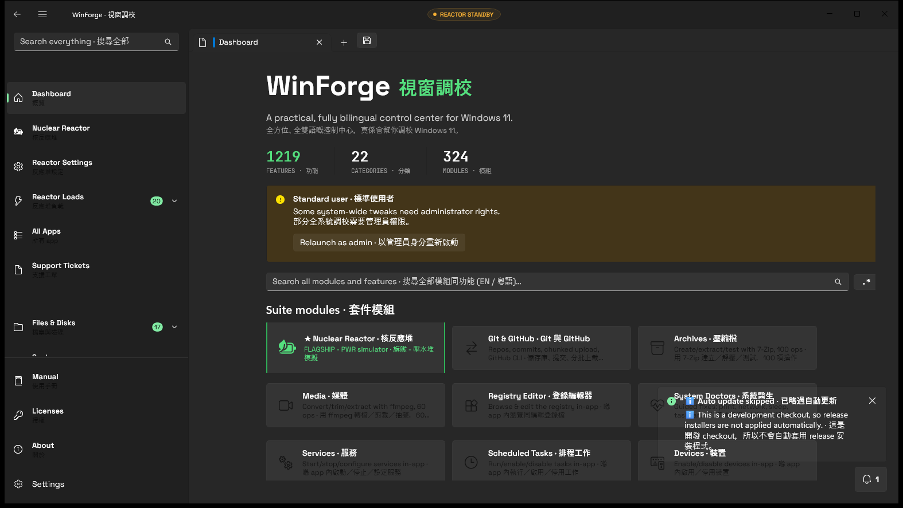

# Pinned tabs and session persistence · 釘選分頁同工作階段保存

## Behavior · 行為

Each tab records `IsPinned` in the local tab-session JSON. Pinned tabs occupy the stable leading region of the tab strip and remain ahead of ordinary tabs when a session is restored. The tab context menu exposes Pin tab / Unpin tab, and toggling the state immediately reorders the real tab item, keeps it selected, and saves the session. Native drag/reorder completion now also saves the complete tab order, and the window-closing path flushes it before the app hides or exits. · 每個分頁喺本機 tab-session JSON 保存 `IsPinned`。釘選分頁固定放喺分頁列前段，重開工作階段後仍然排喺普通分頁之前。分頁 context menu 有 Pin tab / Unpin tab，切換會即時重排真正 tab、保持選取，同保存工作階段。原生拖曳／重排完成而家亦會保存完整分頁次序，關閉視窗前亦會 flush，先收埋去系統匣或者真正退出。

The schema remains backward-compatible: old sessions without `IsPinned` read as unpinned, while new writes use session version 3. Existing group, style, repository, export, and local Git-history data remains intact. · 舊 session 冇 `IsPinned` 會當未釘選，新寫入用 session version 3。原有 group、style、repository、export 同 local Git-history 資料會保留。

The fresh built-artifact capture is `docs/screenshot-tab-session-reorder-2026-08-11.png`, 1574×887, SHA-256 `822870EF6B4194C11A50EA0D5D17EC883FE4E51F1576C10CE26AAB46CFFF30A2`. It shows the real tab strip and restored Dashboard session state; the drag-completion persistence itself is verified by the source contract and close-flush path, not inferred from a static image. · 最新真實 build 圖係 `docs/screenshot-tab-session-reorder-2026-08-11.png`，1574×887，SHA-256 如上；顯示真實分頁列同還原後 Dashboard 工作階段狀態，而拖曳完成保存本身由來源 contract 同 close-flush path 驗證，唔係靠一張靜態圖估出嚟。

## Failure modes and accessibility · 失敗處理同無障礙

- If a session cannot be written, the visible tab state still changes but the save layer reports through its existing bounded local-history path; a later restart may restore the last successful record.
- The accessible tab label remains the user-visible title; pin state is exposed through the real menu command rather than an emoji-only marker.
- Group membership and custom appearance remain separate from pin state, so pinning never changes a group or silently changes a tab's label.

## Verification · 驗證

The persistence schema and compatibility parser are in `Services/TabSessionService.cs`; tab insertion, reordering, menu action, and active-tab restoration are in `MainWindow.xaml.cs`. The full local harness must cover an old JSON session, a pinned/unpinned toggle, restart restoration, and export/import. · 保存 schema 同 compatibility parser 喺 `Services/TabSessionService.cs`；tab 插入、重排、menu action 同 active-tab 還原喺 `MainWindow.xaml.cs`。完整本機 harness 要覆蓋舊 JSON session、釘選／取消釘選、重啟還原同 export/import。

## Suggested articles · 建議文章

- [Shared settings](shared-settings.md) — common local persistence.
- [Managed release contract](../delivery/managed-release-contract.md) — app update state is separate from tab state.
- [Regex builder](../developer-tooling/regex-builder.md) — required for future tab discovery searches.
