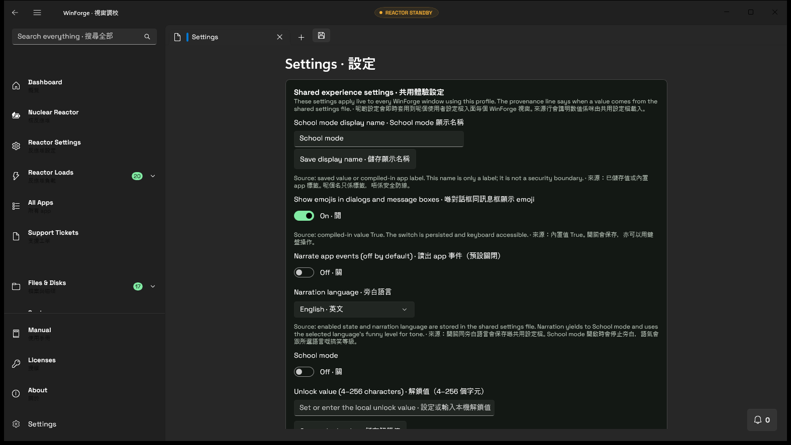

# Scheduled settings and external sources · 排程設定同外部來源

## Behavior · 行為

WinForge stores scheduled-setting rules in the versioned `universal.scheduledSettings.v1` record. Each rule has a stable identifier, label, enabled state, integer priority, optional start/end dates, optional start/end times, an Every day or explicit-weekday selection, the local time-zone identifier, a source kind, and an allowlisted value map. Rules are bounded to 128 records and 32 fields per record. · WinForge 將排程規則保存喺有版本嘅 `universal.scheduledSettings.v1` 記錄。每條規則有穩定識別碼、名稱、啟用狀態、整數優先級、可選開始／結束日期、可選開始／結束時間、每日或者指定星期、時區、來源種類同 allowlist 數值。最多 128 條規則，每條最多 32 個欄位。

The editor supports language, theme, density, accent/seed colour, font family, font scale, font weight, and display name. A matching rule is a temporary override: its result is resolved at runtime and never written back over the user's base setting. Higher priority wins; rules with equal priority resolve by later list order. · 編輯器支援語言、主題、密度、accent／seed 顏色、字體、字體比例、字體粗幼同顯示名稱。符合規則只係暫時覆蓋，唔會寫返去覆蓋使用者基本設定。優先級較高嗰條勝出；同優先級就由列表後面嗰條勝出。

An empty time pair means all day. Equal start/end means a 24-hour window. An end earlier than the start is a cross-midnight window, and the weekday/date boundary belongs to the window's start date. Optional date bounds are inclusive. Local values are applied directly; external values must be refreshed and validated before they become active. · 開始／結束時間都留空代表全日；兩者相同代表 24 小時；結束早過開始代表跨午夜，星期／日期界線跟時間窗開始嗰日。日期上下限包括首尾。 本機數值可以直接套用；外部數值要先重新整理同驗證，先可以生效。

## Sources and security · 來源同安全

- **Local:** values are read from the rule itself.
- **Validated HTTPS API:** the response must be JSON version `1`, contain only known setting fields, contain string values within the field limit, and remain below 256 KiB. Redirects, embedded URL credentials, unknown fields, malformed JSON, oversized responses, and non-HTTPS non-loopback HTTP are rejected. Loopback HTTP is allowed only for bounded development use.
- **Home Assistant boolean:** the endpoint is validated with the same transport rules, the entity must be `binary_sensor.name` or `input_boolean.name`, and `on` activates the rule while any other state leaves the base setting or another rule in effect. The token is stored only in the Windows credential vault under a stable per-rule key.

Refresh uses a five-second timeout, no automatic redirects, bounded response reads, and cancellation. Failures are non-blocking: the last valid external value remains in memory, the base setting remains available, and the user sees the failure rather than a guessed applied value. Tokens and response bodies never enter settings JSON, exports, logs, history, screenshots, or public records. · 重新整理有五秒超時、唔跟 redirect、限制回應大小同支援取消。失敗唔會阻塞：記憶體保留最後有效外部值，基本設定照樣可用，介面會如實顯示失敗，唔會扮成已套用。token 同回應內容唔會寫入設定 JSON、匯出、log、history、截圖或者公開記錄。

## Failure modes · 失敗處理

- Invalid or unsupported schema data loads as an empty schedule rather than silently applying malformed settings.
- A missing time-zone identifier prevents the rule from matching and leaves the base setting active.
- Partial time input, reversed date bounds, an empty weekday selection, an unknown field, an invalid endpoint, or a malformed Home Assistant entity is rejected before persistence.
- Home Assistant `off`, missing vault token, offline operation, authentication refusal, rate limiting, redirects, and malformed source data leave the last valid/base state in effect.

## Verification · 驗證

The implementation is in `Services/ScheduledSettingsService.cs` and the keyboard-accessible settings editor is built by `Pages/SettingsPage.xaml.cs`. The editor's own `SearchPatternBox` searches rule labels, sources, fields, and values with plain text as the default and the full .NET regex builder as an opt-in. Local verification includes the solution build, direct source contract checks, and the runtime resolver paths for date bounds, weekdays, equal times, cross-midnight windows, source validation, and fail-safe refresh. · 實作喺 `Services/ScheduledSettingsService.cs`，設定編輯器喺 `Pages/SettingsPage.xaml.cs`，可以用鍵盤操作。編輯器自己有 `SearchPatternBox`，預設純文字，亦有完整 .NET regex builder。驗證包括 solution build、source contract 同日期、星期、相同時間、跨午夜、來源驗證同安全失敗處理。

## Built-artifact evidence · 真實建置證據

This capture was inspected from the self-contained build on a dedicated hidden desktop. Its
SHA-256 is `6A0B8BDC3F5DC9F58B9F30BF7E8A6EA1D3875A7EF059AE62C26B51C667485B9C`. · 呢張圖由專用隱藏 desktop 上嘅自包含 build 檢視，SHA-256 如上。

## Suggested articles · 建議文章

- [Shared settings](shared-settings.md) — the base settings record and live profile changes.
- [Pinned tabs](pinned-tabs.md) — persisted navigation state that scheduled display settings may temporarily style.
- [Authenticator QR pairing](authenticator-qr.md) — the separate local vault-backed factor surface.
