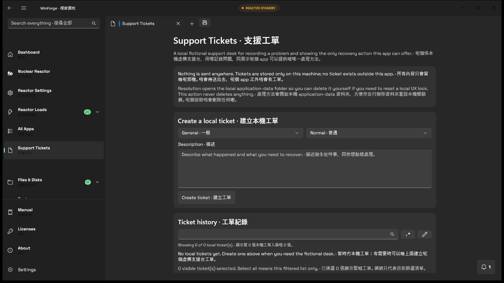

# Support Tickets · 支援工單

## Behavior · 行為

Support Tickets is a fictional, local-only desk reachable from the app navigation, command palette, Help routes, and the forgotten-lock recovery path. It records a category, description, severity, local ticket number, timestamp, status, and canned first response. Status progresses `New → Acknowledged → InProgress → Resolved`; a resolved ticket cannot advance again. · 支援工單係本機虛構支援台，可以由 app 導覽、command palette、Help 路線同忘記鎖定值嘅復原路線到達。每張工單保存類別、描述、嚴重程度、本機工單號碼、時間、狀態同罐頭第一回覆。狀態係 `New → Acknowledged → InProgress → Resolved`，完成後唔可以再推進。

The list is bounded to 500 tickets and descriptions are bounded to 4,000 characters. The resolution surface shows the real WinForge application-data folder path and requests that the platform file manager open it. The app never deletes that folder for the user. · 清單最多 500 張工單，描述最多 4,000 個字元。處理方法介面會顯示真實 WinForge application-data 資料夾路徑，要求平台檔案管理員開啟；app 永遠唔會代使用者刪除資料夾。

## Privacy and failure modes · 私隱同失敗處理

The surface carries an unstyled disclosure: nothing is sent anywhere, tickets exist only on this machine, no network request is made, no data is collected, and no person is reading the ticket. Storage is local JSON under the application-data folder. A storage read or write problem leaves the live app usable and reports the failure; it does not claim that a ticket was sent to a real service desk. · 介面有一行唔受搞笑等級影響嘅清楚聲明：唔會傳送去任何地方，工單只喺呢部機存在，冇網絡請求、冇資料收集，亦冇真人睇緊。資料係 application-data folder 入面嘅本機 JSON。讀寫失敗會如實報告，唔會扮成已經傳去真實支援台。

The folder-opening action is non-destructive and has no deletion shortcut. If the file manager rejects the request, the exact path and failure are shown in a non-blocking notification. · 開資料夾動作唔會破壞資料，亦冇刪除捷徑。如果檔案管理員拒絕，介面會用非阻塞通知顯示準確路徑同失敗原因。

The ticket list supports extended keyboard selection, select-all and inverse selection over the currently filtered list, bulk status advancement, and destructive bulk deletion behind the native two-key/full-slider confirmation. Selected records can be exported as UTF-8 JSON, CSV, Markdown, or HTML; each export includes only the selected records and carries no external credentials. · 工單清單支援 extended 鍵盤揀選、對目前篩選清單揀晒同反轉揀選、批量推進狀態，同由本機兩條匙／完整滑桿確認保護嘅批量刪除。所選紀錄可以匯出 UTF-8 JSON、CSV、Markdown 或 HTML；每種匯出只包括所選紀錄，唔帶任何外部憑證。

## Verification · 驗證

`Services/SupportTicketService.cs` owns the bounded local model and persistence. `Pages/SupportTicketsPage.xaml` and its code-behind provide the bilingual surface and accessible controls. `tests/SupportTickets.Tests/Program.cs` covers the local-only disclosure, persistence, ticket numbers, canned response, full status progression, non-destructive folder opening, and description limits. · `Services/SupportTicketService.cs` 負責有限度本機 model 同保存；`Pages/SupportTicketsPage.xaml` 同 code-behind 提供雙語介面同無障礙控制。`tests/SupportTickets.Tests/Program.cs` 覆蓋本機聲明、保存、工單號碼、罐頭回覆、完整狀態流程、非破壞開資料夾同描述限制。

## Built-artifact evidence · 真實建置證據

This capture was inspected from the self-contained build on a dedicated hidden desktop. Its
SHA-256 is `FB4FF05D43A212468734130B8A08163E6FFF7B9D65F9B996CCAA7C333742AB63`. · 呢張圖由專用隱藏 desktop 上嘅自包含 build 檢視，SHA-256 如上。

## Suggested articles · 建議文章

- [Shared settings](shared-settings.md) — shared language, funny-level, emoji, and School-mode behavior.
- [Pinned tabs](pinned-tabs.md) — persistent navigation and later bulk-management work.
- [Authenticator QR pairing](authenticator-qr.md) — local credential-vault boundaries.
