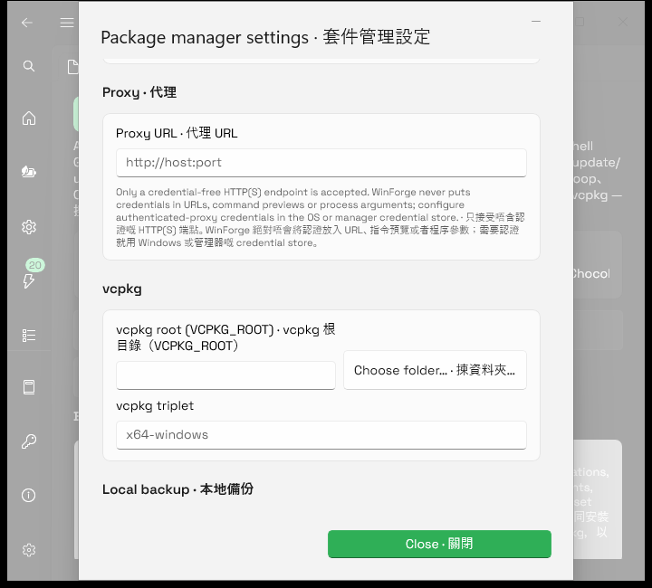
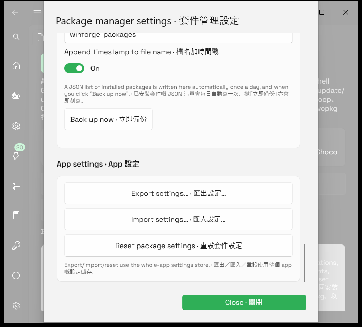

# Package Manager feature · 套件管理功能

## Behavior · 行為

The `packages` deep link opens one native WinUI 3 workspace for 11 engines: WinGet, Scoop, Chocolatey, pip, npm, .NET tools, Windows PowerShell Gallery, PowerShell 7 PSResourceGet, Cargo, Bun, and vcpkg. Its Discover, Updates, Installed, Bundles, Sources, Ignored, Setup, Settings, and Operations views share the same bounded queue, output history, cancellation, retry, source identity, and package-reference policy. Mutating actions remain explicit and source removal requires confirmation. · `packages` deep link 會開啟一個原生 WinUI 3 工作區，涵蓋 11 個引擎。Discover、Updates、Installed、Bundles、Sources、Ignored、Setup、Settings 同 Operations 共用有界佇列、輸出記錄、取消、重試、來源 identity 同套件 reference policy；修改動作保持明確，移除來源前亦要確認。

The app-level update scheduler starts independently of whether the page has been opened. The pinned `ThirdParty/UniGetUI` source is audit/provenance input only: WinForge neither compiles nor launches the upstream executable. · App 級更新排程唔需要先開套件頁；固定 `ThirdParty/UniGetUI` source 只作審核／來源證明，WinForge 唔會編譯或者啟動上游 executable。

## Configuration · 設定

Settings persist through `PackageManagerSettings`. Optional manager executable paths and advanced arguments remain explicit expert surfaces. The proxy field accepts only a credential-free HTTP(S) authority such as `https://proxy.example:8443`; proxy paths, queries, fragments, embedded credentials, control characters, raw percent expansion, and command syntax fail closed. The vcpkg triplet is at most 64 ASCII token characters and may contain only letters, numbers, dots, underscores, and dashes, starting with a letter or number. · 設定經 `PackageManagerSettings` 保存。可選管理器 executable path 同進階 argument 係明確專家介面。Proxy 只接受唔含認證嘅 HTTP(S) authority；path、query、fragment、內嵌認證、控制字元、原始百分號展開同指令語法全部 fail closed。vcpkg triplet 最多 64 個 ASCII token 字元，只可用字母、數字、點、底線同橫線，而且要由字母或數字開始。

WinForge no longer collects proxy usernames/passwords because it cannot use them without exposing them to a command line. Any legacy values remain DPAPI-protected and are never inserted into URLs, previews, or process arguments; when detected, Settings offers an explicit **Forget saved credentials** action. Authenticated proxies must use the operating-system or package-manager credential store. · WinForge 已經唔再收集 proxy 使用者名稱／密碼，因為用佢哋就會暴露喺 command line。任何舊值會保持 DPAPI 保護，而且絕對唔會插入 URL、預覽或者 process argument；偵測到時，Settings 會提供明確 **刪除已保存認證** 動作。需要認證嘅 proxy 要用 Windows 或套件管理器 credential store。

## Failure modes · 失敗模式

- Missing engines are reported as Setup dependencies, never as successful operations. · 欠缺引擎會顯示成 Setup dependency，唔會當成功。
- Invalid proxy/triplet input is rejected inline with a bilingual `InfoBar`, and the last valid value is restored. · 無效 proxy／triplet 會用雙語 `InfoBar` 即場拒絕，並還原上一個有效值。
- Interactive execution fails closed when WinForge cannot preserve its normal-integrity boundary. · WinForge 保持唔到 normal-integrity 界線時，互動執行會 fail closed。
- Cancellation and cleanup target only processes owned by the package operation. Output is bounded and redacted. · 取消同清理只針對套件操作自家 process；輸出有界而且會遮蔽敏感內容。
- Registry lookups are best-effort and cancellable; a network/API failure returns no fabricated update. · Registry 查詢係 best-effort 同可取消；網絡／API 失敗唔會虛構更新。

## Accessibility and layout · 無障礙同版面

Primary controls and dynamically created package/source/operation actions have at least 44×44-pixel targets. Section headings expose heading semantics, selection checkboxes and operation output have programmatic names, truncated row metadata has a tooltip, and long manager/action/batch strips remain horizontally scrollable. The search row separates from the action toolbar so English, Cantonese, and bilingual layouts remain usable at a 720-pixel window width. · 主要控制同動態建立嘅套件／來源／操作按鈕最少 44×44 像素；section heading 有 heading semantics，選取 checkbox 同操作輸出有程式化名稱，被省略嘅 row metadata 有 tooltip；長管理器／操作／批次列可以橫向捲動。搜尋列同 action toolbar 分開，所以英文、粵語同雙語模式喺 720 像素視窗仍然可用。

## Verification · 驗證

- Source lanes passed **29/29** and **28/28** independently; the merged `dotnet run --project tests/PackageManagerCore.Tests -c Debug` contract passes **30/30**, including atomic create/replace/failure preservation plus structured proxy/triplet normalization and malicious-value rejection. · 兩條來源線各自 **29/29**／**28/28**；合併專項 contract **30/30 通過**，包括原子建立／取代／失敗保留，同結構化 proxy／triplet 正規化／惡意值拒絕。
- `dotnet build WinForge.sln -c Debug -p:Platform=x64`: exit 0, **0 errors**. · exit 0，**零 errors**。
- Self-contained publish with Windows App SDK self-containment: exit 0. · Windows App SDK 自包含 publish exit 0。
- XAML literal safety: pass. Detailed source audit: 336 XAML files; 2,875/2,875 handlers and 1,922/1,922 direct actions resolved; zero lifecycle mismatches and zero actionable markers. · XAML literal safety 通過；詳細 source audit 有 336 個 XAML、2,875/2,875 handler、1,922/1,922 direct action，零 lifecycle mismatch／actionable marker。
- LowLevel MCP opened the exact combined self-contained `packages` binary on a fresh dedicated headless desktop. Inspected 1049×646 and 720×650 page captures show the live bilingual layout without overlapping/off-screen action controls. The 720-pixel Settings dialog was also inspected at its proxy/vcpkg and final App Settings sections: no credential inputs remain and all three App Settings actions fit as full-width rows. The exact owned process was closed, the desktop listed zero windows, and its handle was released. · LowLevel MCP 喺全新專用 headless desktop 開啟 exact combined 自包含 `packages` binary；已檢視 1049×646／720×650 live 雙語版面，冇重疊或者走出畫面 action control。720 像素 Settings dialog 嘅 proxy／vcpkg 同最底 App Settings 都已檢視：冇 credential input，三個 App Settings action 亦完整直排；最後已關閉準確自家 process、確認 desktop 零視窗並釋放 handle。
- Repository-driver fallback was kept separate: its first attempt found no dedicated window; a longer retry reported success but inspection showed unrelated desktop content. That image was rejected, overwritten to remove the unrelated content, and never promoted as evidence. · Repo driver fallback 會分開處理：第一次搵唔到專用視窗；加長等候重試雖然報成功，但檢視後發現係不相關桌面內容。該圖已拒絕並覆寫以清除不相關內容，絕對冇升格做證據。

