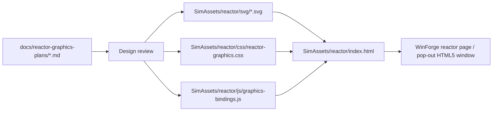

<!--
WinForge Reactor Graphics Planning Pack
Scope: educational / fictionalized nuclear power plant simulator graphics and UI planning.
Safety boundary: do not include real plant-specific setpoints, security layouts, cable routes,
exact emergency operating procedures, or real-world operating instructions. Use fictional values,
abstracted logic, and clearly marked simulation-only labels.
-->
# WinForge Reactor Graphics Plan Pack

This pack is a repository-ready set of Markdown planning files for expanding WinForge's reactor simulator graphics. It is designed for placement under:

```text
docs/reactor-graphics-plans/
```

The current repository structure already exposes a reactor web asset area under:

```text
SimAssets/reactor/
  css/
  js/
  svg/
  index.html
```

These plans are written to feed that structure with better diagrams, SVG concepts, control-room UI mockups, display hierarchy, scenario graphics, alarm visualizations, and documentation for future implementation.

## Intended use

Use each file as a design backlog document. Every file includes at least one of the following:

- Mermaid diagrams for architecture or flow graphics.
- UI wireframes that can be converted into SVG or HTML panels.
- Graphic-generation prompts for icons, educational diagrams, and dashboard art.
- Acceptance criteria for GitHub issues or pull requests.
- Suggested data bindings for simulation variables, without exposing real-world plant setpoints.

## Safety and realism boundary

The goal is **educational realism**, not real plant operation. Keep these rules in every implementation:

1. Use fictionalized ranges and normalized indicators such as `LOW`, `NORMAL`, `HIGH`, `DEGRADED`, or `TRIPPED` instead of real setpoints.
2. Do not model physical security layouts, guard force paths, sensor placement, cyber network addresses, or real plant cable routing.
3. Do not publish exact emergency operating procedures. Use scenario objectives and debrief summaries instead.
4. Keep all graphics clearly labeled as **simulation-only**.
5. For bilingual UI, show English and 繁體中文／粵語 labels together where screen space allows.

## File map

| File | Purpose | Primary graphics output |
|---|---|---|
| `01_PLANT_MIMIC_GRAPHICS_PLAN.md` | Expand the main plant mimic and process overview | PWR loop, heat path, containment, system state tiles |
| `02_CONTROL_ROOM_UI_GRAPHICS_PLAN.md` | Design the main control room, panels, screens, and wall display | Control-room layout, HMI hierarchy, alarm console |
| `03_FACILITY_WALKTHROUGH_MAPS_PLAN.md` | Add plant rooms and facility navigation graphics | Safe educational facility map and room cards |
| `04_SAFETY_SYSTEMS_GRAPHICS_PLAN.md` | Add conceptual safety-system graphics | Defense-in-depth, protection overview, event timeline |
| `05_INSTRUMENTATION_ALARMS_TRENDS_PLAN.md` | Add instruments, alarm logic, trend/historian graphics | Alarm dashboard, channel health, trend replay |
| `06_SCENARIO_TRAINING_GRAPHICS_PLAN.md` | Add training scenario visuals | Scenario cards, briefing/debrief dashboards |
| `07_REACTOR_PHYSICS_VISUALS_PLAN.md` | Add physics visual explanations | Reactivity feedback, xenon, thermal balance |
| `08_FUEL_WASTE_WATER_CYCLE_GRAPHICS_PLAN.md` | Add fuel, spent-fuel, water-treatment graphics | Fuel cycle, water treatment, radwaste overview |
| `09_GRAPHICS_GENERATOR_PIPELINE_PLAN.md` | Add an asset-generation pipeline | Source-to-SVG/PNG flow, naming and build rules |
| `10_BILINGUAL_LABELING_STYLE_GUIDE.md` | Standardize bilingual labels and accessibility | Label rules, typography tokens, contrast plan |
| `11_GRAPHICS_BACKLOG_AND_ISSUES.md` | Convert the plans into actionable work | Issue templates, milestones, acceptance criteria |
| `12_REGULATORY_REALISM_REFERENCE_MAP.md` | Map public guidance to safe simulator features | Requirements-to-feature matrix |
| `13_REACTOR_REALISM_GAP_FILL_PLAN.md` | Fill model, HMI, scenario, and validation gaps | Implementation-ready realism backlog |

## Recommended first milestone

If the reactor runtime does not exist yet, build the `13_REACTOR_REALISM_GAP_FILL_PLAN.md`
foundation first so the graphics have coherent simulator state to display.

Then build these three graphics first because they are high-impact and low-risk:

1. Main plant mimic SVG with primary loop, steam generator, turbine, condenser, containment boundary, and normalized status tiles.
2. Control-room overview wall with alarm banner, plant mode strip, trend ribbon, and room navigation.
3. Scenario briefing/debrief card system that teaches symptoms and concepts without giving real procedures.

## Repository integration sketch



## Definition of done for this pack

A plan from this folder is ready to implement when it has:

- A clear graphic title and target screen.
- Safe data variables or placeholder data.
- A Mermaid or wireframe sketch.
- Bilingual label notes.
- A testable acceptance checklist.
- A clear statement that it is simulation-only.
