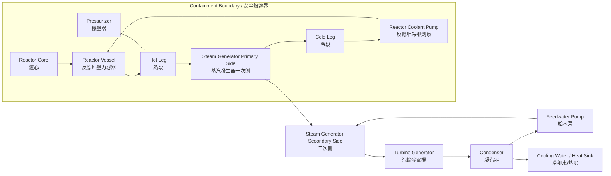

<!--
WinForge Reactor Graphics Planning Pack
Scope: educational / fictionalized nuclear power plant simulator graphics and UI planning.
Safety boundary: do not include real plant-specific setpoints, security layouts, cable routes,
exact emergency operating procedures, or real-world operating instructions. Use fictional values,
abstracted logic, and clearly marked simulation-only labels.
-->
# Plan 01 — Plant Mimic Graphics

## Goal

Create a richer, more realistic **educational PWR plant mimic** for WinForge's reactor simulator. The graphic should make the heat path and system boundaries obvious without turning the simulator into a real operating guide.

## Target files

```text
SimAssets/reactor/svg/plant-mimic-v2.svg
SimAssets/reactor/css/plant-mimic.css
SimAssets/reactor/js/plant-mimic-bindings.js
SimAssets/reactor/index.html
```

## Visual scope

Show the following abstract systems:

| Zone | Show | Do not show |
|---|---|---|
| Reactor core | core heat, control rods, vessel boundary, normalized power | real dimensions, real rod worth, real trip limits |
| Primary loop | reactor vessel, hot/cold leg, pump, pressurizer, steam generator primary side | plant-specific pressures or exact thermal limits |
| Secondary loop | steam generator secondary side, turbine, condenser, feedwater pump | real turbine controls or grid operating procedures |
| Cooling path | condenser heat sink, cooling water flow, heat rejection state | site-specific intake/outfall layout |
| Containment | conceptual boundary, humidity/radiation normalized indicators | shielding details, access/security routes |

## Main graphic concept



## Suggested status tiles

Each tile should be driven by normalized simulation state, not real setpoints.

| Tile | Values | Graphic treatment |
|---|---|---|
| `Plant Mode` | Startup, Power, Shutdown, Training Scenario | top mode strip |
| `Core Heat` | Low, Nominal, Rising, High | glowing core intensity |
| `Primary Integrity` | Normal, Degraded, Isolated | loop line style |
| `Heat Removal` | Available, Reduced, Lost | heat-flow arrows |
| `Steam Demand` | Low, Matched, High | turbine flow width |
| `Containment State` | Normal, Isolated, Challenge | containment border state |
| `Safety Function Summary` | All OK, Watch, Challenged | right-side cards |

## SVG layer plan

```text
plant-mimic-v2.svg
  layer: background-grid
  layer: containment-boundary
  layer: primary-loop-pipes
  layer: primary-loop-components
  layer: secondary-loop-pipes
  layer: turbine-bop-components
  layer: heat-flow-arrows
  layer: sensor-badges
  layer: alarm-overlays
  layer: bilingual-labels
  layer: scenario-callouts
```

## Data-binding sketch

```json
{
  "reactorPowerPct": "normalized display only",
  "coreHeatState": "LOW | NOMINAL | RISING | HIGH",
  "primaryLoopState": "NORMAL | DEGRADED | ISOLATED",
  "secondaryLoopState": "AVAILABLE | REDUCED | LOST",
  "heatRemovalState": "AVAILABLE | DEGRADED | CHALLENGED",
  "containmentState": "NORMAL | ISOLATED | CHALLENGE",
  "activeScenarioId": "string or null"
}
```

## Graphic-generation prompts

Use these as prompts for SVG/icon concept art or internal graphics tasks:

> Create a clean educational SVG-style PWR plant mimic for a fictional simulator. Show reactor vessel, primary loop, pressurizer, steam generator, turbine, condenser, feedwater loop, containment boundary, and heat-flow arrows. Use bilingual English + Cantonese labels. Do not include real setpoints, cable routes, or real plant identifiers.

> Create a dashboard status tile set for a fictional PWR training simulator. Tiles: Plant Mode, Core Heat, Primary Integrity, Heat Removal, Steam Demand, Containment State, Safety Function Summary. Use normalized states only: Normal, Watch, Challenged, Simulated Trip.

## Implementation tasks

1. Create `plant-mimic-v2.svg` with semantic IDs on every component.
2. Add CSS classes for states: `.state-normal`, `.state-watch`, `.state-challenged`, `.state-trip`, `.state-unavailable`.
3. Add a binding layer that updates only classes and text labels, not raw SVG geometry.
4. Add hover tooltips for each major component.
5. Add a mode that hides numbers and shows conceptual labels for public/demo use.

## Acceptance criteria

- The graphic renders in the reactor HTML page without external dependencies.
- The heat path is understandable within 10 seconds.
- Every major component has English and 繁體中文／粵語 labels.
- No real-world setpoints, procedures, plant IDs, or security details appear.
- The graphic remains usable when reduced to laptop screen size.
