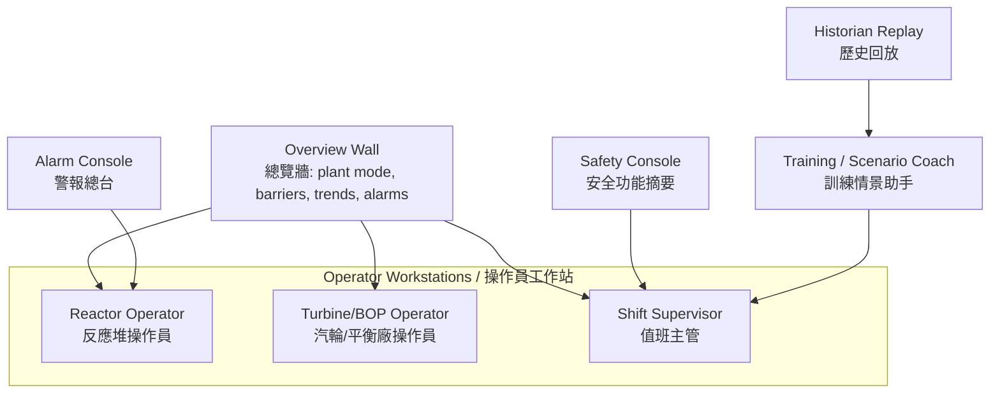
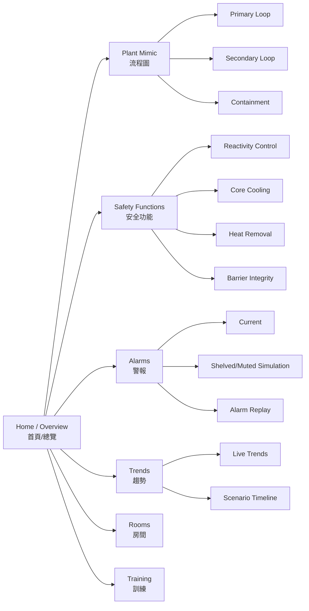

<!--
WinForge Reactor Graphics Planning Pack
Scope: educational / fictionalized nuclear power plant simulator graphics and UI planning.
Safety boundary: do not include real plant-specific setpoints, security layouts, cable routes,
exact emergency operating procedures, or real-world operating instructions. Use fictional values,
abstracted logic, and clearly marked simulation-only labels.
-->
# Plan 02 — Control Room UI Graphics

## Goal

Expand WinForge's reactor simulator from a single plant mimic into a believable **training control-room interface** with an overview wall, operator workstations, alarm console, procedure/training pane, and trend panels.

## Concept

The control room should feel dense and authentic while remaining safe and fictional. It should teach operators how nuclear plant information is organized: plant state, safety functions, alarms, trends, systems, and scenario objectives.

## Control-room layout graphic



## Screen hierarchy



## Wireframe

```text
+----------------------------------------------------------------------------------+
| PLANT MODE | SIMULATION ONLY | CLOCK | SCENARIO | LANGUAGE EN/粵 | FULLSCREEN     |
+----------------------------------------------------------------------------------+
| OVERVIEW WALL: plant mimic + barrier state + heat path + key trend ribbons        |
|                                                                                  |
+--------------------------------------+-------------------------------------------+
| Left nav                             | Main pane                                  |
| - Overview                           |  [SVG plant mimic / system view]           |
| - Core                               |                                           |
| - Primary Loop                       |                                           |
| - Secondary Plant                    |                                           |
| - Safety Functions                   |                                           |
| - Alarms                             |                                           |
| - Trends                             |                                           |
| - Rooms                              |                                           |
| - Training                           |                                           |
+--------------------------------------+-------------------------------------------+
| ALARM BANNER: top 5 active training alarms | TREND STRIP | EVENT LOG             |
+----------------------------------------------------------------------------------+
```

## Graphic assets to add

| Asset | File | Description |
|---|---|---|
| Overview wall background | `svg/control-room-wall.svg` | static wall layout and display frames |
| Workstation icon set | `svg/control-room-workstations.svg` | RO, TO, SS, training coach icons |
| Alarm severity badges | `svg/alarm-badges.svg` | educational severity badges |
| Plant state strip | `svg/plant-state-strip.svg` | mode/status header icons |
| Trend ribbon template | `svg/trend-ribbon.svg` | reusable line/area trend visual |

## UI components

| Component | Purpose | Inputs |
|---|---|---|
| `PlantModeStrip` | Current simulator mode and scenario state | `plantMode`, `scenarioId`, `simClock` |
| `BarrierStatusBar` | Core, coolant, containment, power, heat-sink status | normalized barrier states |
| `AlarmBanner` | Top active training alarms | alarm summary list |
| `TrendRibbon` | Mini trends for power, heat, pressure category, water inventory category | normalized time series |
| `ProcedureCoach` | Training hints and learning objectives | scenario metadata, not real procedures |
| `RoomNavigator` | Switch to facility views | room graph |

## Graphic-generation prompts

> Create a fictional nuclear simulator control-room overview wall in a modern WinUI/HTML5 style. Include a plant mimic, status strips, trend ribbons, alarm banner, and bilingual English + Cantonese labels. Mark everything as simulation-only. Avoid real plant names, real setpoints, exact procedures, or security details.

> Create icons for reactor operator, turbine operator, shift supervisor, alarm console, historian replay, and training coach for a fictional nuclear training simulator. Clean vector style, consistent line weight, bilingual tooltip names.

## Acceptance criteria

- A new user can identify plant mode, active alarms, and heat-removal status without opening submenus.
- Alarm and trend panels stay visible during scenario mode.
- Training hints never replace operator action controls; they appear as explanatory coaching only.
- The UI supports both compact and full-screen pop-out modes.
- Every graphic asset can be used in both English-leading and 粵語-leading display modes.
