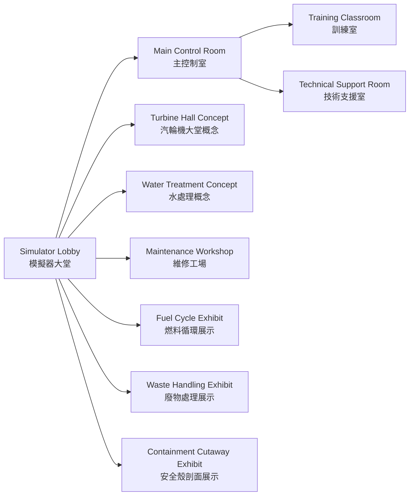
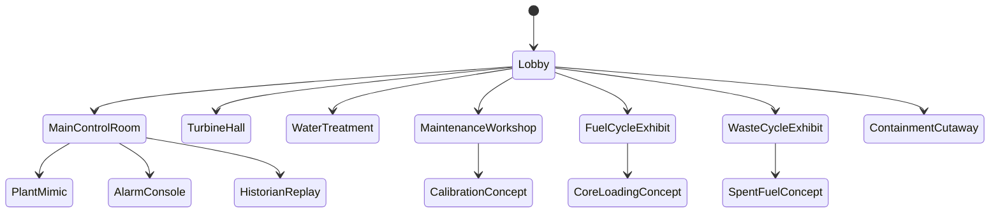

<!--
WinForge Reactor Graphics Planning Pack
Scope: educational / fictionalized nuclear power plant simulator graphics and UI planning.
Safety boundary: do not include real plant-specific setpoints, security layouts, cable routes,
exact emergency operating procedures, or real-world operating instructions. Use fictional values,
abstracted logic, and clearly marked simulation-only labels.
-->
# Plan 03 — Facility Walkthrough Maps

## Goal

Add facility and room graphics so the simulator feels like a complete plant campus, not only a control panel. The map should be educational and abstract; it must not represent a real physical security layout.

## Room categories

| Category | Example rooms | Graphics to create |
|---|---|---|
| Operations | Main control room, simulator training room, technical support room | room cards, navigation map |
| Nuclear island | Containment overview, auxiliary building, spent fuel pool concept room | abstract cutaway cards |
| Turbine island | turbine hall, condenser area, feedwater area | industrial room backdrops |
| Balance of plant | water treatment, electrical switchgear concept, HVAC concept | simplified facility tiles |
| Maintenance | calibration bench, I&C workshop, spare parts room | non-sensitive toolbench graphics |
| Administration | shift office, records, training classroom | educational non-operational rooms |

## Safe facility map



## Room card template

```text
+------------------------------------------------+
| Room name EN / 粵語                             |
| [Illustration or SVG cutaway]                  |
| Purpose: educational summary                   |
| What to watch: 3 conceptual indicators         |
| Related systems: chips                         |
| Training note: scenario relevance              |
| Button: Open graphic / Back to map             |
+------------------------------------------------+
```

## Navigation states



## Image prompt templates

> Create an abstract educational map of a fictional nuclear power plant simulator campus. Include only public-safe conceptual areas: main control room, turbine hall, water treatment, maintenance workshop, fuel cycle exhibit, waste handling exhibit, and containment cutaway. Do not show fences, guard posts, security sensors, exact room adjacencies, or real plant layout.

> Create a vector-style room card for a fictional turbine hall concept in a simulator. Show turbine generator silhouette, condenser block, steam arrows, and safety labels. Use bilingual English + Cantonese labels and no real equipment specifications.

## Implementation tasks

1. Add a `facility-map.svg` with a hub-and-spoke layout.
2. Add per-room SVG backdrops in `SimAssets/reactor/svg/rooms/`.
3. Add `rooms.json` metadata for titles, bilingual labels, system links, and scenario links.
4. Add click navigation in `RoomNavigator`.
5. Add accessibility text for all room cards.

## Acceptance criteria

- The facility map does not resemble a real plant security layout.
- Every room teaches one concept clearly.
- Room graphics link back to relevant plant mimic sections.
- Bilingual labels fit without clipping.
- The map supports keyboard navigation and screen-reader labels.
