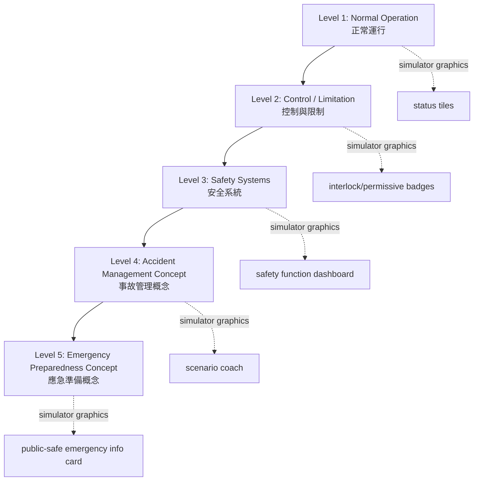
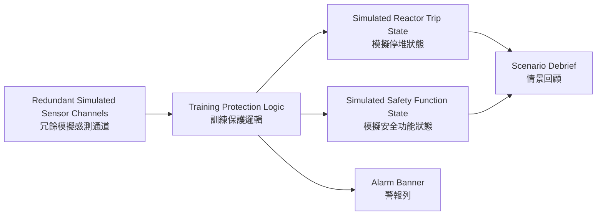

<!--
WinForge Reactor Graphics Planning Pack
Scope: educational / fictionalized nuclear power plant simulator graphics and UI planning.
Safety boundary: do not include real plant-specific setpoints, security layouts, cable routes,
exact emergency operating procedures, or real-world operating instructions. Use fictional values,
abstracted logic, and clearly marked simulation-only labels.
-->
# Plan 04 — Safety Systems Graphics

## Goal

Add graphics that explain **safety functions and defense-in-depth** at a conceptual level. The simulator should show why systems exist, how they are grouped, and what state they are in, without publishing real protection setpoints or exact emergency procedures.

## Safety-function dashboard

| Safety function | Display state | Example graphic |
|---|---|---|
| Reactivity control | Stable, Watch, Challenged, Simulated Trip | rod/core state badge |
| Core cooling | Available, Reduced, Challenged | water inventory icon |
| Heat removal | Available, Reduced, Lost | heat-flow arrow status |
| Barrier integrity | Normal, Watch, Challenged | core/coolant/containment barrier strip |
| Electrical support | Available, Degraded, Lost | power bus icon |
| Habitability concept | Normal, Isolated, Training Event | room air icon |

## Defense-in-depth graphic



## Protection-system educational overview

Keep this high-level and fictionalized.



## Event timeline graphic

```text
T-00: Normal trend baseline
T+01: First indication / symptom appears
T+02: Alarm group appears
T+03: Safety function state changes
T+04: Scenario coach asks diagnosis question
T+05: Simulator stabilizes or escalates based on training choices
T+06: Debrief compares expected concept vs user observation
```

Do not present the timeline as a real emergency operating procedure. It is a simulator tutorial sequence only.

## Graphics to create

| File | Description |
|---|---|
| `svg/safety-functions-dashboard.svg` | six-card safety-function overview |
| `svg/defense-in-depth.svg` | stacked defense-in-depth layers |
| `svg/training-protection-logic.svg` | conceptual redundant channels and training logic |
| `svg/scenario-event-timeline.svg` | safe timeline for scenario debrief |

## Image prompt templates

> Create a vector infographic explaining defense-in-depth for a fictional nuclear power plant simulator. Use five stacked layers and bilingual English + Cantonese labels. Keep it conceptual, educational, and simulation-only; do not include real setpoints, system diagrams, or emergency procedures.

> Create a safety-function dashboard with six tiles: Reactivity Control, Core Cooling, Heat Removal, Barrier Integrity, Electrical Support, and Habitability Concept. Use normalized states only and fictional simulator labels.

## Acceptance criteria

- The safety dashboard is understandable without domain expertise.
- It shows safety **functions**, not plant-specific actuation logic.
- It never displays exact real-world trip setpoints or emergency steps.
- Every scenario can attach to one or more safety-function tiles.
- Event timeline exports to PNG/SVG for release notes and documentation.
