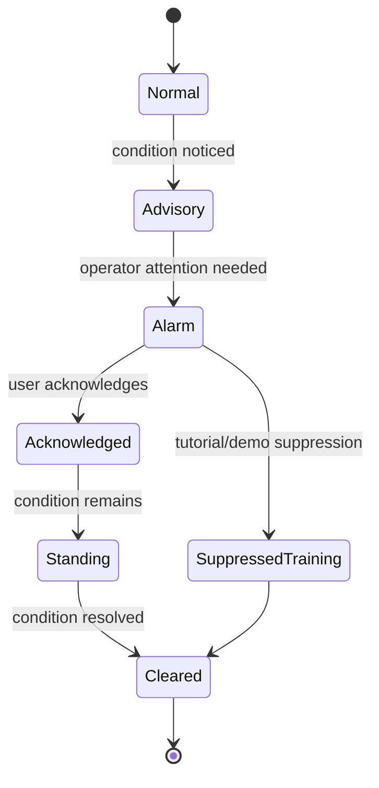
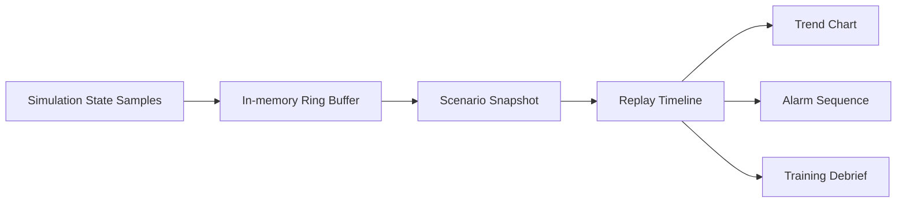

<!--
WinForge Reactor Graphics Planning Pack
Scope: educational / fictionalized nuclear power plant simulator graphics and UI planning.
Safety boundary: do not include real plant-specific setpoints, security layouts, cable routes,
exact emergency operating procedures, or real-world operating instructions. Use fictional values,
abstracted logic, and clearly marked simulation-only labels.
-->
# Plan 05 — Instrumentation, Alarms, Trends, and Historian Graphics

## Goal

Make simulator state visible through better gauges, alarms, trend ribbons, channel-health badges, and historian replay graphics.

## Display philosophy

Use three layers:

1. **Overview layer** — normalized status tiles and trend ribbons.
2. **System layer** — component-specific gauges and instrument badges.
3. **Analysis layer** — historian replay, event list, and scenario debrief.

## Instrument categories

| Category | Example display | Use safe abstraction |
|---|---|---|
| Neutron/power | normalized power bar, rate indicator | no real calibration details |
| Thermal-hydraulic | heat, pressure category, inventory category | no real operating limits |
| Chemistry | boron/chemistry concept badge | qualitative state only |
| Radiation monitoring | area/effluent concept badge | fictional units or normalized state |
| Electrical | power availability, bus health | no real bus topology |
| HVAC/habitability | room air state, isolation concept | no real filter specs |

## Alarm lifecycle graphic



## Alarm dashboard wireframe

```text
+----------------------------------------------------------------------------+
| ACTIVE TRAINING ALARMS / 當前訓練警報                                       |
+----------+----------+----------------------+--------------+---------------+
| Priority | System   | Message EN / 粵語    | State        | Time in state |
+----------+----------+----------------------+--------------+---------------+
| WATCH    | Primary  | Heat removal reduced | Acknowledged | 00:01:22      |
| CAUTION  | BOP      | Feed/steam mismatch  | Standing     | 00:00:41      |
+----------+----------+----------------------+--------------+---------------+
| Buttons: Acknowledge | Open trend | Open related system | Debrief note  |
+----------------------------------------------------------------------------+
```

## Historian replay model



## Trend graphic types

| Graphic | Purpose | Data |
|---|---|---|
| Mini sparkline | quick state change | last 2–5 minutes of normalized values |
| Multi-trend card | compare related variables | normalized series, common time axis |
| Event marker overlay | show alarms/trips on trend | event id and time |
| Replay scrubber | debrief timeline | scenario snapshots |
| Channel-health badge | show sensor health | online, stale, failed, simulated bypass |

## Data schema sketch

```json
{
  "timestamp": "sim-time",
  "plantMode": "POWER | STARTUP | SHUTDOWN | SCENARIO",
  "channels": {
    "coreHeat": { "valueNorm": 0.71, "state": "WATCH", "quality": "GOOD" },
    "heatRemoval": { "valueNorm": 0.58, "state": "DEGRADED", "quality": "GOOD" }
  },
  "alarms": [
    { "id": "SIM-ALM-PRIMARY-001", "priority": "WATCH", "state": "ACKNOWLEDGED" }
  ]
}
```

## Image prompt templates

> Create a modern alarm dashboard for a fictional nuclear training simulator. Include active alarms, priority chips, acknowledgement state, event time, related trend button, and bilingual English + Cantonese labels. Use fictional alarm IDs and no real plant setpoints.

> Create a historian replay infographic showing simulation samples, ring buffer, scenario snapshot, replay timeline, trend chart, alarm sequence, and debrief summary. Clean vector style, safe educational labels only.

## Acceptance criteria

- Alarms can be filtered by system, priority, state, and scenario.
- Trend charts can show event markers.
- Historian replay can support debrief without real operating procedures.
- Channel quality is visible so users can see stale or failed simulated instruments.
- All alarm messages have bilingual text and short plain-language explanations.
