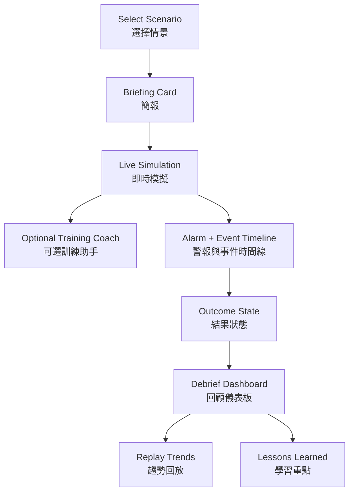
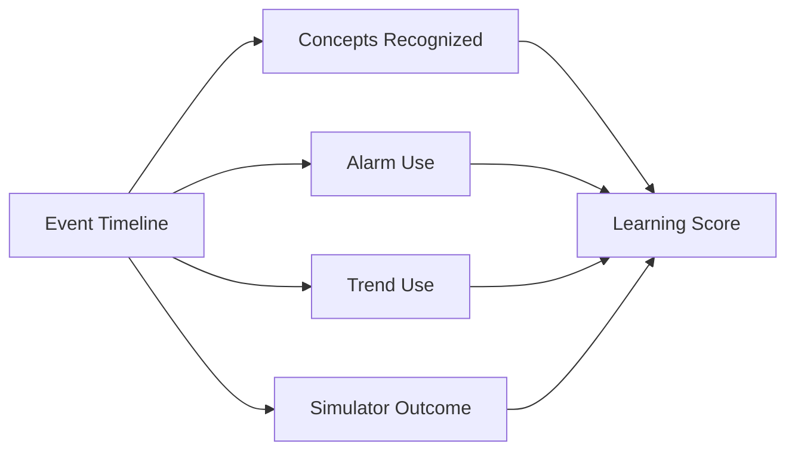

<!--
WinForge Reactor Graphics Planning Pack
Scope: educational / fictionalized nuclear power plant simulator graphics and UI planning.
Safety boundary: do not include real plant-specific setpoints, security layouts, cable routes,
exact emergency operating procedures, or real-world operating instructions. Use fictional values,
abstracted logic, and clearly marked simulation-only labels.
-->
# Plan 06 — Scenario Training Graphics

## Goal

Create a scenario system with graphics for briefing, live coaching, debrief, scoring, and replay. The scenarios should teach concepts and diagnosis, not real operating procedure execution.

## Scenario card layout

```text
+------------------------------------------------------------+
| Scenario title EN / 粵語                                   |
| Difficulty: Intro / Intermediate / Challenge               |
| Focus: heat removal | reactivity | alarms | BOP | chemistry|
| Learning objectives: 3 bullets                             |
| Starting plant state: fictional normalized state            |
| Success concept: identify trend, stabilize simulator state  |
| Button: Start simulation-only scenario                     |
+------------------------------------------------------------+
```

## Scenario flow



## Scenario categories

| Category | Example safe scenario | Graphics needed |
|---|---|---|
| Intro | heat path walkthrough | highlighted arrows and callouts |
| Alarm management | nuisance alarm flood drill | alarm sorting and priority cards |
| Secondary plant | steam/feedwater mismatch concept | turbine/SG trend overlay |
| Primary loop | pump degradation concept | primary loop state animation |
| Chemistry | boron/xenon conceptual challenge | reactivity component cards |
| Electrical | loss of non-safety support concept | power availability dashboard |
| Human factors | diagnose with incomplete trend data | channel-quality badges and debrief |

## Live coach graphic

```text
+----------------------------------------+
| TRAINING COACH / 訓練助手              |
| Observation: Heat removal is reduced   |
| Watch: secondary trend and core heat   |
| Question: Which safety function is     |
|          currently challenged?         |
| Choices: Reactivity / Core cooling /   |
|          Heat removal / Barrier        |
+----------------------------------------+
```

## Debrief dashboard



## Graphic-generation prompts

> Create a scenario briefing card set for a fictional PWR simulator. Cards should show title, difficulty, focus system, learning objectives, starting simulator state, and success concept. Bilingual English + Cantonese labels. No real operating procedures.

> Create a debrief dashboard for a training simulator showing event timeline, alarms recognized, trends opened, safety function identified, and learning score. Educational and fictional only.

## Acceptance criteria

- Each scenario has a briefing card, live state banner, event timeline, and debrief card.
- Scenario text avoids imperative real-world operating instructions.
- Debrief evaluates observation and reasoning, not memorized real procedures.
- Scenario graphics can be exported as release-note screenshots.
- Coach text can be turned off for advanced users.
