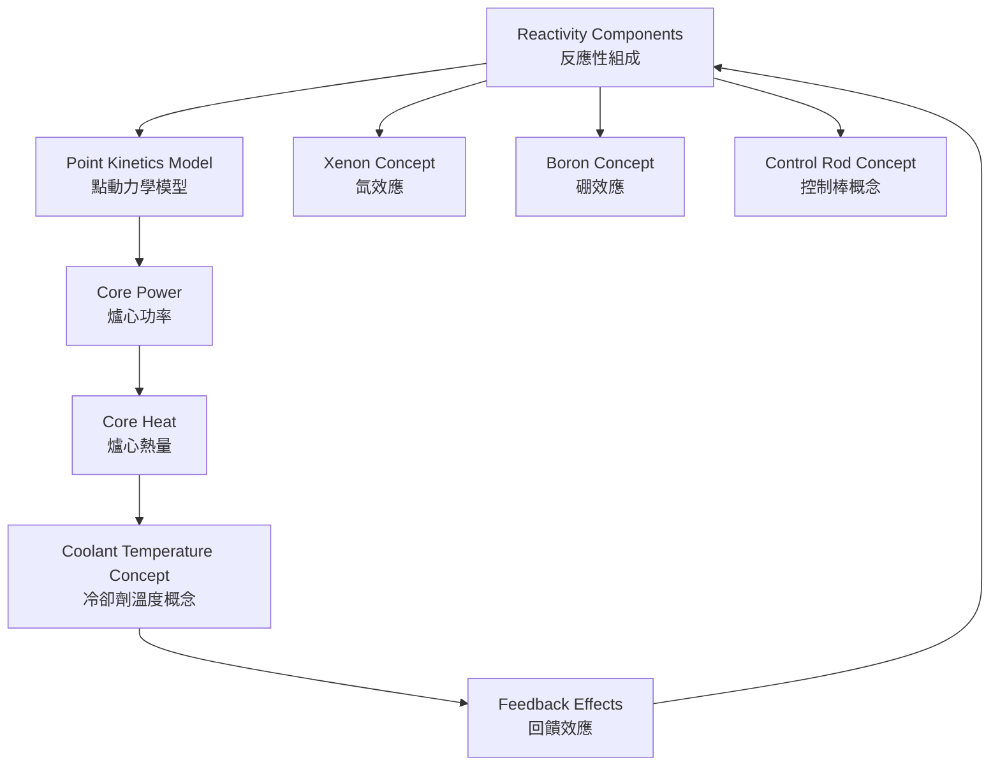
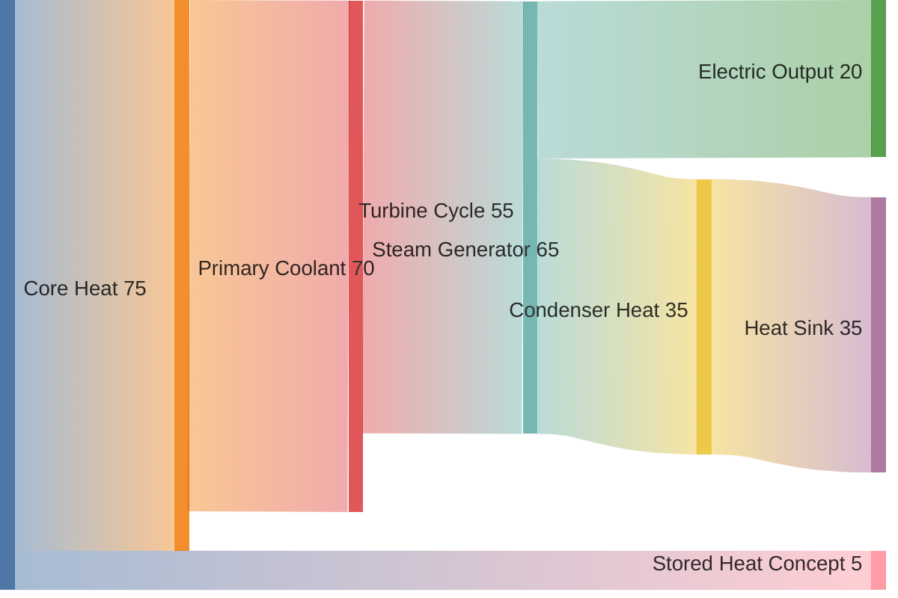

<!--
WinForge Reactor Graphics Planning Pack
Scope: educational / fictionalized nuclear power plant simulator graphics and UI planning.
Safety boundary: do not include real plant-specific setpoints, security layouts, cable routes,
exact emergency operating procedures, or real-world operating instructions. Use fictional values,
abstracted logic, and clearly marked simulation-only labels.
-->
# Plan 07 — Reactor Physics Visuals

## Goal

Add conceptual graphics that explain reactor physics already claimed by the simulator: point kinetics, reactivity feedback, xenon, boron, moderator effects, Doppler feedback, and heat transfer. The graphics should be educational and simplified.

## Physics overview graphic



## Visual cards

| Card | Visual metaphor | Safe data display |
|---|---|---|
| Point kinetics | delayed neutron groups as stacked small bars | normalized contribution only |
| Doppler feedback | fuel heat icon pushing reactivity down | qualitative arrow |
| Moderator feedback | coolant temperature icon | qualitative arrow |
| Boron | concentration beaker icon | fictional normalized level |
| Xenon | poison buildup/decay clock | relative buildup curve |
| Control rods | rods entering/exiting core | position percent only in fictional sim |

## Reactivity balance graphic

```text
+----------------------------------------------------+
| REACTIVITY BALANCE / 反應性平衡                    |
+----------------------+-----------------------------+
| Control rods         | negative / positive trend    |
| Boron concept        | negative trend               |
| Doppler feedback     | stabilizing negative trend    |
| Moderator feedback   | depends on simulator mode     |
| Xenon concept        | time-delayed negative trend   |
+----------------------+-----------------------------+
| Net simulator reactivity: LOW / NOMINAL / HIGH     |
+----------------------------------------------------+
```

## Heat balance graphic



## Time-series graphics

| Graphic | Purpose |
|---|---|
| Xenon curve | show delayed response after power changes |
| Feedback loop animation | show self-limiting feedback concept |
| Heat transfer ribbon | show thermal lag between core and secondary loop |
| Rod motion mini-graphic | show relation between user command and power response |

## Prompt templates

> Create an educational infographic explaining fictional PWR simulator reactivity balance. Include control rods, boron concept, Doppler feedback, moderator feedback, xenon concept, and net simulator reactivity. Use bilingual English + Cantonese labels. No real nuclear data, no real limits, no operational instructions.

> Create a clean heat-balance Sankey-style diagram for a fictional reactor simulator showing Core Heat → Primary Coolant → Steam Generator → Turbine Cycle → Electric Output and Condenser Heat. Use normalized percentages and simulation-only labels.

## Acceptance criteria

- A non-expert user can explain why power does not instantly follow control input.
- Physics visuals link to live simulator trends.
- Values are normalized or fictionalized.
- No real cross sections, real delayed-neutron constants, or plant-specific physics data are exposed.
- Every physics visual has a one-sentence plain-language explanation.
