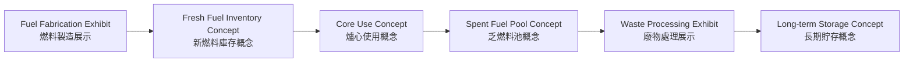
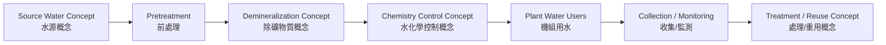

<!--
WinForge Reactor Graphics Planning Pack
Scope: educational / fictionalized nuclear power plant simulator graphics and UI planning.
Safety boundary: do not include real plant-specific setpoints, security layouts, cable routes,
exact emergency operating procedures, or real-world operating instructions. Use fictional values,
abstracted logic, and clearly marked simulation-only labels.
-->
# Plan 08 — Fuel, Waste, and Water Cycle Graphics

## Goal

Make the existing fuel factory, waste cycle, and water-treatment concepts visually coherent. These graphics should teach plant lifecycle context without implying real fuel handling or waste procedures.

## Fuel cycle overview

## Water treatment overview

## Graphics to create

| Asset | Purpose |
|---|---|
| `svg/fuel-cycle-overview.svg` | simplified lifecycle pathway |
| `svg/fuel-assembly-card.svg` | fictional fuel assembly educational card |
| `svg/spent-fuel-concept.svg` | cooling/storage concept, non-procedural |
| `svg/water-treatment-overview.svg` | source → treatment → plant use → collection |
| `svg/radwaste-concept-map.svg` | safe categories and monitoring concepts |

## UI integration

| Screen | New element |
|---|---|
| Plant overview | fuel/water/waste mini status chips |
| Facility map | fuel cycle exhibit, waste exhibit, water-treatment room |
| Scenario training | fuel/water/waste learning cards |
| Historian | water quality concept trend and inventory concept trend |

## Prompt templates

> Create a safe educational fuel cycle infographic for a fictional nuclear simulator. Show fuel fabrication exhibit, fresh fuel inventory concept, core use concept, spent fuel pool concept, waste processing exhibit, and long-term storage concept. Use bilingual labels. Do not include real procedures, real transport logistics, or sensitive material details.

> Create a water-treatment infographic for a fictional power plant simulator: source water, pretreatment, demineralization concept, chemistry control concept, plant water users, collection/monitoring, treatment/reuse concept. Use clean vector style and no real plant design details.

## Acceptance criteria

- Fuel, waste, and water graphics are educational exhibits, not instructions.
- All flows use broad concept labels.
- No real enrichment values, fuel specs, waste package specs, transport details, or access routes are shown.
- Graphics cross-link to facility map and scenario cards.
- Each graphic has a compact version for dashboard tiles.
