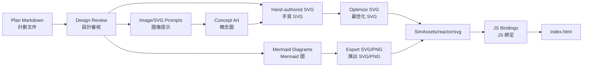

<!--
WinForge Reactor Graphics Planning Pack
Scope: educational / fictionalized nuclear power plant simulator graphics and UI planning.
Safety boundary: do not include real plant-specific setpoints, security layouts, cable routes,
exact emergency operating procedures, or real-world operating instructions. Use fictional values,
abstracted logic, and clearly marked simulation-only labels.
-->
# Plan 09 — Graphics Generator Pipeline

## Goal

Create a repeatable pipeline for turning graphics plans into assets inside `SimAssets/reactor`. The pipeline should support hand-made SVG, Mermaid-generated diagrams, JSON-driven labels, and screenshot export for documentation.

## Proposed pipeline



## Folder layout

```text
SimAssets/reactor/
  svg/
    plant/
    control-room/
    rooms/
    safety/
    instrumentation/
    training/
    physics/
    fuel-water-waste/
  css/
    reactor-graphics.css
    reactor-themes.css
  js/
    graphics-bindings.js
    graphics-historian.js
    room-navigation.js
  data/
    graphics-labels.en-yue.json
    rooms.json
    scenario-cards.json
    alarm-catalog.sim.json
```

## Asset naming convention

```text
<area>-<graphic>-<variant>.<ext>

Examples:
plant-mimic-v2.svg
control-room-overview-wall-v1.svg
alarms-dashboard-wireframe-v1.svg
training-scenario-card-intro-v1.svg
physics-reactivity-balance-v1.svg
```

## SVG ID rules

| Rule | Example |
|---|---|
| component IDs use lowercase kebab-case | `primary-loop-hot-leg` |
| status groups end with `-state` | `containment-state` |
| labels end with `-label-en` or `-label-yue` | `reactor-vessel-label-en` |
| animated groups end with `-anim` | `heat-flow-primary-anim` |
| no real equipment tags | avoid `PT-1234`, `RCP-A-REALTAG` |

## Build script concept

```text
scripts/
  render-mermaid.ps1       # optional Mermaid export helper
  optimize-svg.ps1         # optional SVGO wrapper
  validate-reactor-art.ps1 # checks labels, IDs, forbidden terms
```

## Forbidden-content validation

The validator should flag:

- real plant names or identifiers;
- exact setpoint language such as `trip at [number]`;
- physical security layout terms;
- network addresses or cyber architecture details;
- exact emergency operating procedure steps.

## Graphic metadata schema

```json
{
  "id": "plant-mimic-v2",
  "title": { "en": "Plant Mimic", "yue": "機組流程圖" },
  "area": "plant",
  "safeMode": true,
  "sourcePlan": "01_PLANT_MIMIC_GRAPHICS_PLAN.md",
  "bindings": ["plantMode", "coreHeatState", "heatRemovalState"],
  "exports": ["svg", "png"]
}
```

## Acceptance criteria

- Every graphic has metadata and bilingual labels.
- Every SVG passes ID and forbidden-content validation.
- Graphics can be rendered in light/dark modes.
- A screenshot/export mode can generate README images.
- Documentation updates happen in the same pull request as assets.
