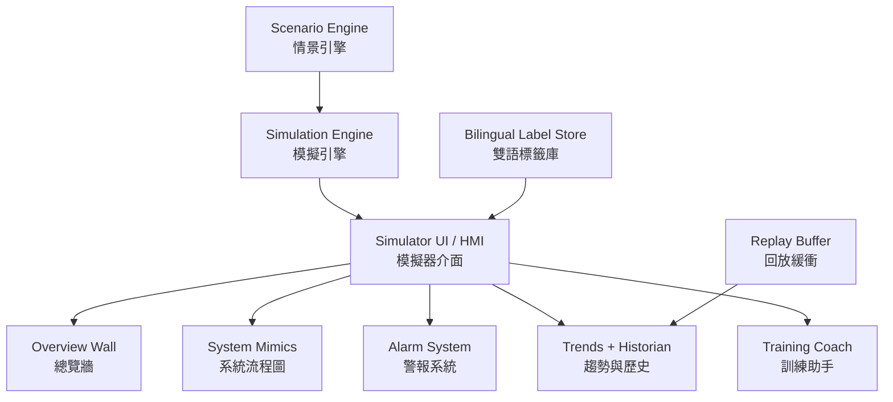

<!--
WinForge Reactor Graphics Planning Pack
Scope: educational / fictionalized nuclear power plant simulator graphics and UI planning.
Safety boundary: do not include real plant-specific setpoints, security layouts, cable routes,
exact emergency operating procedures, or real-world operating instructions. Use fictional values,
abstracted logic, and clearly marked simulation-only labels.
-->
# Plan 12 — Regulatory Realism Reference Map

## Goal

Map public nuclear-control-room design ideas into safe simulator graphics. This file is not a compliance claim. It only helps WinForge borrow public, high-level concepts for educational realism.

## Source categories to reflect safely

| Public guidance category | Safe simulator translation | Avoid |
|---|---|---|
| Human factors engineering | readable displays, consistent labels, task-based screen hierarchy | claiming certification or compliance |
| Instrumentation and control design | separation between overview, system detail, alarms, and historian | real safety logic or real setpoints |
| Control-room HMI design | overview wall, alarm prioritization, trend displays, procedure/training pane | real emergency operating procedures |
| Operator training simulator practice | scenarios, replay, debrief, instructor/coach mode | real licensing exam material |
| Cyber/physical security | simple “protected simulator boundary” icon | real security architecture or layouts |

## Feature-to-realism matrix

| WinForge feature | Realism improvement | Graphic artifact |
|---|---|---|
| Plant mimic | show process boundaries and heat path | `plant-mimic-v2.svg` |
| Alarm banner | show lifecycle: active, acknowledged, standing, cleared | `alarm-dashboard.svg` |
| Trends | show event markers and replay | `historian-replay.svg` |
| Control-room pop-out | show overview wall and workstations | `control-room-wall.svg` |
| Rooms | show educational facility cards | `facility-map.svg` |
| Scenarios | show briefing/debrief graphics | `scenario-card.svg` |
| Physics model | show feedback loops and delayed effects | `reactivity-balance.svg` |
| Fuel/waste/water | show lifecycle context | `fuel-cycle-overview.svg` |

## Safe reference architecture graphic

## Non-sensitive design rules

1. Use **functional categories** rather than real plant system names where possible.
2. Use **normalized state classes** instead of exact values.
3. Present **conceptual sequences** instead of real procedures.
4. Use **fictional training alarm IDs**.
5. Add a visible `Simulation Only / 只供模擬` tag on every screenshot-worthy screen.

## Public reference notes

Useful public documents to consult while designing safe graphics:

- IAEA, *Design of Instrumentation and Control Systems for Nuclear Power Plants* — useful for high-level I&C architecture, HMI, lifecycle, human factors, and computer security themes.
- IAEA, *Human Factors Engineering in the Design of Nuclear Power Plants* — useful for task-oriented, human-centered display planning.
- NRC NUREG-0700, *Human-System Interface Design Review Guidelines* — useful for HSI checklist thinking.
- NRC NUREG-0711, *Human Factors Engineering Program Review Model* — useful for programmatic HFE planning.

Do not copy proprietary standards text or imply formal compliance.

## Acceptance criteria

- Every regulatory-realism reference maps to a safe simulator feature.
- The app never claims to be a licensed simulator unless that is independently true.
- Graphics teach concepts, not operational execution.
- References remain in docs, not in a way that clutters gameplay screens.
