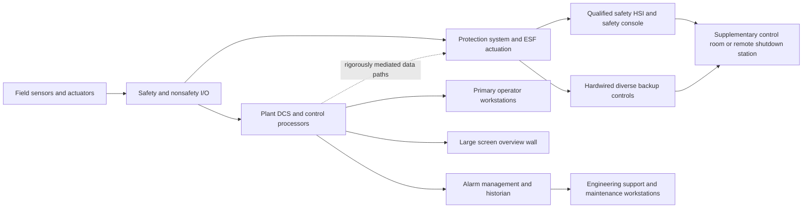

# Nuclear Power Plant Main Control Room Specification Basis

## Executive summary

This report provides a **vendor-neutral, safety-focused specification basis** for a nuclear power plant main control room and its supporting facilities, assuming the reactor type is **unspecified**. Because reactor technology was not specified, the report gives a common baseline and then highlights major variations for **pressurized water reactors**, **boiling water reactors**, and **small modular reactors**. The specification basis is intentionally framed at the level appropriate for **licensing, procurement, conceptual design, and detailed design requirements writing**, rather than as a construction drawing package or operating playbook. citeturn31view0turn33view0turn17search0turn17search1turn17search14

The **highest-priority standards stack** is built around the plant safety requirements and the I&C and human-factors standards that sit directly under them. For an international baseline, the most important documents are **IAEA SSR-2/1 Rev. 1** for plant design requirements, **IAEA SSG-39** for instrumentation and control design, **IAEA SSG-51** for human factors engineering, and **IAEA SSG-34** for electrical power systems. For control-room-specific design, the most important IEC standards are **IEC 60964** for main control room design, **IEC 61772** for display units, **IEC 61227** for operator controls, **IEC 62241** for alarm presentation, **IEC 61839** for functional analysis and allocation, **IEC 61513** for safety-related I&C architecture, **IEC 61226** for safety classification, and **IEC 61500 / 60880 / 62138 / 62340 / 62645** for communications, software, common-cause-failure countermeasures, and cybersecurity programs. In the United States, the most important regulatory anchors are **10 CFR Part 50 Appendix A** General Design Criteria, **10 CFR 50.54(m)** operator staffing, **10 CFR Part 55** operator licensing and simulator use, **10 CFR 73.54 / 73.55** digital and physical protection, and NRC human-factors guidance including **NUREG-0700** and **NUREG-0711**. In Canada, the corresponding design and operations anchors include **CNSC REGDOC-2.5.2**, **REGDOC-2.5.1**, **REGDOC-2.2.5**, **REGDOC-2.3.4**, and **REGDOC-2.6.2**. citeturn3search2turn31view0turn33view0turn3search0turn6search16turn6search2turn7search18turn7search1turn5search0turn8search0turn27search3turn25search2turn24search0turn17search13turn24search7turn38search1turn19search3turn38search7

A defensible modern architecture is a **layered hybrid control room**: a primary non-safety plant-wide HSI and DCS environment for routine operation; an **independent, qualified safety HSI/safety console** for safety-significant monitoring and manual initiation; a **hardwired or highly simple diverse backup layer** for the minimum manual safety actions needed to achieve and maintain safe shutdown; and a **physically, electrically, and functionally separate supplementary control room or remote shutdown station** capable of shutdown, residual heat removal, and monitoring if the main control room must be abandoned. This layered approach is consistent with IAEA defence-in-depth, NRC General Design Criteria, and public EPRI modernization architectures. citeturn32view1turn32view2turn26view0turn32view0turn29view0

The control room should be specified around **human performance** rather than around panels alone. That means early HFE program planning, operating experience review, formal function allocation, task analysis, staffing and qualification analysis, HSI style guides, alarm rationalization, procedure integration, verification, validation, and integrated system validation with representative operators and a plant-referenced simulator. Both the IAEA and NRC explicitly treat these as core design activities, not optional usability refinements. citeturn33view0turn34view0turn34view1turn24search0

A practical specification basis for equipment should treat field instrumentation, actuation, logic, displays, communications, and software as part of one lifecycle-managed system. Minimum specification content should cover **function, safety class, environmental qualification, seismic qualification, EMC, redundancy, diagnostic coverage, calibration method, proof-test method, maintainability, obsolescence path, cybersecurity boundary, and independence from other divisions**. This is more important than naming a vendor. citeturn31view0turn15search0turn14search1turn36search6turn12search4

The biggest design differences by reactor type are the **plant process variables, accident-monitoring displays, manual backup actions, and staffing concept**. A large PWR generally emphasizes hot-leg/cold-leg temperatures, pressurizer level/pressure, steam generator parameters, and ECCS trains around a pressurized primary loop; a BWR emphasizes reactor vessel level/pressure, main steam isolation, suppression pool, recirculation, and containment/drywell metrics in a direct-cycle plant; an SMR may use a **multi-module digital supervisory room** with stronger automation and passive safety reliance, which increases the importance of workload management, transparency of automation, and module-state overview displays. citeturn17search0turn17search1turn16search13turn16search2turn17search14turn16search3

The report **omits** exact trip setpoints, detailed actuation sequencing, security sensor placement, security response tactics, detailed cyber-architecture implementations, plant-specific network addresses, exact cable routes, or detailed emergency operating steps. Those details would materially facilitate misuse and are not necessary to define a legitimate design specification basis.

## Scope and safety boundaries

This document should be read as a **specification basis report** for the control-room complex and its support systems, not as a final design package. The exact bill of materials, quantities, cable schedules, division assignments, and environmental qualifications must be finalized only after the plant’s safety analysis, probabilistic safety assessment, hazards analysis, HFE analyses, licensing basis, and electrical/I&C architecture are frozen. That is consistent with IAEA guidance that I&C and HFE requirements flow from the plant design basis, safety classification, and task analyses, and with NRC review practice under NUREG-0711. citeturn31view0turn33view0turn24search0

The specification basis below therefore defines a **minimum complete functional envelope** for a nuclear control-room complex:
- main control room;
- safety console and minimum manual backup controls;
- supplementary control room or remote shutdown capability;
- control-room HVAC and habitability systems;
- Class 1E / safety-related power, UPS, batteries, and standby AC;
- plant process, safety, and radiation monitoring instrumentation;
- DCS, protection system, safety actuation system, historian, alarm system, and engineering support tools;
- training simulator and validation environment;
- maintenance, calibration, spares, and lifecycle management regime;
- cybersecurity and physical security interfaces; and
- emergency interfaces to SCRAM, ECCS, and post-accident monitoring. citeturn26view0turn32view0turn3search0turn18search0turn27search3turn25search2

## Regulatory and standards baseline

### Priority standards and codes to put at the top of the requirements tree

The hierarchy below reflects what should normally be placed at the top of a control-room requirements specification for a new plant or a major modernization.

| Topic | First-priority baseline | Why it matters most | Source basis |
|---|---|---|---|
| Plant design requirements | IAEA SSR-2/1 Rev. 1; NRC 10 CFR Part 50 Appendix A GDC; CNSC REGDOC-2.5.2 | Establishes control room, I&C, electrical power, shutdown, ECCS, and defence-in-depth obligations | citeturn3search2turn26view0turn17search13 |
| Safety-related I&C architecture | IAEA SSG-39; IEC 61513; IEC 61226; IEEE 603 | Establishes architecture, classification, independence, reliability, single-failure and safety system criteria | citeturn31view0turn5search0turn8search0 |
| Control room design | IEC 60964; IEC 61772; IEC 61227; IEC 62241; IEC 61839 | Covers room design, displays, controls, alarm presentation, and function allocation | citeturn6search16turn6search2turn7search2turn7search18turn7search1 |
| Human factors engineering | IAEA SSG-51; NRC NUREG-0711; NRC NUREG-0700; CNSC REGDOC-2.5.1 | Requires early HFE integration, staffing analysis, V&V, and HSI guidelines | citeturn33view0turn24search0turn24search7 |
| Safety software and digital platforms | IEC/IEEE 60880; IEC 62138; IEC 62566; IEEE 7-4.3.2 | Governs software lifecycle, FPGA development, and programmable digital devices in safety systems | citeturn5search1turn5search2turn31view0turn8search1 |
| Communication and separation | IEC 61500; IEC 60709; IEC 62340 | Covers safety communications, separation, and common-cause-failure countermeasures | citeturn28search9turn31view0 |
| Electrical power systems | IAEA SSG-34; IEEE 308; NRC RG 1.9 / IEEE 387 path | Covers offsite/onsite power, Class 1E, standby AC, testability, independence | citeturn3search0turn15search0turn14search1 |
| Fire protection | NRC NUREG-0800 Ch. 9.5 / NFPA 805 for U.S. LWRs; IAEA fire protection guides | Defines fire protection program and performance-based fire basis | citeturn3search1turn8search15 |
| Cybersecurity | 10 CFR 73.54; NRC RG 5.71 Rev. 1; IEC 62645; NIST SP 800-82 Rev. 3; NIST SP 800-53 Rev. 5; IEC 62443 | Requires protection of safety, security, emergency preparedness, and support digital assets | citeturn27search3turn2search21turn20search6turn20search5turn9search12turn20search2 |
| Staffing, licensing, and simulators | 10 CFR 50.54(m); 10 CFR Part 55; RG 1.149; CNSC REGDOC-2.2.5 | Defines minimum staffing, operator qualification, and simulator fidelity/use | citeturn21view0turn22view0turn18search0turn38search1 |
| Maintenance and lifecycle | IAEA SSG-74; ASME OM; IEEE battery maintenance practices; IAEA ageing guidance | Covers surveillance, in-service testing, maintenance, and obsolescence management | citeturn12search3turn8search2turn15search2turn15search3turn12search4 |

### Design criteria that should appear verbatim or near-verbatim in the specification

For U.S.-style design criteria, the most load-bearing requirements for the control-room complex are these:

- **GDC 13** requires instrumentation to monitor variables and systems over their anticipated ranges for normal operation, anticipated operational occurrences, and accident conditions. citeturn26view0
- **GDC 17** requires onsite and offsite electric power with sufficient independence, redundancy, capacity, and testability, including batteries and onsite distribution, assuming a single failure. citeturn26view0
- **GDC 19** requires a control room from which the unit can be operated safely in normal conditions and maintained in a safe condition under accident conditions, plus equipment outside the control room for prompt hot shutdown and potential cold shutdown if the main room is lost. citeturn26view0
- **GDC 21–24** require protection system reliability, testability, independence, fail-safe behavior, and separation from control systems. citeturn26view0
- **GDC 35–37** require ECCS capability plus inspection and testing provisions. citeturn26view0

Those criteria alone drive many of the practical requirements that follow: plant-wide monitoring, divided safety channels, independent power, qualified displays, testable manual actuation, and remote shutdown capability. citeturn26view0turn31view0

## Reference control room architecture

### Architectural concept

A robust reference architecture for a modern nuclear main control room is shown below. It blends the public EPRI layered HSI concept with IAEA defence-in-depth and NRC protection-system independence criteria. The principle is simple: **routine operation may be highly digital and integrated, but the path to safe shutdown must remain independent, qualified, simple to understand, and testable**. citeturn29view0turn32view1turn26view0



In specification language, the architecture should require:

1. **Primary plant control layer**  
   A non-safety or mixed-criticality DCS/HMI environment for routine control, non-safety systems, balance-of-plant, trending, procedures integration, and operator productivity features. Where plant licensing permits, it may also display safety information, but manual safety actuation should not depend exclusively on this layer. citeturn29view0turn31view0

2. **Qualified safety HSI layer**  
   An independent qualified display-and-control layer capable of supporting the complete range of credited manual safety functions, stable-state or safe-shutdown actions, and access to safety-significant parameters without dependence on the primary HSI. citeturn29view0turn26view0turn31view0

3. **Diverse backup actuation layer**  
   A simple, separate, highly reliable layer for the minimum manual safety actions that must remain available if higher-level digital layers fail or become unavailable. For a light-water reactor, this typically includes reactor trip initiation and key engineered safety feature initiations. The details must remain plant-specific and safety-class-specific. citeturn29view0turn26view0

4. **Supplementary control room / remote shutdown**  
   A physically, electrically, and functionally separate location from which the plant can be brought to and maintained in a safe shutdown state, with residual heat removal and essential monitoring available if the main control room is unusable. citeturn32view0turn26view0

### Control room layout and workstation concept

IEC 60964, IEC 61772, IEC 61227, IEC 62241, and IAEA SSG-39/SSG-51 all point to the same practical design logic: **centralized team coordination, minimized travel for safety-critical actions, balanced sight lines, harmonized display logic, and direct support for abnormal and accident response**. citeturn6search16turn6search2turn7search2turn7search18turn32view3turn33view0

A workable layout sketch for a large single-unit or dual-unit room is:

```text
+----------------------------------------------------------------------------------+
| Large overview wall: plant state, alarms, safety functions, trends, key barriers |
+----------------------------------------------------------------------------------+
| Shift supervisor | Reactor operator A | Reactor operator B | Turbine/BOP operator |
| workstation      | safety/primary HSI | safety/primary HSI | primary HSI          |
+----------------------------------------------------------------------------------+
| Safety console and diverse manual backup controls | procedure station | comms     |
+----------------------------------------------------------------------------------+
| Engineering support / historian / alarm analysis / maintenance support station    |
+----------------------------------------------------------------------------------+
| Controlled rear access to panels, printers, records, and route to supplementary  |
| control room / remote shutdown station                                            |
+----------------------------------------------------------------------------------+
```

The room should be specified to include, at minimum:

| Element | Minimum specification intent | Source basis |
|---|---|---|
| Operator workstations | At least one per primary operator role, with dual independent display paths where needed, soft controls only where validated, and fail-safe fallback for credited actions | citeturn32view3turn7search2turn29view0 |
| Large-screen display | Shared team overview of plant state, barriers, alarms, trends, and critical safety functions | citeturn6search2turn29view0 |
| Safety console | Qualified displays, controls, and clear one-step access to essential safety variables and safety actuation | citeturn29view0turn26view0 |
| Alarm system | Prioritized, rationalized, grouped, suppression-aware, state-based where justified, and independently reviewable | citeturn7search18turn32view3 |
| Supplementary control room | Safe shutdown, essential monitoring, alarming, route protection, and transfer of control priority | citeturn32view0turn26view0 |
| Procedure integration | Electronic procedures allowed, but with validated backup transition to paper or backup hardware | citeturn34view2 |

### Alarm philosophy and control logic

Alarm systems should be specified as a **separate engineered function**, not just a feature inside the DCS. IEC 62241 explicitly treats the main control room alarm system as a function with human-factors requirements and alarm presentation rules. Public nuclear HFE guidance also supports alarm rationalization, prioritization, suppression of nuisance alarms, and scenario-based validation. citeturn7search18turn24search0turn32view3

A sound specification should require:
- alarm philosophy document;
- alarm rationalization database;
- alarm priorities tied to operator response time and plant risk;
- first-out, standing, shelved, suppressed, and inhibited state handling;
- flood analysis and expected maximum alarm rates by scenario;
- unambiguous differentiation between **status**, **advisory**, **alert**, **alarm**, and **trip/actuation**;
- post-event alarm replay from historian; and
- V&V that includes realistic transients and plant evolutions. citeturn7search18turn24search0turn34view1

Control logic should be designed around:
- deterministic timing;
- division independence;
- one-failure tolerance for safety functions;
- clearly defined interlocks, permissives, bypasses, and override states;
- watchdogs and diagnostics;
- time synchronization;
- test modes that prevent inadvertent actuation; and
- maintainable, traceable configuration control across logic, displays, and procedures. citeturn26view0turn31view0turn8search0

## Instrumentation, digital control, and communications

### Baseline equipment schedule

A truly exhaustive instrument list is impossible without a plant design basis, but the following table is the **minimum functional specification set** that a full nuclear control room complex must cover. The schedule is intentionally vendor-neutral and avoids setpoints or plant-specific tags.

| Category | Representative devices and functions | Typical vendor-neutral specification basis | Source basis |
|---|---|---|---|
| Neutron flux and reactor power | Source range, intermediate range, power range neutron instrumentation; in-core/ex-core detectors | Redundant/divisional channels; qualified detectors; accident/environment suitability as required; response, drift, and testability specified | citeturn31view0turn36search0turn31view0 |
| Process pressure | RCS/vessel pressure, steam line pressure, ECCS header pressure, containment pressure, differential pressure | Safety class assigned by function; redundant transmitters; seismically and environmentally qualified where required; digital diagnostics allowed only if justified | citeturn26view0turn31view0 |
| Level | Pressurizer level, steam generator level, reactor vessel narrow/wide range level, tank and sump level, suppression pool level | Diverse measurement methods where risk-justified; qualified indication for accident monitoring where required | citeturn17search0turn17search1turn37search0 |
| Temperature | RTDs, thermocouples, in-core and primary-circuit temperature sensors, HVAC and room habitability temperatures | Accuracy, response time, drift, environmental qualification, replacement method, and calibration method explicitly specified | citeturn31view0turn36search6 |
| Flow | Feedwater, steam, ECCS injection, RHR, cooling water, ventilation flow, diesel fuel and lube auxiliaries | Qualified or commercial grade depending on credited function; clear straight-run and installation assumptions in procurement | citeturn3search0turn26view0 |
| Chemistry and radiological sampling | Conductivity, pH, dissolved oxygen, hydrogen, boron concentration for PWRs, stack and effluent monitors, room radiation monitors | Safety-related where credited; RMS lifecycle requirements; monitoring for normal, AOO, DBA, DEC as applicable | citeturn36search6turn13search6turn37search0 |
| Radiation monitoring | Area gamma, airborne particulate and iodine where applicable, gaseous effluent monitors, accident/post-accident monitors | RMS lifecycle requirements; continuous monitoring requirements; qualification and maintainability defined | citeturn13search6turn36search1turn37search0 |
| Actuation devices | Reactor trip breakers/logic, motor-operated valves, air-operated valves, dampers, breakers, diesel starts, pump starts | End-to-end command confirmation, fail-safe position, stroke timing, test features, manual local means, priority logic | citeturn26view0turn29view0 |
| Valve diagnostics | Position feedback, torque/thrust or travel monitoring where relevant, leak indication where relevant | Integrated with maintenance/condition monitoring but isolated from credited safety paths where needed | citeturn12search3turn8search2 |
| Post-accident / accident monitoring | Key parameters for core cooling, reactivity control, containment status, barrier integrity, releases, and actuation status | Instrumentation selected and qualified under accident-monitoring criteria | citeturn37search0turn26view0 |

### Sensors, actuators, and control valves

The specification for sensors and actuators should be **functional and qualification-based**, not brand-based. At minimum, every procurement package should require the fields below.

| Item class | Minimum technical specification fields |
|---|---|
| Sensor / transmitter | measured variable; range and turndown; accuracy; response time; long-term drift; process connection; wetted materials; EMC; environmental class; seismic qualification; functional safety / nuclear safety class; diagnostic behavior; calibration method; replacement interval assumption |
| Valve and actuator | service fluid; safety function; fail position; stroke time band; leakage class; actuator type; power/instrument-air dependency; end-position proof; torque/thrust margin; local control/indication; manual override; environmental and seismic qualification; periodic test method |
| Controller / logic module | function allocation; safety class; processing determinism; self-diagnostics; watchdog behavior; online test capability; configuration control; firmware/software lifecycle evidence; common-cause-failure mitigation |
| HMI workstation / display | location; role; qualified/non-qualified status; display hierarchy; alarm presentation rules; command confirmation; cybersecurity role; data historian access; backup behavior |
| Communication interface | endpoint classes; protocol; timing requirements; one-way or mediated bidirectional behavior; cybersecurity boundary; independence and isolation requirements; failure mode |

This style of specification is aligned with IAEA SSG-39, IEC 61513, IEC 61226, IEC 61500, IEC 60880/62138, and the related qualification and separation standards listed in the SSG-39 bibliography. citeturn31view0

### RTUs, PLCs, DCS, protection systems, historians, and software

The plant should be specified as a set of **distinct platforms with controlled interactions**, not as one “all-in-one” automation stack.

| Platform | Recommended role | Design rule |
|---|---|---|
| Reactor protection system | Automatic trip/protection logic | Highest safety classification; deterministic; independent divisions; no dependency on non-safety platforms for credited action |
| Engineered safety feature actuation system | ECCS and safety actuation demand processing | Same protective design principles as protection system; clear test and bypass controls |
| Safety display / qualified HSI platform | Qualified display and manual actuation support | Separate from primary DCS; minimal but sufficient function set; qualified data paths only |
| Primary DCS | Normal operation, BOP, non-safety system control, optimization, historian feed | High availability, not sole credited safety path |
| PLC / skid controls | Package systems such as diesel auxiliaries, HVAC skids, water treatment, radwaste subsystems | Strict interface control, cybersecurity boundary, and no unauthorized coupling to safety divisions |
| Historian / event recorder | Trends, sequence of events, post-trip replay, maintenance analytics | Time-synchronized, segregated from safety logic |
| Engineering workstation | Configuration, diagnostics, maintenance | Normally isolated; tightly controlled access; no routine continuous connection to safety divisions |
| Simulator software platform | Plant-referenced training and validation | Fidelity maintained against reference plant and scenario set |

The software basis should explicitly separate:
- **Category A / Class 1E-like software** subject to the strictest lifecycle controls;
- **Category B/C software** for lower safety categories;
- HDL/FPGA development when used in safety applications;
- commercial off-the-shelf products whose HMI consistency, training impact, and maintenance impact must be evaluated before integration. citeturn5search1turn5search2turn31view0turn34view3

### Communication buses and protocols

Safety-critical nuclear systems should not be specified by fashionable protocol names alone. The controlling requirements are **determinism, independence, separation, qualification, analyzability, and cybersecurity**. IEC 61500 covers communication in safety systems performing category A functions, while IAEA SSG-39 emphasizes architectural interfaces, separation, and defence against common-cause failure. NIST ICS guidance notes that many common industrial protocols were not designed with strong security controls and should be tightly constrained inside control networks. citeturn28search9turn32view1turn28search12turn20search5

A practical, safe specification is:

| Use case | Preferred specification posture |
|---|---|
| Safety division internal communications | Use only qualified, deterministic, documented communication methods acceptable under the safety platform and IEC 61500 requirements; minimize complexity |
| Safety-to-nonsafety data transfer | Read-mostly or rigorously mediated transfer; no uncontrolled cross-domain commands; one-way or priority-mediated interfaces preferred |
| Nonsafety process networks | Industrial Ethernet or comparable deterministic OT network with segmentation, timing specification, and cybersecurity controls |
| Package/skid systems | Protocol gateway only through controlled demarcation points; no direct vendor remote access into protected networks |
| Corporate / analytics interface | Historian replication or data diodes / one-way transfer for monitoring use cases wherever practicable |

Protocols commonly found in industrial environments include **Modbus/TCP, DNP3, EtherNet/IP, and other fieldbus/Ethernet variants**, but these should only be used in nuclear facilities where their use is justified within the plant architecture, associated security controls, and licensing basis. They should not be treated as automatically acceptable for safety-critical paths simply because they are common in industry. citeturn28search12turn20search5turn28search9turn31view0

## Supporting facilities, people, and operations

### Supporting facility systems

The control-room complex is only as robust as the facility systems that keep it habitable, powered, protected, and defensible.

| Supporting system | Minimum specification basis | Source basis |
|---|---|---|
| Control room HVAC and habitability | Separate, safety-significant design basis if credited; filtration/pressurization as required; control room access and occupancy protected under accident conditions; toxic and radiological habitability analysis included | citeturn26view0turn13search3 |
| Ventilation and confinement interfaces | Ventilation systems designed as part of confinement and contamination control strategy; interactions with radioactive release pathways analyzed | citeturn13search5turn13search18 |
| Offsite and onsite electric power | Two independent offsite circuits plus onsite emergency power and sufficient distribution independence/testability | citeturn26view0turn3search0 |
| Class 1E AC/DC and I&C power | Class 1E criteria, surveillance, documentation, and independence; batteries and chargers sized for design duty cycle | citeturn15search0turn15search21 |
| Standby AC power | Emergency diesel generators or other accepted standby sources sized, qualified, and tested for design-basis loads | citeturn14search1turn14search0 |
| UPS and batteries | Safety and nonsafety UPS segregated; maintenance and replacement program aligned with applicable IEEE practices | citeturn15search2turn15search3 |
| Fire protection | Fire protection program, barriers, detection, suppression, safe-shutdown analysis, and digital-system fire impairment handling | citeturn3search1turn8search15 |
| Radiation monitoring | Area and effluent monitoring systems with lifecycle controls and plant state coverage from normal operation through accident/post-accident as required | citeturn13search6turn36search1turn37search0 |
| Shielding | Control room dose assumptions, shielding, and route protection for access to supplementary control points | citeturn26view0turn32view3turn3search13 |
| Physical security interface | Control room and supporting digital/physical assets integrated into plant physical protection program, but without exposing sensitive implementation details | citeturn25search2turn27search3 |

### Human factors, staffing, shift pattern, and simulator requirements

The HFE program should be treated as a formal engineering discipline with the same status as I&C or electrical design. NRC NUREG-0711 identifies twelve HFE program elements, including program management, operating experience review, functional requirements analysis and function allocation, task analysis, staffing and qualifications, treatment of important human actions, HSI design, procedure development, training program development, HFE verification and validation, design implementation, and human performance monitoring. IAEA SSG-51 covers the same lifecycle from design through modification and operation. citeturn24search0turn33view0

Staffing must satisfy both the regulatory floor and the plant-specific task burden. In the United States, 10 CFR 50.54(m) still sets minimum licensed operator staffing by the number of operating units and control rooms. In Canada, the CNSC expects the licensee to establish and justify a **minimum staff complement** rather than applying one universal numeric table. For advanced reactors and SMRs, the NRC has recognized that staffing is likely to be more applicant-specific and must be supported by staffing plans and HFE evidence. citeturn21view0turn38search1turn16search7

A concise staffing basis is:

| Staffing view | Practical recommendation | Source basis |
|---|---|---|
| U.S. regulatory minimum | Use 10 CFR 50.54(m) as the minimum legal floor for licensed operators and senior operators | citeturn21view0 |
| Actual staffing basis | Derive from task analysis, workload analysis, independent verification needs, local operator actions, emergency roles, and maintenance/shift support workload | citeturn34view0turn24search0turn33view0 |
| Canadian basis | Establish a plant-specific minimum staff complement and sufficient qualified worker program | citeturn38search1turn38search7 |
| SMR basis | Assume multi-module oversight only if workload, automation transparency, HFE validation, and licensing basis support it | citeturn16search13turn16search3turn16search12 |

For reference, the U.S. minimum licensed staffing table includes, for example, **one senior operator and one operator for a single operating unit in one control room**, with higher counts as unit/control-room combinations increase. The regulation also requires a senior operator in the control room at all times for an operating fueled unit and a licensed operator or senior operator at the controls for each fueled operating unit. citeturn21view0

The training and simulator program should require:
- systematic approach to training;
- plant-referenced simulator with sufficient scope and fidelity for normal, transient, and accident conditions;
- continuing requalification;
- scenario set that covers startup, shutdown, abnormal operation, accident management interfaces, and degraded HSI states;
- HFE validation use of simulator before final implementation. citeturn22view0turn18search0turn18search11turn18search7

A plant-referenced simulator used for operator licensing or experience in the U.S. must demonstrate expected plant response to operator input and to normal, transient, and accident conditions, and its fidelity must be maintained through performance testing and discrepancy correction. citeturn22view0

## Maintenance, cybersecurity, emergency interfaces, budgets, and reactor-type variations

### Maintenance, testing, calibration, spares, and lifecycle management

IAEA guidance is explicit that maintenance, testing, surveillance, and inspection are essential to preserving the reliability and availability assumptions of the plant design, and I&C ageing and obsolescence management must be treated as an iterative lifecycle program. citeturn12search3turn12search4

A defensible maintenance specification should require the following program elements:

| Program element | Minimum requirement | Source basis |
|---|---|---|
| Preventive maintenance | Periodic maintenance plans for I&C, HVAC, power, valves, and workstations based on safety significance and vendor qualification basis | citeturn12search3turn12search4 |
| Surveillance testing | Periodic proof and surveillance testing for safety I&C and power systems, including loss-of-redundancy detection | citeturn26view0turn31view0turn8search2 |
| Calibration management | As-found/as-left records, drift trending, instrument channel monitoring where justified, and calibrated standards traceability | citeturn5search11turn12search3 |
| Spare parts strategy | Minimum onsite stock for critical modules, displays, I/O cards, processors, power supplies, batteries, network components, and room support equipment | citeturn12search4turn36search18 |
| Obsolescence management | Technology watchlist, last-time buys, qualification re-performance triggers, firmware/software support strategy | citeturn12search4turn36search18 |
| Configuration control | Single authoritative configuration baseline linking logic, HSI, procedures, as-built drawing set, simulator model, and cyber asset inventory | citeturn22view0turn20search0turn36search18 |
| Battery maintenance | Dedicated maintenance and replacement program aligned with applicable IEEE practices for vented and VRLA stationary batteries | citeturn15search2turn15search3 |

An illustrative, non-prescriptive schedule basis is:

| Frequency | Typical activities |
|---|---|
| Shift / daily | control room walkdowns, alarm health review, critical display availability, HVAC and room condition checks, significant discrepancy log review |
| Weekly / monthly | workstation health checks, historian backups, cyber log review, battery/UPS inspection, selected channel checks, valve/damper local indication verification |
| Quarterly | selected surveillance tests, network failover tests in approved windows, alarm rationalization review of nuisance rates, calibration sampling |
| Refuelling outage / planned outage | full preventive maintenance campaign, platform firmware review under configuration control, panel inspections, environmental qualification inspections, simulator alignment updates |
| Annual / biennial | licensed operator requalification cycle elements, integrated emergency drills, HFE performance monitoring review, major spare inventory refresh |

### Recommended cybersecurity controls mapped to NIST and IEC

Nuclear cybersecurity is not just “OT security with extra paperwork.” NRC rules require protection of digital systems associated with **safety-related and important-to-safety functions, security functions, emergency preparedness functions, and support systems whose compromise could affect those functions**. NIST SP 800-82 and SP 800-53 provide control families and OT guidance, while IEC 62443 and IEC 62645 provide industrial and nuclear-OT structure. citeturn27search3turn20search5turn9search12turn20search2turn20search6

| Control objective | Nuclear control-room recommendation | NIST / IEC mapping |
|---|---|---|
| Asset identification | Maintain authoritative inventory of all critical digital assets, data flows, and safety/security/emergency interfaces | NIST CM-8, PL-8; IEC 62443 asset inventory; NRC 73.54 asset identification citeturn27search3turn9search12turn20search2 |
| Zoning and conduits | Separate safety divisions, nonsafety control, maintenance, simulator, corporate, and security systems using strict zones and controlled conduits | NIST SC-7, AC-4; IEC 62443 zones/conduits; IEC 62645 programme structure citeturn20search2turn20search6turn2search21 |
| Access control | Role-based access, least privilege, two-person rule for sensitive changes where appropriate, no shared engineering credentials | NIST AC family; IEC 62443 SR 1, SR 2 citeturn9search12turn20search2 |
| Removable media and portable devices | Default deny; scanning and dedicated media control stations; no uncontrolled laptop access to protected networks | NIST MP, SI, CM; NIST 800-82 OT guidance citeturn20search5turn20search1 |
| Remote access | Avoid routine vendor remote access; if unavoidable, use temporary, brokered, monitored, one-way-where-possible access under outage controls | NIST AC, AU, SC; IEC 62443 secure remote access principles citeturn20search5turn20search2 |
| Monitoring and logging | Time-synchronized logs, security monitoring for anomalous change/activity, link to incident response | NIST AU, IR, SI; NRC cyber response expectations citeturn9search12turn20search5turn27search6 |
| Configuration and patch control | Nuclear change control for firmware/software, patch qualification testing, rollback strategy, simulator-first validation | NIST CM, SA; RG 5.71 configuration management expectations citeturn27search6turn20search5 |
| Protective architecture | Defense in depth, minimized attack surface, isolated safety systems, controlled data replication rather than live bidirectional dependence | NRC 73.54, RG 5.71, IEC 62645, IAEA computer security guidance citeturn27search3turn2search21turn20search8 |
| Recovery | Golden images, offline backups, incident playbooks, restoration drills, and safe fallback operating modes | NIST CP, IR, SI; IEC 62443 program lifecycle citeturn9search12turn20search2 |
| Training and awareness | Role-specific cyber training for operators, I&C technicians, and engineers; malicious and inadvertent action scenarios | NIST AT; RG 5.71 awareness/training expectations citeturn27search6turn9search12 |

### Emergency response and interfaces to SCRAM and ECCS

The control room must be designed so that the operators can monitor and command the plant through anticipated operational occurrences, design-basis accidents, and the transition to severe accident management if required. GDC 20 requires the protection system to initiate appropriate systems, including reactivity control; GDC 35 requires abundant emergency core cooling; GDC 19 requires a control room and remote shutdown capability; and NRC and IAEA accident-monitoring guidance require the instrument basis to support operator diagnosis and response. citeturn26view0turn37search0turn19search2

At specification level, the control room should therefore require:
- clear, diverse command path for **reactor trip / SCRAM**;
- displayed and recorded confirmation of trip status and rod/control element insertion status as applicable;
- displayed status and manual initiation capability for **engineered safety feature actuation** where credited;
- accident-monitoring display set for core cooling, reactivity control, containment/barrier integrity, essential power, and release monitoring;
- procedure system that supports escalation from normal procedures to abnormal operating procedures, emergency operating procedures, and accident/severe accident guidance;
- seamless communication interfaces to technical support center, emergency operations facility, radiation protection, and onsite emergency response teams. citeturn26view0turn37search0turn19search2turn19search19

### Reactor-type variations

| Dimension | PWR | BWR | SMR |
|---|---|---|---|
| Process overview | Indirect cycle; steam generators and pressurizer central to HSI | Direct cycle; vessel level/pressure and steam line conditions central | Often multi-module supervisory view with stronger automation and passive safety emphasis |
| Key operation displays | RCS temperatures, pressurizer level/pressure, SG levels and feedwater balance | Reactor vessel level/pressure, main steam isolation, recirculation/jet pumps, suppression pool/drywell | Module-by-module state, common systems, shared turbine/generator where applicable, passive heat removal availability |
| Typical safety monitoring emphasis | ECCS trains, SG heat removal, containment, boron/reactivity management | ECCS and ADS/containment functions, vessel inventory, suppression pool performance | Passive safety system state, module coordination, shared systems loading, operator workload across modules |
| Control-room implication | Strong NSSS/secondary-side balance displays and procedure guidance | Strong vessel-inventory and isolation logic visualization | Highest requirement for workload management, function allocation, and automation transparency |
| Public evidence used here | NRC PWR systems manual | NRC BWR systems manual | NRC/NuScale multi-module simulator and advanced staffing guidance | 
| Source basis | citeturn17search0 | citeturn17search1 | citeturn16search13turn16search2turn16search7 |

### ROM budget scenarios

These are **rough-order-of-magnitude**, not tender-ready estimates. They are inferred from public modernization references: an EPRI study cited about **$94 million** for a single-outage full-plant I&C modernization under stated assumptions, an INL/DOE project citing **$50 million DOE cost share** for a control-room modernization pilot, and older EPRI anecdotal information of about **$5.8 million per plant** for a much simpler modernization without advanced features. A full-scope simulator is also a significant financial investment and public simulator contract values show multimillion-dollar scale. citeturn29view0turn30view0turn10search0turn11search0

| Scenario | Scope | ROM 2026 USD | Basis |
|---|---|---:|---|
| Low | Limited HSI refresh, alarm rationalization, selective DCS upgrades, retention of most field instruments, minor room rework, existing simulator partial upgrade | 10M–25M | Inferred from older simpler EPRI anecdotal plant modernizations scaled to modern nuclear quality expectations citeturn29view0 |
| Medium | Hybrid control room modernization with qualified safety console, significant HFE/V&V, simulator upgrade, network and cybersecurity segmentation, moderate support-system rework | 25M–60M | Anchored by modern pilot project scale and typical large-site hybrid modernization scope citeturn30view0turn10search0 |
| High | Full-plant I&C modernization, extensive room rebuild, significant support-system upgrades, full simulator modernization, major outage integration | 60M–120M+ | Anchored by EPRI single-outage modernization estimate around 94M with allowance for scope/site variation citeturn29view0 |

These ranges should be treated as budgeting inputs only. Final cost depends heavily on existing plant architecture, number of units, safety-system digitization scope, outage strategy, simulator scope, cyber boundary redesign, and whether field instruments/actuators are replaced. citeturn29view0turn30view0

## Open questions and limitations

This report is designed to be **comprehensive but non-sensitive**. It therefore does **not** include exact trip setpoints, plant-specific wiring diagrams, security response details, exact cyber-defense configurations, exact emergency operating step logic, or physical-security sensor placement.

Several items remain inherently **plant-specific** and cannot be finalized without a reactor vendor, licensing jurisdiction, and safety analysis package:
- exact number of protection divisions and channel assignment;
- exact parameter list and ranges for accident monitoring;
- exact system-by-system controller and I/O counts;
- exact control-room furniture dimensions and sight-line geometry;
- exact minimum shift complement above the regulatory floor;
- exact habitability, shielding, and HVAC design conditions;
- exact quantity of simulator models, fidelity requirements, and instructor systems;
- exact spare parts holdings and preventive maintenance intervals. citeturn24search0turn31view0turn33view0turn38search1

Even with those limitations, the specification basis above is strong enough to support the next legitimate project stages: **owner’s requirements, design philosophy documents, HFE program plan, control-room concept of operations, procurement functional specifications, licensing strategy, and preliminary CAPEX planning**. citeturn24search0turn33view0turn29view0turn30view0