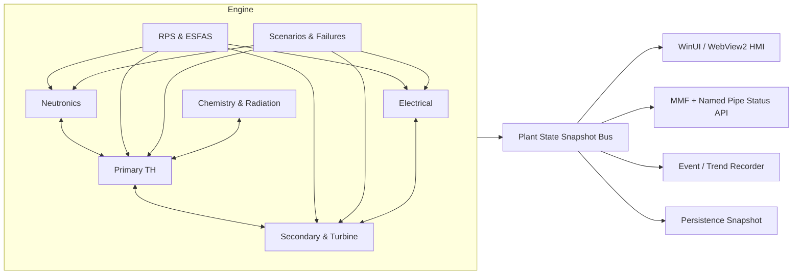
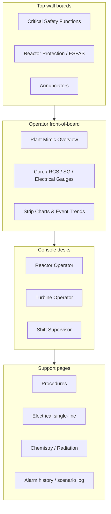

# Nuclear Power Plant Control Room Specification and WinForge Reactor Integration Plan

## Executive summary

WinForge already contains the beginnings of a serious light-water-reactor simulation: the repository’s reactor module is a WinUI “fully-simulated Pressurized Water Reactor” page with a dedicated `ReactorSimService`, generated mimic diagram, gauges, annunciators, strip charts, accident scenarios, autosave, public status API, and an optional popped-out control-room surface. The current engine models six-group point kinetics, core thermohydraulic state, pressurizer pressure control, steam generator heat removal, turbine/generator behaviour, and some engineered safety features such as SCRAM, ECCS injection, containment responses, and annunciation. However, the project’s own realism review concludes that the baseline model cannot yet sustain a stable at-power equilibrium because of integrator stability, reactivity calibration, and thermal energy-balance defects; its own test report says the reactor is “safe at rest” but still runs away if started up. citeturn29view0turn40view0turn42view0turn43view0

The most realistic and implementable path for WinForge is **not** to chase a licensing-grade plant model. It is to build a **hybrid educational full-scope simulator/game model** around a generic public four-loop Westinghouse-style PWR reference plant, with a control room that feels operationally authentic while keeping the physics modular, numerically stable, performant, and testable. The core recommendation is to move from the current monolithic service toward a layered architecture with separate modules for neutronics, primary system thermal-hydraulics, secondary side and balance-of-plant, reactor protection and ESFAS, electrical power, chemistry/radiation, scenarios/failures, and HMI projection/view models. That approach aligns with IAEA guidance on I&C architecture, defence in depth, independence, and common-cause-failure avoidance, and with NRC/INL human-factors guidance for staged control-room validation. citeturn22view2turn22view1turn22view3turn21view2turn44view1turn45view0

For facility scope, the simulation should include the main elements that public PWR references consistently show: reactor coolant system, steam generators, pressurizer, reactor coolant pumps, turbine-generator, condenser and feedwater systems, containment, residual heat removal, ECCS trains, spent-fuel and radwaste abstractions, electrical distribution and diesel-backed emergency power, chemistry and volume control, make-up water treatment, and support systems. The NRC’s PWR systems manual explicitly frames a plant as a primary system plus secondary system supported by many auxiliary systems and dedicated accident-mitigation systems, while WinForge already contains associated side modules such as water treatment, waste handling, and a reactor status API. citeturn19view0turn20view0turn20view1turn10view0turn10view1turn30view0

The proposed delivery plan is phased. First stabilise the physics and isolate the engine behind well-defined interfaces. Then implement a reference control-room information architecture, instrument catalogue, trip logic, and safety-system latches. Then expand scenarios, validation, and usability. A realistic initial roadmap is roughly **twenty-two to twenty-eight developer-weeks** for a solid single-reactor simulation vertical slice, assuming one strong full-stack .NET developer plus periodic domain-review support. That estimate is an engineering inference from the current WinForge architecture, the project’s own open defects, the amount of missing protection/HMI structure, and the simulator-validation work typically recommended in IAEA, NRC, INL, and OECD guidance. citeturn29view0turn42view0turn43view0turn34view1turn44view1turn45view0turn45view1

## Current WinForge baseline

WinForge’s reactor stack is already richer than a placeholder minigame. `ReactorModule.xaml.cs` describes the page as a “hyper-realistic PWR control room” driven by `ReactorSimService`, with a 100 ms `DispatcherTimer` driving render/update cadence, generated gauges, strip-chart recorders, a reactor protection panel, critical safety function cells, annunciators following an ISA-style ringback pattern, persistence integration, audio, and a public status API binding. The repository documentation separately describes a Westinghouse-style hard-panel layout with status banner, analog gauges, RPS channel cards, annunciator tiles, strip charts, and a WebView2/HTML5 pop-out control room. citeturn29view0turn14view0

The engine itself already exposes a broad state space. `ReactorSimService` advertises six-group point kinetics; reactivity from rods, soluble boron, Doppler, moderator temperature, and xenon; thermal-hydraulics for fuel temperature, Tcold/Thot/Tavg, primary pressure, RCP flow, steam-generator heat transfer, secondary steam pressure, turbine electrical output, and condenser; safety behaviour including SCRAM, trips, ECCS injection and relief valves; containment pressure/spray/isolation logic; leakage detection; electrical disturbances including offsite power and station blackout alarms; and scenario triggering through boundary-condition changes rather than purely scripted outcomes. The module also exposes a zero-dependency local status API over memory-mapped files and named pipes, with a documented schema version and a matching SDK client. citeturn40view0turn27view2turn40view1turn40view3turn40view5turn30view0turn15view0

The repository also contains adjacent “plant-side” abstractions that are useful for a broader facility simulation. `WaterTreatmentService` models an intake/clarifier/RO/demineraliser/degasifier chain and tracks conductivity, pH, dissolved oxygen, silica, chlorides, and storage-tank inventory. `NuclearWasteService` models on-disk spent-fuel “waste” generation with safety floors, storage caps, warnings, and background write progress. That means WinForge already has the beginnings of the **whole-facility** loop the user asked for: not just core power, but chemistry, make-up water, waste storage, and cross-process state sharing. citeturn10view1turn10view0

The constraint is that the current baseline is not yet internally consistent enough to support a convincing control room at power. The project’s own realism review says the original point-kinetics integration was unstable, the excess reactivity baseline was non-physical, and the thermal energy balance did not close, leading to “meltdown from broken arithmetic” rather than operator error; it recommends backward Euler, recalibrated rod worth and excess baseline, closed thermal balance, decay heat, better xenon, pressure/pzr modelling, and completion of missing protection functions. The test report confirms progress in some areas, including headless testing and backward-Euler stability, but also says the at-power reactivity calibration remains unfinished and that a cold core can still melt on startup because of tracked calibration defects. citeturn42view0turn43view0

## Reference facility scope and system architecture

For this project, the most practical reference plant is a **fictional, public, generic four-loop PWR**. That matches WinForge’s Westinghouse-style framing and aligns with the public NRC PWR systems material, which shows the canonical primary loop, steam generators, pressurizer, turbine-generator train, condenser/feedwater loop, containment systems, residual heat removal, and ECCS line-up for large PWRs. The purpose here is simulation fidelity and control-room credibility, not replication of any one licensed plant. citeturn14view0turn19view0turn20view0turn20view1

At a facility level, the simulation scope should be partitioned into the following public-facing plant domains:

| Domain | What the simulation should include | Why it matters in gameplay/simulation |
|---|---|---|
| Nuclear steam supply system | Core, vessel, control rods, boron, pressurizer, four RCS loops, steam generators, RCPs | Core power, temperature, pressure, shutdown margin, trips |
| Secondary and turbine cycle | Main steam, turbine governor, generator, condenser, condensate, feedwater, turbine bypass/steam dump | Load-following, turbine trips, feedwater transients, heat sink |
| Engineered safety features | RPS, ESFAS, SI, accumulators, RHR, AFW, containment isolation, containment spray | Accident response and procedural depth |
| Electrical systems | Main generator, unit auxiliary transformer abstraction, safety buses, EDGs, batteries/DC | LOOP/SBO scenarios and degraded power responses |
| Chemistry and volume control | Charging, letdown, VCT, boron, make-up, purification | Reactivity management, inventory control, leak response |
| Water treatment and support systems | Raw-water-to-ultrapure train, component cooling/service water abstractions | Support-systems gameplay and long-duration operation |
| Radiological and leakage monitoring | Sump, containment atmosphere, particulate/gaseous monitors, SGTR secondary activity | Diagnostic challenge and alarm/annunciation depth |
| Fuel, spent-fuel and waste abstractions | Fuel authenticity, loading, burnup state, waste caps | Progression systems and economy loops |
| Operations and support spaces | Main control room, remote shutdown abstraction, technical support pages, alarm/event log | Better HMI, incident review, scenario briefings |

The recommended code architecture is a **publish-subscribe plant kernel** with clear ownership boundaries:



This architecture is consistent with IAEA recommendations that overall I&C architecture preserve defence in depth, define independence between lines of defence, and explicitly address redundancy, separation, and common-cause vulnerabilities. It also better fits the way WinForge already exposes a stable wire schema through `ReactorStatusApiService`, while avoiding further growth of a single God-object service. citeturn22view2turn22view1turn22view3turn30view0

## Control room layout and human-machine interfaces

A realistic game/simulator control room should be organised around **operator tasks**, not around code classes. Public HFE guidance from the NRC, IEC, IAEA, INL, and OECD all points in the same direction: information architecture, task support, verification/validation, crew performance, and staged design evaluation matter as much as the underlying instruments themselves. NUREG-0700 is an HSI design-review guide; IEC 60964 establishes requirements for human-machine interfaces in main control rooms; IAEA SSG-51 and associated HFE guidance integrate HFE through the plant-design life cycle; INL and OECD both emphasise staged validation, operator-in-the-loop studies, and integrated system validation. citeturn21view2turn23search2turn23search26turn21view0turn21view3turn44view1turn45view0turn45view1

iturn47image0

WinForge’s own target layout is already sensible: status banner, SCRAM bar, plant mimic, analog gauges, RPS channel cards, annunciator windows, strip charts, and pop-out room tabs. That should be expanded into a deliberate room model with a **main operating console**, **safety/protection panel**, **electrical/back-up power panel**, **chemistry/radiation page**, **trend/event workstation**, and **abnormal/emergency procedures pane**. Public control-room practice also supports combining analog-style overview cues with selective digital detail, rather than flooding the operator with raw numbers. citeturn14view0turn44view0turn44view1

A recommended WinForge control-room zoning model is shown below.



### Recommended panel inventory

The following panel groups give WinForge a full-facility feel without becoming unmanageable:

| Panel group | Primary contents |
|---|---|
| Overview panel | Reactor mode, trip first-out, mission time, CSFs, main mimic, load demand |
| Reactor panel | Neutron flux ranges, reactor period, reactivity meter, rods, boron, axial offset, quadrant tilt |
| Primary system panel | Tcold, Thot, Tavg, subcooling, RCS pressure, pressurizer level, relief/safety valves, loop flows |
| Secondary/turbine panel | Steam pressure, steam flow, SG levels, feedwater, turbine speed/load, condenser vacuum |
| Safety panel | RPS channel cards, ESFAS signal matrix, SI/AFW/spray/isolation latches, interlocks |
| Electrical panel | Generator status, breaker line-up, safety buses, EDG start/loaded state, DC/battery health |
| Chemistry/radiation panel | VCT status, make-up chemistry, leak rate, containment monitors, SGTR indicators |
| Event/trend panel | Alarm chronology, first-out, procedure step tracker, trend plots, snapshots/bookmarks |

### HMI behaviour rules

The HMI should follow a few hard rules:

| Rule | Specification |
|---|---|
| Hierarchy | Always show overview first, diagnostics second, raw detail third |
| Alarm discipline | Latching first-out, acknowledge, ringback, reset; no “Christmas tree” flicker |
| Rate separation | Physics faster than HMI; display values filtered to avoid jitter except for trips |
| Colour semantics | Reserved colours only: green normal, amber degraded, red action required, blue permissive/support, grey unavailable |
| Interaction safety | Two-step actions for SCRAM reset, SI bypasses, breaker closures, mode transfers |
| Trend literacy | Every key analogue should have an accessible 15 s, 5 min, and scenario-duration trend |
| Procedural coupling | Each alarm/trip page should deep-link to a relevant procedure or operating note |

Those rules are consistent with the current WinForge annunciator state-machine approach, with NRC/IEC/IAEA control-room guidance, and with INL’s repeated use of operator-in-the-loop prototype evaluation before installing control-room changes. citeturn29view0turn21view2turn23search2turn21view0turn44view1

## Instrumentation, control logic and safety systems

The plant instrumentation model should be realistic in **type**, **range category**, **voting logic**, and **update behaviour**, but it should remain a simulation abstraction rather than a reproduction of plant procurement data. Public sources support the major categories clearly: RTDs and thermocouples for temperature, pressure detectors for RCS/pressurizer pressures, elbow-tap differential pressure for some PWR flow indications, in-core thermocouples and movable flux maps, ex-core source/intermediate/power-range neutron detectors, and diverse leakage/radiation monitoring. The same public sources also show that safety systems are redundant, multi-train, and tied to protective setpoint logic rather than free-form operator judgement. citeturn38view0turn39view4turn39view1turn39view3

### Recommended instrument catalogue

The table below gives **recommended simulation/HMI ranges** and update rates for WinForge. These are design recommendations for the game engine, derived from public PWR instrumentation categories, public generic PWR operating envelopes, and WinForge’s current exposed variables and trip functions. They are meant to feel credible in a simulator, not to reproduce a particular licensed plant’s calibration sheets. citeturn19view0turn26view2turn38view0turn39view1turn41view0

| Tag family | Public instrument type | Recommended display range | Recommended internal update | Recommended operator display update |
|---|---|---:|---:|---:|
| SR-N | BF₃ source-range proportional detector | 0 to 1e5 cps | 20 Hz | 2 Hz |
| IR-N | Gamma-compensated ion chamber | 1e-8 to 1.0 RTP equiv. | 20 Hz | 5 Hz |
| PR-N | Uncompensated ion chamber | 0 to 125% rated thermal power | 20 Hz | 10 Hz |
| RX-PER | Derived reactimeter / reactor period | -300 to +300 s shown, overflow beyond | 20 Hz | 10 Hz |
| RCS-T-HL / CL | Redundant RTDs in hot and cold legs | 20 to 360 °C | 10 Hz | 5 Hz |
| RCS-P | Pressurizer / RCS pressure transmitters | 0 to 17.5 MPa | 10 Hz | 5 Hz |
| RCS-F | Loop flow via DP/elbow taps | 0 to 110% rated flow | 10 Hz | 5 Hz |
| PZR-L | Pressurizer level narrow range | 0 to 100% | 5 Hz | 2 Hz |
| SG-L-NR | SG narrow-range level | 0 to 100% | 10 Hz | 5 Hz |
| SG-P / SG-F | Steam pressure / steam flow | 0 to 9 MPa; 0 to 120% flow | 10 Hz | 5 Hz |
| CET / ICC | Core-exit / subcooling margin inference | 0 to 650 °C; -20 to +80 °C | 10 Hz | 2 Hz |
| CTMT-P / T | Containment atmospheric monitors | 0 to 500 kPa(g); 0 to 150 °C | 5 Hz | 2 Hz |
| LEAK/RAD | Sump, particulate, noble gas, secondary activity | trend-scaled, engineering units in pages | 1 Hz | 1 Hz |
| ELEC | Bus voltage/frequency/current/breaker state | normal plus alarm bands | 10 Hz | 5 Hz |

### Protection and interlock logic

WinForge already possesses the right conceptual basis for a believable protection system: fail-safe rod release, 2-out-of-4 coincidence for key trips, permissives such as P-6/P-7/P-10/P-11-style arming conditions, and a set of public trip functions including power-range high flux, positive rate, pressurizer pressure high/low, overtemperature ΔT, overpower ΔT, low flow, steam-generator low-low level, and low steamline pressure causing safety injection. These should be formalised into a separate **RPS/ESFAS state machine layer** with channel quality flags, bypass states, test mode, and first-out logging. citeturn14view0turn41view0turn41view2

| Function | Suggested vote logic | Current WinForge basis | Recommended implementation |
|---|---|---|---|
| Reactor trip on high neutron flux | 2/4 | Present | Keep separate channel objects with noise, test, failed-high/failed-low states |
| Reactor trip on short/positive period | 2/4 or 2/2 by range | Present in alarms / power-rate logic | Separate startup-rate / period display from trip bistable |
| Overtemperature ΔT | 2/4 | Present | Implement variable setpoint object with design-bias term and permissives |
| Overpower ΔT | 2/4 | Present | Same pattern as OTΔT with clear HMI explanation |
| Low pressurizer pressure | 2/4 | Present | Model hysteresis and seal-in |
| High pressurizer pressure | 2/4 | Present | Couple to relief and code safety valve indications |
| Low RCS flow | 2/4 | Present | Loop-aware voting, degraded when pumps off/coasting |
| SG low-low level / AFW actuation | 2/3 | Present | Separate trip result from AFW start permissive and post-trip shrink/swell filtering |
| Steamline low pressure / SI | 2/4 | Present | Keep as ESFAS path, not generic trip-only path |
| Containment high pressure stages | 2/4 equivalent by train | Present | Explicit staged Hi-1/Hi-2/Hi-3 ESFAS matrix with timers and reset conditions |
| Turbine trip / P-9 reactor trip | event + permissive | Present in part | Make full interlock page visible to user |
| AMSAC / ATWS mitigation | diverse path | Present in part | Keep independent of RPS state to preserve diversity concept |

These design choices align with IAEA expectations for redundancy, independence, defence in depth, and common-cause mitigation, and with IEEE 603’s role as a minimum criteria standard for nuclear safety-system I&C. citeturn22view0turn22view1turn22view2turn22view3turn23search1turn23search10

### Safety systems to model explicitly

The NRC’s PWR systems manual gives a generic public ECCS line-up of high-pressure injection or charging, intermediate-pressure injection, accumulators, and low-pressure/residual heat removal, with the goal of core cooling and borated shutdown margin following a LOCA or related event. It also describes containment cooling/spray and residual heat removal as key post-trip functions. WinForge already represents parts of this space but should make them visible and procedurally coherent. citeturn20view1turn26view2turn40view1turn40view5

The recommended safety-system scope for WinForge is:

| System | Minimum simulation specification |
|---|---|
| Reactor Protection System | Channelised bistables, voted trips, seal-in, manual SCRAM, reset permissives |
| ESFAS / Safety Injection | SI on appropriate triggers, latched trains, RWST suction, borated injection mass balance |
| Accumulators | Passive injection when RCS pressure falls below threshold; train inventory depletion |
| AFW | Motor-driven and turbine-driven abstractions; SG recovery and heat-sink support |
| Residual Heat Removal | Low-pressure injection plus shutdown cooling mode once entry conditions are met |
| Containment isolation | Phase A and B train logic, affected penetrations, isolated auxiliaries |
| Containment spray / fan coolers | Timed actuation, pressure/temperature reduction dynamics |
| Emergency power | LOOP, EDG start, load sequencing, DC endurance, SBO degradation logic |
| Diverse actuation / AMSAC | Backup actuation path for selected scenarios |
| Critical Safety Functions | Continuous S/C/H/P/Z/I-style status trees for HMI overview |

## Model fidelity recommendations and code integration plan

### Recommended modelling approach

A simulator/game engine does not need full 3D licensing analysis to feel credible. Public guidance cuts both ways here: reactor behaviour is genuinely coupled and three-dimensional, but training simulators and educational tools still rely on appropriate model fidelity, configuration control, validation, and task fit rather than maximum physics complexity at all times. INL explicitly notes that neutron physics and thermal-hydraulics are coupled and nonlinear; the IAEA stresses simulator fidelity and structured validation; OECD/NEA recommends staged validation rather than attempting everything in one monolithic end-state. citeturn38view1turn34view1turn34view0turn45view0

| Approach | Description | Pros | Cons | Fit for WinForge |
|---|---|---|---|---|
| Lumped 0D point kinetics + lumped plant nodes | Single-core point kinetics and a few temperatures/pressures | Fast, simple, easy to tune | Weak spatial effects, hot-channel realism, procedure depth limited | Good only as baseline |
| Hybrid 0D/1D recommended | Six-group point kinetics plus hot-channel, loop-wise TH, SG inventory, containment node, electrical train models | Best realism-to-cost ratio, enough for trips/procedures/scenarios | More code and validation effort | **Recommended now** |
| Reduced nodal spatial kinetics | Few axial/radial nodal powers plus simpler TH | Better axial offset, rod-bank effects, quadrant tilt | Harder numerical coupling and QA | Good phase-two enhancement |
| Full-core 3D / CFD-style | Near-analysis-grade nodal/coupled multiphysics | Highest fidelity | Overkill for WinForge, large validation burden, performance risk | Not recommended |

The recommended **hybrid 0D/1D** fidelity stack is:

| Submodel | Recommended fidelity |
|---|---|
| Neutronics | Six delayed groups, implicit integration, rod-bank worth curves, boron worth, Doppler, MTC, xenon/iodine, startup source |
| Primary TH | Loop-wise Tcold/Thot, Tavg, reactor coolant mass/inventory, pressurizer saturation model, loop flow/coastdown, subcooling |
| Fuel / hot channel | Average channel + hot channel, centreline temperature, DNBR surrogate margin, PCT during core uncovery |
| Secondary | SG inventory, steam pressure, steam flow, feedwater temperature and flow, turbine bypass, condenser vacuum abstraction |
| Containment | One or two lumped nodes for pressure, temperature, steam condensation, spray/fan coolers, leakage source terms |
| Electrical | Generator, synchronisation, grid load demand, safety bus state, EDG load sequencing, DC battery endurance |
| Radiation / chemistry | Simplified source terms, leak-rate inference, secondary activity, VCT and make-up chemistry |

### Code-level integration points

WinForge already has the most important integration edges: a UI page, a central simulation service, persistence hooks, a local status API, and headless tests. The implementation plan should keep those strengths while reducing coupling.

**Recommended new namespaces and interfaces**

```csharp
namespace WinForge.Reactor.Core;

public interface IPlantModel
{
    PlantSnapshot Step(in PlantCommand command, double dt);
    PlantSnapshot Snapshot { get; }
    void Load(PlantSnapshot snapshot);
}

public interface IProtectionSystem
{
    ProtectionSnapshot Evaluate(in SensorBus sensors, double dt);
}

public interface IPlantEventBus
{
    void Publish<T>(T evt);
    IDisposable Subscribe<T>(Action<T> handler);
}
```

This keeps the engine deterministic and headless-friendly, which matches the repository’s existing headless test harness approach. citeturn43view0turn29view0

**Recommended module split**

| Current area | Recommended destination |
|---|---|
| Point kinetics and reactivity | `Reactor.Core.Neutronics` |
| Thermal and pressure dynamics | `Reactor.Core.ThermalHydraulics` |
| Steam/turbine/electrical | `Reactor.Core.BalanceOfPlant` |
| RPS/ESFAS logic | `Reactor.Core.Protection` |
| Chemistry and leak/radiation monitors | `Reactor.Core.Chemistry` |
| Scenario injectors | `Reactor.Core.Scenarios` |
| Snapshot DTOs and schemas | `Reactor.Contracts` |
| View mapping and alarm formatting | `Reactor.Hmi` |

### Extending the existing status API

WinForge currently publishes a schema-versioned payload with fields such as `mode`, `powerPercent`, `thermalMW`, `electricMW`, `isGenerating`, `isScrammed`, `primaryPressureMPa`, `coolantAvgC`, `reactorPeriodS`, and `activeAlarms`. That is a sound base, but it is too thin for a serious control room, telemetry page, or external scenario runner. citeturn30view0turn15view0

A proposed **schemaVersion 2** payload:

```json
{
  "schemaVersion": 2,
  "sequence": 18422,
  "timestampUtc": "2026-06-26T18:15:31.820Z",
  "mode": "Run",
  "power": {
    "neutronPercent": 99.2,
    "thermalMW": 3410.4,
    "electricMW": 1134.8,
    "decayHeatPercent": 6.8
  },
  "primary": {
    "pressureMPa": 15.52,
    "tColdC": 291.0,
    "tHotC": 325.4,
    "tAvgC": 308.2,
    "subcoolingMarginC": 27.1,
    "loopFlowPercent": 100.0,
    "pressurizerLevelPercent": 54.0
  },
  "core": {
    "periodS": 999.0,
    "reactivityPcm": -12.0,
    "shutdownMarginPcm": 1450.0,
    "axialOffsetPercent": -4.2,
    "quadrantTiltRatio": 1.00,
    "fuelCenterlineC": 1215.0,
    "hotChannelMargin": {
      "dnbrMarginPercent": 18.5,
      "pctMarginC": 999.0
    }
  },
  "secondary": {
    "steamPressureMPa": 6.6,
    "sgLevelPercent": 61.0,
    "feedwaterFlowPercent": 100.0,
    "condenserVacuumPercent": 97.0
  },
  "safety": {
    "rpsTripped": false,
    "siActuated": false,
    "afwRunning": false,
    "containmentIsolationA": false,
    "containmentIsolationB": false,
    "containmentSpray": false,
    "edgOnBus": false
  },
  "alarms": {
    "firstOut": null,
    "active": []
  }
}
```

This proposal remains fully aligned with the repository’s existing MMF/named-pipe model, stable schema philosophy, and drop-in client pattern; it simply adds the plant-structure needed for the richer control room specified in this report. citeturn30view0turn15view0

### Recommended tools and libraries

The repository already prizes zero-dependency interoperability, which is a strength. The best plan is therefore to keep the **engine core dependency-light**, and only add libraries where they clearly reduce maintenance cost. citeturn30view0turn15view0

| Tool / library | Source | Recommendation | Rationale |
|---|---|---|---|
| .NET BCL + `System.Text.Json` + `System.IO.Pipes` + MMF | Existing WinForge approach | **Keep** | Already used in status API/SDK; stable and no extra coupling |
| CommunityToolkit.Mvvm | Microsoft docs | **Adopt for HMI view models** | Good fit for complex WinUI state, commands, observable projections citeturn46search2turn46search14 |
| Math.NET Numerics | Official docs | **Optional for calibration, interpolation, fitting** | Useful for rod-worth curves, filtering, optimisation, ODE helpers without forcing a full solver rewrite citeturn46search0turn46search8 |
| OxyPlot | Official docs/project site | **Optional for engineering trends** | Lightweight cross-platform plotting if current strip charts become hard to maintain citeturn46search1turn46search5 |
| ComputeSharp | Official wiki / NuGet | **Optional, visuals only** | Good for GPU-backed mimic or heatmap effects; do not put plant safety logic on GPU citeturn46search3turn46search11 |
| Custom deterministic solver layer | In-repo | **Required** | Reactor logic needs deterministic, replayable stepping better kept under project control |

## Testing, validation, verification and delivery roadmap

### Verification and validation strategy

The repository’s existing headless harness is exactly the right seed. Keep it, expand it, and make it the authority for regression prevention. The current test report already runs pure C# sources headlessly and tracks scenario results; that should evolve into a layered V&V programme. Public simulator and HFE sources strongly support this: IAEA guidance stresses fidelity and integrated testing, INL shows prototype/operator-loop evaluation, and OECD/NEA emphasises integrated system validation and multi-stage validation rather than single-shot end testing. citeturn43view0turn34view1turn34view0turn44view1turn45view0turn45view1

Recommended V&V stack:

| Layer | What to test | Example acceptance criteria |
|---|---|---|
| Unit tests | Reactivity terms, implicit solver, valve/breaker latches, timers | Deterministic outputs, no NaNs, monotonic expectations where appropriate |
| Property tests | Conservation bounds, inventories non-negative, trip seal-in rules | Never impossible state combinations |
| Scenario tests | Startup, power ascension, load rejection, turbine trip, LOOP, LOFW, SGTR, SBLOCA, LBLOCA, SBO | Key trends and outcomes within expected envelopes |
| Golden-trace regression | Snapshot/time-series comparison for curated scenarios | No unintended drift in validated scenarios |
| HMI integration tests | Alarm sequencing, bypass labels, page routing, first-out persistence | Correct human-facing behaviour under simulated faults |
| Operator-loop formative studies | Small internal playtests against procedures/goals | No obvious human-engineering discrepancies |
| Summative validation | Multi-scenario crew/task runs at milestone phases | Design supports task completion without introducing new human-error traps |

### Performance and resource estimates

Because WinForge currently updates the page on a 100 ms timer and the current status API streams on a ~500 ms cadence, the best architecture is to **decouple solver cadence from UI cadence**. A practical target is an internal fixed-step solver at **20–50 Hz**, a UI projection update at **10 Hz**, trend logging at **2–10 Hz**, and external API streaming at **2 Hz** unless a client requests archival/trend export. This preserves responsiveness while keeping the engine deterministic and easy to replay. citeturn29view0turn30view0

Estimated runtime envelope for the recommended hybrid model on a mid-range desktop or laptop:

| Metric | Target |
|---|---|
| Solver thread time | under 4 ms per 50 Hz step average |
| UI projection / render prep | under 6 ms per 10 Hz frame average |
| Memory growth from reactor module | 120–300 MB depending on trend depth and scenario buffers |
| Save snapshot size | 50–250 KB compressed JSON equivalent |
| External status API latency | under 10 ms MMF fast path; ~500 ms subscribe cadence by default |
| Long-scenario replay storage | ~5–20 MB per hour if lossy downsampled, much larger if raw |

These are implementation estimates rather than measured benchmarks, but they are well matched to the current WinForge timing model, the headless-engine approach, and the scope of the recommended hybrid fidelity architecture. citeturn29view0turn30view0turn43view0

### Prioritised backlog

The highest-confidence backlog is the one that combines the repository’s own realism-review priorities with the architectural and HMI work needed to present them well.

| Epic | Task | Effort | Depends on |
|---|---|---:|---|
| Physics foundation | Finalise implicit point-kinetics path and remove unstable legacy paths | 3–4 days | none |
| Physics foundation | Recalibrate rod worth, excess baseline, boron and xenon equilibrium | 4–6 days | solver stability |
| Physics foundation | Close thermal energy balance with loop-wise TH state | 5–8 days | solver stability |
| Physics foundation | Add decay heat and post-trip heat-source handling | 3–5 days | thermal balance |
| Core realism | Add hot-channel / DNBR surrogate / PCT surrogate margins | 4–6 days | thermal balance |
| Protection | Split RPS/ESFAS into dedicated service with channels, votes, bypass/test | 6–9 days | stable sensors |
| Safety systems | Make SI, accumulators, AFW, RHR, spray, isolation explicit train objects | 6–10 days | protection service |
| HMI architecture | Create typed plant snapshot, view-model projection, trend/event bus | 4–6 days | module split |
| HMI ergonomics | Rebuild overview, safety, electrical, chemistry pages around task zoning | 8–12 days | snapshot layer |
| API contracts | Extend schema to v2, add backward-compatible client, document fields | 3–4 days | snapshot layer |
| Validation | Expand headless scenarios and golden traces | 5–7 days | stable modules |
| UX validation | Run staged playtests / operator-task walkthroughs and log HEDs | 4–6 days | HMI vertical slice |

A realistic phased roadmap is:

| Phase | Goal | Duration |
|---|---|---:|
| Foundation | Stable physics, clean module boundaries, reproducible snapshots | 4–6 weeks |
| Control room alpha | Overview page, safety page, trends, alarms, basic procedures | 4–5 weeks |
| Safety and scenarios | ECCS/AFW/electrical/train logic, expanded accident set | 4–6 weeks |
| Validation and polish | HED fixes, schema finalisation, performance tuning, documentation | 3–5 weeks |

That roadmap deliberately mirrors the repository’s own realism priorities while incorporating staged validation practices recommended by OECD/NEA and INL. citeturn42view0turn43view0turn45view0turn44view1

## Assumptions and limitations

This plan assumes WinForge remains a **Windows-first .NET/WinUI** application with optional WebView2 surfaces, and that the reactor remains a **public, educational, fictionalised generic PWR** rather than a plant-specific replica. It also assumes the current repository direction continues to favour a headless pure-C# engine, repository-native persistence, and the existing MMF/named-pipe local API model. citeturn29view0turn14view0turn30view0

Some details are necessarily approximate. Public primary sources are strong on architecture, safety principles, human factors, instrumentation categories, generic PWR system functions, and simulator validation, but they do **not** provide a full plant-specific calibration package, nor should this report attempt to reconstruct one. For that reason, the sensor ranges and some performance figures above are **simulation design recommendations**, not real operating instructions or procurement specifications. Likewise, this report intentionally omits construction-grade design instructions, plant-specific security details, exact emergency operating setpoints, or any step-by-step content that would enable misuse. citeturn19view0turn21view1turn21view0turn21view2turn34view1

The main open questions for implementation are straightforward and technical rather than architectural: whether the project wants one operator station or crewed multi-seat play; whether balance-of-plant systems should be fully interactive or partly automated; what minimum hardware target should be supported; how much scenario randomness is acceptable for replay determinism; and whether the control room should remain primarily WinUI-native or migrate more heavily toward the existing HTML5/WebView2 concept. Those choices affect schedule and polish, but they do not materially change the core recommendation of this report. citeturn14view0turn29view0