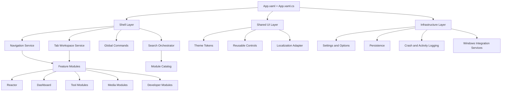
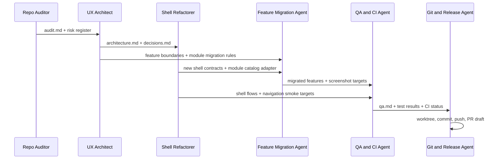

# WinForge UI Revamp Guide for a Codex Agent

## Executive summary

WinForge is already a substantial Windows desktop application rather than a thin launcher: the repository describes it as a bilingual WinUI 3 and .NET 11 control centre with 138 in-app modules, while the project file targets `net11.0-windows10.0.26100.0`, sets a minimum Windows platform version of `10.0.17763.0`, enables WinUI, and ships self-contained via the Windows App SDK. The app-level resources are currently minimal, with `App.xaml` only merging `XamlControlsResources`, which is a strong sign that theme tokens, shell styles, and per-feature visual resources are not yet modularized. citeturn6view0turn26view0turn25view0

The repository also shows that the current shell is powerful but tightly coupled. `MainWindow.xaml.cs` handles title bar configuration, fullscreen state, menu building, navigation, session restore, update notices, keyboard accelerators, background-service startup, command palette startup, clipboard monitoring, and system tray behavior from the shell layer; detached tabs are implemented through a custom `DetachedTabWindow`; and the agent guidance says that adding a module currently requires touching a page, a service, `ModuleRegistry`, `MainWindow.xaml.cs` mapping, `ApplyStartPage()`, and `MainWindow.xaml` navigation. That is workable at small scale, but at WinForge’s size it makes UI changes expensive and error-prone. citeturn4view0turn11view0turn7view0turn12view0

The recommended path is an incremental modernization, not a rewrite-from-scratch. Keep WinUI 3 as the default framework because the repository already uses WinUI 3 and Windows App SDK, and Microsoft positions WinUI 3 as the modern native Windows desktop UI framework for Windows 10 version 1809 and later. Layer on a modular shell using `CommunityToolkit.Mvvm`, .NET dependency injection, strongly typed options, and XAML resource dictionaries for design tokens. That approach minimizes migration risk while making a future Uno Platform or Avalonia port possible if OS goals later become cross-platform. citeturn14search1turn14search0turn24search0turn24search1turn22search6turn22search9

The delivery workflow should also be modernized around feature branches and worktrees. Git worktrees are specifically meant to let one repository host multiple linked working trees, and the current repository already has a single release workflow that builds and publishes releases on pushes to `main`. Because of that, the Codex agent should do all UI-revamp work in a new topic branch created through a new worktree, validate there, and push that branch upstream without force-pushing. citeturn17search0turn17search1turn9view0turn16search3turn7view0

## Repository UI audit

The current UI stack is already modern in several respects. The README describes live language switching across Bilingual, Cantonese, and English modes, a shell with navigation, search, tabs, and accessibility affordances, and a master search experience from the Dashboard. The localization service confirms the three language modes, and the Dashboard page is explicitly described as the system-summary, global-search, category-entry page. Those are good foundations for a revamp because the app already has a meaningful shell, not just standalone forms. citeturn6view0turn13view0turn13view3

The main structural problem is shell concentration. `MainWindow.xaml` is 335 lines and almost 40 KB, and the shell code-behind acts as the operational centre for window chrome, navigation, session state, startup sequencing, background agents, and tray behavior. In practice that means UI shell concerns, process-orchestration concerns, and operational concerns are all mixed together. The detached-tab implementation reinforces that point: it is featureful and useful, but it is also shell logic living directly in `MainWindow` partials rather than in a navigation workspace abstraction. citeturn25view2turn4view0turn11view0

The second major problem is feature sprawl plus multi-point registration. The `Pages` and `Services` directories are both very large, flat directories with many modules and services in the same namespace neighborhood, while the agent guidance says a new module must be registered in multiple places. `ModuleRegistry` is useful for search metadata, but it is not yet the single source of truth for feature discovery, routing, and navigation. That is the main architectural blocker to a maintainable UI revamp. citeturn21view0turn21view1turn7view0turn12view0

The theming story is another likely pain point. `App.xaml` currently merges `XamlControlsResources` and leaves placeholders for additional merged dictionaries and app resources, but there is no evidence in that entry file of a formal token system for spacing, typography, corner radii, semantic colors, pane widths, or per-feature resource dictionaries. Microsoft’s XAML resource-dictionary guidance is specifically designed for consistent reuse of styles and theme resources across an app, so WinForge is well positioned to formalize this now. citeturn25view0turn22search0turn22search6turn22search9

There are also signs of documentation and operational drift. The README says 138 modules, while `AGENTS.md` and `CLAUDE.md` describe the app as “~130” modules. The repo root shows both `.agents` and `.claude` directories, while the agent docs reference a run skill path in a way that is not fully consistent across files. That does not block development, but it means the Codex agent should verify actual checked-in paths before scripting around repo tooling. citeturn6view0turn7view0turn8view2

The testing and CI posture is currently limited for a UI modernization project. The repo contains a standalone `tests/ReactorSim.Tests` harness with `Program.cs`, and the agent docs say the reactor headless tests are run with `dotnet run --project tests/ReactorSim.Tests` and currently pass `13/15`. There is only one GitHub Actions workflow in `.github/workflows`, `release.yml`, and it builds and publishes a release on pushes to `main`. That is a release pipeline, not a pull-request-quality gate for UI changes. citeturn8view1turn7view0turn8view0turn9view0

Finally, the repo documents known UI-risk hotspots: the agent guidance explicitly says that `audioeditor`, `lightswitch`, and `timelens` crash on open, and that standard screenshot tools can mask the unpackaged app so the run-driver should be used instead. Those facts matter because the UI audit subagent must quarantine known-bad pages and must gather screenshots with the repo’s own driver or equivalent tooling rather than assuming naive screen capture will be accurate. citeturn7view0turn8view2

## Proposed modular UI architecture

The target UI framework is unspecified, so the correct move is to document three viable options and then pick one default. WinUI 3 is Microsoft’s native Windows desktop UI framework through the Windows App SDK. Uno Platform is a single-codebase .NET platform that can reuse a WinUI-compatible API surface across web, desktop, mobile, and embedded targets. Avalonia is a cross-platform .NET UI framework with its own rendering engine and broad platform coverage. Because WinForge is already a WinUI 3 app with Windows-specific integrations and a large existing XAML surface, the default recommendation is to stay on WinUI 3 for this revamp unless cross-platform compatibility becomes an explicit product requirement. citeturn14search1turn15search0turn15search3turn14search4

| Option | Best fit | Advantages | Trade-offs | Recommendation |
|---|---|---|---|---|
| WinUI 3 + Windows App SDK + CommunityToolkit.Mvvm | Windows-first revamp with lowest migration risk | Reuses current XAML, current shell, current services, current packaging model | Remains Windows-only in the near term | **Default** |
| Uno Platform | Future cross-platform roadmap while keeping a WinUI-style API | Better long-term portability with some XAML/API reuse | Adds multi-head complexity and broader CI/testing matrix | **Good fallback if cross-platform becomes required** |
| Avalonia | Broadest platform reach with a mature cross-platform model | Consistent rendering across OSes, strong portability story | Highest rewrite cost from Microsoft.UI.Xaml concepts | **Only if a deliberate rewrite is approved** |

The architecture should be split into four layers: Shell, Features, Shared UI, and Infrastructure. The shell owns top-level navigation and workspace behavior. Features own views, viewmodels, feature services, and feature resources. Shared UI owns controls, tokens, and localization adapters. Infrastructure owns settings, persistence, diagnostics, and Windows-facing integration boundaries. This matches the repo’s current strengths—localized text, reusable tweak cards, module registry metadata, and many native services—while reducing the current shell coupling. Microsoft’s MVVM Toolkit, built-in DI support, options pattern, resource dictionaries, `NavigationView`, and `TabView` all fit naturally into this shape. citeturn14search0turn24search0turn24search2turn24search1turn22search1turn22search5turn13view2turn12view0



The folder structure should be feature-first even if the migration begins incrementally. The important rule is that new work goes into modular folders first, and legacy shell wiring is adapted to consume them until enough surface area has been migrated to collapse old paths.

```text
WinForge/
  UI/
    Shell/
      ShellView.xaml
      ShellView.xaml.cs
      ShellViewModel.cs
      NavigationService.cs
      WorkspaceService.cs
    Shared/
      Controls/
      Theming/
        Tokens.xaml
        Typography.xaml
        Shell.xaml
      Localization/
        LocalizationAdapter.cs
  Features/
    Dashboard/
      DashboardPage.xaml
      DashboardPage.xaml.cs
      DashboardViewModel.cs
      DashboardModule.cs
    Reactor/
      ReactorModule.xaml
      ReactorModule.xaml.cs
      ReactorViewModel.cs
    Settings/
      SettingsPage.xaml
      SettingsPage.xaml.cs
      SettingsViewModel.cs
  Infrastructure/
    Hosting/
    Configuration/
    Diagnostics/
    Persistence/
  Tests/
    Unit/
    E2E/
```

A key design rule for this revamp is to introduce a single source of truth for module metadata and navigation. The repo’s existing `ModuleRegistry` already stores tag, English, Chinese, glyph, and keywords for search, so the least-disruptive modernization is to evolve that into a richer module-descriptor catalog instead of continuing to split those concerns across `ModuleRegistry`, `MainWindow.xaml`, `MapType()`, and `ApplyStartPage()`. citeturn12view0turn7view0

```csharp
// Recommended incremental replacement for scattered module registration.
// Keep the existing tags so --page aliases and saved sessions remain stable.

public sealed record ModuleDescriptor(
    string Tag,
    string Route,
    string TitleEn,
    string TitleZh,
    string Glyph,
    Type ViewType,
    Func<IServiceProvider, object?>? ParameterFactory = null,
    bool IsExperimental = false,
    bool IsEnabledByDefault = true);

public interface IModuleCatalog
{
    IReadOnlyList<ModuleDescriptor> All { get; }
    ModuleDescriptor? FindByTag(string tag);
    ModuleDescriptor? FindByRoute(string route);
}

public sealed class ModuleCatalog : IModuleCatalog
{
    private readonly IReadOnlyList<ModuleDescriptor> _all =
    [
        new("dashboard", "dashboard", "Dashboard", "概覽", "\uE80F", typeof(DashboardPage)),
        new("reactor", "reactor", "Reactor", "反應堆", "\uE9CA", typeof(ReactorModule)),
        new("settings", "settings", "Settings", "設定", "\uE713", typeof(SettingsPage))
    ];

    public IReadOnlyList<ModuleDescriptor> All => _all;
    public ModuleDescriptor? FindByTag(string tag) =>
        _all.FirstOrDefault(x => string.Equals(x.Tag, tag, StringComparison.OrdinalIgnoreCase));
    public ModuleDescriptor? FindByRoute(string route) =>
        _all.FirstOrDefault(x => string.Equals(x.Route, route, StringComparison.OrdinalIgnoreCase));
}
```

The default implementation framework should be WinUI 3 plus `CommunityToolkit.Mvvm`, .NET Generic Host, and options-bound configuration. The MVVM Toolkit is explicitly intended as a modular MVVM library, and .NET’s built-in DI and options pattern exist to eliminate hard-coded dependencies and to isolate configuration by scenario. citeturn14search0turn24search0turn24search1turn24search2

```csharp
using CommunityToolkit.Mvvm.ComponentModel;
using CommunityToolkit.Mvvm.Input;
using Microsoft.Extensions.DependencyInjection;
using Microsoft.Extensions.Hosting;

public partial class App : Application
{
    public static IHost Host { get; private set; } = default!;

    public App()
    {
        var builder = Microsoft.Extensions.Hosting.Host.CreateApplicationBuilder();

        builder.Services.AddSingleton<IModuleCatalog, ModuleCatalog>();
        builder.Services.AddSingleton<IThemeService, ThemeService>();
        builder.Services.AddSingleton<ILocalizationService, LocalizationServiceAdapter>();
        builder.Services.AddSingleton<INavigationService, NavigationService>();
        builder.Services.AddSingleton<IWorkspaceService, WorkspaceService>();

        builder.Services.AddSingleton<ShellViewModel>();
        builder.Services.AddTransient<DashboardViewModel>();
        builder.Services.AddTransient<SettingsViewModel>();

        Host = builder.Build();
        this.InitializeComponent();
    }
}

public partial class ShellViewModel : ObservableObject
{
    private readonly IModuleCatalog _catalog;
    private readonly INavigationService _navigation;

    public IReadOnlyList<ModuleDescriptor> Modules { get; }

    [ObservableProperty]
    private ModuleDescriptor? selectedModule;

    public ShellViewModel(IModuleCatalog catalog, INavigationService navigation)
    {
        _catalog = catalog;
        _navigation = navigation;
        Modules = catalog.All;
        SelectedModule = Modules.FirstOrDefault(x => x.Tag == "dashboard");
    }

    [RelayCommand]
    private void Navigate(string tag)
    {
        var module = _catalog.FindByTag(tag);
        if (module is null) return;

        SelectedModule = module;
        _navigation.Navigate(module);
    }
}
```

The revamp should also formalize design tokens. XAML resource dictionaries and theme resources are the right native mechanism for making colors, brush semantics, spacing, radii, and shell sizing consistent across a WinUI app, and `Application.Resources` makes those values available app-wide. citeturn22search0turn22search6turn22search9turn22search15

```xml
<!-- UI/Shared/Theming/Tokens.xaml -->
<ResourceDictionary
    xmlns="http://schemas.microsoft.com/winfx/2006/xaml/presentation"
    xmlns:x="http://schemas.microsoft.com/winfx/2006/xaml">

    <x:Double x:Key="Space.100">4</x:Double>
    <x:Double x:Key="Space.200">8</x:Double>
    <x:Double x:Key="Space.300">12</x:Double>
    <x:Double x:Key="Space.400">16</x:Double>
    <x:Double x:Key="Space.600">24</x:Double>

    <CornerRadius x:Key="Radius.Card">12</CornerRadius>
    <Thickness x:Key="Shell.PagePadding">24</Thickness>
    <x:Double x:Key="Shell.NavPaneWidth">320</x:Double>

    <SolidColorBrush x:Key="Brush.SurfacePrimary" Color="{ThemeResource CardBackgroundFillColorDefaultBrush}" />
    <SolidColorBrush x:Key="Brush.SurfaceSecondary" Color="{ThemeResource LayerFillColorDefaultBrush}" />
</ResourceDictionary>
```

```xml
<!-- App.xaml -->
<Application.Resources>
    <ResourceDictionary>
        <ResourceDictionary.MergedDictionaries>
            <XamlControlsResources xmlns="using:Microsoft.UI.Xaml.Controls" />
            <ResourceDictionary Source="UI/Shared/Theming/Tokens.xaml" />
            <ResourceDictionary Source="UI/Shared/Theming/Typography.xaml" />
            <ResourceDictionary Source="UI/Shared/Theming/Shell.xaml" />
        </ResourceDictionary.MergedDictionaries>
    </ResourceDictionary>
</Application.Resources>
```

One concrete shell simplification is worth calling out. WinForge currently implements detached tabs through `TabDroppedOutside` and a custom detached-window class. The WinUI documentation says `TabView` gained `CanTearOutTabs` support in Windows App SDK 1.6 and later for a more integrated drag-out flow. Since WinForge targets a modern Windows App SDK package already, the revamp should evaluate whether custom tear-out logic can be reduced to a thinner wrapper over built-in behavior. citeturn11view0turn22search5turn27view0

## Subagents and communication protocol

WinForge already carries AI-agent guidance files and agent-related folders in the repo root, which means a Codex-driven workflow fits the repository’s existing operating model. At the same time, the repo’s agent docs show some path and convention drift, so this UI-revamp run should define explicit subagents and a strict handoff format instead of relying on informal agent memory. citeturn6view0turn7view0turn8view2

| Subagent | Primary responsibility | Inputs | Outputs | Hard constraints |
|---|---|---|---|---|
| Repo Auditor | Audit current shell, navigation, theming, localization, and feature wiring | `AGENTS.md`, `README.md`, `App.xaml`, `MainWindow*`, `Pages/`, `Services/` | `docs/ui-revamp/audit.md`, risk register, file map | Must not change production code |
| UX Architect | Define target IA, shell layout, token system, and feature boundaries | Audit output, WinUI docs, localization constraints | `docs/ui-revamp/architecture.md`, Mermaid diagrams, folder map | Must preserve current module tags and deep-link aliases unless approval is recorded |
| Shell Refactorer | Extract shell state, navigation, tabs, and command orchestration into modular services | Architecture spec, current shell files | new shell services, viewmodels, token dictionaries | Must not break `--page` navigation, fullscreen, tabs, tray semantics |
| Feature Migration Agent | Pilot-migrate representative modules to the new pattern | Module catalog, shell refactor, selected modules | migrated feature folders, adapter glue | Avoid reactor physics changes unless shell work absolutely requires it |
| Localization and Accessibility Agent | Preserve bilingual/Cantonese/English behavior and improve accessibility states | `Loc`, `LocalizedText`, shell pages | localization adapter, accessibility acceptance notes, screenshot evidence | Must not introduce English-only UI strings in the shell |
| QA and CI Agent | Add build/test/a11y validation and artifact collection | existing workflow, run-winforge tooling, test docs | PR workflow, smoke tests, result artifacts | Keep release pipeline isolated from PR validation |
| Git and Release Agent | Prepare worktree, branch, commits, PR text, and push | all completed artifacts | clean branch history, pushed branch, PR description draft | Never force-push; never push directly to `main` |

The communication protocol should be file-first and deterministic. Every subagent writes to `docs/ui-revamp/` and uses the same artifact names: `audit.md`, `architecture.md`, `decisions.md`, `tasks.md`, `qa.md`, and `progress.md`. Every handoff entry should include the changed files, rationale, open risks, and a concrete acceptance statement. This matters especially in WinForge because the repo itself flags the reactor area as the most complex subsystem, documents unfinished realism work, and lists specific module pages that currently crash. citeturn7view0turn8view2



Two operating safeguards should be mandatory. First, the subagents should quarantine `audioeditor`, `lightswitch`, and `timelens` from broad auto-navigation smoke tests until those crashes are explicitly addressed. Second, anything touching the reactor should be limited to shell-hosting, layout, and style boundaries unless a separate reactor-specific plan is approved, because the repo’s own guidance says that the reactor simulation itself is a high-complexity area with known unfinished calibration work. citeturn7view0turn8view2

## Goals, success criteria, and task roadmap

The current baseline is clear enough to set explicit goals. The repo’s documented build path is `dotnet build WinForge.sln -c Debug -p:Platform=x64`, its distributable run path is self-contained `dotnet publish`, and its existing automated test path is the standalone reactor harness. .NET’s testing guidance supports running test projects through `dotnet test`, and Accessibility Insights for Windows provides FastPass and Live Inspect for desktop accessibility checks. That gives the revamp a concrete “done” definition instead of subjective visual approval alone. citeturn6view0turn7view0turn19search1turn23search0turn23search2

The Codex agent should treat the revamp as successful only when all of the following are true:

- The shell builds successfully with the repo’s documented Debug x64 build command. citeturn6view0turn7view0
- The app still publishes successfully as a self-contained `win-x64` build. citeturn6view0turn9view0
- Top-level shell flows still work: title bar, main navigation, search entry, tabs, detached-tab or tear-out behavior, language switching, and tray lifecycle. citeturn4view0turn11view0turn13view0
- The shell uses modular resource dictionaries and viewmodel-driven navigation rather than shell code-behind as the only orchestration point. citeturn25view0turn14search0turn24search0
- The revamp introduces at least one PR-validation workflow distinct from the current release-on-`main` workflow. citeturn8view0turn9view0turn20search0
- Accessibility checks are run against the updated shell with Accessibility Insights for Windows FastPass and Live Inspect on representative screens. citeturn23search0turn23search2
- The topic branch is created in a linked worktree and pushed upstream without force-pushing. citeturn17search0turn17search1turn16search3turn7view0

| Priority | Task | Estimated effort | Owner | Dependencies | Definition of done |
|---|---|---:|---|---|---|
| P0 | Create worktree, branch, and revamp working docs | 0.5 day | Git and Release Agent | None | Worktree exists, branch tracks remote, `docs/ui-revamp/` committed |
| P0 | Produce shell and module audit | 1 day | Repo Auditor | Worktree | File map, risks, and screenshots or code evidence recorded |
| P0 | Define target architecture and migration rules | 1 day | UX Architect | Audit | Architecture doc, diagrams, and decision log committed |
| P0 | Extract design-token dictionaries | 0.5–1 day | Shell Refactorer | Architecture | `App.xaml` merges token dictionaries and shell styles load correctly |
| P0 | Introduce DI host and shell viewmodel | 1–2 days | Shell Refactorer | Architecture | Navigation and shell state resolved through services/viewmodels |
| P1 | Introduce module catalog single-source adapter | 1 day | Shell Refactorer | Shell VM | Search, routing, and nav metadata read from one catalog |
| P1 | Migrate dashboard plus one settings-like module | 1–2 days | Feature Migration Agent | Shell VM, module catalog | Two representative modules use new pattern end-to-end |
| P1 | Preserve localization and accessibility semantics | 1 day | Localization and Accessibility Agent | Shell VM | Bilingual/Cantonese/English shell validated; focus and names reviewed |
| P1 | Add unit-test project for shell and catalog | 0.5–1 day | QA and CI Agent | Module catalog | `dotnet test` passes on at least one new unit-test project |
| P1 | Add PR validation workflow | 0.5 day | QA and CI Agent | Unit tests | Build/test workflow runs on PRs without creating releases |
| P2 | Evaluate replacing custom tab tear-out with native API | 0.5–1 day | Shell Refactorer | Shell VM | Decision recorded and implemented or explicitly deferred |
| P2 | Prepare commit series, PR text, and push branch | 0.5 day | Git and Release Agent | All prior tasks | Branch pushed, PR description ready, history readable |

## Codex execution runbook

Because the current repository auto-builds and publishes releases on pushes to `main`, all revamp work should happen in a feature branch created through a linked worktree. Git’s `worktree` model is designed precisely for parallel working trees on one repository, and `git push -u origin HEAD` is the cleanest way to publish the current topic branch and set upstream tracking in one step. citeturn9view0turn17search0turn17search1turn16search2turn16search3

Use this branch naming convention for the UI revamp: `codex/ui-shell-foundation`, `codex/ui-theme-tokens`, or `codex/ui-revamp-main-shell`. Keep names lowercase and kebab-case. Use an English branch name even though the repo has bilingual commit-message conventions; the goal is predictable Git ergonomics for the agent run. The repo’s own guidance says never to force-push and to merge into `main` rather than push directly there. citeturn7view0turn8view2

```powershell
# Preparation
git fetch origin --prune
git switch main
git pull --ff-only origin main

# Worktree + branch
$Branch = "codex/ui-revamp-main-shell"
$Worktree = "..\worktrees\winforge-ui-revamp-main-shell"
git worktree add -b $Branch $Worktree origin/main
git worktree list

Set-Location $Worktree
git status
```

Before changing code, create the revamp documentation folder and capture a deterministic audit. The repo’s own guidance says to read `AGENTS.md`, use the documented build and publish commands, and verify how the run-winforge tooling is actually laid out in the checked-in tree rather than assuming the docs are fully current. citeturn7view0turn8view2turn6view0

```powershell
New-Item -ItemType Directory -Force docs\ui-revamp | Out-Null
@"
# UI Revamp Audit
- Date: 2026-06-28
- Branch: $Branch
- Scope: shell, theming, navigation, feature modularization
"@ | Set-Content docs\ui-revamp\audit.md

# Optional repo search helpers
rg "NavigationView|TabView|ApplyStartPage|MapType|ModuleRegistry|Loc\.I|LocalizedText" .
rg "audioeditor|lightswitch|timelens" AGENTS.md CLAUDE.md docs -n
rg "run-winforge|driver.ps1" . -n
```

Implement the revamp in this order. First formalize theme tokens and merged dictionaries. Then introduce a shell viewmodel plus DI host wiring. Then add the module-catalog abstraction. Then migrate the dashboard and one lower-risk module. Only after those pieces are stable should you touch tab tear-out behavior or deeper feature migrations. That order directly addresses the repo’s current shell coupling and multi-point module registration cost. citeturn25view0turn4view0turn7view0turn12view0

```powershell
# Suggested file scaffolding
New-Item -ItemType Directory -Force UI\Shell | Out-Null
New-Item -ItemType Directory -Force UI\Shared\Theming | Out-Null
New-Item -ItemType Directory -Force UI\Shared\Localization | Out-Null
New-Item -ItemType Directory -Force Features\Dashboard | Out-Null
New-Item -ItemType Directory -Force Features\Settings | Out-Null
New-Item -ItemType Directory -Force Infrastructure\Hosting | Out-Null
```

Use these implementation examples as the starting point for real code changes.

```csharp
// Infrastructure/Hosting/AppHost.cs
using Microsoft.Extensions.DependencyInjection;
using Microsoft.Extensions.Hosting;

namespace WinForge.Infrastructure.Hosting;

public static class AppHost
{
    public static IHost Build()
    {
        var builder = Host.CreateApplicationBuilder();

        builder.Services.AddSingleton<IModuleCatalog, ModuleCatalog>();
        builder.Services.AddSingleton<IThemeService, ThemeService>();
        builder.Services.AddSingleton<INavigationService, NavigationService>();
        builder.Services.AddSingleton<IWorkspaceService, WorkspaceService>();
        builder.Services.AddSingleton<ILocalizationService, LocalizationServiceAdapter>();

        builder.Services.AddSingleton<ShellViewModel>();
        builder.Services.AddTransient<DashboardViewModel>();
        builder.Services.AddTransient<SettingsViewModel>();

        return builder.Build();
    }
}
```

```csharp
// UI/Shared/Localization/LocalizationServiceAdapter.cs
namespace WinForge.UI.Shared.Localization;

public interface ILocalizationService
{
    string Pick(string en, string zh);
    AppLanguage CurrentLanguage { get; }
}

public sealed class LocalizationServiceAdapter : ILocalizationService
{
    public string Pick(string en, string zh) => Loc.I.Pick(en, zh);
    public AppLanguage CurrentLanguage => Loc.I.Language;
}
```

```xml
<!-- UI/Shell/ShellView.xaml -->
<muxc:NavigationView
    x:Name="NavView"
    IsBackButtonVisible="Collapsed"
    OpenPaneLength="{StaticResource Shell.NavPaneWidth}">
    <muxc:NavigationView.MenuItemsSource>
        <x:Bind ViewModel.Modules, Mode=OneWay />
    </muxc:NavigationView.MenuItemsSource>
</muxc:NavigationView>
```

The repo’s documented build and publish commands should remain the authoritative smoke-check commands during the migration, and the current reactor harness should continue to run as-is. For new unit tests, use `dotnet test`; MSTest is a Microsoft-supported, cross-platform framework with good IDE integration, and xUnit v3 is also a viable option if the team prefers it. For end-to-end testing, use Appium Windows Driver for native shell flows and Playwright .NET for WebView2 or HTML-based surfaces such as the reactor UI. citeturn6view0turn7view0turn19search6turn18search17turn28search0turn18search2turn18search10

```powershell
# Build
dotnet restore
dotnet build WinForge.sln -c Debug -p:Platform=x64

# Existing headless harness
dotnet run --project tests\ReactorSim.Tests

# Self-contained publish
dotnet publish WinForge.csproj -c Release -p:Platform=x64 -r win-x64 --self-contained true -p:WindowsAppSDKSelfContained=true -p:WindowsPackageType=None

# Future unit tests after you add them
dotnet test tests\WinForge.UI.Tests\WinForge.UI.Tests.csproj
```

For desktop accessibility, do not stop at visual inspection. The best low-friction path is to run Accessibility Insights for Windows on the updated shell and capture FastPass plus a few Live Inspect checks for the main navigation, search, the dashboard, a representative settings page, and the tab strip. That fits the repo’s existing accessibility intent and gives the PR concrete evidence. citeturn6view0turn23search0turn23search2

When the branch is ready, commit in small, reviewable slices. Because the repo guidance says commit messages are bilingual, the safest compromise for an English-language Codex run is an English conventional-commit style subject with an optional bilingual second line or body summary. citeturn7view0turn8view2

```text
feat(ui-shell): extract navigation shell into DI-backed viewmodel

Refactors MainWindow shell responsibilities into ShellViewModel and NavigationService.
保留現有模組 tag 同深連結，同時將外殼狀態模組化。
```

```text
feat(ui-theme): add app-wide token dictionaries and shell styles

Adds merged ResourceDictionaries for spacing, radii, typography, and shell resources.
加入可重用主題 token，同步為之後逐步搬遷模組做準備。
```

```text
test(ui-shell): add module-catalog and shell-navigation coverage

Adds MSTest coverage for catalog lookup and selection-driven navigation behavior.
加入 UI 外殼基礎測試，減少之後重構回歸風險。
```

Use this PR description template so the review stays operationally useful.

```markdown
## Summary
Revamps the WinForge shell toward a modular UI architecture without changing the app's Windows-first platform choice.

## Why
- Current shell responsibilities are concentrated in `MainWindow`
- Module registration is split across multiple files
- App-wide theme tokens and PR validation were missing

## What changed
- Added DI-backed shell services and `ShellViewModel`
- Added token-based ResourceDictionaries
- Introduced a single-source module catalog adapter
- Migrated Dashboard and Settings pilot surfaces
- Added PR validation workflow

## How tested
- `dotnet build WinForge.sln -c Debug -p:Platform=x64`
- `dotnet run --project tests/ReactorSim.Tests`
- `dotnet publish WinForge.csproj -c Release -p:Platform=x64 -r win-x64 --self-contained true -p:WindowsAppSDKSelfContained=true -p:WindowsPackageType=None`
- Accessibility Insights for Windows FastPass on shell screens

## Screenshots
- Dashboard
- Navigation pane
- Tabs / detached-tab or tear-out flow
- Language switcher

## Risks
- Known crash-prone modules remain quarantined from broad nav smoke tests
- Reactor simulation logic intentionally untouched except shell-hosting boundaries

## Checklist
- [ ] No direct push to `main`
- [ ] No force-push
- [ ] Release workflow unchanged or intentionally updated with approval
- [ ] Docs under `docs/ui-revamp/` updated
```

The CI posture should be split into validation and release. GitHub workflow files belong in `.github/workflows`, the current repo already uses that directory, `actions/checkout` checks out the repository into `$GITHUB_WORKSPACE`, and `actions/setup-dotnet` sets up a .NET CLI environment. The repo currently has only `release.yml`, so add a separate PR validation workflow rather than overloading the release pipeline. citeturn20search0turn20search1turn20search2turn20search15turn8view0turn9view0

```yaml
# .github/workflows/ui-validation.yml
name: UI Validation

on:
  pull_request:
    branches: [main]
  push:
    branches-ignore: [main]

jobs:
  build-test:
    runs-on: windows-latest

    steps:
      - name: Checkout
        uses: actions/checkout@v4
        with:
          fetch-depth: 0

      - name: Set up .NET
        uses: actions/setup-dotnet@v4
        with:
          dotnet-version: '11.0.x'

      - name: Restore
        run: dotnet restore

      - name: Build Debug x64
        run: dotnet build WinForge.sln -c Debug -p:Platform=x64 --no-restore

      - name: Reactor harness
        run: dotnet run --project tests/ReactorSim.Tests

      - name: Unit tests
        run: |
          if (Test-Path tests/WinForge.UI.Tests/WinForge.UI.Tests.csproj) {
            dotnet test tests/WinForge.UI.Tests/WinForge.UI.Tests.csproj --logger trx
          } else {
            Write-Host "UI unit-test project not present yet; skipping."
          }
        shell: pwsh

      - name: Publish self-contained x64
        run: >
          dotnet publish WinForge.csproj
          -c Release
          -p:Platform=x64
          -r win-x64
          --self-contained true
          -p:WindowsAppSDKSelfContained=true
          -p:WindowsPackageType=None

      - name: Upload test results
        if: always()
        uses: actions/upload-artifact@v4
        with:
          name: ui-validation-results
          path: |
            **/TestResults/**
            docs/ui-revamp/**
```

When you are satisfied with the branch, push it and set the upstream in one step. The repo guidance says never to force-push; the official Git docs describe `git push <remote> <branch>` as the simplest push form, and `git push -u origin HEAD` is a safe, concise variant for topic branches. citeturn16search3turn7view0

```powershell
git status
git add App.xaml App.xaml.cs MainWindow.xaml MainWindow.xaml.cs UI Features Infrastructure .github/workflows docs/ui-revamp tests
git commit -m "feat(ui-shell): extract navigation shell into DI-backed viewmodel"

# Publish the current branch and set upstream
git push -u origin HEAD
```

If the worktree is no longer needed after push or merge, clean it up explicitly instead of leaving stale metadata behind. Git documents `git worktree remove` for removing a linked worktree and `git worktree prune` for cleaning stale administrative files. citeturn17search1

```powershell
Set-Location ..
git worktree list
git worktree remove .\worktrees\winforge-ui-revamp-main-shell
git worktree prune
```