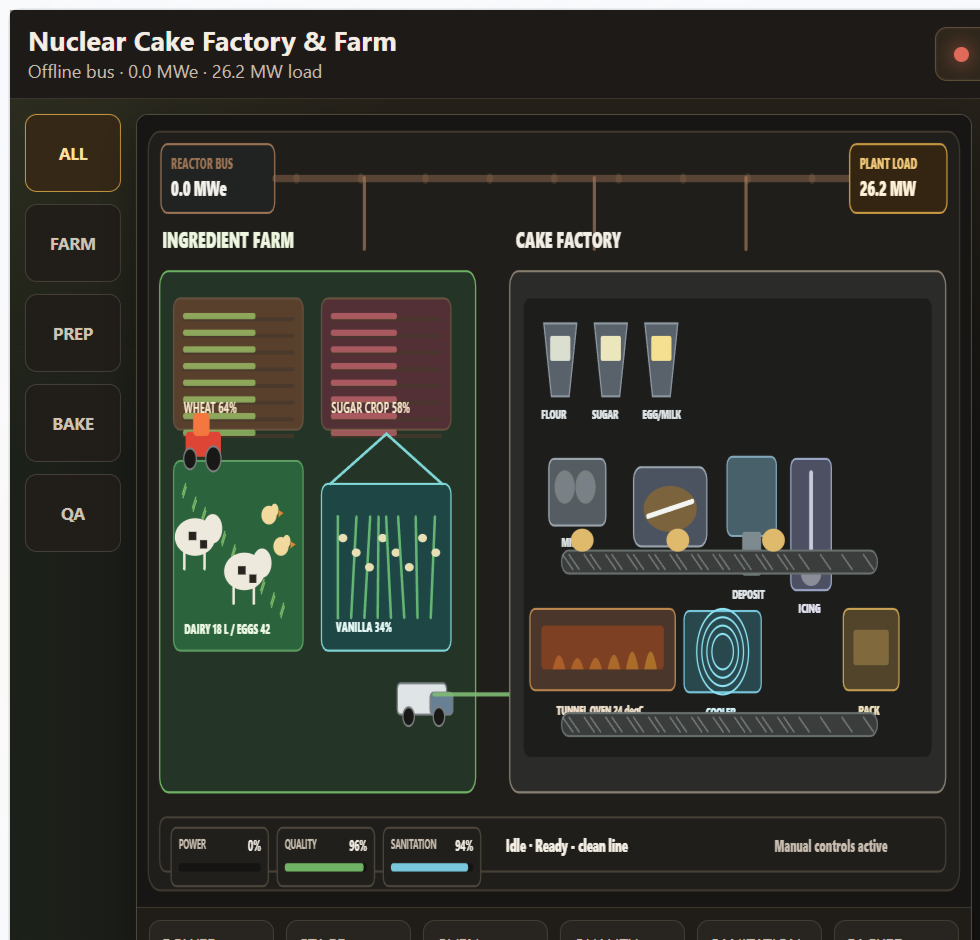
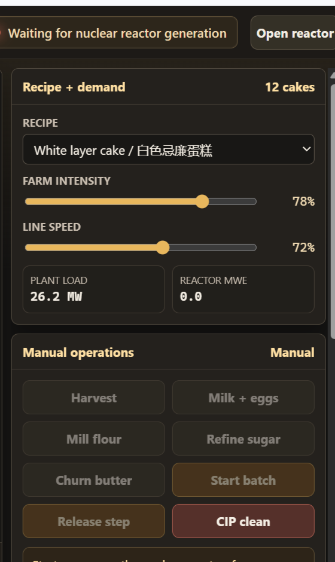

# Cake Factory & Farm · 蛋糕工廠與農場

**EN —** The Cake Factory & Farm module is a hands-on HTML5 simulator for a reactor-powered ingredient farm and bakery line. It is not a video and it is not fully automatic: the reactor bus, supply dock, supplier purchase orders, inbound delivery lead time, farm, dairy ration mixing, milking-parlor washdown, poultry-house washdown, utility plant, audited ingredient lots, ingredient factories, packaging plant, byproduct hauling, effluent treatment, QA lab release, warehouse batch kitting, plant maintenance, mixer, tunnel oven, cooling, icing, packaging, customer order dispatch, QA, signed `.cake` files and CIP cleaning all expose live controls and operator release gates.

**粵語 —** 蛋糕工廠與農場模組係一個由反應堆供電嘅 HTML5 互動模擬器，包含原料農場同烘焙生產線。佢唔係影片，亦唔係全自動：反應堆供電、收貨、供應商採購單、入廠送貨等候時間、農場、奶牛飼料混合、擠奶間清洗、已審核批號、原料工廠、副產物運走、廢水處理、QA 實驗室放行、倉庫備料、廠房維修、攪拌、隧道焗爐、冷卻、裝飾、包裝、客戶訂單出貨、品檢、已簽署 `.cake` 檔同 CIP 清潔全部都有即時控制同操作員放行關卡。

Open in-app: `WinForge.exe --page cakefactory`

## Screenshots · 截圖

### Full WinForge module · 完整 WinForge 模組

### Immersive HTML5 scene · 沉浸式 HTML5 場景

### HTML controls · HTML 控制台

## What It Simulates · 模擬內容

| Area · 區域 | Simulation · 模擬內容 |
|---|---|
| Reactor bus · 反應堆供電 | The factory only runs when the live reactor status bus is generating enough electrical power. A meltdown or offline reactor locks out powered actions. |
| Supply chain inputs · 供應鏈輸入 | Ingredients do not appear from nowhere: seed, irrigation water, fertilizer, animal feed, cocoa beans, brine, soda ash, phosphate, starch carrier, paperboard, label stock, packaging ink, adhesive and filter media are finite stocks delivered through the receiving dock. Finished coded cartons are not delivered directly; the operator runs the packaging plant to make them. The main HTML5 workflow requires a paid supplier purchase order, a delivery ETA, truck arrival and manual unloading before stocks enter inventory. |
| Ingredient farm · 原料農場 | Wheat, sugar crop, vanilla, pasture health, cow milk and eggs grow over time only when reactor power and the required farm inputs are available. Milk comes from a tracked lactating cow herd that consumes mixed dairy ration, water, bedding and labor, then passes through a powered milking parlor and chilled bulk tank. Eggs come from a laying-hen flock that consumes poultry feed, water, bedding and labor before the egg-room washer/grader can stamp an egg lot. |
| Dairy barn · 奶牛畜舍 | The operator mixes TMR from finite forage, grain and mineral premix. Cows consume that ration, make manure, lose comfort when bedding/labor/hygiene are poor, and milk QA reflects parlor hygiene, bacteria, somatic cells, fat and protein. Washdown consumes process water, steam, compressed air, filter media and labor. |
| Poultry house · 禽舍 | Laying hens consume finite feed, water, bedding and barn labor, produce poultry manure and lose nest hygiene over time. Egg QA tracks shell quality and washer temperature, and the operator must wash the poultry house when hygiene or manure starts hurting output. |
| Utility plant · 公用工程廠 | Process water, culinary steam and compressed air are made by a timed, powered support plant instead of appearing instantly. Running the utility plant consumes raw water and filter media, adds reactor load, moves through RO/boiler/compressor phases, reports conductivity and pressure, then transfers utilities only after completion. |
| Lot traceability · 批號追蹤 | Receiving, harvest, dairy/poultry collection, ingredient factories and batch start all stamp audited lot or manifest IDs. Batches keep a trace manifest that lists the flour, sugar, eggs, milk, butter, leavening, salt, vanilla, cocoa and packaging lots used. |
| Ingredient conversion · 原料轉換 | Harvest, collect cow milk/eggs, then run timed powered factory jobs: mill wheat into cake flour, refine sugar crop into sugar, churn milk/cream into butter, roast/grind cocoa beans into cocoa, evaporate brine into salt, blend leavening feedstocks into baking powder and convert paperboard/labels/ink/adhesive into coded cake cartons. Completed factory lots go to QA lab hold before batching can use them. |
| Warehouse kitting · 倉庫備料 | Batches do not pull ingredients straight from storage. The operator must stage a traceable warehouse kit first; kitting consumes ingredient inventory, reserves cartons, uses forklift battery and occupies staging pallet space before the line can start. |
| Factory telemetry · 工廠遙測 | Ingredient factories consume raw inputs plus process water, culinary steam, compressed air and filter media at start, add reactor load, expose unit-operation phase, run progress and process QA, pause on low power, and release output only after completion. Each plant tracks equipment condition, calibration, bearing temperature, vibration, byproduct bin capacity and effluent tank capacity; wear affects throughput, QA and yield until the operator services the factories. Readings include mill roll gap, flour extraction, sugar Brix, evaporator temperature, separator rpm, butterfat, cocoa roast temperature, grind size, brine salinity, crystallizer temperature, leavening blend homogeneity, carton-former speed, print registration and glue-pot temperature. |
| Byproducts + effluent · 副產物與廢水 | Factory runs create named residual streams: bran, beet pulp, buttermilk, cocoa shell, brine blowdown, leavening dust, carton trim, label matrix scrap and process effluent. Full bins or tanks block new factory runs until the operator hauls byproducts or treats effluent. |
| Bakery line · 烘焙生產線 | Operator-driven scaling, mixing, depositing, tunnel baking, spiral cooling, icing/decorating and packaging/coding. |
| Customer orders · 客戶訂單 | Packed cakes move into finished goods. Active customer orders track required cakes, due time, reward, cash and reputation. Dispatch is manual and requires reactor power, enough finished goods, truck battery charge and a cold-chain temperature below the safety limit. |
| Signed cake files · 已簽署蛋糕檔 | Packed cakes are minted as portable `.cake` files signed with the bakery private key. Other devices validate them with the trusted public key, forged cakes are rejected, and eating a cake deletes the file. |
| Food safety · 食物安全 | HACCP-style prompts, kill-step temperature, cooling limit, sanitation score, quality score, rejects and waste tracking. |
| CIP sanitation · CIP 清潔 | Clean-in-place locks batching while washing mixer, depositor, oven belt, icing head and packer. |

## Controls · 控制

| Control · 控制 | Use · 用途 |
|---|---|
| Station rail · 工站列 | Focus the scene on All, Farm, Prep, Bake or QA without leaving the simulator. |
| Recipe select · 配方選單 | Choose White layer cake, Butter pound cake or Chocolate layer cake. The recipe changes batch size, ingredients, bake target and target specific gravity. |
| Farm intensity · 農場強度 | Raises or lowers crop growth, pasture/livestock output and farm electrical demand. |
| Line speed · 生產線速度 | Raises or lowers bakery throughput and factory electrical demand. |
| Order supplies · 訂購補給 | Pays cash to place an audited supplier purchase order. The inbound truck has an ETA and does not add inventory while it is still en route. |
| Unload delivery · 卸貨入倉 | After the supplier truck reaches the receiving dock, unloads and books audited seed, water, fertilizer, feed, cocoa beans, brine, soda ash, phosphate, starch carrier, paperboard, label stock, packaging ink, adhesive, process water, culinary steam, compressed air and filter media into inventory. |
| Run utilities · 運行公用工程 | Runs the RO skid, clean-steam boiler and compressor. The run consumes raw water/filter media up front, draws reactor power while timed, then produces process water, culinary steam and compressed air after release. |
| Harvest · 收成 | Moves ready wheat, sugar crop and vanilla from fields into inventory and stamps harvest lot IDs. |
| Mix dairy ration · 混合奶牛飼料 | Converts finite forage, grain, mineral premix, water and barn labor into a traceable TMR ration lot for the lactating cow herd. |
| Wash parlor · 清洗擠奶間 | Uses process water, culinary steam, compressed air, filter media and labor to wash the milking parlor, scrape manure and restore hygiene. |
| Wash poultry · 清洗禽舍 | Uses process water, culinary steam, compressed air, filter media and labor to wash the poultry house, clear poultry manure, rebed nests and restore egg QA conditions. |
| Milk + eggs · 收奶蛋 | Collects cow milk from the powered milking parlor and graded eggs from the barn buffers. Milk is produced by lactating cows, chilled in a bulk tank, stamped as a milk lot and checked for temperature, bacteria, somatic cell count, fat and protein. Eggs are produced by laying hens, stamped as an egg lot and checked for shell quality plus washer temperature. |
| Mill flour · 磨粉 | Converts harvested wheat into cake flour and bran/waste. |
| Refine sugar · 煉糖 | Converts sugar crop into usable sugar and waste. |
| Churn butter · 打牛油 | Converts milk/cream into butter while preserving cold milk inventory. |
| Roast cocoa · 烘焙可可 | Converts finite cocoa beans into usable cocoa powder. |
| Salt works · 鹽廠 | Converts finite brine into baking-grade salt using a powered evaporator and crystallizer. |
| Leavening plant · 膨鬆劑廠 | Converts finite soda ash, phosphate and starch carrier into usable baking powder. |
| Packaging plant · 包裝廠 | Converts finite paperboard, label stock, packaging ink and food-grade adhesive into coded cake cartons using a carton former, labeler and case coder. |
| Release lab lot · 實驗室放行批號 | Consumes lab utilities and releases a completed factory output lot after QA checks. Batching is blocked while a required factory lot is still on lab hold. |
| Service plants · 維修廠房 | Stops ingredient-factory work, consumes utilities, lubricates bearings, replaces filters, recalibrates sensors/scales and restores plant condition. |
| Haul byproducts · 運走副產物 | Uses the dock/forklift to clear bran, beet pulp, buttermilk, cocoa shell, brine blowdown, leavening dust, carton trim and label matrix scrap; some residuals are sold or reused as animal feed. |
| Treat effluent · 處理廢水 | Uses compressed air and filter media to treat process effluent, reclaim water and send sludge to waste. |
| Stage kit · 備料套件 | Picks released ingredients and cartons into a traceable warehouse kit using forklift battery and staging pallet space. |
| Start batch · 開批 | Starts the manual batch line from the staged warehouse kit. |
| Release step · 放行工序 | Advances only when the current stage is complete and the safety gate is satisfied. |
| Dispatch order · 訂單出貨 | Ships the active customer order after finished goods, reactor power, truck charge and cold-chain temperature are ready. Dispatch consumes finished goods, pays cash and updates reputation. |
| CIP clean · CIP 清潔 | Starts a clean-in-place sanitation loop. Batching is locked until it completes. |
| Trust key · 信任公鑰 | Imports the embedded bakery public key from a copied `.cake` file so another device can validate that bakery. |
| Validate cake · 驗證蛋糕 | Verifies the latest `.cake` file signature and trusted public key before it can be used. |
| Eat + delete · 食用並刪除 | Consumes the latest valid cake by deleting the `.cake` file from disk. |
| Open reactor · 開反應堆 | Navigates to the Nuclear Reactor module so the reactor bus can be started/recovered. |

## Operating Procedure · 操作程序

1. Open the module with `WinForge.exe --page cakefactory`.
2. If the banner says **Waiting for nuclear reactor generation**, open the reactor module and bring the plant to generation. The cake simulator intentionally disables powered work without the reactor bus.
3. Select a recipe and set farm intensity / line speed. Higher settings make the scene more active but increase plant load.
4. Keep the supply chain stocked. Use **Order supplies** when seed, irrigation water, fertilizer, poultry feed, dairy forage, grain, mineral premix, bedding, labor, cocoa beans, brine, leavening feedstocks, paperboard, label stock, packaging ink, adhesive or factory utilities are low. Wait for the supplier truck ETA, then press **Unload delivery** after it reaches the dock. Unloading records a new receiving manifest.
5. Prepare ingredients manually:
   - Harvest fields when wheat, sugar crop or vanilla are mature.
   - Press **Mix dairy ration** to make a TMR lot from forage, grain, mineral premix, water and barn labor.
   - Keep the cow herd fed, watered and bedded, then collect milk when the dairy buffer is ready. Watch mixed ration, manure, parlor hygiene, bulk tank temperature and milk QA before batching.
   - Press **Wash parlor** when manure rises or parlor hygiene drops; washdown consumes utilities and labor.
   - Keep the laying hens fed, watered, bedded and staffed, then collect eggs when the nest buffer is ready. Watch poultry manure, hen-house hygiene, shell quality and egg washer temperature before batching.
   - Press **Wash poultry** when poultry manure rises or nest hygiene drops; washdown consumes utilities and labor.
   - Mill wheat into flour and wait for the powered roller mill run to finish.
   - Refine sugar crop into sugar and wait for diffuser/evaporator completion.
   - Churn butter when milk inventory has enough reserve and wait for the separator/churn run.
   - Roast cocoa beans into cocoa when a chocolate recipe needs it, then wait for roast/grind completion.
   - Run the salt works when salt is low and wait for evaporation/crystallization.
   - Run the leavening plant when baking powder is low and wait for blend homogeneity.
   - Run the packaging plant when coded cartons are low and wait for paperboard unwind, carton forming, print registration, glue set and code verification.
   - Press **Run utilities** when process water, culinary steam or compressed air is low; wait for RO/boiler/compressor completion before starting utility-heavy factory jobs.
   - Watch byproduct bins and the effluent tank. Press **Haul byproducts** or **Treat effluent** before support systems reach capacity.
   - Press **Release lab lot** after each factory run finishes so the completed lot clears QA hold before it can feed a batch or the next factory run.
   - Use **Service plants** when condition, calibration, vibration or bearing temperature starts to pull down yield or QA.
6. Press **Stage kit** after the inventory panel shows no missing ingredients, required factory lots are released, and enough coded cartons are available.
   - Staging opens a traceable kit manifest, consumes the picked ingredient inventory, reserves cartons, drains forklift battery and occupies staging pallet space.
7. Press **Start batch** only after the warehouse kit is staged.
   - Starting the batch opens a batch lot manifest linked to the staged kit and its ingredient/packaging lots.
8. Watch the current stage and wait for the release gate:
   - **Weighing + scaling:** wait for scale verification.
   - **Planetary mixing:** wait for mix time and target batter specific gravity.
   - **Depositing batter:** wait for pan-weight stabilization.
   - **Tunnel oven bake:** release only after product core temperature reaches the kill step.
   - **Spiral cooling:** release only when product core temperature is safe for icing.
   - **Icing + decorating:** release when decorating is complete and sanitation remains acceptable.
   - **Packaging + coding:** release to finish the batch, log QA and count packed/rejected cakes.
9. When packaging completes, packed cakes enter finished goods and the app mints one signed `.cake` file per packed cake under the cake-factory app data folder.
10. Watch the customer order panel. Press **Dispatch order** only when finished goods meet the order quantity and the truck battery / cold-chain readings are ready.
11. On another device, copy the `.cake` file into the cake folder, press **Trust key** once for that bakery, then use **Validate cake**.
12. Use **Validate cake** before another module or operator uses a cake file. A forged, tampered, untrusted, replayed or expired cake is rejected.
13. Use **Eat + delete** when a workflow consumes a cake. The valid `.cake` file is deleted, so it cannot be eaten twice.
14. Run **CIP clean** when sanitation drops or after production. The simulator locks batching during CIP, then restores sanitation as the wash/rinse/drain loop progresses.

## Manual-First Behavior · 手動優先行為

The simulator deliberately avoids full automation:

- It does not start batches on its own.
- It does not harvest, mill, refine or churn ingredients automatically.
- It does not create ingredients from thin air; farm and bakery output consume finite upstream inputs.
- The main receiving flow is not instant. Supplies require cash, a purchase order, truck travel time, dock arrival and manual unloading before they enter inventory.
- Process water, culinary steam and compressed air are not created from nowhere. The operator must run the utility plant, which consumes raw water and filter media, adds reactor load and transfers utility output only after the timed run completes.
- Cartons do not come from thin air or arrive as finished packaging. Supplier deliveries bring paperboard, label stock, packaging ink and adhesive; the operator must run the packaging plant and release the finished carton lot before batching can use it.
- Milk specifically comes from lactating cows, which consume traceable mixed ration, water, bedding and barn labor before the powered milking parlor can transfer raw milk into cold storage. Warm, high-count, low-solids, high-SCC or low-hygiene milk is held by the recipe gate.
- Eggs specifically come from laying hens, which consume traceable feed, water, bedding and barn labor before the egg-room washer/grader can transfer eggs into inventory. Low shell quality, poor nest hygiene or out-of-range washer temperature is held by the recipe gate.
- Dairy ration is not automatic. The operator must mix forage, grain, mineral premix, water and labor into a TMR lot, and the herd consumes that lot during production.
- The parlor is not self-cleaning. Manure accumulates, hygiene decays, and washdown consumes real utilities and labor before improving milk QA conditions.
- The poultry house is not self-cleaning. Poultry manure accumulates, nest hygiene decays, and washdown consumes real utilities and labor before improving egg QA conditions.
- Receiving, harvest, dairy/poultry collection, factory output and batch start all carry lot IDs. A batch cannot start if required ingredient lot data is missing.
- Ingredient factories are not instant: they consume finite inputs and utilities, add reactor load, move through unit-operation phases, report process QA, pause on low power and release usable ingredients only after the process completes.
- Ingredient factory residuals are not ignored. Named byproducts and process effluent accumulate, capacity can block further runs, and clearing them consumes dock handling, compressed air or filter media.
- Factory output is not automatically usable. The QA lab holds each completed factory lot until the operator releases it, and the release consumes real utilities.
- The bakery line cannot start directly from storage. The operator must stage a warehouse kit, which consumes inventory and warehouse handling capacity before the line can run.
- Ingredient factories wear down. A run degrades the specific plant that ran, worn equipment slows throughput and reduces yield/QA, and maintenance consumes real utilities before restoring condition and calibration.
- It does not advance stages automatically after timers complete.
- It waits for the operator to release each HACCP gate.
- It does not ship orders automatically. Customer dispatch waits for the operator and consumes finished goods, truck charge and cold-chain capacity.
- It blocks release if power, temperature, sanitation or recipe requirements are not satisfied.
- It rejects forged `.cake` files and refuses to consume them.

## Troubleshooting · 疑難排解

| Symptom · 狀況 | Cause / fix · 原因 / 修正 |
|---|---|
| Controls are disabled · 控制不能按 | Reactor is offline, not generating enough power, or in meltdown. Open the reactor and restore generation. |
| Unload delivery is disabled · 無法卸貨 | No supplier truck is scheduled, the truck is still en route, reactor bus power is low, forklift battery is low or pallet space is full. |
| Stage kit is disabled · 無法備料 | Missing recipe ingredients, lab hold, active CIP cycle, no reactor bus power, low forklift battery or no staging pallet space. |
| Start batch is disabled · 未能開批 | No staged warehouse kit, active CIP cycle, no reactor bus power, wrong selected recipe for the staged kit, or a batch already on the line. |
| Farm output stalls · 農場停產 | Seed, irrigation water, fertilizer or animal feed is low. Order supplies, wait for the truck, unload the delivery and restore reactor power. |
| Milk production stalls · 牛奶停產 | Mixed ration, water, bedding, labor, pasture health or reactor power is low. Mix dairy ration, order supplies, unload the delivery, wash the parlor and restore power. |
| Milk QA hold · 牛奶品檢暫停 | Bulk tank is warm, bacteria/SCC is high, solids are low or parlor hygiene is poor. Wash the parlor, restore cooling and wait for in-spec milk. |
| Egg production stalls · 雞蛋停產 | Poultry feed, water, bedding, labor, hen-house hygiene or reactor power is low. Order supplies, unload the delivery, wash poultry and restore power. |
| Egg QA hold · 雞蛋品檢暫停 | Shell quality is low, nest hygiene is poor or washer temperature is out of range. Wash poultry, restore utilities and wait for in-spec eggs. |
| Run utilities is disabled · 未能運行公用工程 | Reactor bus power is low, raw water/filter media is low, the utility plant is already active, or process-water/steam/air storage is too full. |
| Traceability hold · 批號追蹤暫停 | A required ingredient has quantity but no lot ID. Run the relevant collection/factory step or receive audited supplies so the ledger can be restored. |
| Lab release hold · 實驗室放行暫停 | A factory output lot is waiting for QA lab release. Press Release lab lot after restoring reactor power and lab utilities. |
| Service plants is disabled · 無法維修廠房 | A factory run is active, reactor bus power is low, or process water/steam/compressed air/filter media is insufficient. |
| Ingredient factory is disabled · 原料工廠不能啟動 | QA lab hold, low utilities, full byproduct bins or a full effluent tank can block the run. Release the lab lot, restore utilities, haul byproducts or treat effluent. |
| Packaging plant is disabled · 包裝廠不能啟動 | Paperboard, label stock, packaging ink, adhesive, process water, compressed air or filter media is low, a factory run is active, a lab lot is still on hold, or waste/effluent capacity is full. |
| Release step is disabled · 未能放行 | Stage timer is still running, kill-step/cooling/sanitation gate is not met, or reactor power is unavailable. |
| Dispatch order is disabled · 無法出貨 | Finished goods are below the active order quantity, reactor bus power is low, truck battery charge is low, or the dispatch cold chain is too warm. |
| Cake file rejected · 蛋糕檔被拒絕 | The file is forged, tampered, signed by an untrusted public key, expired or already eaten. |
| Quality drops · 品質下降 | Low power, worn or uncalibrated ingredient plants, bad oven temperature, missed specific gravity target, or low sanitation. Service plants, slow down, clean and wait for gate conditions. |
| CIP seems to stop production · CIP 停止生產 | Expected behavior: CIP locks batching until the sanitation loop finishes. |

## Verification · 驗證

The module was tested with these checks:

| Evidence · 證據 | Result · 結果 |
|---|---|
| Headless service scenarios · 無介面服務情景 | `dotnet run --project tests/ReactorSim.Tests/ReactorSim.Tests.csproj -c Debug` passed **35/35** scenarios, including cake power gating, no-auto manual mode, cow milk provenance and cold-chain QA, laying-hen egg provenance and poultry washdown, dairy ration mixing and parlor hygiene/washdown, audited lot traceability, QA lab release holds, warehouse batch kitting, finite supply inputs and utilities, supplier delivery lead time, timed utility plant production, timed non-farm ingredient factories, timed packaging plant production, no carton air-drops, unit-operation phases, process QA, factory equipment maintenance, named byproduct/effluent handling, ingredient chain, full manual batch, customer order dispatch, signed `.cake` file crypto and CIP sanitation. |
| WinForge GUI screenshot · WinForge 圖形介面截圖 | `WinForge.exe --page cakefactory` was launched from a self-contained publish and captured into `docs/screenshot-cakefactory.png`. |
| WebView asset packaging · WebView 資產封裝 | `SimAssets/cake/index.html` is included under `SimAssets/**/*.*`, copied to publish output and loaded through WebView2 virtual-host mapping. |
| Signed cake files · 已簽署蛋糕檔 | The test suite verifies private-key signing, public-key trust on another device root, forged/tampered rejection, replay rejection and eat-delete consumption. |

## Implementation Files · 實作檔案

- `Pages/CakeFactoryModule.xaml` — WinUI host for the HTML5 simulator.
- `Pages/CakeFactoryModule.xaml.cs` — WebView2 bridge, reactor-bus snapshot posting and operator action handling.
- `SimAssets/cake/index.html` — immersive HTML5 canvas, controls and JavaScript UI.
- `Services/CakeFactoryService.cs` — authoritative simulator model for recipes, inventory, stages, quality, sanitation and reactor-power dependency.
- `Services/CakeFileService.cs` — signed portable `.cake` file creation, public-key trust, validation and eat-delete consumption.
- `tests/ReactorSim.Tests/Program.cs` — headless scenario coverage for cake simulator behavior.

[← Apps, Git & Packages](Apps-Git-and-Packages.md) · [Screenshots](Screenshots.md) · [Wiki Home](Home.md)
