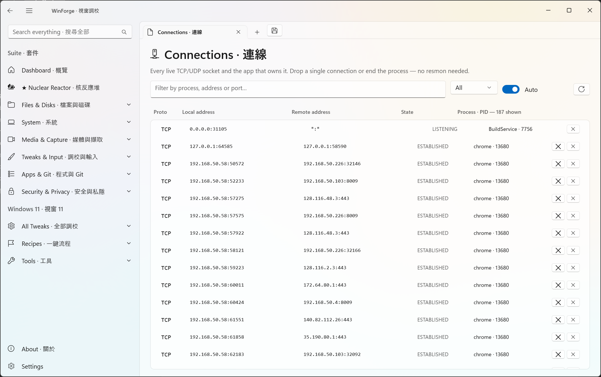
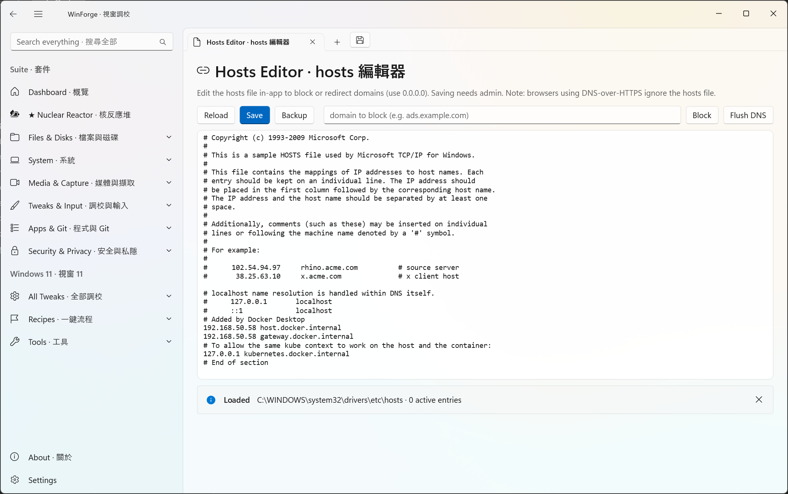
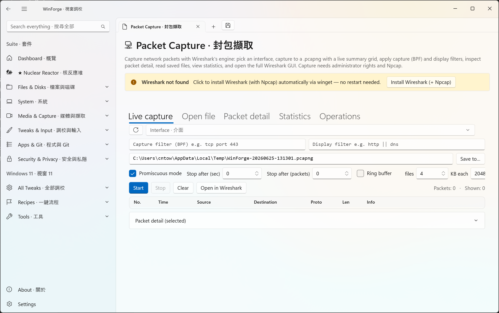
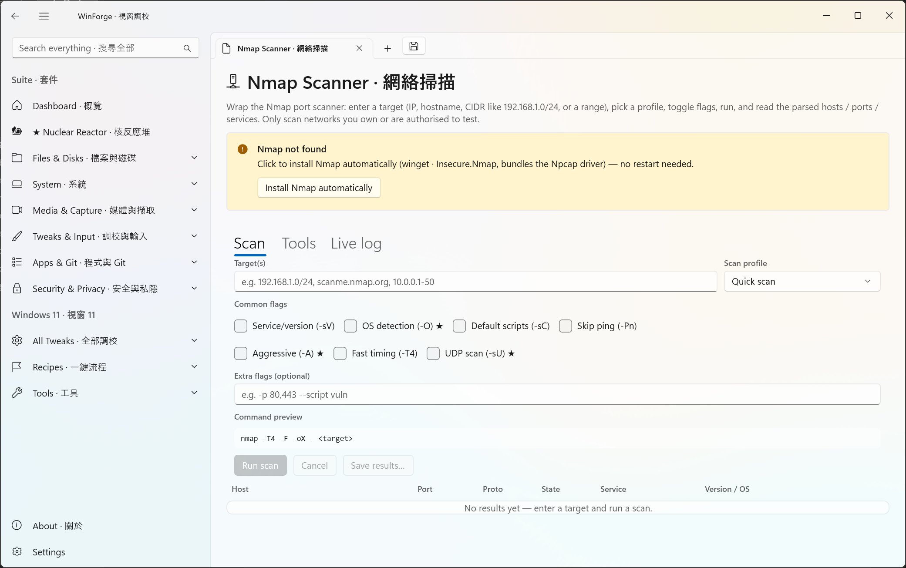
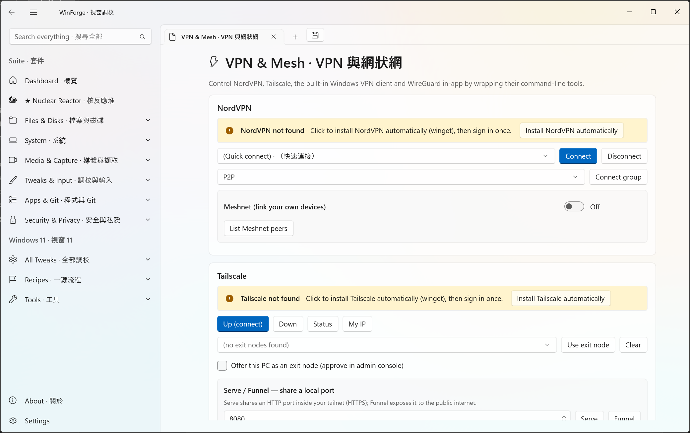
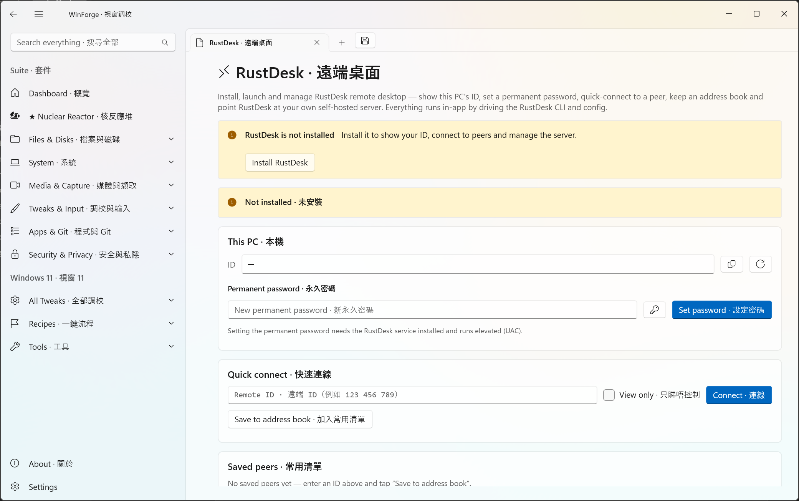
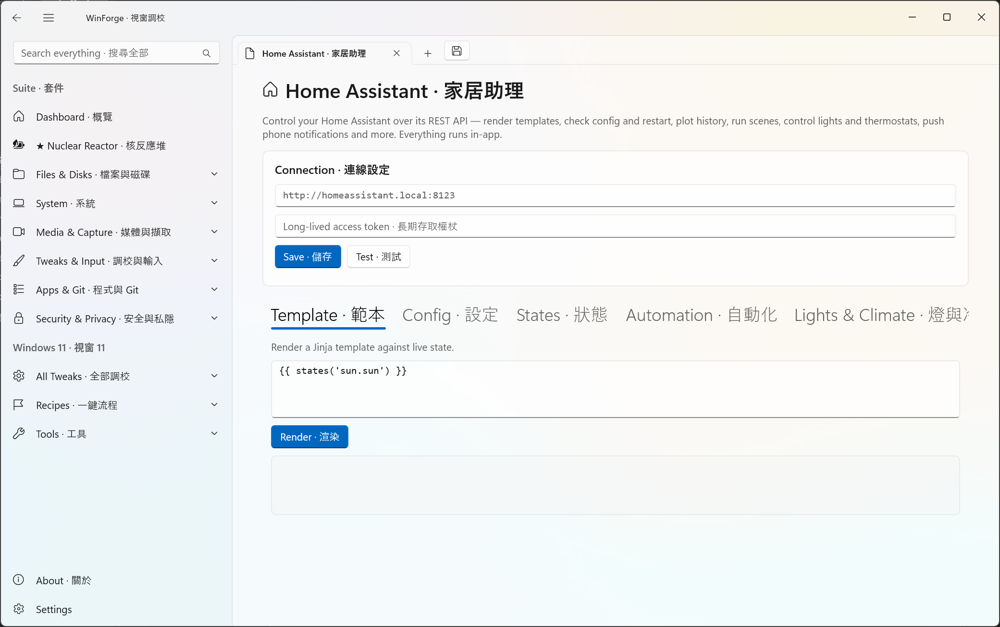
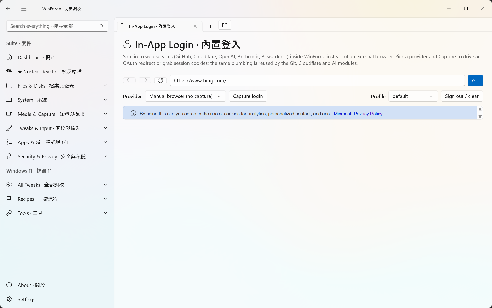

# Network · 網絡

Networking, remote access and packet tools for WinForge. · WinForge 嘅網絡、遠端存取同封包工具。

## Connections · 連線

Live TCP/UDP socket list with owning processes (netstat/TCPView). · 即時 TCP／UDP 連線清單同擁有程序（netstat／TCPView）。

Open in-app: `WinForge.exe --page connections`

## Hosts Editor · hosts 編輯器

Edit the hosts file and block domains. · 編輯 hosts 檔案同封鎖網域。

Open in-app: `WinForge.exe --page hosts`

## Packet Capture · 封包擷取

Capture and filter packets with tshark/dumpcap (pcap). · 用 tshark／dumpcap 擷取同過濾封包（pcap）。

Open in-app: `WinForge.exe --page wireshark`

## Nmap Scanner · 網絡掃描

Scan hosts, ports, services and OS with Nmap. · 用 Nmap 掃描主機、端口、服務同作業系統。

Open in-app: `WinForge.exe --page nmap`

## VPN & Mesh · VPN 與網狀網

Manage NordVPN and Tailscale mesh connections. · 管理 NordVPN 同 Tailscale 網狀網連線。

Open in-app: `WinForge.exe --page vpn`

## RustDesk · 遠端桌面

Self-hostable remote desktop control (TeamViewer alternative). · 可自架嘅遠端桌面控制（TeamViewer 替代品）。

Open in-app: `WinForge.exe --page rustdesk`

## Cloudflare & Tunnel · Cloudflare 與 Tunnel

Cloudflared tunnels, DNS routing, Access, DoH and WARP. · Cloudflared 隧道、DNS 路由、Access、DoH 同 WARP。

Open in-app: `WinForge.exe --page cloudflare`

## Home Assistant · 家居助理

Drive the Home Assistant REST API for scenes, lights and more. · 驅動 Home Assistant REST API 控制場景、燈光等。

Open in-app: `WinForge.exe --page homeassistant`

## In-App Login · 內置登入

Shared WebView2 OAuth and sign-in for connected services. · 共用 WebView2 OAuth 同登入連接服務。

Open in-app: `WinForge.exe --page weblogin`

[← Wiki Home](Home.md)
