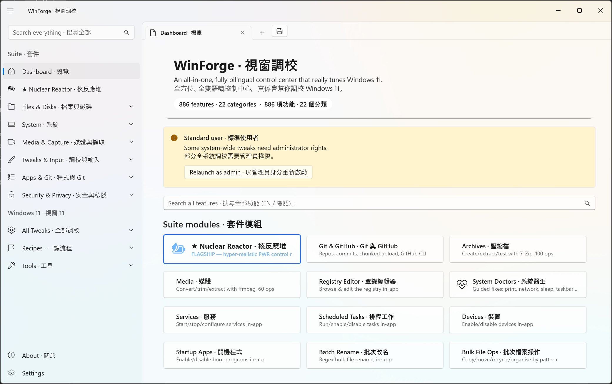
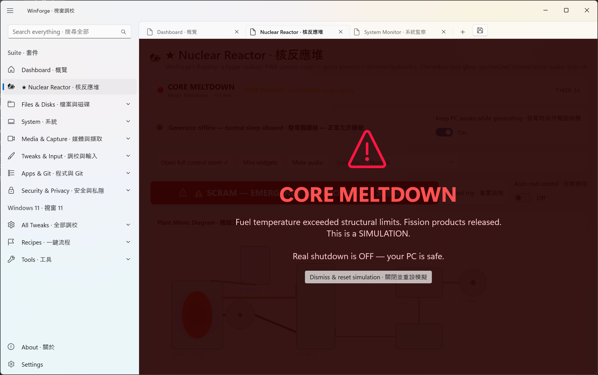

# Nuclear Reactor — Operating Manual · 核反應堆操作手冊

**EN —** The Nuclear Reactor is WinForge's flagship: a hyper-realistic **Pressurized Water Reactor (PWR)** control room rendered entirely in WinUI 3. It models 6-group point kinetics, reactivity feedback (Doppler / moderator / boron / xenon), thermal-hydraulics, a steam/turbine secondary plant, a Westinghouse-style protection system, synthesized control-room audio, and a live plant mimic. It is a **simulation/training toy** — it controls no real hardware.

**粵語 —** 核反應堆係 WinForge 嘅旗艦模組：一個完全用 WinUI 3 繪製、超寫實嘅**壓水式反應堆（PWR）**控制室。佢模擬六組點動力學、反應性回饋（都卜勒／緩和劑／硼／氙）、熱工水力、蒸汽渦輪二次側、西屋式保護系統、合成控制室音效，同即時機組流程圖。佢只係一個**模擬／訓練玩具**，唔會控制任何真實硬件。

> ⚠️ **Safety / 安全** — Two real-world side-effects are **opt-in and clearly gated**:
> - **Meltdown → real PC shutdown** is **OFF by default**. When meltdown occurs it only shows a simulated overlay (see below). You must arm "ARM REAL SHUTDOWN" to enable an actual (abortable, 10 s countdown) Windows shutdown.
> - **Keep PC awake while generating** holds the PC awake only while the generator is on-load; it releases the instant you SCRAM or trip.
> 兩個會影響真實系統嘅效果都係**預設關閉、明確開關**：熔毀真實關機**預設 OFF**（只播模擬畫面）；發電保持喚醒只喺併網時生效，SCRAM 即放開。

---

## 1. Where to find it · 喺邊度搵到

It is the **first tile on the Dashboard** (★ FLAGSHIP) and the **top entry in the navigation**. You can also deep-link from a terminal: `WinForge.exe --reactor` (or `--page reactor`).

它係**儀表板第一個磚** (★ 旗艦) 同**導覽列最頂**。亦可由終端機深層連結：`WinForge.exe --reactor`。

---

## 2. The control room at a glance · 控制室概覽

| Area · 區域 | What it shows · 內容 |
|---|---|
| **Status banner** · 狀態橫額 | Mode (Shutdown / Startup / Run / Tripped / Meltdown), the first-out trip cause, and mission time `T+…s`. |
| **Keep-awake pill** · 喚醒指示 | `⚡ Grid online — this PC is kept awake (N MWe)` when generating, else `Generator offline — normal sleep allowed`. |
| **Toolbar** · 工具列 | **Open full control room** (pop-out window), **Mini widgets** (desktop gadgets), **Mute audio**, **Scenario** selector. |
| **SCRAM bar** · 緊急停堆 | The big red **SCRAM — EMERGENCY SHUTDOWN · 緊急停堆** button + **Reset trip · 重置跳脫**. |
| **Auto rod control** · 自動棒控制 | Hands the regulating bank to an automatic controller targeting a power setpoint. |
| **Plant Mimic Diagram** · 機組流程圖 | Vessel → pressurizer → steam generator → turbine → generator → condenser, animated by flow and temperature. |

Scroll down for the **instrument gauges**, the **Reactor Protection System** channel panel, the **annunciator** tiles, and the **strip-chart recorders**:

- **Critical Safety Functions** (top): `P Integrity`, `Z Containment`, `I Inventory` status tiles (green / amber / red).
- **Reactor Protection System · 反應堆保護系統** — one card per protection function with its **2-out-of-4 instrument channels** as LEDs. (2-of-4 coincidence with Westinghouse setpoints: a single tripped channel is a *partial* trip — amber; the reactor trips only when ≥2 of 4 channels of a function trip.)
- **Instrument Gauges · 儀錶** — analog dials for Reactor power (%), Thermal power (MW), Electrical (MWe), Decay heat (%), Reactor period (s), Reactivity (pcm), fuel temp, Tavg / Thot / Tcold, subcooling, primary pressure.

---

## 3. Realistic operating procedures · 實際操作程序

These follow real PWR practice. Design references: ~3411 MWth / ~1100 MWe, Tavg ≈ 305 °C at full power, primary ≈ 155 bar (2250 psia), β-eff ≈ 0.0065.

### 3.1 Cold startup → approach to criticality · 冷態起動 → 接近臨界
1. **Establish primary flow.** Start ≥3 reactor coolant pumps; confirm flow > 85 %. · 啟動主泵，流量 > 85%。
2. **Pressurize.** Energize pressurizer heaters; raise primary pressure toward ~2235 psia. · 加壓至約 2235 psia。
3. **Dilute / withdraw.** With shutdown banks fully out, slowly dilute boron and/or withdraw the regulating bank, watching the **source-range** count-rate and the **1/M** plot trend toward zero. · 稀釋硼／提棒，睇起動率同 1/M。
4. **Declare criticality** when a small, *stable* positive period (> 30 s) holds at low power. Reactivity should hover near **0 pcm**. · 喺低功率、穩定正週期 (>30 s) 時宣布臨界。
5. Never let reactivity approach prompt-critical (+β ≈ +650 pcm). The period gauge going very short is your warning. · 切勿接近瞬發臨界。

### 3.2 Power ascension & grid sync · 升功率與併網
1. Raise power on the regulating bank (or **Auto rod control** to a power setpoint), keeping Tavg on its program. · 升功率，保持 Tavg。
2. As steam pressure builds, roll the turbine to **1800 rpm** (4-pole / 60 Hz), then **close the generator breaker** to sync. · 渦輪升到 1800 rpm 後併網。
3. Raise turbine load; the **keep-awake pill** turns gold and the PC will not sleep while you're on-load. · 加負載，喚醒指示變金色。

### 3.3 Normal at-power operation · 正常滿載運行
- Hold Tavg on program with the regulating bank; trim **boron** for slow reactivity (xenon burn-in/out over hours). · 用棒保持 Tavg，用硼補償氙。
- Watch **axial offset** and keep gauges inside their green bands. · 睇軸向偏差，保持綠帶內。

### 3.4 Normal shutdown · 正常停堆
1. Ramp turbine load down, **open the generator breaker**. · 減負載、解列。
2. Insert the regulating bank / borate to bring power down. · 落棒／加硼降功率。
3. Trip when subcritical and cooled per program. · 按程序冷卻後停堆。

---

## 4. Emergencies · 緊急情況

### 4.1 SCRAM (reactor trip) · 緊急停堆
Press **SCRAM — EMERGENCY SHUTDOWN** (or let an automatic trip fire). All rods drop, inserting large negative reactivity; the annunciators light **first-out**. Then follow **E-0 (Reactor Trip / Safety Injection)**: verify rods in, verify turbine/feedwater response, verify safety-injection criteria, monitor the **Critical Safety Functions**. · 揿 SCRAM，跟 E-0 程序。

Automatic trips include (Westinghouse-style setpoints): high neutron flux (~109 %), low RCS flow (~90 %), low/high pressurizer pressure (~1865 / 2385 psig), low SG level, turbine trip. · 自動跳脫設定點如上。

### 4.2 Meltdown · 熔毀
If fuel temperature exceeds structural limits for too long, the core melts:

The simulation shows the **CORE MELTDOWN** overlay and (with real shutdown OFF) the message *"Real shutdown is OFF — your PC is safe."* Click **Dismiss & reset simulation · 關閉並重設模擬** to recover. · 顯示熔毀畫面，揿「關閉並重設模擬」復原。

---

## 5. Scenario drills · 情景演習
Use the **Scenario** selector to inject classic transients and practice your response: **LOCA**, **Station Blackout (SBO)**, **Loss of Feedwater (LOFW)**, **ATWS**, **xenon restart**. Each has a realistic parameter signature and automatic protective actions. · 用情景選擇器注入 LOCA／SBO／LOFW／ATWS／氙重起等典型瞬態。

## 6. Audio, widgets & the pop-out window · 音效、小工具與彈出視窗
- **Mute audio** toggles the synthesized soundscape (ambient pump/turbine hum, SCRAM/annunciator alarms, acknowledgement beeps), generated in C# — no external files. · 合成音效，可靜音。
- **Mini widgets** spawn small always-on-top desktop gauges (e.g. core power, status) you can place anywhere. · 桌面小工具。
- **Open full control room** pops the reactor into its own dedicated window for a full-screen control-room view. · 彈出獨立控制室視窗。

## 7. Resilience · 韌性
- **Crash/shutdown-safe autosave** snapshots reactor state (power, precursors, temps, pressures, xenon, rods, boron, mode, setpoints, alarms) every few seconds with atomic writes + a `.bak` fallback, and flushes on app exit, crash, session-ending, and **before** any armed real shutdown — so a reopened reactor resumes where it left off. · 防崩潰/關機自動儲存與還原。
- **Always-On Reactor** (opt-in) registers a logon task so the reactor relaunches if closed; it has a clearly visible OFF switch — it is never hidden or unkillable. · 常駐反應堆（可選），有明顯關閉開關。

---

## 8. Realism roadmap · 寫實度路線圖
WinForge's first multi-agent realism review found the instrumentation is complete but the **core physics needs three foundational fixes** before scenarios behave correctly (you'll currently see the core run away to meltdown):
1. Backward-Euler kinetics integration (the explicit step is numerically unstable).
2. Re-calibrated reactivity baseline + split regulating/shutdown rod banks.
3. A closed thermal energy balance + an ANS-5.1 decay-heat model.

These are tracked in [reactor-realism-review-001.md](../reactor-realism-review-001.md) and are being implemented incrementally. Until they land, gauge **values** are not yet physical even though every panel renders. · 首次寫實度審查發現三項核心物理基礎修正待完成；詳見審查報告。

---
*Screenshots captured from the running self-contained build · 截圖擷取自實際運行的自包含建置 · `English + 繁體中文／粵語`*
