# Screenshots · 截圖集

Canonical screenshots live in `docs/` and are embedded here through raw GitHub URLs. Entries are captured — and cropped, highlighted, annotated, and redacted — with [`winforge-shot`](https://github.com/codingmachineedge/WinForge/tree/main/tools/WinForgeShot). See the [Wiki Screenshot Workflow](Wiki-Screenshot-Workflow.md) for the full recipe.

正式截圖放喺 `docs/`，呢度用 raw GitHub URL 嵌入。截圖由 [`winforge-shot`](https://github.com/codingmachineedge/WinForge/tree/main/tools/WinForgeShot) 擷取，並裁切、加強調、標註同遮蔽。完整做法見 [Wiki 截圖工作流程](Wiki-Screenshot-Workflow.md)。

## Current Capture Status · 目前擷取狀態

**EN —** On 2026-07-11, a fresh self-contained Dashboard capture reproduced
`CopyFromScreen`: `The handle is invalid`. The direct `PrintWindow` fallback
returned success but its inspected 682×1311 PNG was uniformly
`ARGB #FF000000` across 3,198 samples. Windows.Graphics.Capture
`CreateForWindow` could create capture items for both WinForge and an owned
coloured diagnostic window, but neither free-threaded frame pool received a
frame within 12 seconds. Therefore this desktop session has no valid capture
fallback: no PNG was created/replaced, no stale image was substituted, and no
visual-pass result is published.

**粵語 —** 2026-07-11 嘅新 self-contained Dashboard 截圖重現咗
`CopyFromScreen`: `The handle is invalid`。直接 `PrintWindow` fallback 雖然
回傳成功，但已檢查嘅 682×1311 PNG 喺 3,198 個抽樣都係
`ARGB #FF000000`。Windows.Graphics.Capture `CreateForWindow` 雖然可以為
WinForge 同自有有色診斷視窗建立 capture item，但兩個 free-threaded frame pool
喺 12 秒內都收唔到 frame。所以呢個 desktop session 冇有效 capture fallback：
冇建立／替換 PNG、冇用舊圖頂替，亦冇發佈 visual-pass 結果。

**EN —** Batch 06 repeated the capture check against H2 Plant after its fresh
self-contained route launch. `driver.ps1 -Out` again stopped at
`CopyFromScreen`: `The handle is invalid`; a `PrintWindow` fallback attempt
then reported `ERROR: bad window rect`, while the previously successful-call
fallback output is uniformly black. No valid PNG exists for this batch, so no
canonical screenshot was replaced and no visual-pass status is claimed.

**粵語 —** Batch 06 喺新 self-contained route launch 之後，再試咗 H2 Plant
capture。`driver.ps1 -Out` 又喺 `CopyFromScreen` 報 `The handle is invalid`；
`PrintWindow` fallback 跟住報 `ERROR: bad window rect`，而之前成功 call 到嘅
fallback output 仍然係 uniform-black。呢批冇有效 PNG，所以冇換 canonical
截圖，亦唔會聲稱 visual-pass。

**EN —** The fresh self-contained Package Manager deep-link check selected Discover,
Updates, and Installed through UI Automation on 2026-07-11. Its required
`driver.ps1 -Out` screenshot attempt for `package-updates` again fell back from
`CopyFromScreen` to `PrintWindow`, then stopped because the result was a uniform
frame: `CopyFromScreen is unavailable and the PrintWindow fallback produced a uniform
frame; graphics capture is unavailable in this desktop session.` No PNG was created
or replaced, and this is not a visual-pass claim.

**粵語 —** 2026-07-11 嘅新 self-contained Package Manager 深層連結檢查用 UI
Automation 成功揀到搜尋安裝、可更新同已安裝。指定嘅 `package-updates`
`driver.ps1 -Out` 截圖再一次由 `CopyFromScreen` fallback 去 `PrintWindow`，但因為
結果係 uniform frame 而停止：`CopyFromScreen is unavailable and the PrintWindow
fallback produced a uniform frame; graphics capture is unavailable in this desktop
session.` 冇建立或者替換 PNG，亦唔係 visual-pass 聲稱。

**EN —** Batch 08 made a fresh 15-second mactools capture attempt after its
bounded launch retry had passed. CopyFromScreen was unavailable; the driver
then tried PrintWindow, detected a uniform frame, and stopped with
CopyFromScreen is unavailable and the PrintWindow fallback produced a uniform
frame; graphics capture is unavailable in this desktop session. No
mactools-default.png was saved, no canonical image was replaced or reused, and
the batch is capture-blocked, not visual-pass.

**粵語 —** Batch 08 喺受限 launch retry 通過之後，為 mactools 做咗新嘅 15 秒
capture 嘗試。CopyFromScreen 唔可用；driver 跟住試 PrintWindow、發現係 uniform
frame，再以 CopyFromScreen is unavailable and the PrintWindow fallback produced a
uniform frame; graphics capture is unavailable in this desktop session. 停止。
冇儲存 mactools-default.png、冇替換或者重用 canonical image，呢一批係
capture-blocked，唔係 visual-pass。

**EN —** Batch 07’s post-fix KeePass launch succeeded, then its fresh
15-second `driver.ps1 -Out` attempt again stopped at `CopyFromScreen`: `The
handle is invalid`. No `keepass-clipboard-safety.png` was produced, so the
existing canonical KeePass image was neither replaced nor reused as evidence;
the route has `capture-blocked`, not visual-pass, status.

**粵語 —** Batch 07 修正後嘅 KeePass launch 通過，之後新嘅 15 秒
`driver.ps1 -Out` 嘗試又喺 `CopyFromScreen` 停咗：`The handle is invalid`。
冇產生 `keepass-clipboard-safety.png`，所以既有 canonical KeePass 圖冇換、亦
冇當新證據使用；呢條 route 係 `capture-blocked`，唔係 visual-pass。
**EN —** The subsequent numeric-literal reliability audit attempted a fresh
12-second `driver.ps1 -Out` capture for each changed page: Markdown TOC, Name
Generator, Number Formatter, Scientific Notation, Subnet Calculator, and Unit
Converter. Every route reached the capture step but each `CopyFromScreen` call
returned `The handle is invalid`. No page produced a valid PNG, no stale
canonical screenshot was substituted, and these six pages are
`capture-blocked`, not visual-pass.

**粵語 —** 跟住嘅 numeric-literal reliability 審查，為每個改過頁面都用新鮮
12 秒 `driver.ps1 -Out` 試過截圖：Markdown 目錄、名稱產生器、數字格式化、科學
記數法、子網計算器同單位換算器。每條 route 都去到 capture step，但每次
`CopyFromScreen` 都回傳 `The handle is invalid`。冇一頁產生有效 PNG、冇用舊
canonical 截圖頂替，呢 6 頁係 `capture-blocked`，唔係 visual-pass。

## Redaction Rules · 遮蔽規則

**EN —** Before adding screenshots, redact or avoid personal data: Windows usernames, home-folder paths, repo paths outside WinForge, hostnames, IPs that identify private networks, account names, emails, API keys, tokens, session cookies, vault item names, SSH profiles, and real package/source credentials. Use `winforge-shot --redact "x|y|w|h|box|blur|pixelate"` to obscure regions irreversibly; see the [Wiki Screenshot Workflow](Wiki-Screenshot-Workflow.md).

**粵語 —** 新增截圖前，請遮蔽或者避開個人資料：Windows 用戶名、home folder 路徑、WinForge 以外嘅 repo 路徑、主機名、會識別私人網絡嘅 IP、帳戶名、電郵、API key、token、session cookie、保險庫項目名、SSH profile，同真實套件／來源憑證。用 `winforge-shot --redact "x|y|w|h|box|blur|pixelate"` 不可逆咁遮蔽範圍；詳見 [Wiki 截圖工作流程](Wiki-Screenshot-Workflow.md)。

---

## System & Tweaks · 系統與調校

### Dashboard · 概覽

### Registry Editor · 登錄編輯器

### System Doctors · 系統醫生

### Services · 服務

### Scheduled Tasks · 排程工作

### Devices · 裝置

### ViVeTool · 功能旗標

### Startup Apps · 開機程式

### Environment Variables · 環境變數

### Event Viewer · 事件檢視器

### System Info (Winfetch) · 系統資訊

### System Monitor · 系統監察

### Process Explorer · 程序總管

### Battery & Thermal · 電池與散熱

### Volume Mixer · 音量混合器

### Context Menu · 右鍵選單

### Explorer Right-Click · 檔案總管右鍵選單

### Nilesoft Shell · Nilesoft 右鍵選單

### Awake · 保持喚醒

### Settings & Control Panel · 設定與控制台

### Native Utilities · 原生工具

### PowerToys Extras · PowerToys 額外工具

### World Monitor · 世界監察

### Activity Timeline · 活動時間軸

---

## Files & Disks · 檔案與磁碟

### Archives · 壓縮檔

### Batch Rename · 批次改名

### Bulk File Ops · 批次檔案操作

### New+ · 範本新增

### Duplicate Finder · 重複檔案搜尋

### Instant File Search · 即時檔案搜尋

### File Locksmith · 檔案鎖偵測

### Disk Analyser · 磁碟分析

### Hex Editor · 十六進位編輯器

### Drives · 磁碟機

### Disk Health (SMART) · 硬碟健康（SMART）

### Disk Benchmark · 硬碟速度測試

### TestDisk / PhotoRec Recovery · TestDisk / PhotoRec 資料救援

### Peek · 快速預覽

### Rich Preview · 豐富預覽

### OneDrive · OneDrive

### Font Manager · 字型管理

### FTP / SFTP · FTP／SFTP 檔案傳輸

### Config & Backup · 設定與備份

---

## Media & Capture · 媒體與擷取

### Media · 媒體

### Audio Editor · 音訊編輯器

### Audio Tagger · 音訊標籤編輯器

### Media Player · 媒體播放器

### Media Downloader · 媒體下載器

### Document Converter · 文件轉換器

### PDF Toolkit · PDF 工具箱

### Screen Recorder · 螢幕錄影

### Capture Studio · 擷取工作室

### Text Extractor (OCR) · 原生文字辨識

### GIF Studio · 螢幕轉 GIF

### Crop And Lock · 裁切與鎖定

### ZoomIt · 螢幕放大與標註

### Voice & Read-Aloud · 語音朗讀

### PA Announcements · 喇叭語音廣播

### Pixel Editor · 像素畫編輯器

### Image Editor · 點陣圖影像編輯器

### Blender (3D / Render) · Blender（3D／算圖）

---

## Developer · 開發者

### VS Code · VS Code 編輯器

### Windows Terminal · Windows 終端機

### SSH Toolset · SSH 工具

### quicktype · JSON 轉型別

### API Client · REST API 用戶端

### Diff & Merge (WinMerge) · 比對與合併

### Diagram Editor · 圖表編輯器

### .NET Decompiler · .NET 反編譯器

### Postgres Tool · Postgres 工具 / pgAdmin

### SQLite Browser · SQLite 資料庫瀏覽器

### Packer (Image Builder) · Packer（映像建置器）

### AWS Manager · AWS 管理中心

### Website Cloner · 網站複製器

### Resume Writer · 履歷與求職信寫手

---

## Network · 網絡

### Connections · 連線

### Hosts Editor · hosts 編輯器

### Packet Capture · 封包擷取

### Nmap Scanner · 網絡掃描

### VPN & Mesh · VPN 與網狀網

### RustDesk · 遠端桌面

### Cloudflare & Tunnel · Cloudflare 與 Tunnel

### Home Assistant · 家居助理

### In-App Login · 內置登入

---

## Apps, Git & Packages · 應用程式、Git 與套件

### Git & GitHub · Git 與 GitHub

### Package Manager · 套件管理

### Cake Factory & Farm · 蛋糕工廠與農場

### App Uninstaller · 應用程式解除安裝

### Android (ADB) · Android（ADB）

### Fastboot / Flasher · Fastboot／刷機

### Android Emulator & SDK · Android 模擬器與 SDK

### qBittorrent · 種子下載

### Native Torrent · 原生種子下載

### Communications · 通訊

### Mail · 電郵

---

## AI · 人工智能

### AI Agents · AI 代理

### AI Chat · AI 聊天

### Ollama · 本地大模型

---

## Window Management · 視窗管理

### Window Manager · 視窗管理

### Workspaces · 工作區

### FancyZones · 視窗分區

### AltSnap · Alt 拖曳視窗

### Komorebi (Tiling WM) · Komorebi 平鋪視窗管理

### GlazeWM Tiling · GlazeWM 平鋪視窗

---

## PowerToys-style Utilities · PowerToys 式工具

### Keyboard Remapper · 鍵盤重新對應

### Hotkey & Macro Runner · 熱鍵與巨集

### Shortcut Guide · 快捷鍵指南

### Command Palette · 指令面板

### Color Picker · 螢幕取色

### Screen Ruler · 螢幕間尺

### Mouse Utilities · 滑鼠工具

### Mouse & Pointer · 滑鼠與指標

### Mouse Without Borders · 無界滑鼠

### Quick Accent · 快速重音符

### Command Not Found · 搵唔到指令

### Clipboard · 剪貼簿

### Advanced Paste · 進階貼上

### Taskbar Tweaker · 工作列調校

### Windhawk Mods · Windhawk 模組

### LightSwitch (Auto Dark Mode) · 自動深淺色

### Rainmeter Widgets · Rainmeter 桌面小工具

### Time & Unit Tools · 時間與單位工具

### Flashcards · 間隔重複記憶卡

---

## Virtualization & Containers · 虛擬化與容器

### Docker · Docker 容器管理

### Docker over SSH · 透過 SSH 控制 Docker

### WSL & VM Launcher · WSL 與 VM 啟動器

### VirtualBox Manager · VirtualBox 管理

### Proxmox VE · Proxmox VE 虛擬化

---

## Security & Vaults · 安全與保險庫

### WinForge Vault · WinForge 保險庫

### Bitwarden Vault · Bitwarden 密碼庫

### KeePass Vault · 密碼保險庫

---

## Gaming & Emulation · 遊戲與模擬

### Minecraft World Editor (Amulet) · Minecraft 世界編輯器（Amulet）

### Minecraft Server · Minecraft 伺服器

### ViaProxy · Minecraft 版本代理

### Imaging & Game Tools · 燒錄與遊戲工具

---

## Nuclear Reactor · 核反應堆

### Nuclear Reactor · 核反應堆

### Reactor Gauges · 反應堆儀表
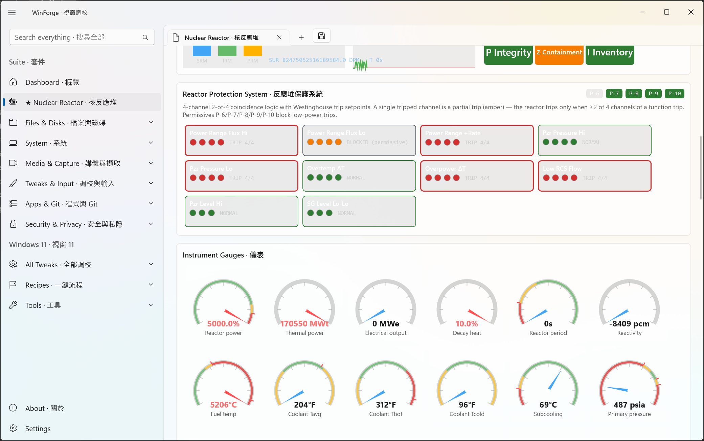

### Reactor Meltdown Scenario · 反應堆熔毀情境

---

## Additional Wiki Captures · 額外 Wiki 截圖

### AltSnap · Alt 拖曳視窗
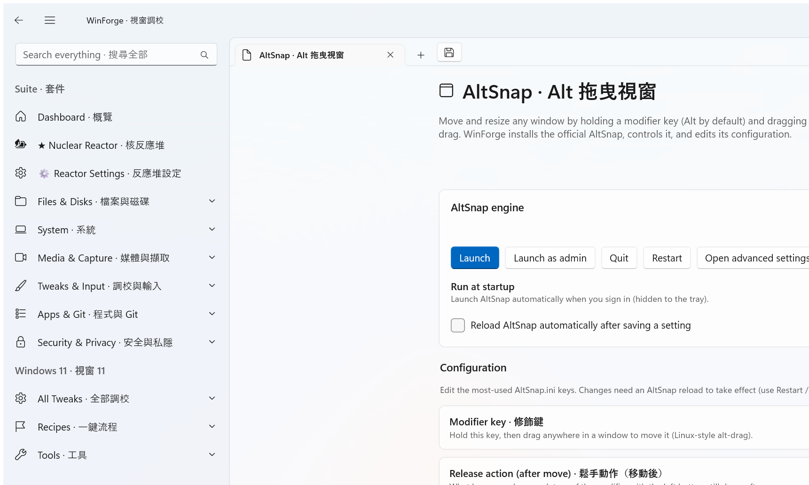

### Annoyances · 煩擾項目
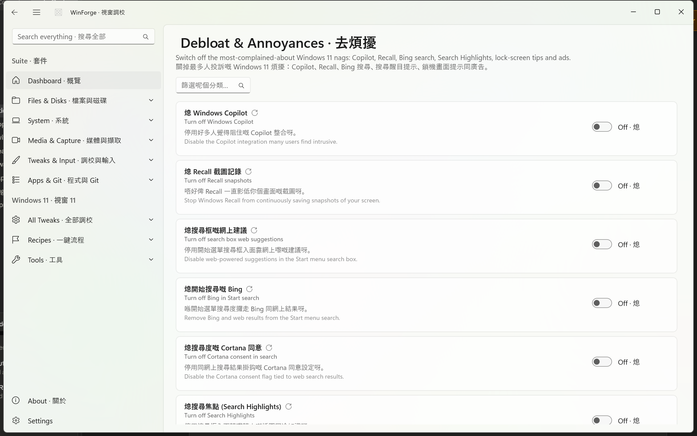

### Battery & Thermal · 電池與散熱
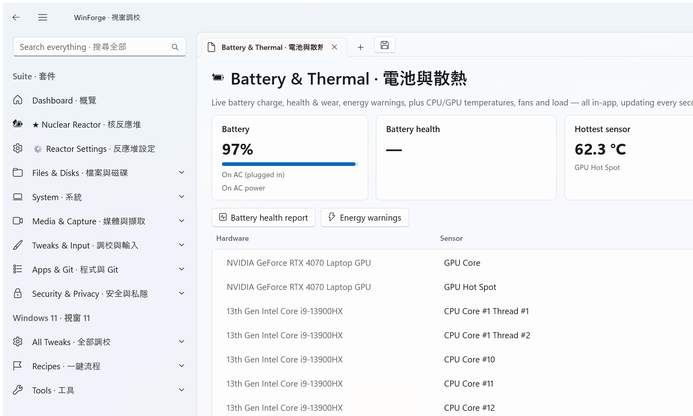

### Maintenance · 維護
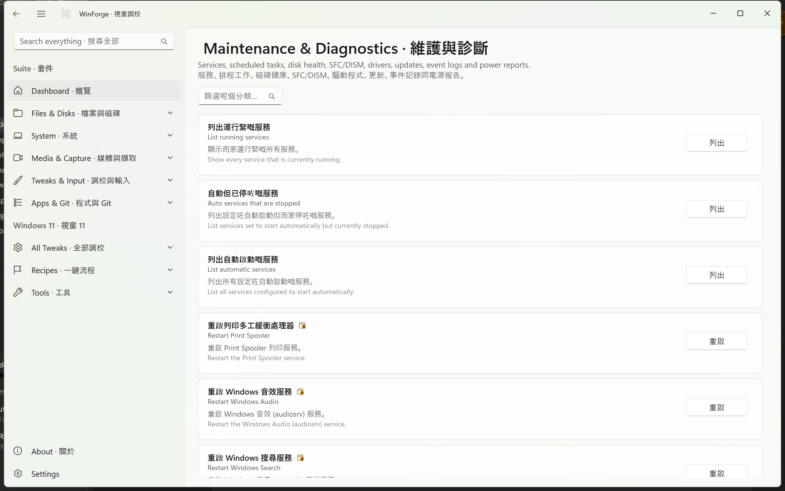

### Nilesoft Shell · Nilesoft 右鍵選單
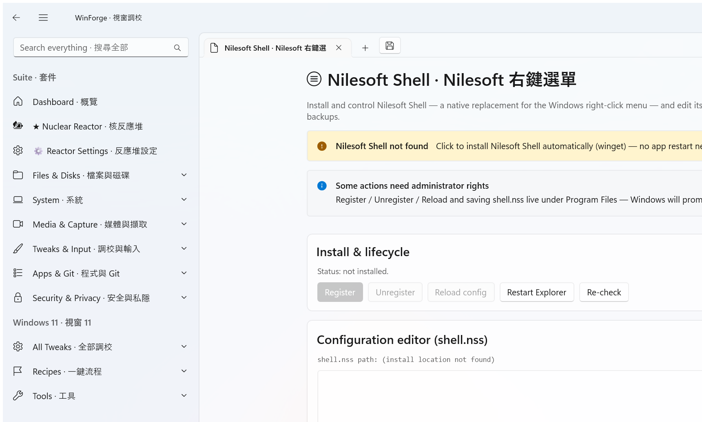

### qBittorrent · 種子下載
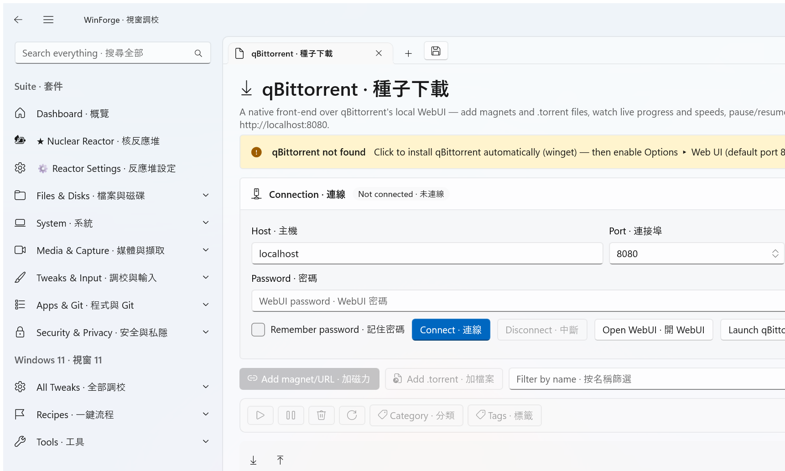

### Recipes · 配方
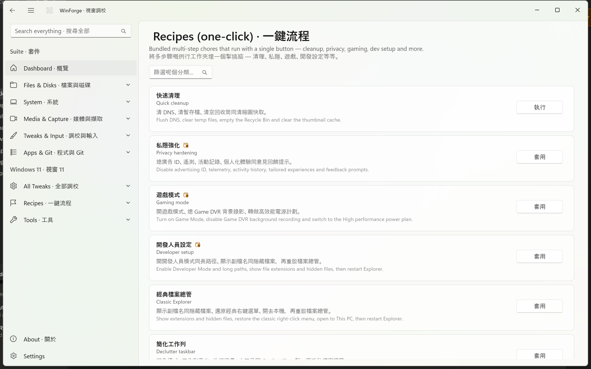

### Search · 搜尋
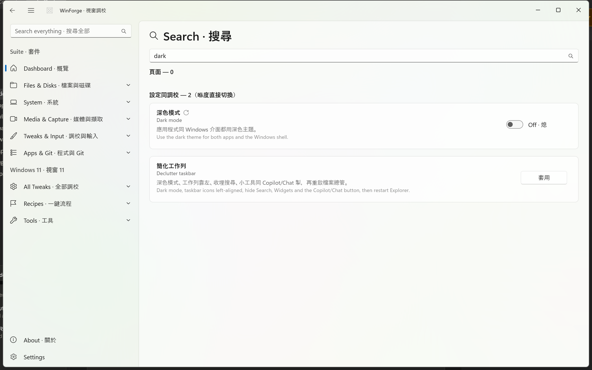

### Taskbar Tweaker · 工作列調校
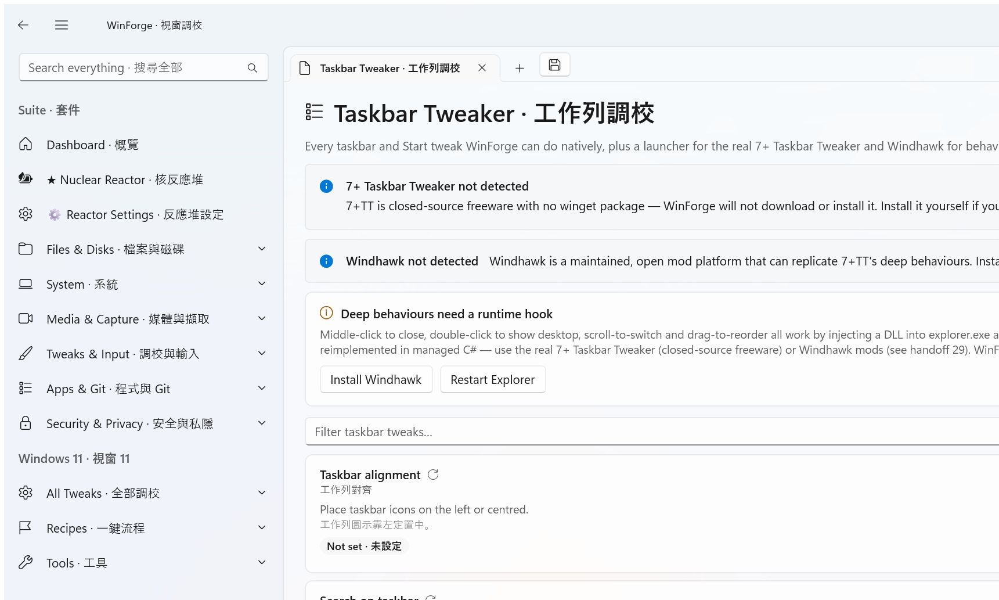

### App Uninstaller · 應用程式解除安裝
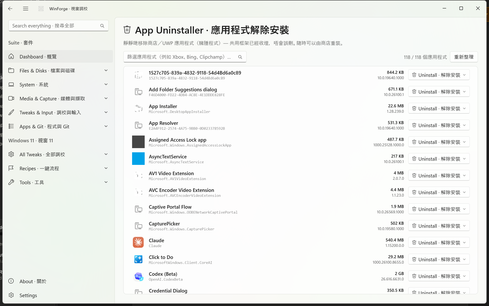

### Winaero · Winaero 調校
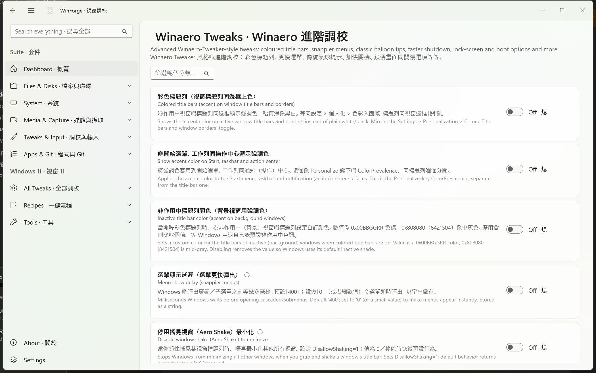
