# Screenshots · 截圖集

Canonical screenshots live in `docs/` and are embedded here through raw GitHub URLs. Current WinUI pixels are captured with the process-owned `run-winforge` driver; [`winforge-shot`](https://github.com/codingmachineedge/WinForge/tree/main/tools/WinForgeShot) performs optional cropping, highlighting, annotation, and redaction. See the [Wiki Screenshot Workflow](Wiki-Screenshot-Workflow.md) for the full recipe.

正式截圖放喺 `docs/`，呢度用 raw GitHub URL 嵌入。目前 WinUI pixels 由 process-owned `run-winforge` driver 擷取；[`winforge-shot`](https://github.com/codingmachineedge/WinForge/tree/main/tools/WinForgeShot) 負責可選裁切、加強調、標註同遮蔽。完整做法見 [Wiki 截圖工作流程](Wiki-Screenshot-Workflow.md)。

## Current Capture Status · 目前擷取狀態

This gallery documents the canonical .NET / WinUI 3 application. C++/WinRT port screenshots and capture-blocked evidence moved with the independent [WinForge-Native repository](https://github.com/codingmachineedge/WinForge-Native). No native-port image is presented here as managed-app evidence.

呢個圖庫記錄正式 .NET／WinUI 3 app。C++/WinRT 移植版截圖同 capture-blocked 證據已搬去獨立 [WinForge-Native repository](https://github.com/codingmachineedge/WinForge-Native)；呢度唔會將原生移植版圖片當成 managed app 證據。

## Redaction Rules · 遮蔽規則

**EN —** Before adding screenshots, redact or avoid personal data: Windows usernames, home-folder paths, repo paths outside WinForge, hostnames, IPs that identify private networks, account names, emails, API keys, tokens, session cookies, vault item names, SSH profiles, and real package/source credentials. Use `winforge-shot --redact "x|y|w|h|box|blur|pixelate"` to obscure regions irreversibly; see the [Wiki Screenshot Workflow](Wiki-Screenshot-Workflow.md).

**粵語 —** 新增截圖前，請遮蔽或者避開個人資料：Windows 用戶名、home folder 路徑、WinForge 以外嘅 repo 路徑、主機名、會識別私人網絡嘅 IP、帳戶名、電郵、API key、token、session cookie、保險庫項目名、SSH profile，同真實套件／來源憑證。用 `winforge-shot --redact "x|y|w|h|box|blur|pixelate"` 不可逆咁遮蔽範圍；詳見 [Wiki 截圖工作流程](Wiki-Screenshot-Workflow.md)。

---

## System & Tweaks · 系統與調校

### Language & Tone Settings · 語言與語氣設定

The live-control proof below uses English level 5 and Cantonese level 1 to demonstrate independent updates; the original profile values were restored to English 2 / Cantonese 3 before the owned process closed. The narrow 720×646 capture verifies that navigation collapses and both exact-step sliders remain readable without overlap. · 下面即時控制證據用英文第 5 級、粵語第 1 級示範兩邊獨立更新；關閉自家 process 前已將原本設定還原做英文 2／粵語 3。720×646 窄畫面圖亦驗證導覽會收窄，兩個準確步進 slider 保持清楚、冇重疊。

### Dashboard · 概覽
> Screenshot refresh is blocked in this desktop session: `CopyFromScreen` is unavailable and the `PrintWindow` fallback produces a uniform frame. The Dashboard route remains launch-verified. · 呢個桌面工作階段未能更新截圖：`CopyFromScreen` 未可用，而且 `PrintWindow` 後備方案會產生單一畫面。Dashboard 路由仍已驗證可以啟動。

### Registry Editor · 登錄編輯器
> Screenshot refresh is blocked in this desktop session: `CopyFromScreen` is unavailable and the `PrintWindow` fallback produces a uniform frame. The `regedit` route, editable full-path navigation, and in-app value editing remain launch-verified. · 呢個桌面工作階段未能更新截圖：`CopyFromScreen` 未可用，而且 `PrintWindow` 後備方案會產生單一畫面。`regedit` 路由、可編輯完整路徑導覽同 app 內值編輯仍已驗證可以啟動。

### System Doctors · 系統醫生
Fresh guided-maintenance evidence from the final self-contained build on dedicated LowLevel headless desktops. The canonical 1049×646 frame has SHA-256 `70A06EFD3CDD87EE8AC9A02F361083BA755E2EB28C844EFB0BA50E56C9ED632C`; the 760×720 narrow frame has `EA7F865C8309FDFC59CE78D07606C4CEE6A29C8763CE6CDA3947425CAB5EAA32`. Accessibility-tree interaction expanded Storage Sense (`52141DF041D14766C2CC2209B8BC73439B254E54CC469FE5A034D9044A08F0BB`) and the ResetBase irreversible warning (`05C26B2DBC1630D9C4927D84F93B24422D1CDA5E8826A48202AD16A7E3871233`). No action button or destructive Windows operation was invoked; the final exact PID/HWND closed gracefully, the desktop returned zero windows, and every dedicated desktop closed. · 最新引導式維護證據由最終自包含 build 喺專用 LowLevel headless desktop 擷取；正常、窄版、展開儲存感知同 ResetBase 警告畫面 hash 如上。冇撳動作掣或執行破壞性 Windows 操作，最終指定 PID／HWND 安全關閉，desktop 零視窗，全部專用 desktop 已關閉。

### Services · 服務

### Scheduled Tasks · 排程工作

### Devices · 裝置

### ViVeTool · 功能旗標

### Startup Apps · 開機程式

### Environment Variables · 環境變數

### Event Viewer · 事件檢視器

### System Info (Winfetch) · 系統資訊

### System Monitor · 系統監察

### Process Explorer · 程序總管

### Battery & Thermal · 電池與散熱

### Volume Mixer · 音量混合器

Current 2026-07-24 evidence: the self-contained DEBUG app rendered this 1284×811 canonical frame (SHA-256 `A7C1F09F3CB6636DEED27CF30158A14E2C0AAC21648245FA1ED412A946D0FB2E`) from its live WinUI tree on a dedicated LowLevel desktop. The expected headless `No audio endpoint` state is shown honestly. An adversarial follow-up inspected app-owned 1264×791 / 784×691 frames, independent fresh-HWND 1280×800 / 800×700 / 1300×820 frames, and a 1033×637 driver capture after theme-aware opaque compositing and write-through atomic final promotion were hardened; no clipping, overlap, stale evidence, foreign pixels, retained process, or temporary image was found. · 目前 2026-07-24 證據：self-contained DEBUG app 喺專用 LowLevel desktop 由即時 WinUI tree 輸出呢張 1284×811 正式圖（SHA-256 如上）；圖中如實顯示 headless 環境預期嘅 `No audio endpoint` 狀態。對抗覆核再檢視 app-owned 1264×791／784×691、獨立 fresh-HWND 1280×800／800×700／1300×820，同 driver 1033×637 圖，亦驗證加固後按 theme 合成嘅不透明 pixels 同 write-through 原子 final promotion；冇裁切、重疊、舊證據、其他視窗 pixels、殘留 process 或 temp 圖。

### Context Menu · 右鍵選單

### Explorer Right-Click · 檔案總管右鍵選單

### Nilesoft Shell · Nilesoft 右鍵選單

### Awake · 保持喚醒

### Settings & Control Panel · 設定與控制台

### Browser Control · 瀏覽器控制

Current 2026-07-24 evidence: the process-owned driver rendered this 1033×637 frame (SHA-256 `400AF4B89FE16B6A22023BE1259442D8D1A0BF88C39C0445C9A7E7DFE161FB3C`) from the live WinUI tree on a dedicated LowLevel desktop. An inspected 784×691 narrow frame (SHA-256 `BDB186204A24F1AFFF927F1347E315A77FBCCD218D8B09D7423C7E4282DF94B3`) confirms bilingual wrapping without clipping or overlap. No browser launch, cache deletion, package mutation, or debugging session was triggered, and the dedicated desktop closed with zero retained windows. · 目前 2026-07-24 證據：process-owned driver 喺專用 LowLevel desktop 由即時 WinUI tree 輸出 1033×637 正式圖，同 784×691 窄版圖（SHA-256 如上）；雙語換行冇裁切／重疊，亦冇啟動瀏覽器、刪快取、改套件或者開除錯，專用 desktop 最後零殘留視窗並已關閉。

### Native Utilities · 原生工具

### PowerToys Extras · PowerToys 額外工具

### Power Display · 顯示器控制
Fresh capture is pending because the current desktop capture host rejects `CopyFromScreen` with “The handle is invalid” even for a one-pixel virtual-screen test, while `PrintWindow` returns a uniform black frame. No blank or misleading screenshot is published. · 新截圖暫時未能提供，因為目前桌面擷取主機連一像素虛擬螢幕測試都會令 `CopyFromScreen` 回傳「The handle is invalid」，而 `PrintWindow` 只會回傳全黑畫面；所以唔會發佈空白或者誤導嘅截圖。

### Video Conference Mute · 視像會議靜音
Fresh capture is pending because the current desktop capture host rejects `CopyFromScreen` with “The handle is invalid” even for a one-pixel virtual-screen test, while `PrintWindow` returns a uniform black frame. No blank or misleading screenshot is published. · 新截圖暫時未能提供，因為目前桌面擷取主機連一像素虛擬螢幕測試都會令 `CopyFromScreen` 回傳「The handle is invalid」，而 `PrintWindow` 只會回傳全黑畫面；所以唔會發佈空白或者誤導嘅截圖。

### World Monitor · 世界監察

### Activity Timeline · 活動時間軸

---

## Files & Disks · 檔案與磁碟

### Archives · 壓縮檔

### Batch Rename · 批次改名

### Bulk File Ops · 批次檔案操作

### New+ · 範本新增

### Duplicate Finder · 重複檔案搜尋

### Instant File Search · 即時檔案搜尋

### File Locksmith · 檔案鎖偵測

### Disk Analyser · 磁碟分析

### Hex Editor · 十六進位編輯器

### Drives · 磁碟機

### Disk Health (SMART) · 硬碟健康（SMART）

### Disk Benchmark · 硬碟速度測試

### TestDisk / PhotoRec Recovery · TestDisk / PhotoRec 資料救援

### Peek · 快速預覽

### Rich Preview · 豐富預覽

### Roman Numerals · 羅馬數字
> Native visual capture is `capture-blocked`: the repository driver rejected its blank/near-uniform frame, and the inspected LowLevel headless capture showed only a title bar and blank client. No substitute image is shown. · 原生視覺擷取係 `capture-blocked`：repository driver 拒絕咗空白／接近單色 frame，而檢查過嘅 LowLevel 無頭擷取只有 title bar 同空白 client；唔會展示替代圖片。

### OneDrive · OneDrive

### Font Manager · 字型管理

### FTP / SFTP · FTP／SFTP 檔案傳輸

### Config & Backup · 設定與備份

---

## Media & Capture · 媒體與擷取

### Media · 媒體

### Audio Editor · 音訊編輯器

### Audio Tagger · 音訊標籤編輯器

### Media Player · 媒體播放器

### Media Downloader · 媒體下載器

### Document Converter · 文件轉換器

### PDF Toolkit · PDF 工具箱

### Screen Recorder · 螢幕錄影

### Capture Studio · 擷取工作室

### Text Extractor (OCR) · 原生文字辨識

### GIF Studio · 螢幕轉 GIF

### Crop And Lock · 裁切與鎖定
Fresh capture is pending because the current desktop capture host rejects `CopyFromScreen` with “The handle is invalid” even for a one-pixel virtual-screen test, while `PrintWindow` returns a uniform black frame. No blank or stale screenshot is published. · 新截圖暫時未能提供，因為目前桌面擷取主機連一像素虛擬螢幕測試都會令 `CopyFromScreen` 回傳「The handle is invalid」，而 `PrintWindow` 只會回傳全黑畫面；所以唔會發佈空白或者過期嘅截圖。

### ZoomIt · 螢幕放大與標註

### Voice & Read-Aloud · 語音朗讀

### PA Announcements · 喇叭語音廣播

### Pixel Editor · 像素畫編輯器

### Image Editor · 點陣圖影像編輯器

### Blender (3D / Render) · Blender（3D／算圖）

---

## Developer · 開發者

### VS Code · VS Code 編輯器

### Windows Terminal · Windows 終端機

### SSH Toolset · SSH 工具

### quicktype · JSON 轉型別

### API Client · REST API 用戶端

### Diff & Merge (WinMerge) · 比對與合併

### Diagram Editor · 圖表編輯器

### .NET Decompiler · .NET 反編譯器

### Postgres Tool · Postgres 工具 / pgAdmin

### SQLite Browser · SQLite 資料庫瀏覽器

### Packer (Image Builder) · Packer（映像建置器）

### AWS Manager · AWS 管理中心

### Website Cloner · 網站複製器

### Resume Writer · 履歷與求職信寫手

### Regex Tester and guided builder · 正則測試器同引導砌法

Keyboard focus reaches the guided builder and remains visibly outlined; the page scrolls vertically and its five flags no longer overflow in one horizontal row. · 鍵盤 focus 可以去到引導砌法兼有清楚外框；頁面會垂直滾動，五個旗標亦唔再塞爆一條橫行。

### Synchronized Regex search control · 同步 Regex 搜尋控制

The 852×646 LowLevel and 760×720 app-owned Dashboard captures show the unclipped shared row, explicit regex state, and direct builder action. A live flyout audit found and drove the one-column flag and shorter prompt fixes; the complete flyout remains covered by the focused source/test contract. · 852×646 LowLevel 同 760×720 app-owned Dashboard 圖顯示冇裁切嘅共用列、明確 regex 狀態同直接 builder action。live flyout 審核搵到並推動單欄旗標／短提示修正；完整 flyout 由專項原始碼／測試合約覆蓋。

### Regex Cheatsheet · 正則速查
> **Capture status · 截圖狀態：** Fresh `regexcheat` capture is `capture-blocked`: `CopyFromScreen` was unavailable, the `PrintWindow` fallback was uniform, and graphics capture was unavailable in this desktop session. The route passed a launch-only check, but no PNG was created, inspected, or claimed as visual verification. · 新嘅 `regexcheat` 截圖係 `capture-blocked`：呢個 desktop session 嘅 `CopyFromScreen` 唔可用、`PrintWindow` 後備畫面係 uniform，而 graphics capture 亦唔可用。route launch-only check 通過，但冇 PNG 產生、檢查或者當成視覺驗證。

### Password Generator · 密碼產生器
> No current canonical managed-app screenshot is published for this page. · 呢個頁面目前未有正式 managed-app 截圖。

### UUID v7 · UUID v7 識別碼
> No current canonical managed-app screenshot is published for this page. · 呢個頁面目前未有正式 managed-app 截圖。

---

## Network · 網絡

### Connections · 連線

### Hosts Editor · hosts 編輯器

### Packet Capture · 封包擷取

### Nmap Scanner · 網絡掃描

### VPN & Mesh · VPN 與網狀網

### RustDesk · 遠端桌面

### Cloudflare & Tunnel · Cloudflare 與 Tunnel

### Home Assistant · 家居助理

### In-App Login · 內置登入

---

## Apps, Git & Packages · 應用程式、Git 與套件

### Git & GitHub · Git 與 GitHub

### Package Manager · 套件管理

#### Narrow bilingual layout · 窄畫面雙語版面

#### Credential-free proxy and vcpkg settings · 無 credential proxy 同 vcpkg 設定

#### Narrow-safe App Settings actions · 窄畫面安全 App Settings actions

### Cake Factory & Farm · 蛋糕工廠與農場
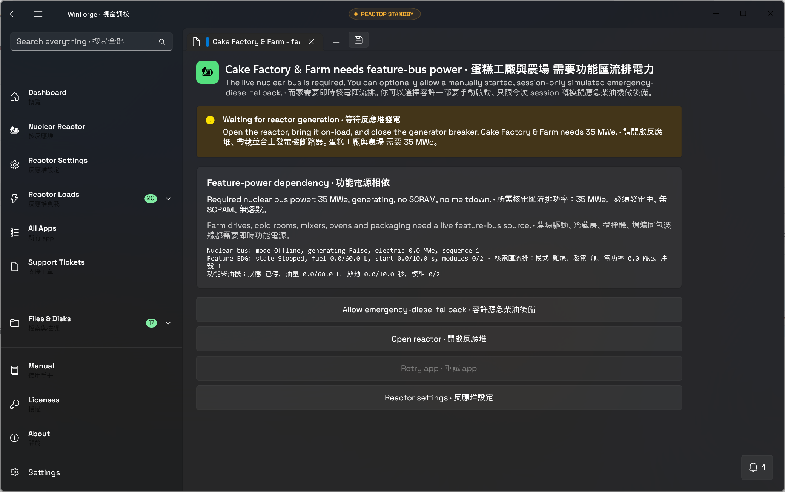

### App Uninstaller · 應用程式解除安裝
> No current canonical managed-app screenshot is published for this page. · 呢個頁面目前未有正式 managed-app 截圖。

### Android (ADB) · Android（ADB）

### Fastboot / Flasher · Fastboot／刷機

### Android Emulator & SDK · Android 模擬器與 SDK

### qBittorrent · 種子下載

### Native Torrent · 原生種子下載

### Communications · 通訊

### Mail · 電郵

---

## AI · 人工智能

### AI Agents · AI 代理

### AI Chat · AI 聊天

### Ollama · 本地大模型

---

## Window Management · 視窗管理

### Window Manager · 視窗管理

### Workspaces · 工作區

### FancyZones · 視窗分區

### AltSnap · Alt 拖曳視窗

### Komorebi (Tiling WM) · Komorebi 平鋪視窗管理

### GlazeWM Tiling · GlazeWM 平鋪視窗

---

## PowerToys-style Utilities · PowerToys 式工具

### Keyboard Remapper · 鍵盤重新對應

### Hotkey & Macro Runner · 熱鍵與巨集

### Shortcut Guide · 快捷鍵指南

### Command Palette · 指令面板
> Screenshot refresh is blocked in this desktop session: `CopyFromScreen` is unavailable and the `PrintWindow` fallback produces a uniform frame. The `cmdpalette` deep link, diacritic-insensitive search, direct `reg HKCU\\...` registry-path handoff, immediate native theme switching, accessible Solid/Mica/Acrylic appearance and local background images, bookmarks, credential-free Remote Desktop profiles, on-demand performance metrics, explicit command mode, Window Walker provider, and persistent Dock remain launch-verified. · 呢個桌面工作階段未能更新截圖：`CopyFromScreen` 未可用，而且 `PrintWindow` 後備方案會產生單一畫面。`cmdpalette` 深層連結、忽略重音符號搜尋、直接 `reg HKCU\\...` 登錄檔路徑交接、即時原生主題切換、容易閱讀嘅 Solid／Mica／Acrylic 外觀同本機背景圖片、書籤、冇儲存登入資料嘅遠端桌面設定檔、按需效能指標、明確指令模式、Window Walker 提供者同常駐 Dock 仍已驗證可以啟動。

### Color Picker · 螢幕取色

### Screen Ruler · 螢幕間尺

### Mouse Utilities · 滑鼠工具

### CursorWrap · 游標環繞
> CursorWrap is documented through the live managed Mouse Utilities page and its feature reference. · CursorWrap 由正式 managed Mouse Utilities 頁面同功能參考文件記錄。

### Mouse & Pointer · 滑鼠與指標

### Mouse Without Borders · 無界滑鼠

### Quick Accent · 快速重音符

### Case Converter · 大小寫轉換
> No current canonical managed-app screenshot is published for this page. · 呢個頁面目前未有正式 managed-app 截圖。

### Command Not Found · 搵唔到指令

### Clipboard · 剪貼簿

### Advanced Paste · 進階貼上

### Taskbar Tweaker · 工作列調校

### Windhawk Mods · Windhawk 模組

### LightSwitch (Auto Dark Mode) · 自動深淺色

### Rainmeter Widgets · Rainmeter 桌面小工具
> Fresh Batch 10 capture is blocked: `CopyFromScreen` is unavailable and the
> `PrintWindow` fallback produced a uniform frame. No current Rainmeter PNG was
> created, so the superseded Rainmeter screenshots were removed rather than
> reused as visual evidence. · Batch 10 新截圖受阻：`CopyFromScreen` 未可用，而
> `PrintWindow` 後備方案產生 uniform frame。冇建立最新 Rainmeter PNG，所以已移除
> 過時 Rainmeter 截圖，唔會重用做視覺證據。

### Time & Unit Tools · 時間與單位工具

> Native Unit Price (`priceper` / `unitprice` / `module.unitprice`) has no replacement image yet: `CopyFromScreen` was unavailable and the `PrintWindow` fallback was blank or near-uniform. No invalid PNG was retained or promoted; see the capture-blocked record above. · 原生單位價格暫時冇替換圖：`CopyFromScreen` 不可用，`PrintWindow` fallback 空白／近乎單色。冇保留或升格無效 PNG；見上面 capture-blocked 紀錄。

### Flashcards · 間隔重複記憶卡

---

## Virtualization & Containers · 虛擬化與容器

### Docker · Docker 容器管理

### Docker over SSH · 透過 SSH 控制 Docker

### WSL & VM Launcher · WSL 與 VM 啟動器

### VirtualBox Manager · VirtualBox 管理

### Proxmox VE · Proxmox VE 虛擬化

---

## Security & Vaults · 安全與保險庫

### WinForge Vault · WinForge 保險庫

### Bitwarden Vault · Bitwarden 密碼庫

### KeePass Vault · 密碼保險庫

---

## Gaming & Emulation · 遊戲與模擬

### Minecraft World Editor (Amulet) · Minecraft 世界編輯器（Amulet）

### Minecraft Server · Minecraft 伺服器

### ViaProxy · Minecraft 版本代理

### Imaging & Game Tools · 燒錄與遊戲工具

---

## Nuclear Reactor · 核反應堆

### Nuclear Reactor · 核反應堆

### Reactor Settings · 反應堆設定
> **Capture status · 截圖狀態：** Fresh `reactorsettings` capture is `capture-blocked`: `CopyFromScreen` was unavailable, the `PrintWindow` fallback was uniform, and graphics capture was unavailable in this desktop session. The prior Reactor Settings image was removed rather than reused as current evidence; the route passed a no-control launch-only check. · 新嘅 `reactorsettings` 截圖係 `capture-blocked`：呢個 desktop session 嘅 `CopyFromScreen` 唔可用、`PrintWindow` 後備畫面係 uniform，而 graphics capture 亦唔可用。之前嘅 Reactor Settings 圖片已移除，唔會當成最新證據重用；route 冇操作控制項嘅 launch-only check 通過。

### Reactor Gauges · 反應堆儀表
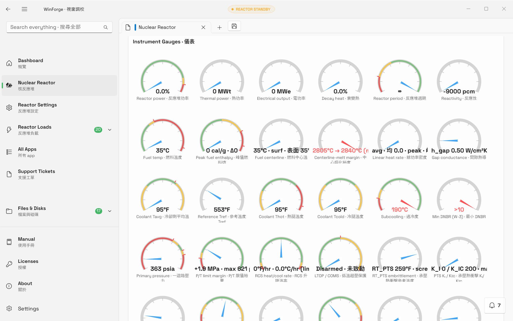

### Reactor Meltdown Scenario · 反應堆熔毀情境
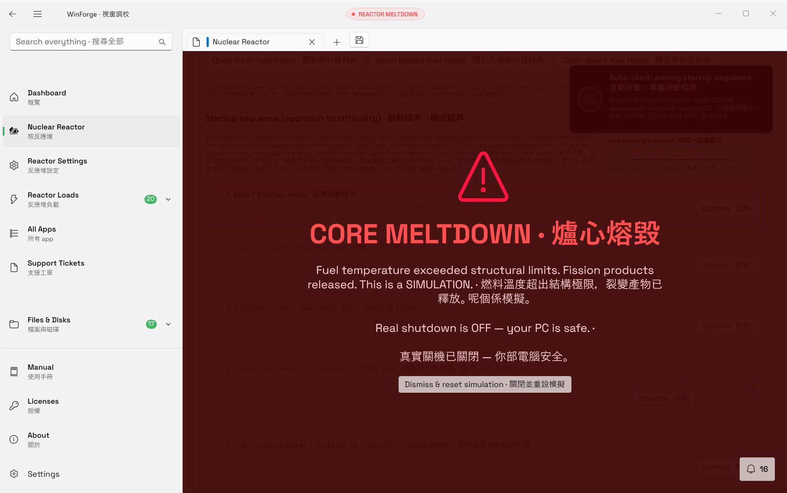

---

## Additional Wiki Captures · 額外 Wiki 截圖

### AltSnap · Alt 拖曳視窗
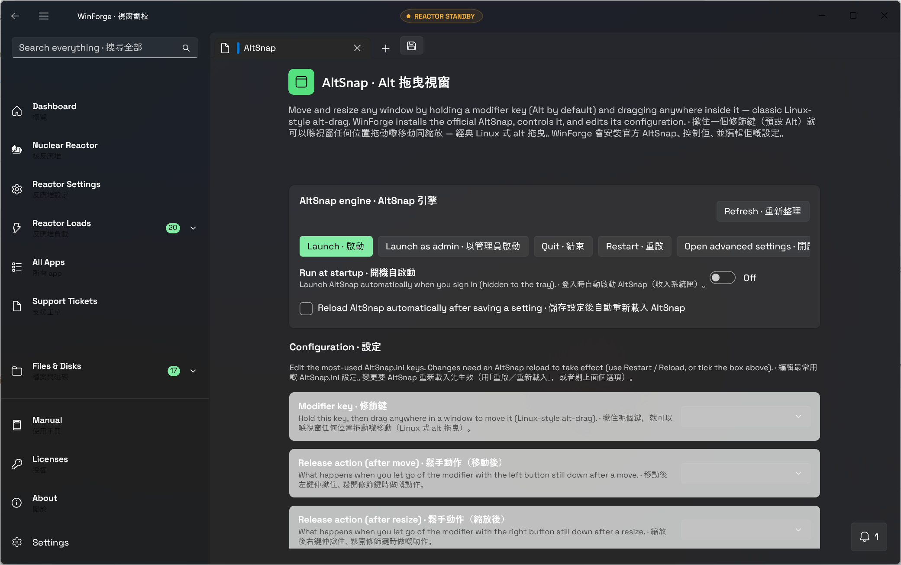

### Annoyances · 煩擾項目
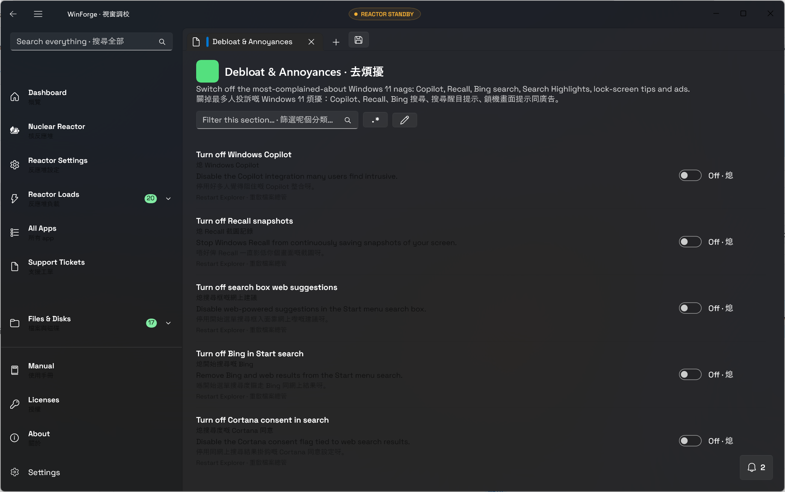

### Battery & Thermal · 電池與散熱
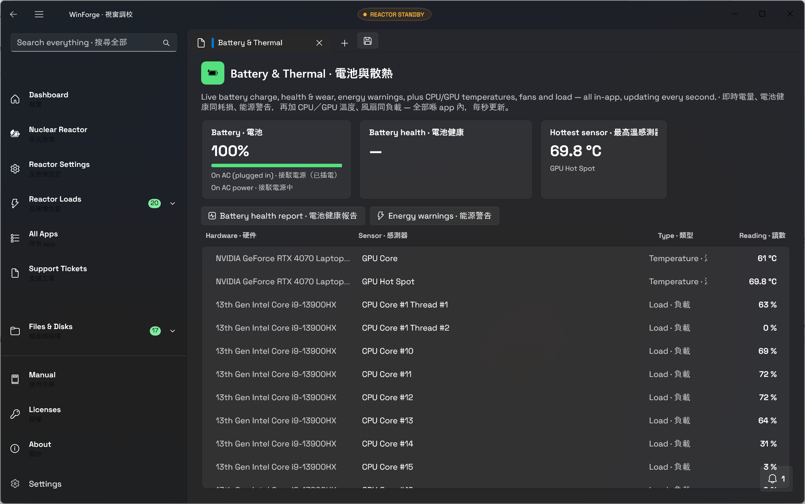

### Maintenance · 維護
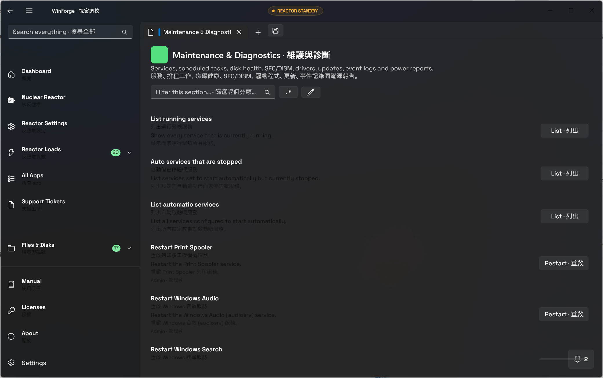

### Nilesoft Shell · Nilesoft 右鍵選單
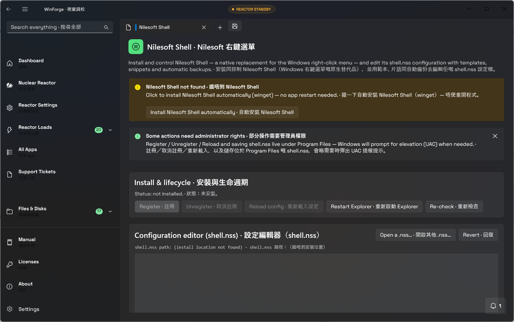

### qBittorrent · 種子下載
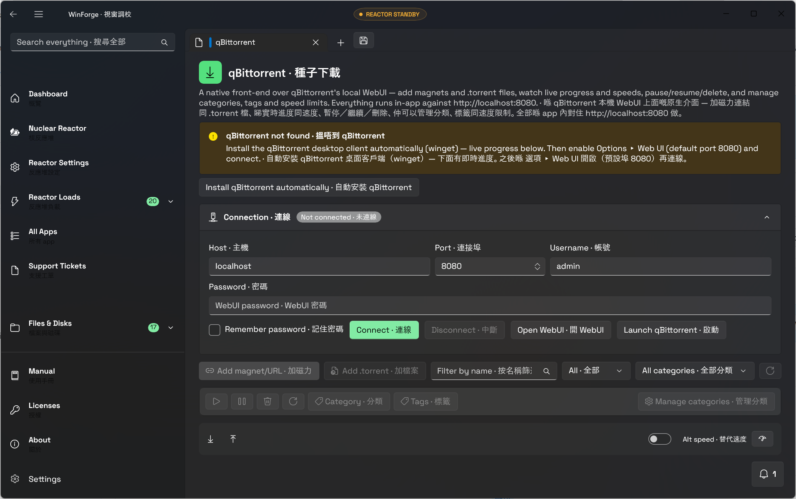

### Recipes · 配方
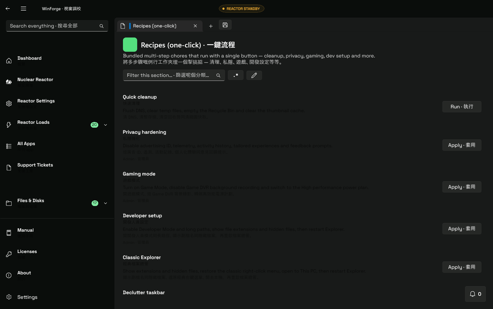

### Search · 搜尋
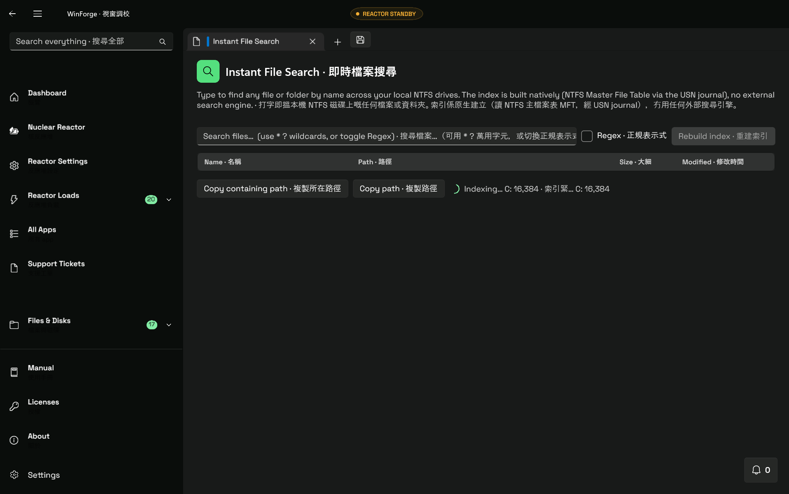

### Taskbar Tweaker · 工作列調校
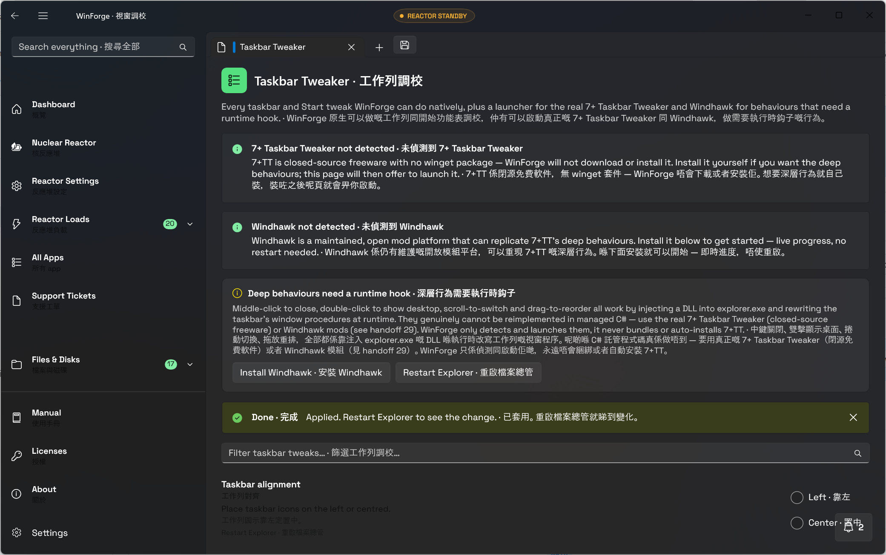

### App Uninstaller · 應用程式解除安裝
> No current canonical managed-app screenshot is published for this page. · 呢個頁面目前未有正式 managed-app 截圖。

### Winaero · Winaero 調校
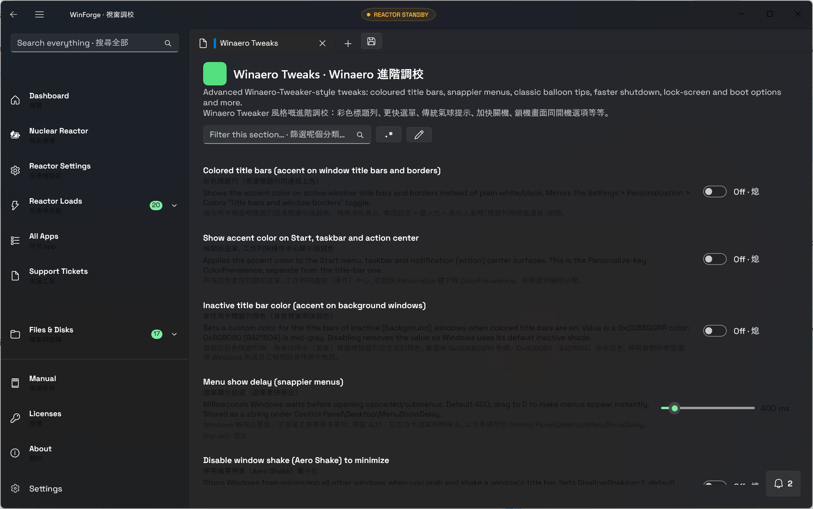

## Command Palette extension packs capture status · 指令面板擴充套件截圖狀態

- Launch-only smoke check: `cmdpalette` started successfully after the extension-pack update.
- Capture attempt: `CopyFromScreen` was unavailable; the `PrintWindow` fallback produced a uniform frame, so graphics capture is unavailable in this desktop session.
- No replacement canonical screenshot was published, and no visual inspection is claimed for this update.

- 僅啟動測試：擴充套件更新後，`cmdpalette` 已成功啟動。
- 截圖嘗試：`CopyFromScreen` 未可用；`PrintWindow` 備援只產生單色畫面，所以呢個桌面工作階段未能擷取圖像。
- 今次冇發佈替代嘅正式截圖，亦都冇聲稱已做視覺檢查。
