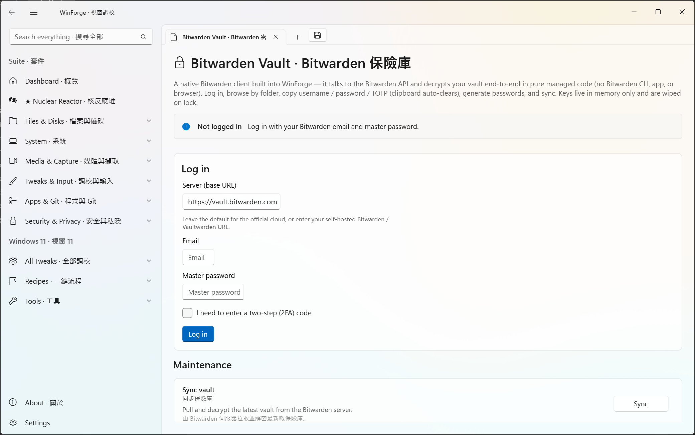
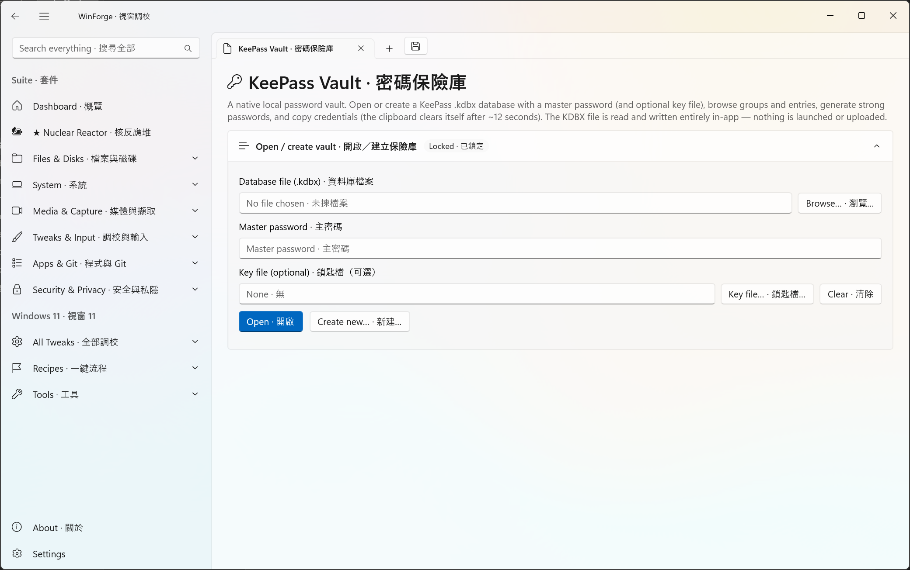

# Security & Vaults · 安全與保險庫

Tools for encrypting volumes and managing your passwords and secrets. · 用嚟加密磁碟區同管理你嘅密碼同機密資料嘅工具。

## WinForge Vault · WinForge 保險庫

On-the-fly encrypted volume containers (VeraCrypt-derived). · 即時加密嘅磁碟區容器（源自 VeraCrypt）。

Open in-app: `WinForge.exe --page vault-volumes`

## Bitwarden Vault · Bitwarden 密碼庫

Drive the Bitwarden CLI for logins, TOTP and generators. · 驅動 Bitwarden CLI 管理登入、TOTP 同密碼產生。

Open in-app: `WinForge.exe --page bitwarden`

## KeePass Vault · 密碼保險庫

Local offline KeePass (kdbx) password vault, natively encrypted. · 本機離線 KeePass（kdbx）密碼庫，原生加密。

Open in-app: `WinForge.exe --page keepass`

[← Wiki Home](Home.md)
