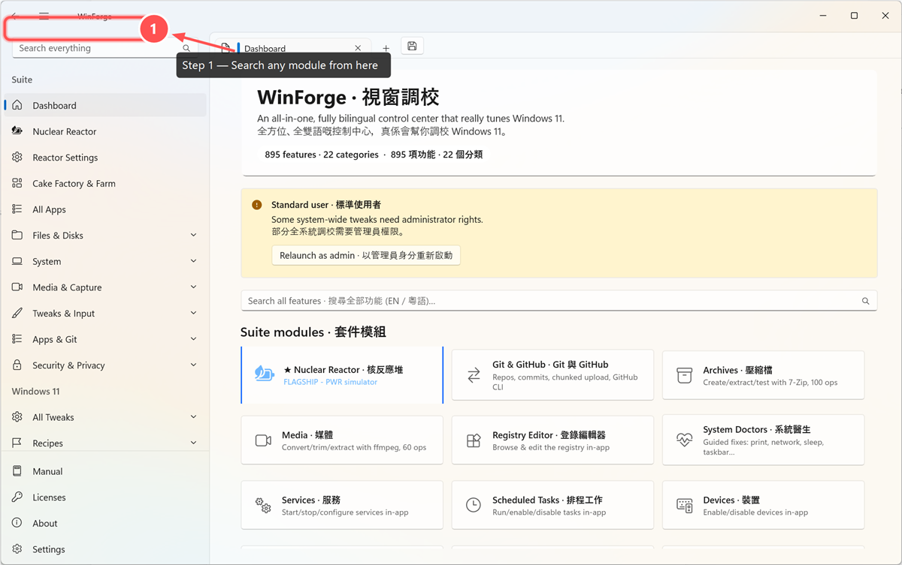
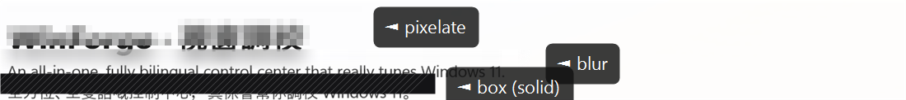

# Wiki Screenshot Workflow · Wiki 截圖工作流程

**EN —** Capture current WinUI pixels with the repository
[`run-winforge` driver](https://github.com/codingmachineedge/WinForge/tree/main/.agents/skills/run-winforge),
then use [`tools/WinForgeShot`](https://github.com/codingmachineedge/WinForge/tree/main/tools/WinForgeShot)
(`winforge-shot`) to **crop, highlight, annotate, number steps, and redact personal info**.
The driver requests a DEBUG-only image of WinForge's live visual tree, validates it as
non-uniform, and cleans up its unique temporary file and owned process. It never samples
raw desktop pixels, so an overlapping application cannot leak into evidence. A validated,
HWND-targeted `PrintWindow` call is the only capture fallback.

**粵語 —** 先用 repo 嘅 [`run-winforge` driver](https://github.com/codingmachineedge/WinForge/tree/main/.agents/skills/run-winforge)
擷取目前 WinUI pixels，再用 [`tools/WinForgeShot`](https://github.com/codingmachineedge/WinForge/tree/main/tools/WinForgeShot)
（`winforge-shot`）做**裁切、加強調框、加文字、加步驟編號、同遮蔽個人資料**。
Driver 會要求 DEBUG-only 即時 WinForge visual tree 圖、驗證唔係單色空畫面，並清理唯一 temp file
同自家 process。佢永遠唔會抽取原始 desktop pixels，所以其他 app 遮住 WinForge 都唔會漏入證據；
唯一 capture 後備係經驗證、只針對自家 HWND 嘅 `PrintWindow`。

---

## 1. Capture · 擷取

**EN —** Launch a page by its deep-link alias and capture it with the self-contained driver.
Build `WinForgeShot` once only when annotation or redaction is needed:
`dotnet build tools/WinForgeShot/WinForgeShot.csproj -c Release`.

**粵語 —** 用 self-contained driver 經 deep-link 別名啟動某頁再擷取。只係需要標註或遮蔽時，
先建置一次 `WinForgeShot`：`dotnet build tools/WinForgeShot/WinForgeShot.csproj -c Release`。

```
powershell -ExecutionPolicy Bypass -File .agents/skills/run-winforge/driver.ps1 \
    -Page dashboard -WaitMs 15000 -Out docs/screenshot-dashboard.png
```

**EN —** To edit an **existing** screenshot without relaunching WinForge, use `--open`
(no app is started):

**粵語 —** 想喺**唔重開** WinForge 嘅情況下編輯**現有**截圖，用 `--open`（唔會啟動 app）：

```
winforge-shot --open docs/screenshot-vault.png --redact "10%|40%|35%|6%|box" --out docs/screenshot-vault.png
```

---

## 2. Coordinates · 座標

**EN —** All geometry fields are **`|`-separated** and each value is either **pixels**
(`120`) or a **percentage** of the image dimension (`35%`). `x`/width resolve against the
image **width**; `y`/height against the **height**. **Prefer percentages** — they survive
resolution and DPI changes, so a recipe still lands correctly when the window size differs.
Colors are names (`red green cyan amber yellow blue magenta white black`) or hex
(`#RRGGBB` / `#AARRGGBB`).

**粵語 —** 所有幾何欄位都用 **`|` 分隔**，每個值可以係**像素**（`120`）或者**百分比**（`35%`）。
`x`／寬度對應圖片**闊度**；`y`／高度對應**高度**。**建議用百分比** — 解像度同 DPI 變咗都唔會走位，
所以同一條配方喺唔同視窗大細都影得啱。顏色用名（`red green cyan amber yellow blue magenta white black`）
或十六進位（`#RRGGBB` / `#AARRGGBB`）。

---

## 3. Annotate steps · 步驟標註

**EN —** Combine a **highlight** call-out, a numbered **step** badge, an **arrow**, and a
**text** label to mark exactly what the reader should click. Operations apply in
command-line order.

**粵語 —** 組合**強調框**（highlight）、**步驟編號**（step）、**箭嘴**（arrow）同
**文字**（text）就可以準確指出讀者要㩒邊度。各操作按指令次序套用。

```
winforge-shot --open docs/screenshot-dashboard.png \
    --highlight "0.5%|3%|16%|4%|red" \
    --step      "17%|5%|1|red" \
    --arrow     "26%|9%|19%|6%|red" \
    --text      "20%|10%|Step 1 — Search any module from here|white|26|#111" \
    --scale w:1200 \
    --out docs/wiki/images/howto-annotate-demo.png
```



| Action · 動作 | Argument · 參數 | Purpose · 用途 |
|---|---|---|
| `--highlight` | `x\|y\|w\|h[\|color\|thick]` | Rounded call-out box with a glow · 圓角強調框（帶光暈） |
| `--box` | `x\|y\|w\|h[\|color\|thick]` | Plain rectangle outline · 普通方框 |
| `--ellipse` | `x\|y\|w\|h[\|color\|thick]` | Ellipse outline · 橢圓框 |
| `--arrow` | `x1\|y1\|x2\|y2[\|color\|thick]` | Arrow pointer · 箭嘴指標 |
| `--step` | `x\|y\|number[\|color\|diam]` | Numbered badge · 編號徽章 |
| `--text` | `x\|y\|message[\|color\|size\|bg]` | Label; add `bg` for a rounded plate · 文字標籤；加 `bg` 出圓角底板 |
| `--crop` | `x\|y\|w\|h` | Crop to a region · 裁切到指定範圍 |
| `--scale` | `pct` or `w:px` | Resize (`50`, `50%`, `w:1200`) · 縮放 |

---

## 4. Redact personal info · 遮蔽個人資料

**EN —** Three redaction modes, all **irreversible** (the underlying pixels are destroyed):
`box` paints a solid hatched rectangle — the clearest "this was hidden"; `blur` and
`pixelate` obscure while keeping the surrounding layout legible.

**粵語 —** 三種遮蔽模式，全部**不可逆**（底層像素會被破壞）：
`box` 畫實心斜紋方塊 — 最清楚表示「呢度遮咗」；`blur` 同 `pixelate` 遮住同時保留周圍版面易讀。

```
winforge-shot --open docs/screenshot-dashboard.png \
    --redact "0%|6%|40%|40%|pixelate" \
    --redact "0%|49%|59%|20%|blur" \
    --redact "0%|73%|48%|20%|box" \
    --out demo.png
```



### What to redact · 要遮蔽乜嘢

**EN —** Before committing a screenshot, redact or avoid: Windows usernames, home-folder
paths (`C:\Users\<you>\…`), repo paths outside WinForge, hostnames, IPs that identify a
private network, account names, emails, API keys, tokens, session cookies, vault item
names, SSH profiles, and real package/source credentials. When in doubt, redact.

**粵語 —** 提交截圖之前，請遮蔽或避開：Windows 用戶名、home folder 路徑（`C:\Users\<你>\…`）、
WinForge 以外嘅 repo 路徑、主機名、會識別私人網絡嘅 IP、帳戶名、電郵、API key、token、
session cookie、保險庫項目名、SSH profile，同真實套件／來源憑證。唔肯定就遮。

> **Tip · 提示 —** Prefer to compose the shot so secrets are off-screen in the first place
> (e.g. WinForge Vault hides mounted volumes until refresh). Redaction is the fallback for
> what cannot be avoided. · 最好一開始就構圖令秘密唔入鏡（例如 WinForge 保險庫未 refresh
> 前唔會顯示已掛載磁碟）。遮蔽係避唔到時嘅後備。

---

## 5. Authoring recipe · 撰寫配方

**EN —** For a multi-step guide, capture once and emit one annotated PNG per step. A clean
pattern that keeps coordinates simple is to crop a header/base region to its own image
first (so percentages are read directly off the visible crop), then annotate that base:

**粵語 —** 寫多步教學時，擷取一次，每步輸出一張標註 PNG。一個令座標簡單嘅做法係先將
header／底圖裁切成獨立圖片（百分比可以直接喺可見裁圖讀出），再喺呢張底圖標註：

```
# 1) capture the page · 擷取整頁
winforge-shot --page git --wait 15000 --out base.png

# 2) one image per step · 每步一張
winforge-shot --open base.png --highlight "40%|30%|20%|6%|red" --step "38%|30%|1" \
              --text "5%|2%|Step 1 — Add a folder|white|26|#111" --out git-step1.png
winforge-shot --open base.png --highlight "40%|40%|20%|6%|red" --step "38%|40%|2" \
              --text "5%|2%|Step 2 — Stage changes|white|26|#111" --out git-step2.png
```

**EN —** Save captures to `docs/` (gallery) or annotated/how-to images to
`docs/wiki/images/`, then embed with a relative path: ``.
Keep alt text bilingual. See the full flag reference in the tool's
[README](https://github.com/codingmachineedge/WinForge/blob/main/tools/WinForgeShot/README.md).

**粵語 —** 擷取圖放 `docs/`（圖庫），標註／教學圖放 `docs/wiki/images/`，再用相對路徑嵌入：
``。替代文字保持雙語。完整旗標說明見工具嘅
[README](https://github.com/codingmachineedge/WinForge/blob/main/tools/WinForgeShot/README.md)。

---
[← Home · 返主頁](Home) · [Screenshots · 截圖集](Screenshots) · [Tool README · 工具說明](https://github.com/codingmachineedge/WinForge/blob/main/tools/WinForgeShot/README.md)
